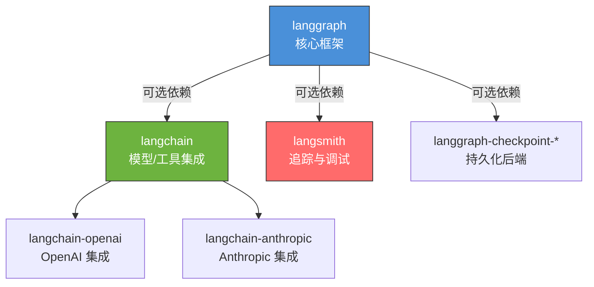
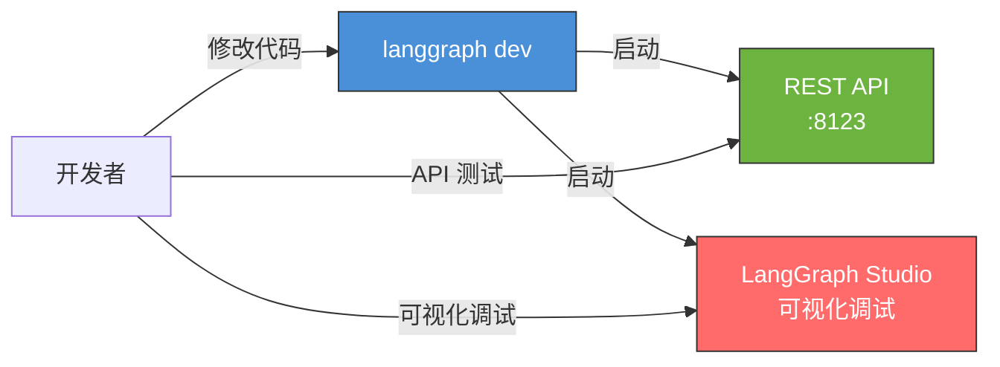

# 安装与环境配置

> 本页帮你从零搭建 LangGraph 的本地开发环境，包括安装、配置和验证。

## 1. Python 版本要求

LangGraph 要求 **Python 3.10+**。推荐使用 Python 3.11 或 3.12。

```bash
# 检查 Python 版本
python --version
# 或
python3 --version
```

如果版本低于 3.10，需要先升级 Python。推荐使用 [pyenv](https://github.com/pyenv/pyenv)（Mac/Linux）或直接从 [python.org](https://www.python.org/downloads/) 下载安装。

> **前端类比**：Python 版本 = Node.js 版本。就像你的项目要求 `node >= 18` 一样，LangGraph 要求 `python >= 3.10`。管理 Python 版本的 `pyenv` 类似前端的 `nvm`。
>
> **为什么要 3.10+**：LangGraph 大量使用 `TypedDict`、`Annotated` 等类型标注特性，这些在 3.10 后才完善。

## 2. 安装 LangGraph

### 2.1 使用 pip（传统方式）

```bash
# 创建虚拟环境（强烈建议！）
python -m venv .venv

# 激活虚拟环境
# macOS / Linux:
source .venv/bin/activate
# Windows:
.venv\Scripts\activate

# 安装 LangGraph
pip install -U langgraph
```

> **前端类比**：`python -m venv .venv` 相当于为项目创建一个隔离的 `node_modules`。Python 的虚拟环境确保项目间的依赖不会冲突，就像 npm 默认把包装在项目的 `node_modules` 下一样。

### 2.2 使用 uv（推荐 -- 更快更现代）

[uv](https://github.com/astral-sh/uv) 是 Rust 编写的 Python 包管理器，速度极快，是 Python 生态的"pnpm"。

```bash
# 安装 uv（如果还没装）
# macOS / Linux:
curl -LsSf https://astral.sh/uv/install.sh | sh
# Windows:
powershell -ExecutionPolicy ByPass -c "irm https://astral.sh/uv/install.ps1 | iex"

# 创建项目（如果是新项目）
uv init my-langgraph-project
cd my-langgraph-project

# 添加 LangGraph 依赖
uv add langgraph
```

> **前端类比**：
> | pip | uv | npm/yarn 对应 |
> |-----|-----|--------------|
> | `pip install pkg` | `uv add pkg` | `npm install pkg` |
> | `pip install -r requirements.txt` | `uv sync` | `npm install` |
> | `python -m venv .venv` | `uv venv`（自动） | — (node_modules 自动) |
> | `requirements.txt` | `pyproject.toml` | `package.json` |
> | `pip freeze` | `uv lock` | `package-lock.json` |

### 2.3 常用附加包

根据你的使用场景，可能还需要安装以下包：

```bash
# 如果需要使用 LangChain 的模型集成
pip install -U langchain langchain-openai langchain-anthropic

# 如果需要使用 LangSmith 调试
pip install -U langsmith

# 如果需要使用 checkpointer（持久化）
pip install -U langgraph-checkpoint-sqlite   # SQLite checkpointer
pip install -U langgraph-checkpoint-postgres  # PostgreSQL checkpointer

# 一次性安装完整开发套件
pip install -U langgraph langchain langchain-openai langsmith
```

用 uv 的话：

```bash
uv add langgraph langchain langchain-openai langsmith
```

### 2.4 依赖关系图



**关键认知**：`langgraph` 核心包是独立的，不强制依赖 `langchain`。你可以只装 `langgraph` 然后用原生 OpenAI SDK 调用模型。但在实践中，配合 `langchain` 会更方便。

## 3. 环境变量配置

### 3.1 API Key 配置

LangGraph 本身不需要 API Key，但你使用的模型需要：

```bash
# 在项目根目录创建 .env 文件
```

```ini
# .env
OPENAI_API_KEY=sk-your-openai-key
ANTHROPIC_API_KEY=sk-ant-your-anthropic-key

# LangSmith（可选，用于调试追踪）
LANGSMITH_API_KEY=lsv2_your-langsmith-key
LANGSMITH_TRACING=true
```

在 Python 中加载：

```python
# 方式一：使用 python-dotenv
from dotenv import load_dotenv
load_dotenv()

# 方式二：直接设置（不推荐，硬编码）
import os
os.environ["OPENAI_API_KEY"] = "sk-..."
```

> **前端类比**：这和前端项目的 `.env.local` 文件一模一样。`python-dotenv` 的作用 = Next.js 内置的 `.env` 加载能力。记得把 `.env` 加入 `.gitignore`。

### 3.2 项目结构建议

```
my-langgraph-project/
├── .env                    # 环境变量（不要提交到 git！）
├── .gitignore
├── pyproject.toml          # 项目配置和依赖（= package.json）
├── src/
│   └── my_agent/
│       ├── __init__.py
│       ├── graph.py        # 图定义
│       ├── nodes.py        # 节点函数
│       ├── state.py        # 状态定义
│       └── tools.py        # 工具定义
└── tests/
    └── test_graph.py
```

> **前端类比**：
> | Python 项目 | 前端项目 |
> |-------------|----------|
> | `pyproject.toml` | `package.json` |
> | `uv.lock` | `pnpm-lock.yaml` |
> | `.venv/` | `node_modules/` |
> | `src/my_agent/` | `src/app/` |
> | `tests/` | `__tests__/` |

## 4. 本地开发服务器（LangGraph Dev Server）

LangGraph 提供了一个本地开发服务器，类似前端的 dev server，支持热重载和可视化调试。

### 4.1 安装 CLI

```bash
pip install -U "langgraph-cli[inmem]"
# 或
uv add "langgraph-cli[inmem]"
```

### 4.2 创建配置文件

在项目根目录创建 `langgraph.json`：

```json
{
  "graphs": {
    "my_agent": "./src/my_agent/graph.py:graph"
  },
  "dependencies": ["."]
}
```

### 4.3 启动开发服务器

```bash
langgraph dev
```

这会启动一个本地服务，提供：
- **REST API** 端点（默认 `http://localhost:8123`）
- **LangGraph Studio**（可视化调试界面）
- **自动发现**你的图定义

> **前端类比**：`langgraph dev` = `npm run dev`。它启动一个本地服务器，你修改代码后会自动重载。LangGraph Studio 相当于 React DevTools——可以可视化你的图结构、实时查看状态流转。

### 4.4 通过 Studio 调试

启动 dev server 后，打开浏览器访问 LangGraph Studio。你可以：

1. 查看图的可视化拓扑
2. 发送测试输入
3. 实时观察节点执行和状态变化
4. 查看每个节点的输入输出



## 5. 验证安装

### 5.1 最小验证脚本

创建 `verify.py`，运行以验证一切正常：

```python
"""验证 LangGraph 安装是否成功"""
from langgraph.graph import StateGraph, MessagesState, START, END


def echo(state: MessagesState):
    """简单回声节点：返回用户输入"""
    last_msg = state["messages"][-1]
    return {
        "messages": [
            {"role": "ai", "content": f"Echo: {last_msg['content']}"}
        ]
    }


# 构建图
builder = StateGraph(MessagesState)
builder.add_node("echo", echo)
builder.add_edge(START, "echo")
builder.add_edge("echo", END)
graph = builder.compile()

# 执行
result = graph.invoke({
    "messages": [{"role": "user", "content": "Hello LangGraph!"}]
})

# 验证输出
ai_message = result["messages"][-1]
print(f"输入: Hello LangGraph!")
print(f"输出: {ai_message['content'] if isinstance(ai_message, dict) else ai_message.content}")
print("---")
print("LangGraph 安装验证通过！")
```

运行：

```bash
python verify.py
```

期望输出：

```
输入: Hello LangGraph!
输出: Echo: Hello LangGraph!
---
LangGraph 安装验证通过！
```

### 5.2 验证带模型调用

如果你安装了 `langchain-openai` 并配置了 API Key，可以验证完整的模型调用：

```python
"""验证 LangGraph + 模型集成"""
from dotenv import load_dotenv
load_dotenv()

from langchain.chat_models import init_chat_model
from langgraph.graph import StateGraph, MessagesState, START, END

# 初始化模型（会自动使用环境变量中的 API Key）
model = init_chat_model("gpt-4o-mini")


def chatbot(state: MessagesState):
    response = model.invoke(state["messages"])
    return {"messages": [response]}


builder = StateGraph(MessagesState)
builder.add_node("chatbot", chatbot)
builder.add_edge(START, "chatbot")
builder.add_edge("chatbot", END)
graph = builder.compile()

result = graph.invoke({
    "messages": [{"role": "user", "content": "用一句话介绍 LangGraph"}]
})

print(result["messages"][-1].content)
print("---")
print("模型集成验证通过！")
```

### 5.3 检查版本信息

```python
import langgraph
print(f"LangGraph 版本: {langgraph.__version__}")

# 检查可选依赖
try:
    import langchain
    print(f"LangChain 版本: {langchain.__version__}")
except ImportError:
    print("LangChain: 未安装")

try:
    import langsmith
    print(f"LangSmith 版本: {langsmith.__version__}")
except ImportError:
    print("LangSmith: 未安装")
```

## 6. 常见安装问题

### 6.1 版本冲突

```bash
# 如果遇到版本冲突，先升级 pip
pip install -U pip

# 然后清除缓存重新安装
pip install -U --force-reinstall langgraph
```

### 6.2 虚拟环境未激活

**症状**：运行脚本时报 `ModuleNotFoundError: No module named 'langgraph'`

**解法**：确认虚拟环境已激活：

```bash
# 检查 Python 路径
which python
# 应该指向 .venv/bin/python，而不是系统 Python

# 如果未激活
source .venv/bin/activate
```

> **前端类比**：这相当于你用全局 Node.js 运行脚本，但依赖只装在了项目的 `node_modules` 下。激活虚拟环境 = 让 Python 知道去哪里找包。

### 6.3 Apple Silicon (M1/M2) 特殊处理

部分依赖可能需要额外编译：

```bash
# 安装 Xcode 命令行工具
xcode-select --install

# 使用 uv 通常能自动处理编译问题
uv add langgraph
```

### 6.4 Windows 路径问题

Windows 用户如果遇到路径相关错误：

```bash
# 使用 PowerShell（不是 cmd）
# 确保 Python 和 pip 在 PATH 中
python -m pip install -U langgraph
```

## 7. 开发工具推荐

### IDE 配置

| 工具 | 推荐 | 说明 |
|------|------|------|
| **IDE** | VS Code + Python 扩展 | 类型提示、调试器、终端一体 |
| **类型检查** | Pylance (VS Code) | 对 TypedDict 支持好，能检测状态类型错误 |
| **格式化** | Ruff | Rust 写的 Python linter + formatter，极快 |
| **Notebook** | Jupyter / VS Code Notebooks | 交互式开发和调试 |

### VS Code 推荐扩展

```json
{
  "recommendations": [
    "ms-python.python",
    "ms-python.vscode-pylance",
    "charliermarsh.ruff",
    "ms-toolsai.jupyter"
  ]
}
```

## 8. 完整环境搭建速查

一键复制的完整设置流程：

```bash
# 1. 安装 uv（如果没装过）
curl -LsSf https://astral.sh/uv/install.sh | sh

# 2. 创建项目
uv init my-agent && cd my-agent

# 3. 安装依赖
uv add langgraph langchain langchain-openai python-dotenv

# 4. 创建 .env
cat > .env << 'EOF'
OPENAI_API_KEY=sk-your-key-here
EOF

# 5. 创建验证脚本
cat > verify.py << 'PYEOF'
from langgraph.graph import StateGraph, MessagesState, START, END

def echo(state: MessagesState):
    last = state["messages"][-1]
    return {"messages": [{"role": "ai", "content": f"Echo: {last['content']}"}]}

g = StateGraph(MessagesState)
g.add_node("echo", echo)
g.add_edge(START, "echo")
g.add_edge("echo", END)
app = g.compile()

r = app.invoke({"messages": [{"role": "user", "content": "Hello!"}]})
print(r["messages"][-1])
print("Setup complete!")
PYEOF

# 6. 运行验证
uv run python verify.py
```

---

**先修**：[概览](/ai/langgraph/guide/overview) — 了解 LangGraph 是什么

**下一步**：
- [快速上手](/ai/langgraph/guide/quickstart) — 构建第一个完整的 Agent
- [LangGraph 思维方式](/ai/langgraph/guide/thinking-in-langgraph) — 学会用图的方式思考

**参考**：
- [LangGraph Installation (Official)](https://langchain-ai.github.io/langgraph/tutorials/get-started/install/)
- [uv 文档](https://docs.astral.sh/uv/)
- [LangGraph CLI](https://langchain-ai.github.io/langgraph/concepts/langgraph-cli/)
