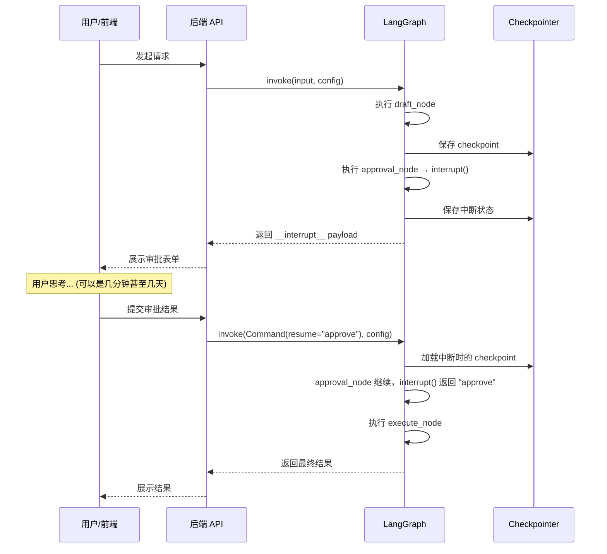
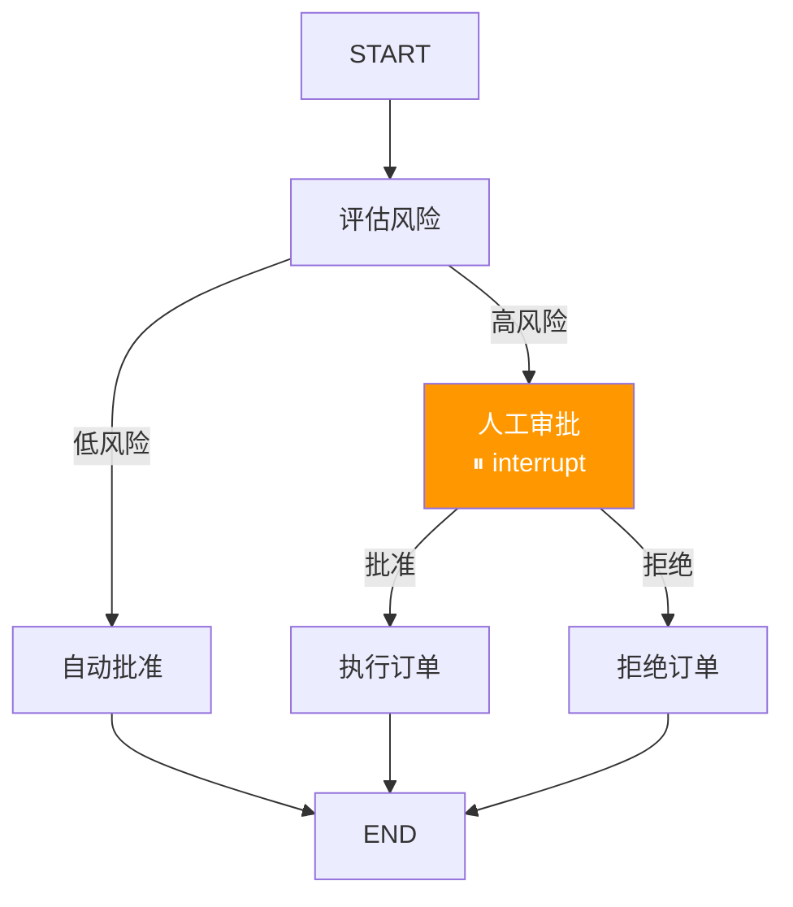

# Interrupts — Human-in-the-Loop (HITL)

> 前端开发者对 `window.confirm("确认删除？")` 不陌生——它会暂停 JS 执行，等待用户点击后继续。LangGraph 的 `interrupt` 做同一件事，但远比 `confirm` 强大：它能暂停整个分布式工作流、持久化当前状态、等待数天后再恢复。

## 前端类比：先建立直觉

| 前端概念 | LangGraph 概念 | 说明 |
|---------|---------------|------|
| `window.confirm()` | `interrupt()` | 暂停执行，等待用户输入 |
| `confirm` 返回值 | `Command(resume=value)` | 用户输入作为恢复值 |
| 阻塞式对话框 | 持久化中断 | 但不阻塞进程，checkpoint 保存状态 |
| `Promise` + `await` | interrupt/resume 模式 | 暂停→恢复的异步控制流 |

**LangGraph 原生语义**：`interrupt()` 函数在节点内调用，它会立即暂停图的执行并将一个 payload 返回给调用方。状态被保存到 checkpoint 中。调用方收集到人类输入后，通过 `Command(resume=value)` 恢复执行，此时 `interrupt()` 函数的返回值就是 `resume` 提供的值。

[🔗 Human-in-the-Loop 官方概念文档](https://langchain-ai.github.io/langgraph/concepts/human_in_the_loop/){target="_blank" rel="noopener"}

---

## 1. Interrupt 暂停机制

### 基础用法

```python
from langgraph.types import interrupt
from langgraph.graph import StateGraph, START, END, MessagesState
from langgraph.checkpoint.memory import InMemorySaver

def draft_node(state: MessagesState):
    """生成草稿"""
    return {"messages": [{"role": "assistant", "content": "草稿：建议将服务迁移到 K8s"}]}

def approval_node(state: MessagesState):
    """在这里暂停，等待人工审批"""
    # interrupt() 的参数是返回给调用方的 payload
    # 它必须是 JSON 可序列化的
    decision = interrupt({
        "question": "是否批准这个迁移方案？",
        "draft": state["messages"][-1].content,
        "options": ["approve", "reject", "revise"]
    })

    # 当 Command(resume=...) 恢复执行时，decision 就是 resume 的值
    if decision == "approve":
        return {"messages": [{"role": "assistant", "content": "方案已批准，开始执行"}]}
    elif decision == "reject":
        return {"messages": [{"role": "assistant", "content": "方案已拒绝"}]}
    else:
        return {"messages": [{"role": "assistant", "content": f"根据反馈修改：{decision}"}]}

def execute_node(state: MessagesState):
    return {"messages": [{"role": "assistant", "content": "执行完毕"}]}

builder = StateGraph(MessagesState)
builder.add_node("draft", draft_node)
builder.add_node("approval", approval_node)
builder.add_node("execute", execute_node)

builder.add_edge(START, "draft")
builder.add_edge("draft", "approval")
builder.add_edge("approval", "execute")
builder.add_edge("execute", END)

checkpointer = InMemorySaver()
graph = builder.compile(checkpointer=checkpointer)
```

### 关键前提

使用 `interrupt` 必须满足两个条件：
1. 编译图时挂载 **checkpointer**（否则暂停后状态丢失）
2. 调用时传入 **thread_id**（标识要恢复的会话）

---

## 2. Resume 恢复机制

```python
from langgraph.types import Command

config = {"configurable": {"thread_id": "migration-review-001"}}

# 第一次执行 — 在 approval_node 处暂停
result = graph.invoke(
    {"messages": [{"role": "user", "content": "请制定迁移方案"}]},
    config
)

# 检查中断信息
print(result)
# result 中会包含 __interrupt__ 字段：
# [Interrupt(value={'question': '是否批准这个迁移方案？', ...})]

# 恢复执行 — 传入人类的决策
resumed = graph.invoke(
    Command(resume="approve"),  # interrupt() 的返回值将是 "approve"
    config
)
print(resumed["messages"][-1])
# "执行完毕"
```

### Interrupt-Resume 流程图



---

## 3. 常见模式

### 模式 1：Stream + HITL 中断

在流式场景中处理中断：

```python
from langgraph.types import Command
from langchain_core.messages import AIMessageChunk

config = {"configurable": {"thread_id": "stream-hitl-001"}}
input_data = {"messages": [{"role": "user", "content": "分析这个方案"}]}

while True:
    interrupted = False
    async for mode, chunk in graph.astream(
        input_data,
        config,
        stream_mode=["messages", "updates"],
        subgraphs=True,
    ):
        if mode == "messages":
            msg, _ = chunk
            if isinstance(msg, AIMessageChunk) and msg.content:
                print(msg.content, end="", flush=True)

        elif mode == "updates":
            if "__interrupt__" in chunk:
                interrupted = True
                interrupt_info = chunk["__interrupt__"][0].value
                print(f"\n中断: {interrupt_info}")

                # 收集用户输入
                user_input = input("请输入你的决定: ")
                input_data = Command(resume=user_input)
                break

    if not interrupted:
        break  # 正常完成
```

### 模式 2：多中断处理

一个图中可以有多个 interrupt 点：

```python
def step_1(state):
    """第一个中断：确认方向"""
    direction = interrupt({"question": "选择哪个方向？", "options": ["A", "B"]})
    return {"direction": direction}

def step_2(state):
    """第二个中断：确认细节"""
    detail = interrupt({
        "question": f"方向 {state['direction']} 的具体参数？",
        "input_type": "text"
    })
    return {"detail": detail}

# 使用时需要多次 resume
config = {"configurable": {"thread_id": "multi-interrupt"}}

# 第一次：触发 step_1 的 interrupt
r1 = graph.invoke({"direction": "", "detail": ""}, config)
# 第一次 resume
r2 = graph.invoke(Command(resume="A"), config)
# 第二次 resume（自动到下一个 interrupt）
r3 = graph.invoke(Command(resume="详细参数..."), config)
```

### 模式 3：审批/拒绝模式

```python
from typing import Literal
from langgraph.types import interrupt, Command

def approval_gate(state) -> Command[Literal["proceed", "cancel"]]:
    """审批关卡：批准则继续，拒绝则取消"""
    approved = interrupt({
        "question": "是否批准执行？",
        "action_details": state.get("plan", ""),
        "risk_level": state.get("risk", "low")
    })

    if approved:
        return Command(goto="proceed")
    else:
        return Command(goto="cancel")
```

### 模式 4：审查并编辑状态

让用户在中断时不仅做决策，还能修改 Agent 的输出：

```python
def review_and_edit(state):
    """让用户审查并可能修改 Agent 生成的内容"""
    edited = interrupt({
        "type": "review",
        "content": state["draft"],
        "instruction": "请审查以下内容，可以直接修改后提交"
    })

    # edited 可以是修改后的内容
    return {"draft": edited}

# 恢复时传入修改后的内容
graph.invoke(
    Command(resume="修改后的草稿内容..."),
    config
)
```

### 模式 5：工具内中断

在工具调用中嵌入人工确认：

```python
from langgraph.types import interrupt

def dangerous_tool(action: str, params: dict):
    """执行危险操作前要求人工确认"""
    # 在工具内部中断
    confirmed = interrupt({
        "type": "tool_confirmation",
        "tool": "dangerous_tool",
        "action": action,
        "params": params,
        "warning": "此操作不可逆，请确认"
    })

    if not confirmed:
        return "操作已取消"

    # 执行实际操作
    return f"已执行 {action}"
```

### 模式 6：人工输入验证

让 Agent 的输出经过人工校验：

```python
def validate_output(state):
    """让人工验证 Agent 输出的准确性"""
    validation = interrupt({
        "type": "validation",
        "agent_output": state["result"],
        "question": "这个结果准确吗？如不准确请提供正确答案",
        "options": ["accurate", "inaccurate"]
    })

    if validation == "accurate":
        return {"validated": True}
    else:
        # validation 包含了人工提供的正确答案
        return {"result": validation, "validated": True}
```

---

## 4. Interrupt 规则

使用 `interrupt` 时必须遵守以下规则，否则会导致不可预期的行为。[🔗 interrupt() 使用规则详解](https://langchain-ai.github.io/langgraph/how-tos/human_in_the_loop/review-tool-calls/){target="_blank" rel="noopener"}

### 规则 1：不要在 try-except 中使用 interrupt

```python
# ❌ 错误 — interrupt 内部通过特殊异常实现暂停
def bad_node(state):
    try:
        result = interrupt("确认？")
    except Exception:
        # 这会捕获 interrupt 的内部异常，导致暂停失败
        pass

# ✅ 正确 — interrupt 放在 try 外面或只捕获特定异常
def good_node(state):
    result = interrupt("确认？")
    try:
        do_something_risky()
    except ValueError:
        handle_error()
```

### 规则 2：不要对 interrupt 重排序

```python
# ❌ 错误 — 条件性地跳过某些 interrupt 会导致恢复时错位
def bad_node(state):
    if state.get("need_approval"):
        a = interrupt("审批？")
    b = interrupt("确认？")  # 恢复时可能和上面的 interrupt 错位

# ✅ 正确 — interrupt 的顺序必须是确定性的
def good_node(state):
    a = interrupt("审批？")
    b = interrupt("确认？")
```

### 规则 3：不要返回复杂不可序列化的值

```python
# ❌ interrupt payload 必须是 JSON 可序列化的
interrupt(lambda: "不行")  # 函数不可序列化
interrupt({"file": open("x.txt")})  # 文件对象不可序列化

# ✅ 只传 JSON 友好的数据
interrupt({"question": "确认？", "options": ["yes", "no"]})
interrupt("简单字符串也可以")
```

### 规则 4：副作用必须幂等

```python
# ❌ 恢复时节点会重新执行到 interrupt 之前的代码
def bad_node(state):
    send_notification("开始处理")  # 恢复时会重复发送！
    approved = interrupt("审批？")
    return {"approved": approved}

# ✅ 在 interrupt 之前的副作用要做幂等处理
def good_node(state):
    if not state.get("notified"):
        send_notification("开始处理")
    approved = interrupt("审批？")
    return {"approved": approved, "notified": True}
```

---

## 5. 在 Subgraph 中使用 Interrupt

子图中的 interrupt 会"冒泡"到主图的调用方：

```python
from langgraph.graph import StateGraph, START, END, MessagesState
from langgraph.types import interrupt
from langgraph.checkpoint.memory import InMemorySaver

# 子图：包含 interrupt
def sub_approval(state: MessagesState):
    decision = interrupt({
        "source": "subgraph",
        "question": "子图需要审批"
    })
    return {"messages": [{"role": "assistant", "content": f"子图审批结果: {decision}"}]}

sub_builder = StateGraph(MessagesState)
sub_builder.add_node("approve", sub_approval)
sub_builder.add_edge(START, "approve")
sub_builder.add_edge("approve", END)
sub_graph = sub_builder.compile()

# 主图：引用子图
def main_process(state: MessagesState):
    return {"messages": [{"role": "assistant", "content": "主图处理完成"}]}

main_builder = StateGraph(MessagesState)
main_builder.add_node("process", main_process)
main_builder.add_node("sub", sub_graph)
main_builder.add_edge(START, "process")
main_builder.add_edge("process", "sub")
main_builder.add_edge("sub", END)

checkpointer = InMemorySaver()
graph = main_builder.compile(checkpointer=checkpointer)

config = {"configurable": {"thread_id": "subgraph-interrupt"}}

# 执行 — 会在子图的 interrupt 处暂停
result = graph.invoke(
    {"messages": [{"role": "user", "content": "开始"}]},
    config
)
# result 包含 __interrupt__ 来自子图

# 恢复 — Command 会自动路由到子图中的 interrupt
from langgraph.types import Command
resumed = graph.invoke(Command(resume="approved"), config)
```

---

## 6. 用 Interrupt 调试

interrupt 不仅用于生产中的人机交互，也是强大的调试工具：

```python
def debug_node(state):
    """在任何节点加入 interrupt 进行断点调试"""
    # 查看当前状态
    print(f"当前状态: {state}")

    # 暂停执行，让开发者检查
    action = interrupt({
        "debug": True,
        "current_state": str(state),
        "message": "检查状态后输入 'continue' 继续，或输入新的 state 值"
    })

    if action == "continue":
        return state
    else:
        # 开发者可以注入修改
        return action
```

**前端类比**：这就像在代码中加 `debugger` 语句——执行到这里就暂停，你可以在 DevTools 中检查变量、修改值，然后继续执行。

---

## 7. 完整的审批工作流示例

```python
from typing import TypedDict, Literal
from langgraph.graph import StateGraph, START, END
from langgraph.types import interrupt, Command
from langgraph.checkpoint.memory import InMemorySaver

class OrderState(TypedDict):
    order_id: str
    amount: float
    risk_level: str
    approved: bool
    result: str

def assess_risk(state: OrderState):
    """评估订单风险"""
    level = "high" if state["amount"] > 10000 else "low"
    return {"risk_level": level}

def auto_approve(state: OrderState):
    """低风险自动批准"""
    return {"approved": True, "result": f"订单 {state['order_id']} 自动批准"}

def manual_review(state: OrderState) -> Command[Literal["execute", "reject"]]:
    """高风险人工审批"""
    decision = interrupt({
        "type": "approval_required",
        "order_id": state["order_id"],
        "amount": state["amount"],
        "risk_level": state["risk_level"],
        "message": f"订单金额 ¥{state['amount']}，需要人工审批"
    })

    if decision == "approve":
        return Command(
            update={"approved": True},
            goto="execute"
        )
    else:
        return Command(
            update={"approved": False, "result": f"订单 {state['order_id']} 被拒绝: {decision}"},
            goto="reject"
        )

def execute_order(state: OrderState):
    return {"result": f"订单 {state['order_id']} 已执行，金额 ¥{state['amount']}"}

def reject_order(state: OrderState):
    return state  # result 已在 manual_review 中设置

def route_by_risk(state: OrderState) -> Literal["auto_approve", "manual_review"]:
    return "manual_review" if state["risk_level"] == "high" else "auto_approve"

builder = StateGraph(OrderState)
builder.add_node("assess", assess_risk)
builder.add_node("auto_approve", auto_approve)
builder.add_node("manual_review", manual_review)
builder.add_node("execute", execute_order)
builder.add_node("reject", reject_order)

builder.add_edge(START, "assess")
builder.add_conditional_edges("assess", route_by_risk)
builder.add_edge("auto_approve", END)
builder.add_edge("execute", END)
builder.add_edge("reject", END)

checkpointer = InMemorySaver()
graph = builder.compile(checkpointer=checkpointer)

# 场景：高风险订单
config = {"configurable": {"thread_id": "order-HIGH-001"}}
result = graph.invoke(
    {"order_id": "ORD-001", "amount": 50000.0, "risk_level": "", "approved": False, "result": ""},
    config
)
# 在 manual_review 暂停，返回 __interrupt__

# 人工批准
final = graph.invoke(Command(resume="approve"), config)
print(final["result"])  # "订单 ORD-001 已执行，金额 ¥50000.0"
```



---

## 要点回顾

| 概念 | 一句话 |
|------|--------|
| `interrupt(payload)` | 暂停执行并返回 payload 给调用方 |
| `Command(resume=value)` | 恢复执行，value 成为 interrupt() 的返回值 |
| 前提条件 | 必须有 checkpointer + thread_id |
| 子图 interrupt | 自动冒泡到主图调用方 |
| 幂等性 | interrupt 之前的代码在恢复时会重新执行 |

---

## 先修与下一步

- **先修**：[持久化](/ai/langgraph/guide/persistence) | [Durable Execution](/ai/langgraph/guide/durable-execution)
- **下一步**：[Time Travel](/ai/langgraph/guide/time-travel) | [Memory 记忆系统](/ai/langgraph/guide/memory)
