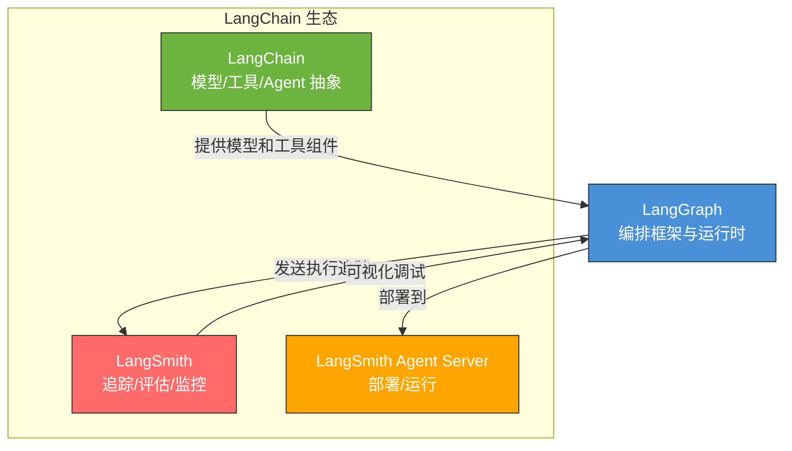

# LangGraph 概览

> LangGraph 是一个**低层级编排框架与运行时（low-level orchestration framework & runtime）**，用于构建、管理和部署长运行、有状态的 Agent 与工作流。被 Klarna、Replit、Elastic 等企业在生产环境中采用。

## 1. LangGraph 是什么

### 1.1 一句话定义

LangGraph 是一个让你把 **LLM 应用的执行流程建模为"有状态图"** 的框架。它不负责帮你写 prompt，不封装"一键 Agent"，而是提供**执行控制层**——让你的 Agent 在复杂场景下依然可控、可中断、可恢复、可观测。

### 1.2 它不是 LangChain 的"简单扩展"

很多人第一印象是"LangGraph = LangChain 多了个图功能"。这是误解。

| 维度 | LangChain | LangGraph |
|------|-----------|-----------|
| **抽象层级** | 高层——提供预置 Agent 架构、工具绑定、prompt 模板 | 低层——只提供节点、边、状态、执行运行时 |
| **核心关注** | 模型调用、工具编排、RAG 管道 | 执行控制：中断/恢复/持久化/流式/调试 |
| **依赖关系** | LangGraph 可以不用 LangChain | LangChain 的高级 Agent 底层用 LangGraph |
| **适用阶段** | 快速原型、简单工具链 | 流程复杂、需要生产级控制 |

> **前端类比**：如果把构建 AI Agent 类比为构建 Web 服务——LangChain 相当于 Next.js（高层、约定式、开箱即用），而 LangGraph 相当于 Express.js（低层、自由度高、你完全控制中间件和路由）。
>
> **LangGraph 原生语义**：LangGraph 自称 "orchestration framework"，强调的是**编排（orchestration）**而非**抽象（abstraction）**。它不替你决定业务架构，只给你搭建执行管道的原语。

### 1.3 前置知识

官方建议在学习 LangGraph 之前，先熟悉两个概念：

- **Models**：了解如何调用 LLM（OpenAI、Anthropic 等），至少能调通一次 `chat.invoke()`
- **Tools**：了解 function calling / tool calling 的基本概念

这是因为 LangGraph 本身不限定模型和工具的来源，它只负责编排。

## 2. 核心收益（Core Benefits）

LangGraph 官方强调了 5 大核心收益。下面逐一拆解。

### 2.1 Durable Execution（可恢复执行）

构建能够**持久化到故障恢复后继续运行**的 Agent。流程中断后不必整条链路重跑，从上次 checkpoint 恢复即可。

**适用场景**：长链路调用、外部 API 不稳定、需要跨多个步骤的复杂处理。

> **前端类比**：类似 Service Worker 中的后台同步（Background Sync）——即使浏览器关闭，任务仍会在下次打开时恢复执行。
>
> **LangGraph 原生语义**：基于 Checkpoint 机制，每个节点执行完都会持久化状态快照。失败后通过 `thread_id` 恢复到最近一个快照继续执行。

### 2.2 Human-in-the-Loop（人机协作）

在任意关键节点**暂停执行、等待人类审批或输入**，然后恢复执行。

**适用场景**：高风险操作前的审批闸门（发邮件、转账、数据删除）、需要人工审核 LLM 输出。

```python
from langgraph.types import interrupt

def review_node(state):
    # 在此暂停，等待人类输入
    decision = interrupt({
        "message": "请审核以下内容",
        "content": state["draft"]
    })
    return {"approved": decision}
```

> **前端类比**：类似 `window.confirm()` 弹窗——流程在弹窗处暂停，等用户点击确认后继续。但 LangGraph 的 interrupt 是**服务端持久化的**，可以跨请求、跨进程恢复。

### 2.3 Comprehensive Memory（全面记忆）

- **短期记忆（Short-term）**：线程内状态与 Checkpoint，当前会话的工作记忆
- **长期记忆（Long-term）**：跨线程 Store，用户维度的持久化知识

> **前端类比**：短期记忆 = React 组件的 `useState`（组件卸载就没了）；长期记忆 = `localStorage`（跨页面持久化）。
>
> **LangGraph 原生语义**：短期记忆依赖 Checkpointer 的线程状态；长期记忆依赖 Store API（如 Redis Store），可按 namespace 分隔不同用户的记忆。

### 2.4 Debugging with LangSmith（可视化调试）

可以用 LangSmith 可视化执行路径、状态变化、节点行为、运行时指标，排查复杂流程问题。

> **前端类比**：类似 Redux DevTools——你能看到每个 action（节点）执行前后的 state 变化，还能"时间旅行"到任意历史状态。
>
> **LangGraph 原生语义**：LangSmith 提供 Trace、Evaluation、Monitoring 三大能力。结合 LangGraph 的 Checkpoint，实现完整的执行回放。

### 2.5 Production-Ready Deployment（生产级部署）

提供可扩展的基础设施，专为有状态、长运行工作流设计。

> **前端类比**：类似 Vercel 之于 Next.js——框架本身只定义行为，部署平台负责规模化运行。
>
> **LangGraph 原生语义**：通过 LangSmith Agent Server 部署，支持水平扩展、状态持久化、监控告警。

## 3. LangGraph 生态

LangGraph 可以独立使用，也可以与 LangChain 生态无缝集成。



### 三者分工

| 组件 | 职责 | 何时用 |
|------|------|--------|
| **LangChain** | 模型集成、工具定义、Agent 高层抽象 | 需要快速接入模型和工具时 |
| **LangGraph** | 执行流程编排、状态管理、中断恢复 | 流程复杂、需要可控性时 |
| **LangSmith** | 追踪、评估、监控、可视化调试 | 开发调试和生产运维时 |

### 工程建议

1. **本地原型**：先用 LangGraph 构建原型
2. **接入观测**：用 LangSmith 做执行追踪和调试
3. **生产部署**：需要上线时接入 Agent Server

## 4. 最小可运行示例

以下是一个最小的 LangGraph 程序，展示核心 API 的使用方式：

```python
from langgraph.graph import StateGraph, MessagesState, START, END


# 定义节点函数：接收 state，返回局部更新
def chatbot(state: MessagesState):
    return {"messages": [{"role": "ai", "content": "你好！我是 LangGraph 驱动的 Agent。"}]}


# 1. 创建图构建器，传入状态类型
graph_builder = StateGraph(MessagesState)

# 2. 添加节点
graph_builder.add_node("chatbot", chatbot)

# 3. 添加边：定义执行流向
graph_builder.add_edge(START, "chatbot")    # START → chatbot
graph_builder.add_edge("chatbot", END)       # chatbot → END

# 4. 编译：将构建器转为可执行的图
graph = graph_builder.compile()

# 5. 执行
result = graph.invoke({
    "messages": [{"role": "user", "content": "你好！"}]
})
print(result["messages"][-1])
```

### 关键概念解读

| 代码元素 | 含义 | 前端类比 |
|----------|------|----------|
| `StateGraph` | 图构建器，定义节点和边 | `createRouter()` 路由配置 |
| `MessagesState` | 内置的消息状态类型，自带 `messages` 字段和 `add_messages` reducer | 类似 Redux 中预定义的 slice |
| `START` / `END` | 图的虚拟入口和出口 | 路由的 `/` 入口和 404 兜底 |
| `add_node()` | 注册一个节点函数 | `app.use()` 注册中间件 |
| `add_edge()` | 连接两个节点 | 路由跳转规则 |
| `compile()` | 将构建配置"冻结"为可执行图 | `webpack.compile()` 将配置转为可运行产物 |
| `invoke()` | 执行一次完整的图运行 | `fetch()` 发起请求并等待完整响应 |

### 执行流程


## 5. 与前端的终极类比

### LangGraph 之于 Agent = Express.js 之于 Web 服务

| Express.js | LangGraph |
|------------|-----------|
| `app = express()` | `builder = StateGraph(State)` |
| `app.use(middleware)` | `builder.add_node("name", fn)` |
| `app.get('/path', handler)` | `builder.add_edge(START, "name")` |
| `app.listen(3000)` | `graph = builder.compile()` |
| `req/res` 对象 | `state` 状态对象 |
| 中间件链 `next()` | 节点间的边（Edge） |
| 条件路由 | `add_conditional_edges()` |
| 请求上下文 | `Runtime` 上下文 |

**核心相似点**：都是低层框架，给你最大控制力，不替你做架构决策。

**关键差异**：Express 处理的是无状态的 HTTP 请求-响应，而 LangGraph 处理的是**有状态的、可能长运行的执行流程**——它需要持久化状态、支持中断恢复、支持人机协作。

## 6. 设计灵感

LangGraph 受以下系统启发：

- **Pregel**：Google 的大规模图计算模型
- **Apache Beam**：统一的批流处理编程模型
- **NetworkX**：API 接口风格

这说明 LangGraph 的核心思想来自**成熟的分布式计算/图计算范式**，不是临时拼装的 API。

## 7. 何时该用 LangGraph

| 场景 | 推荐方案 |
|------|----------|
| 简单问答 + 几个工具 | 先用 LangChain `create_agent` |
| 需要条件分支和多步骤 | LangGraph |
| 需要人工审批中断 | LangGraph |
| 长流程需要失败恢复 | LangGraph |
| 需要执行回放和时间旅行 | LangGraph |
| 多 Agent 协作 | LangGraph |

## 8. 本页总结

- LangGraph 是**编排框架**，不是高层 Agent SDK
- 核心价值在于 5 大能力：Durable Execution、HITL、Memory、Debugging、Production
- 与 LangChain/LangSmith 是**互补关系**，不是替代关系
- 设计灵感来自成熟的分布式图计算范式

---

**先修**：无（本页是入门第一站）

**下一步**：
- [安装与环境配置](/ai/langgraph/guide/install) — 搭建本地开发环境
- [快速上手](/ai/langgraph/guide/quickstart) — 用 Graph API 和 Functional API 构建完整 Agent

**参考**：
- [LangGraph Overview (Official)](https://langchain-ai.github.io/langgraph/)
- [LangGraph Python Docs](https://langchain-ai.github.io/langgraph/reference/)
