# 常见坑与排查

## 1) 中断后“重复执行副作用”

**症状**：恢复后重复发邮件、重复扣费、重复写库。  
**原因**：`interrupt` 恢复时节点会从头执行，`interrupt` 之前副作用被重复触发。

**修复**：

- 把副作用放到 `interrupt` 之后。
- 或把副作用封装成幂等任务（带幂等 key）。

## 2) 同一节点多次 interrupt 顺序错乱

**症状**：恢复值错位，问 A 回答却被当成 B。  
**原因**：同节点多个 `interrupt` 按索引匹配，执行顺序变化会导致错配。

**修复**：

- 保持 `interrupt` 调用顺序稳定。
- 避免基于不稳定条件动态跳过某个 `interrupt`。

## 3) 裸 try/except 把 interrupt 吞掉

**症状**：看起来调用了 `interrupt`，但执行没有真正暂停。  
**原因**：`interrupt` 通过特殊异常触发暂停，被 `except Exception` 捕获了。

**修复**：

- 不要用裸 `except` 包裹 `interrupt`。
- 仅捕获明确业务异常类型。

## 4) 并行分支写同一字段互相覆盖

**症状**：并行节点结果丢失或只有最后一个生效。  
**原因**：没有为该字段设计 reducer，默认覆盖语义。

**修复**：

- 对并行聚合字段使用 reducer（如 `operator.add`、`add_messages`）。

## 5) 恢复失败：thread_id 不一致

**症状**：`Command(resume=...)` 后像新流程，不接着上次走。  
**原因**：恢复时使用了新的 `thread_id`。

**修复**：

- 全链路固定 `thread_id`，并在日志里可追踪。

## 6) 只看 token，不看流程状态

**症状**：前端只显示“模型在说话”，看不到节点进度/审批等待。  
**原因**：只用了 `messages` 流，没消费 `updates/custom`。

**修复**：

- 前端至少双流：`messages` + `updates`。
- 审批与长任务加 `custom` 事件。

## 7) 图太大、节点职责混乱

**症状**：后期维护困难，改一处牵一片。  
**原因**：把所有逻辑都塞进单图，缺少子图边界。

**修复**：

- 抽取可复用子图（审批流、检索流、汇总流）。
- 每个节点坚持“单一职责 + 局部更新”。

## 一张排查流程图

```mermaid
flowchart TD
    A[出现异常行为] --> B{是否与恢复相关?}
    B -->|是| C[检查 thread_id 与 checkpointer]
    C --> D{interrupt 前是否有副作用?}
    D -->|是| E[改为幂等或后移副作用]
    D -->|否| F[检查 interrupt 顺序与 resume 映射]
    B -->|否| G{是否并行分支问题?}
    G -->|是| H[检查 reducer 与字段覆盖]
    G -->|否| I[检查 stream_mode 与节点日志]
```

## 前端开发者专用自检清单

- [ ] 我是否把 `thread_id` 当成会话主键管理？
- [ ] UI 是否同时消费了 `messages` 与 `updates`？
- [ ] 审批弹窗是否由 `__interrupt__` payload 驱动？
- [ ] 恢复操作是否总是走 `Command(resume=...)` 并复用同一线程？
- [ ] 出现重放时是否能通过 state history 定位到具体 superstep？

## 参考

- [Interrupts](https://docs.langchain.com/oss/python/langgraph/interrupts)
- [Durable Execution](https://docs.langchain.com/oss/python/langgraph/durable-execution)
- [Persistence](https://docs.langchain.com/oss/python/langgraph/persistence)
