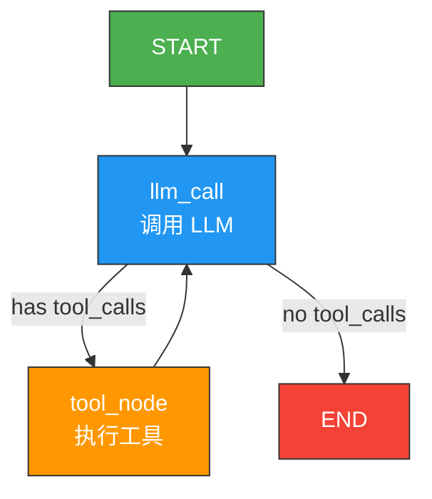
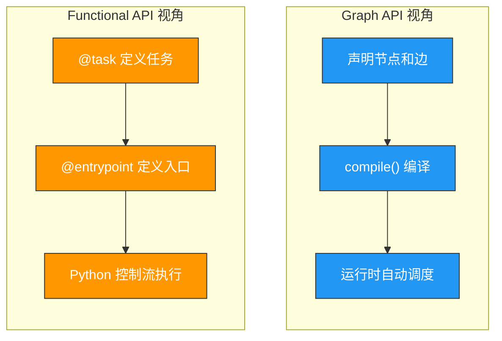
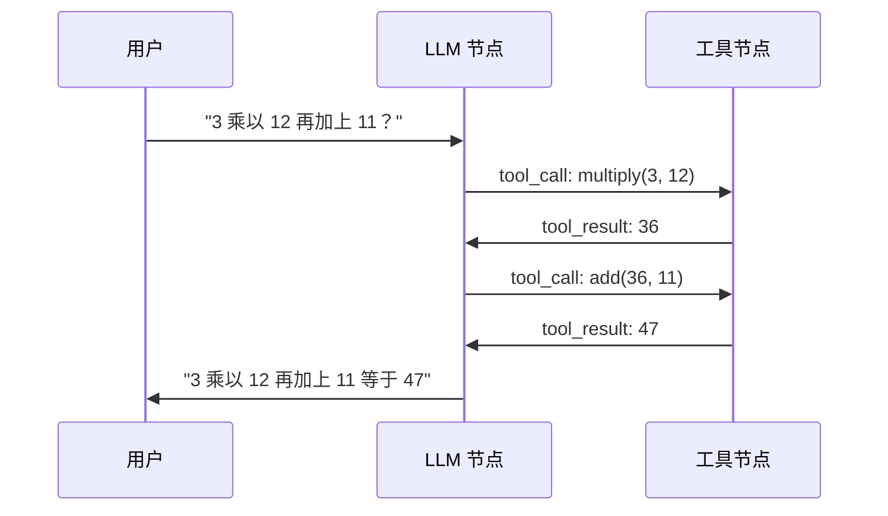

# 快速上手

> 本页带你用 LangGraph 的两种核心 API——Graph API 和 Functional API——各构建一个完整的 ReAct Agent。两种方式都会经历：定义工具 -> 定义模型 -> 定义节点 -> 组装运行。

## 前置准备

确保你已完成 [安装与环境配置](/ai/langgraph/guide/install)，并配置了 API Key。

```bash
pip install -U langgraph langchain langchain-openai
```

```python
# 在脚本开头加载环境变量
from dotenv import load_dotenv
load_dotenv()
```

## 1. 共同基础：定义工具和模型

两种 API 都会使用同一组工具和模型，我们先把它们定义好。

### 1.1 定义工具

```python
from langchain.tools import tool


@tool
def multiply(a: int, b: int) -> int:
    """将两个数相乘。当用户要求计算乘法时使用。"""
    return a * b


@tool
def add(a: int, b: int) -> int:
    """将两个数相加。当用户要求计算加法时使用。"""
    return a + b


@tool
def divide(a: int, b: int) -> float:
    """将两个数相除。当用户要求计算除法时使用。"""
    return a / b


tools = [add, multiply, divide]
```

> **前端类比**：`@tool` 装饰器的作用类似定义一个 API Route Handler。`docstring` 会被自动转换为函数描述，发送给 LLM，让它知道何时调用这个工具——这类似 OpenAPI 的 `description` 字段。
>
> **LangGraph 原生语义**：LangGraph 本身不限定工具的来源。这里使用 LangChain 的 `@tool` 是为了方便，你也可以用原生的 function calling schema。

### 1.2 初始化模型

```python
from langchain.chat_models import init_chat_model

# 使用支持 tool calling 的模型
llm = init_chat_model("gpt-4o-mini")

# 将工具绑定到模型（让模型知道有哪些工具可用）
llm_with_tools = llm.bind_tools(tools)
```

> **前端类比**：`bind_tools()` 类似给 HTTP 客户端配置默认的 headers 或 interceptors——绑定后，每次调用模型时都会自动带上工具定义。

## 2. Graph API 版本（声明式图构建）

Graph API 是 LangGraph 的经典方式：你声明节点和边，然后编译成可执行图。

### 2.1 完整执行流程



### 2.2 步骤一：定义状态

```python
from langgraph.graph import MessagesState

# MessagesState 内置了 messages 字段和 add_messages reducer
# 等价于：
# class MessagesState(TypedDict):
#     messages: Annotated[list, add_messages]
```

`MessagesState` 是 LangGraph 为聊天场景预定义的状态类型。它的 `messages` 字段使用 `add_messages` reducer，意味着新消息会**追加**到列表而非覆盖。

> **前端类比**：`MessagesState` 类似 Redux Toolkit 的 `createSlice` 预定义的 state 结构，`add_messages` 是内置的 reducer 函数。

### 2.3 步骤二：定义 LLM 调用节点

```python
from langgraph.graph import MessagesState


def llm_call(state: MessagesState):
    """LLM 决策节点：调用模型，可能返回工具调用或最终回答"""
    response = llm_with_tools.invoke(state["messages"])
    return {"messages": [response]}
```

节点函数的核心约定：
- **输入**：接收完整 `state`
- **输出**：返回**局部更新**（只返回需要更新的字段）

> **前端类比**：节点函数的模式类似 Redux 的 reducer——接收当前 state，返回新的部分 state。不同的是，LangGraph 节点可以有副作用（网络调用等），更像 Redux Thunk。

### 2.4 步骤三：定义工具执行节点

```python
from langgraph.prebuilt import ToolNode

# ToolNode 是内置的工具执行节点
# 它会根据 LLM 返回的 tool_calls 自动执行对应工具
tool_node = ToolNode(tools)
```

`ToolNode` 是 LangGraph 预构建的节点，它会：
1. 从 state 的最后一条消息中提取 `tool_calls`
2. 执行对应的工具函数
3. 将工具返回值包装成 `ToolMessage` 追加到 messages

### 2.5 步骤四：定义条件边（结束逻辑）

```python
from langgraph.graph import END


def should_continue(state: MessagesState):
    """判断是否需要继续循环：有 tool_calls 则继续，否则结束"""
    last_message = state["messages"][-1]

    # 如果 LLM 返回了 tool_calls，转到工具节点
    if last_message.tool_calls:
        return "tool_node"

    # 否则，LLM 已经给出最终回答，结束
    return END
```

> **前端类比**：条件边 = Express.js 的路由守卫（Route Guard）或 React Router 的 `loader`。根据当前状态决定"下一步去哪"。

### 2.6 步骤五：构建并编译

```python
from langgraph.graph import StateGraph, START

# 创建图构建器
agent_builder = StateGraph(MessagesState)

# 添加节点
agent_builder.add_node("llm_call", llm_call)
agent_builder.add_node("tool_node", tool_node)

# 添加边
agent_builder.add_edge(START, "llm_call")                # 入口 → LLM
agent_builder.add_conditional_edges(                       # LLM → 条件分支
    "llm_call",
    should_continue,
    ["tool_node", END]
)
agent_builder.add_edge("tool_node", "llm_call")           # 工具 → 回到 LLM

# 编译为可执行图
agent = agent_builder.compile()
```

### 2.7 完整代码（Graph API）

```python
from dotenv import load_dotenv
load_dotenv()

from langchain.tools import tool
from langchain.chat_models import init_chat_model
from langgraph.graph import StateGraph, MessagesState, START, END
from langgraph.prebuilt import ToolNode


# --- 工具定义 ---
@tool
def multiply(a: int, b: int) -> int:
    """将两个数相乘。"""
    return a * b

@tool
def add(a: int, b: int) -> int:
    """将两个数相加。"""
    return a + b

@tool
def divide(a: int, b: int) -> float:
    """将两个数相除。"""
    return a / b

tools = [add, multiply, divide]

# --- 模型 ---
llm = init_chat_model("gpt-4o-mini")
llm_with_tools = llm.bind_tools(tools)

# --- 节点 ---
def llm_call(state: MessagesState):
    """调用 LLM"""
    return {"messages": [llm_with_tools.invoke(state["messages"])]}

tool_node = ToolNode(tools)

# --- 条件边 ---
def should_continue(state: MessagesState):
    if state["messages"][-1].tool_calls:
        return "tool_node"
    return END

# --- 构建图 ---
builder = StateGraph(MessagesState)
builder.add_node("llm_call", llm_call)
builder.add_node("tool_node", tool_node)
builder.add_edge(START, "llm_call")
builder.add_conditional_edges("llm_call", should_continue, ["tool_node", END])
builder.add_edge("tool_node", "llm_call")

agent = builder.compile()

# --- 运行 ---
result = agent.invoke({
    "messages": [{"role": "user", "content": "3 乘以 12 再加上 11 等于多少？"}]
})
print(result["messages"][-1].content)
```

## 3. Functional API 版本（命令式函数组合）

Functional API 是 LangGraph 的另一种风格：用 Python 函数和装饰器直接定义执行逻辑，更符合"写代码"的直觉。

### 3.1 核心概念

| 概念 | 说明 | Graph API 对应 |
|------|------|----------------|
| `@entrypoint` | 定义一个可执行的入口函数 | `StateGraph` + `compile()` |
| `@task` | 定义一个可追踪、可重试的任务 | `add_node()` |
| 函数调用 + `.result()` | 调用任务并获取结果 | `add_edge()` |
| `if/else` / `while` | Python 原生控制流 | `add_conditional_edges()` |

### 3.2 步骤一：定义模型调用任务

```python
from langgraph.func import task

@task
def call_model(messages: list):
    """调用 LLM（task 装饰器使其可追踪和持久化）"""
    response = llm_with_tools.invoke(messages)
    return response
```

### 3.3 步骤二：定义工具执行任务

```python
from langgraph.prebuilt import ToolNode

tool_node = ToolNode(tools)

@task
def call_tools(message):
    """执行 LLM 返回的工具调用"""
    # ToolNode 期望接收 MessagesState 格式
    result = tool_node.invoke({"messages": [message]})
    return result["messages"]
```

### 3.4 步骤三：定义 Agent 入口

```python
from langgraph.func import entrypoint


@entrypoint()
def agent(messages: list):
    """ReAct Agent 的完整循环"""
    # 调用 LLM
    llm_response = call_model(messages).result()

    # 循环：如果 LLM 返回了 tool_calls，就执行工具然后再调用 LLM
    while llm_response.tool_calls:
        # 执行工具
        tool_results = call_tools(llm_response).result()

        # 将工具结果追加到消息列表
        messages = messages + [llm_response] + tool_results

        # 再次调用 LLM
        llm_response = call_model(messages).result()

    return llm_response
```

> **前端类比**：Functional API 的写法非常类似 async/await 风格的 Node.js 代码。`@task` = 一个可追踪的异步函数，`.result()` = `await`，`@entrypoint` = Express 的 route handler。
>
> **LangGraph 原生语义**：`@task` 不只是语法糖，它让任务具有**可追踪性**（LangSmith 可见）和**持久化能力**（配合 checkpointer 可恢复执行）。`@entrypoint` 则标记了执行图的边界。

### 3.5 完整代码（Functional API）

```python
from dotenv import load_dotenv
load_dotenv()

from langchain.tools import tool
from langchain.chat_models import init_chat_model
from langgraph.func import entrypoint, task
from langgraph.prebuilt import ToolNode


# --- 工具定义 ---
@tool
def multiply(a: int, b: int) -> int:
    """将两个数相乘。"""
    return a * b

@tool
def add(a: int, b: int) -> int:
    """将两个数相加。"""
    return a + b

@tool
def divide(a: int, b: int) -> float:
    """将两个数相除。"""
    return a / b

tools = [add, multiply, divide]

# --- 模型 ---
llm = init_chat_model("gpt-4o-mini")
llm_with_tools = llm.bind_tools(tools)

# --- 工具节点 ---
tool_node = ToolNode(tools)

# --- 任务定义 ---
@task
def call_model(messages: list):
    """调用 LLM"""
    return llm_with_tools.invoke(messages)

@task
def call_tools(message):
    """执行工具调用"""
    result = tool_node.invoke({"messages": [message]})
    return result["messages"]

# --- Agent 入口 ---
@entrypoint()
def agent(messages: list):
    """ReAct Agent"""
    llm_response = call_model(messages).result()

    while llm_response.tool_calls:
        tool_results = call_tools(llm_response).result()
        messages = messages + [llm_response] + tool_results
        llm_response = call_model(messages).result()

    return llm_response

# --- 运行 ---
result = agent.invoke([
    {"role": "user", "content": "3 乘以 12 再加上 11 等于多少？"}
])
print(result.content)
```

## 4. 两种 API 对比

### 4.1 核心差异

| 维度 | Graph API | Functional API |
|------|-----------|----------------|
| **编程风格** | 声明式（描述"图长什么样"） | 命令式（描述"代码怎么跑"） |
| **控制流** | 通过边和条件边定义 | 用 Python 原生 `if/else/while` |
| **状态管理** | 显式 State 类型 + reducer | 函数参数传递 |
| **可视化** | 编译前就能看到图结构 | 需要运行后才能追踪 |
| **复杂分支** | 需要 `add_conditional_edges` | 直接写 `if` |
| **并行执行** | 通过 `Send()` API | 通过多个 `.result()` |
| **学习曲线** | 需要理解图的概念 | 更接近普通 Python 代码 |

### 4.2 执行模型对比



### 4.3 如何选择

| 场景 | 推荐 |
|------|------|
| 流程固定、需要可视化审查 | Graph API |
| 流程简单、快速原型 | Functional API |
| 团队需要统一规范 | Graph API（更结构化） |
| 逻辑复杂但线性 | Functional API（更易读） |
| 需要动态并行（如 map-reduce） | Graph API（`Send()` 更强） |
| 从现有 Python 代码迁移 | Functional API（改动更小） |

> **前端类比**：
> - Graph API 类似 **React Router 的声明式配置**——你先定义好所有路由和条件，框架负责匹配执行
> - Functional API 类似 **Express.js 的中间件链**——你用代码直接写出执行顺序和条件

**重要认知**：两种 API 底层共享同一个运行时（Pregel），都支持持久化、流式、中断恢复。选择哪种只影响"你如何描述图"，不影响"图如何执行"。

## 5. 运行与测试

### 5.1 基本运行

```python
# Graph API
result = agent.invoke({
    "messages": [{"role": "user", "content": "3 加 5 等于多少？"}]
})
print(result["messages"][-1].content)

# Functional API
result = agent.invoke([
    {"role": "user", "content": "3 加 5 等于多少？"}
])
print(result.content)
```

### 5.2 流式输出

```python
# Graph API 流式
for chunk in agent.stream(
    {"messages": [{"role": "user", "content": "3 乘以 7 等于多少？"}]},
    stream_mode="updates"
):
    print(chunk)
    print("---")
```

### 5.3 带持久化运行

```python
from langgraph.checkpoint.memory import MemorySaver

# 重新编译，挂载 checkpointer
agent_with_memory = builder.compile(checkpointer=MemorySaver())

config = {"configurable": {"thread_id": "math-session-1"}}

# 第一轮对话
result1 = agent_with_memory.invoke(
    {"messages": [{"role": "user", "content": "3 乘以 12 等于多少？"}]},
    config=config
)
print(result1["messages"][-1].content)

# 第二轮对话（同一 thread_id，上下文延续）
result2 = agent_with_memory.invoke(
    {"messages": [{"role": "user", "content": "再加上 11 呢？"}]},
    config=config
)
print(result2["messages"][-1].content)
```

### 5.4 查看图结构

```python
# 生成 Mermaid 格式的图描述
print(agent.get_graph().draw_mermaid())

# 在 Jupyter Notebook 中生成图片
# from IPython.display import Image, display
# display(Image(agent.get_graph().draw_mermaid_png()))
```

## 6. ReAct 循环执行流程详解

无论用哪种 API，底层执行的都是相同的 ReAct 循环：



**执行步骤**：

1. 用户发送问题
2. LLM 分析问题，决定先调用 `multiply(3, 12)`
3. 工具节点执行乘法，返回 `36`
4. LLM 收到工具结果，决定调用 `add(36, 11)`
5. 工具节点执行加法，返回 `47`
6. LLM 收到工具结果，判断已经有了最终答案，直接回复用户

这就是 **ReAct（Reasoning + Acting）** 模式——LLM 在"推理"和"行动"之间交替，直到得出最终答案。

## 7. 常见问题

### Q: 为什么 Graph API 需要 `should_continue` 而 Functional API 用 `while`？

Graph API 的图结构是静态声明的，需要一个函数来告诉运行时"下一步去哪个节点"。Functional API 使用 Python 原生控制流，`while` 循环天然就是条件循环。

### Q: 两种 API 可以混用吗？

可以。你可以在 Graph API 的节点中调用 `@task` 装饰的函数，也可以在 Functional API 中使用 Graph API 构建的子图。

### Q: `ToolNode` 是必须的吗？

不是。`ToolNode` 是 LangGraph 的预构建便捷组件。你完全可以自己写工具执行逻辑，手动解析 `tool_calls` 并调用对应函数。

---

**先修**：
- [概览](/ai/langgraph/guide/overview) — 理解 LangGraph 定位
- [安装与环境配置](/ai/langgraph/guide/install) — 搭建开发环境

**下一步**：
- [LangGraph 思维方式](/ai/langgraph/guide/thinking-in-langgraph) — 学会用图的方式思考业务流程
- [工作流与 Agent 模式](/ai/langgraph/guide/workflows-agents) — 掌握 6 种常见编排模式

**参考**：
- [LangGraph Quickstart (Official)](https://langchain-ai.github.io/langgraph/tutorials/get-started/quickstart/)
- [Graph API vs Functional API](https://langchain-ai.github.io/langgraph/concepts/choosing-apis/)
