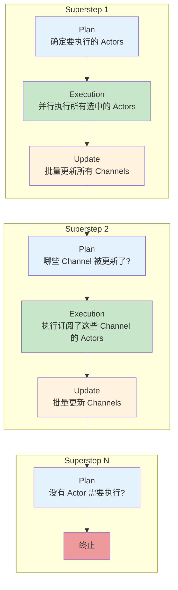
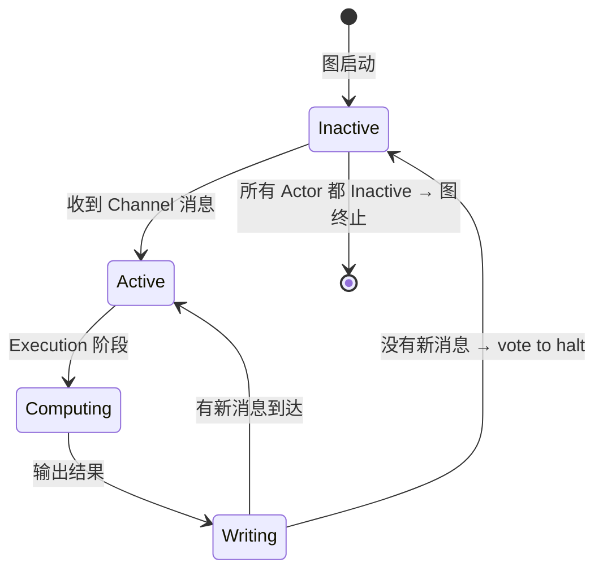
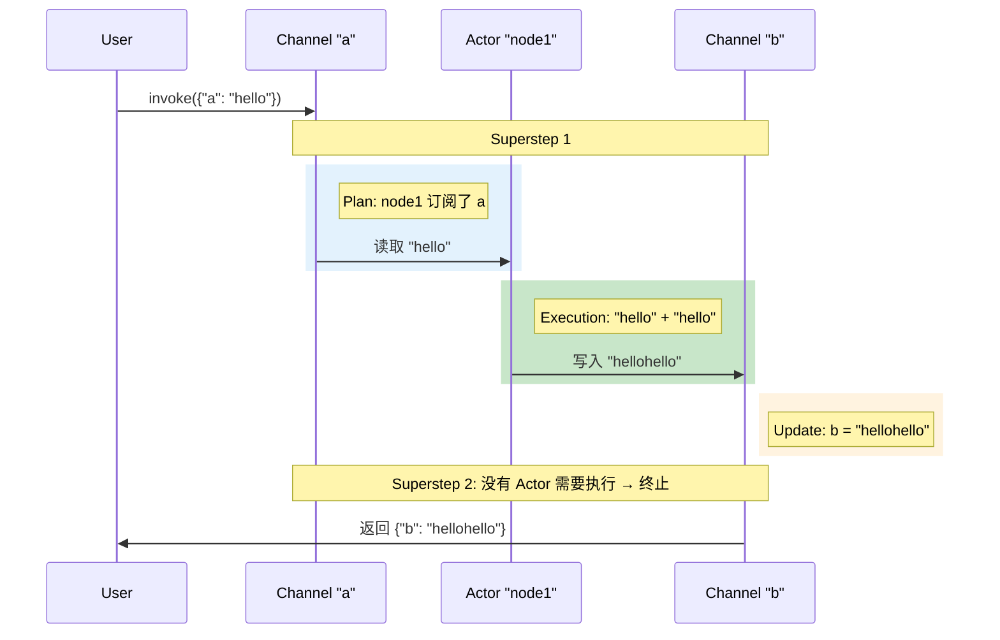
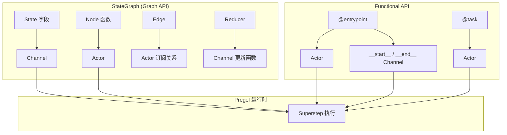
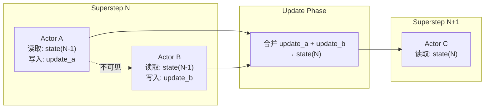
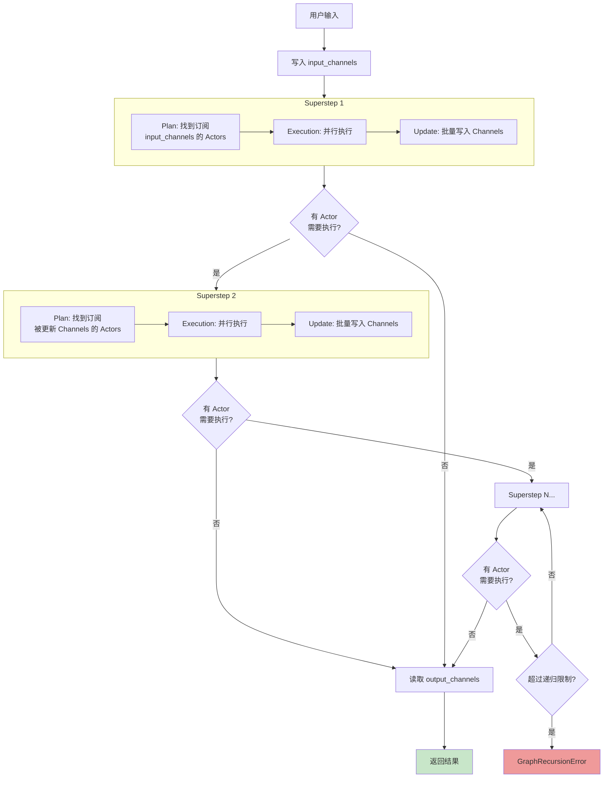

# Runtime (Pregel)

> LangGraph 的所有高级 API（StateGraph、Functional API）底层都运行在 **Pregel** 运行时之上。理解 Pregel 的工作原理，能帮你在遇到诡异行为时快速定位问题，也能让你更好地设计高效的工作流。

## 前端类比：建立直觉

| Pregel 概念 | 前端类比 | 说明 |
|-------------|---------|------|
| **Pregel 运行时** | Web Worker 线程池 | 管理多个执行单元的调度 |
| **Actor** | 单个 Web Worker | 独立的计算单元，读写通道 |
| **Channel** | MessageChannel / postMessage | Actor 之间的通信机制 |
| **Superstep** | requestAnimationFrame 的一帧 | 一轮同步执行 + 状态更新 |
| **Plan 阶段** | React 的 render phase | 决定"谁需要执行" |
| **Execution 阶段** | React 的 commit phase | 实际执行计算 |
| **Update 阶段** | DOM 批量更新 | 批量应用状态变更 |

> **LangGraph 原生语义说明**：Pregel 运行时的名字来源于 Google 的 [Pregel 论文](https://research.google/pubs/pub37252/)，这是一个用于大规模图计算的算法。LangGraph 将其思想应用于 Agent 工作流编排，通过 Actor + Channel + Superstep 模型实现可靠、可恢复的执行。

## LangGraph 运行时概述

### Pregel 是什么

`Pregel` 是 LangGraph 的核心运行时引擎。它将 **Actors**（执行器）和 **Channels**（通道）组合成一个应用。无论你用 `StateGraph` 还是 `@entrypoint`，最终编译/装饰后得到的都是一个 `Pregel` 实例。

```python
from langgraph.graph import StateGraph, START, END
from typing import TypedDict


class MyState(TypedDict):
    value: str


def my_node(state: MyState) -> dict:
    return {"value": state["value"] + "!"}


builder = StateGraph(MyState)
builder.add_node("my_node", my_node)
builder.add_edge(START, "my_node")
builder.add_edge("my_node", END)

graph = builder.compile()

# graph 就是一个 Pregel 实例
print(type(graph))
# <class 'langgraph.pregel.Pregel'>

# 查看内部的 nodes（actors）
print(graph.nodes)
# {'__start__': ..., 'my_node': ...}

# 查看内部的 channels
print(graph.channels)
# {'value': <LastValue>, '__start__': <EphemeralValue>, ...}
```

### 执行模型概览

Pregel 采用 **BSP（Bulk Synchronous Parallel）** 模型，将执行分为多个离散的 **superstep**。每个 superstep 由三个阶段组成：



## Actors（执行器）

### 概念

Actor 是 Pregel 中的计算单元。在 LangGraph 的高级 API 中：

- **StateGraph** 的每个 Node 对应一个 Actor
- **Functional API** 的每个 `@entrypoint` 和 `@task` 对应一个 Actor

Actor 的核心行为：
1. **订阅（Subscribe）**：监听特定的 Channel
2. **读取（Read）**：从 Channel 中获取数据
3. **计算（Compute）**：执行业务逻辑
4. **写入（Write）**：将结果写入 Channel

```python
from langgraph.pregel import Pregel, NodeBuilder
from langgraph.channels import EphemeralValue

# 底层 API：直接创建 Actor
node1 = (
    NodeBuilder()
    .subscribe_only("input_channel")    # 订阅 input_channel
    .do(lambda x: x.upper())            # 计算逻辑
    .write_to("output_channel")         # 写入 output_channel
)
```

### Actor 生命周期



1. 图启动时，所有 Actor 处于 **Inactive** 状态
2. 当 Actor 订阅的 Channel 收到新消息时，Actor 变为 **Active**
3. Active 的 Actor 在 Execution 阶段执行计算
4. 计算完毕后，如果没有新消息，Actor 投票 halt，回到 **Inactive**
5. 当所有 Actor 都 Inactive 且没有消息在传输中时，图执行终止

> **前端类比**：这类似 Web Worker 的消息驱动模型。Worker 平时处于空闲状态，收到 `postMessage` 后开始计算，计算完通过 `postMessage` 发送结果。如果没有新消息，Worker 就继续空闲。

## Channels（通道）

### 概念

Channel 是 Actor 之间的通信机制。每个 Channel 有：
- **值类型**（value type）：存储什么类型的数据
- **更新类型**（update type）：接受什么类型的更新
- **更新函数**（update function）：如何将更新应用到当前值

### 内置 Channel 类型

| Channel 类型 | 行为 | 对应高级 API 概念 |
|-------------|------|-------------------|
| `LastValue` | 存储最后一个值（覆盖） | State 字段的默认行为 |
| `EphemeralValue` | 只在当前 superstep 有效 | 输入/输出通道 |
| `Topic` | PubSub 模式，可累积多个值 | 不常直接使用 |
| `BinaryOperatorAggregate` | 用二元操作符聚合值 | `Annotated[type, reducer]` |

```python
from langgraph.channels import EphemeralValue, LastValue, Topic
from langgraph.channels import BinaryOperatorAggregate

# LastValue：存最后一个值
channel_last = LastValue(str)
# 等价于 State 中的 current_step: str

# EphemeralValue：只活一个 superstep
channel_ephemeral = EphemeralValue(str)
# 用于输入/输出通道

# Topic：累积多个值
channel_topic = Topic(str, accumulate=True)
# 类似 Annotated[list[str], operator.add]

# BinaryOperatorAggregate：自定义聚合
import operator
channel_agg = BinaryOperatorAggregate(int, operator=operator.add)
# 等价于 Annotated[int, operator.add]
```

### Channel 与高级 API 的映射

当你用 `StateGraph` 定义一个 State：

```python
from typing import TypedDict, Annotated
import operator


class MyState(TypedDict):
    name: str                                    # → LastValue(str)
    scores: Annotated[list[int], operator.add]   # → BinaryOperatorAggregate(list, operator.add)
```

编译后，Pregel 自动为每个字段创建对应的 Channel：

```python
graph = builder.compile()
print(graph.channels)
# {
#   'name': <LastValue[str]>,
#   'scores': <BinaryOperatorAggregate[list[int]]>,
#   '__start__': <EphemeralValue>,
#   ...
# }
```

## 执行模型示例

### 单节点执行

```python
from langgraph.channels import EphemeralValue
from langgraph.pregel import Pregel, NodeBuilder

# 创建一个简单的 Actor：输入翻倍
node1 = (
    NodeBuilder()
    .subscribe_only("a")         # 订阅通道 a
    .do(lambda x: x + x)        # 字符串翻倍
    .write_to("b")              # 写入通道 b
)

app = Pregel(
    nodes={"node1": node1},
    channels={
        "a": EphemeralValue(str),
        "b": EphemeralValue(str),
    },
    input_channels=["a"],
    output_channels=["b"],
)

result = app.invoke({"a": "hello"})
print(result)
# {'b': 'hellohello'}
```

执行过程：



### 多节点链式执行

```python
from langgraph.channels import EphemeralValue, LastValue
from langgraph.pregel import Pregel, NodeBuilder

node1 = (
    NodeBuilder().subscribe_only("a")
    .do(lambda x: x + x)
    .write_to("b")
)

node2 = (
    NodeBuilder().subscribe_only("b")
    .do(lambda x: x + x)
    .write_to("c")
)

app = Pregel(
    nodes={"node1": node1, "node2": node2},
    channels={
        "a": EphemeralValue(str),
        "b": LastValue(str),
        "c": EphemeralValue(str),
    },
    input_channels=["a"],
    output_channels=["b", "c"],
)

result = app.invoke({"a": "foo"})
print(result)
# {'b': 'foofoo', 'c': 'foofoofoofoo'}
```

执行过程：

| Superstep | Plan | Execution | Update |
|-----------|------|-----------|--------|
| 1 | node1（订阅了 a） | `"foo" + "foo"` → 写入 b | b = "foofoo" |
| 2 | node2（订阅了 b，b 被更新了） | `"foofoo" + "foofoo"` → 写入 c | c = "foofoofoofoo" |
| 3 | 无 Actor 需要执行 | - | 终止 |

### 带聚合的并行执行

```python
from langgraph.channels import EphemeralValue, BinaryOperatorAggregate
from langgraph.pregel import Pregel, NodeBuilder


def reducer(current, update):
    if current:
        return current + " | " + update
    return update


node1 = (
    NodeBuilder().subscribe_only("a")
    .do(lambda x: x + x)
    .write_to("b", "c")         # 同时写入 b 和 c
)

node2 = (
    NodeBuilder().subscribe_only("b")
    .do(lambda x: x + x)
    .write_to("c")              # 也写入 c
)

app = Pregel(
    nodes={"node1": node1, "node2": node2},
    channels={
        "a": EphemeralValue(str),
        "b": EphemeralValue(str),
        "c": BinaryOperatorAggregate(str, operator=reducer),
    },
    input_channels=["a"],
    output_channels=["c"],
)

result = app.invoke({"a": "foo"})
print(result)
# {'c': 'foofoo | foofoofoofoo'}
```

### 循环执行

```python
from langgraph.channels import EphemeralValue
from langgraph.pregel import Pregel, NodeBuilder, ChannelWriteEntry

example_node = (
    NodeBuilder().subscribe_only("value")
    .do(lambda x: x + x if len(x) < 10 else None)
    .write_to(ChannelWriteEntry("value", skip_none=True))
)

app = Pregel(
    nodes={"example_node": example_node},
    channels={"value": EphemeralValue(str)},
    input_channels=["value"],
    output_channels=["value"],
)

result = app.invoke({"value": "a"})
print(result)
# {'value': 'aaaaaaaaaaaaaaaa'}
```

循环执行过程：

| Superstep | value | 输出 |
|-----------|-------|------|
| 1 | "a" | "aa" (len=2 < 10) |
| 2 | "aa" | "aaaa" (len=4 < 10) |
| 3 | "aaaa" | "aaaaaaaa" (len=8 < 10) |
| 4 | "aaaaaaaa" | "aaaaaaaaaaaaaaaa" (len=16 >= 10, 返回 None → skip) |
| 5 | 无更新 → 终止 | |

## 高级 API 与底层 Pregel 的关系

### StateGraph → Pregel

```python
from langgraph.graph import StateGraph, START, END
from typing import TypedDict


class Essay(TypedDict):
    topic: str
    content: str | None
    score: float | None


def write_essay(essay: Essay) -> dict:
    return {"content": f"Essay about {essay['topic']}"}


def score_essay(essay: Essay) -> dict:
    return {"score": 10}


builder = StateGraph(Essay)
builder.add_node(write_essay)
builder.add_node(score_essay)
builder.add_edge(START, "write_essay")
builder.add_edge("write_essay", "score_essay")

# compile() 将 StateGraph 转化为 Pregel 实例
graph = builder.compile()

# 查看生成的 Pregel 结构
print("=== Nodes (Actors) ===")
for name in graph.nodes:
    print(f"  {name}")
# __start__, write_essay, score_essay

print("\n=== Channels ===")
for name, channel in graph.channels.items():
    print(f"  {name}: {type(channel).__name__}")
# topic: LastValue
# content: LastValue
# score: LastValue
# __start__: EphemeralValue
# write_essay: EphemeralValue
# score_essay: EphemeralValue
# start:write_essay: EphemeralValue  (边的通道)
# ...
```

### Functional API → Pregel

```python
from langgraph.func import entrypoint
from langgraph.checkpoint.memory import InMemorySaver


@entrypoint(checkpointer=InMemorySaver())
def my_workflow(data: str) -> str:
    return f"processed: {data}"


# @entrypoint 也产生 Pregel 实例
print(type(my_workflow))
# <class 'langgraph.pregel.Pregel'>

print("Nodes:", list(my_workflow.nodes.keys()))
# ['my_workflow']

print("Channels:", list(my_workflow.channels.keys()))
# ['__start__', '__end__', '__previous__']
```

### 对照关系



## Superstep 执行语义

### 事务性

每个 superstep 是**事务性的（transactional）**。如果 superstep 中的任何一个 Actor 抛出异常，该 superstep 的**所有**更新都会被回滚。

```python
# 如果 node_a 和 node_b 在同一个 superstep 并行执行
# 且 node_b 抛出异常
# 那么 node_a 的更新也会被丢弃

# Superstep N:
#   node_a → {"result": "ok"}    ← 不会被应用
#   node_b → raise Exception()   ← 导致整个 superstep 回滚
```

> **前端类比**：这类似 React 18 的并发渲染中的 Suspense 行为。如果一个组件 throw Promise（挂起），整个 Suspense boundary 内的渲染都会被中止，不会有部分提交。

### 隔离性

在同一个 superstep 中并行执行的 Actor **看不到**彼此的更新。更新只在 superstep 结束的 Update 阶段才对其他 Actor 可见。



### 无序性

同一 superstep 中并行 Actor 的更新**没有确定的顺序**。如果多个 Actor 写入同一个 Channel，最终结果取决于 Channel 的类型：

- `LastValue`：不确定哪个值"赢"（避免这种情况！）
- `BinaryOperatorAggregate`：通过 reducer 合并（顺序无关时安全）
- `Topic`：所有值都被收集（顺序可能不同）

## Pregel 执行全景图



## 实际意义：什么时候需要关心 Pregel

大多数时候，你只需要用 StateGraph 或 Functional API，不需要直接操作 Pregel。但以下场景需要理解 Pregel：

| 场景 | 需要了解的 Pregel 概念 |
|------|----------------------|
| 并行节点更新同一字段 | Superstep 的隔离性和无序性 |
| 循环图的执行次数异常 | Superstep 计数和递归限制 |
| 调试"为什么节点没执行" | Channel 订阅关系和 Plan 阶段 |
| 错误只回滚了部分状态 | Superstep 的事务性 |
| 检查 checkpoint 内容 | Channel 快照就是 checkpoint |
| 自定义底层执行行为 | 直接使用 Pregel API |

---

**先修内容**：[Graph API 概念详解](./graph-api) | [Functional API 概念详解](./functional-api)

**下一步**：[Streaming 流式处理](./streaming) | [持久化](./persistence)
