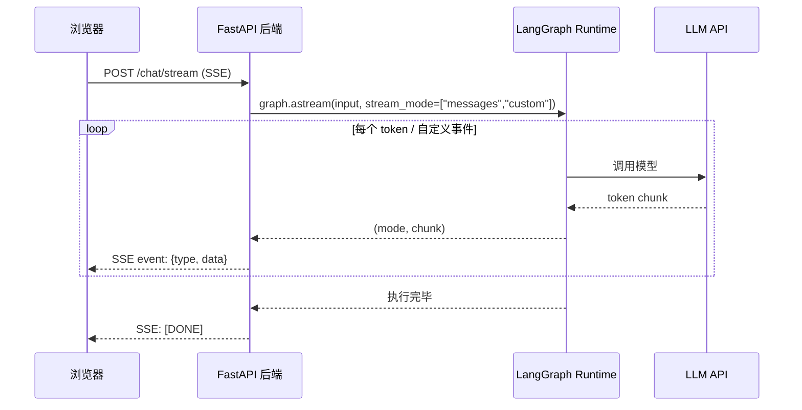

# Streaming 流式处理

> 对前端开发者来说，流式输出并不陌生——SSE、ReadableStream、EventSource 都是日常工具。LangGraph 的 streaming 本质上做同一件事：让你在图执行过程中**实时拿到中间数据**，而不是等全部完成。

## 前端类比：先建立直觉

| 前端概念 | LangGraph stream mode | 说明 |
|---------|----------------------|------|
| `EventSource` (SSE) | `stream()` 方法 | 持续接收服务端推送的事件流 |
| `response.body.getReader()` | `messages` mode | 逐 token 读取 LLM 输出 |
| `ReadableStream` + transform | `custom` mode | 自定义数据在流中传递 |
| Redux action log | `updates` mode | 每个节点执行后的状态变更 |
| React DevTools profiler | `debug` mode | 完整的执行追踪信息 |

**LangGraph 原生语义**：`graph.stream()` 是 LangGraph 的流式执行入口。通过 `stream_mode` 参数，你可以精确控制接收哪种粒度的数据——从完整状态快照到单个 LLM token。

[🔗 Streaming 官方指南](https://langchain-ai.github.io/langgraph/how-tos/streaming-tokens/){target="_blank" rel="noopener"}

---

## 1. 支持的 Stream Mode 列表

LangGraph 支持以下 6 种 stream mode：

| Mode | 输出内容 | 典型场景 |
|------|---------|---------|
| `values` | 每步后的**完整状态** | 需要看到全量 state 变化 |
| `updates` | 每步的**增量更新** | 只关心"变了什么" |
| `messages` | LLM 的 **token 级输出** | 前端实时展示打字效果 |
| `events` | LangChain 回调事件 | 与 LangSmith 集成的观测 |
| `custom` | 节点内自定义数据 | 进度条、中间结果推送 |
| `debug` | 完整调试信息 | 开发排查问题 |

---

## 2. 基础用法

### `values` — 完整状态快照

每次节点执行完毕后，返回当前的**完整状态**：

```python
from langgraph.graph import StateGraph, START, END, MessagesState
from langgraph.checkpoint.memory import InMemorySaver

def node_a(state: MessagesState):
    return {"messages": [{"role": "assistant", "content": "第一步完成"}]}

def node_b(state: MessagesState):
    return {"messages": [{"role": "assistant", "content": "第二步完成"}]}

builder = StateGraph(MessagesState)
builder.add_node("a", node_a)
builder.add_node("b", node_b)
builder.add_edge(START, "a")
builder.add_edge("a", "b")
builder.add_edge("b", END)

graph = builder.compile()

# values mode：每次拿到完整 state
for chunk in graph.stream(
    {"messages": [{"role": "user", "content": "开始"}]},
    stream_mode="values"
):
    print(f"消息数量: {len(chunk['messages'])}")
    print(f"最后一条: {chunk['messages'][-1]}")
    print("---")
```

**前端类比**：类似于 Redux store 的 `subscribe()` — 每次 state 变更后你拿到完整的 store snapshot。

### `updates` — 增量更新

只返回每个节点的**输出增量**，不包含完整状态：

```python
# updates mode：只看每步变了什么
for chunk in graph.stream(
    {"messages": [{"role": "user", "content": "开始"}]},
    stream_mode="updates"
):
    # chunk 是 dict，key 是节点名，value 是该节点的输出
    for node_name, update in chunk.items():
        print(f"节点 [{node_name}] 输出: {update}")
```

**前端类比**：类似于 Redux 中间件只看 action payload，而不是整个 state tree。

输出示例：
```
节点 [a] 输出: {'messages': [{'role': 'assistant', 'content': '第一步完成'}]}
节点 [b] 输出: {'messages': [{'role': 'assistant', 'content': '第二步完成'}]}
```

---

## 3. 多模式组合 Streaming

你可以同时订阅多种 stream mode，LangGraph 会用元组标记每条数据的来源：

```python
# 同时接收 updates 和 messages
for mode, chunk in graph.stream(
    {"messages": [{"role": "user", "content": "讲个笑话"}]},
    stream_mode=["updates", "messages"]
):
    if mode == "updates":
        # 节点级更新
        print(f"[UPDATE] {chunk}")
    elif mode == "messages":
        # LLM token 级输出
        msg_chunk, metadata = chunk
        if msg_chunk.content:
            print(f"[TOKEN] {msg_chunk.content}", end="", flush=True)
```

**前端类比**：类似于在一个 `EventSource` 连接中通过不同的 `event` 类型区分消息：

```javascript
// 前端类比
const source = new EventSource('/stream');
source.addEventListener('update', (e) => { /* 节点更新 */ });
source.addEventListener('token', (e) => { /* LLM token */ });
```

---

## 4. Stream Graph State

### 流式获取状态（适合前端轮询展示）

```python
from langgraph.graph import StateGraph, START, END
from typing import TypedDict, Annotated
from operator import add

class AnalysisState(TypedDict):
    query: str
    steps: Annotated[list[str], add]
    result: str

def step_research(state: AnalysisState):
    return {"steps": ["research_done"]}

def step_analyze(state: AnalysisState):
    return {"steps": ["analysis_done"]}

def step_summarize(state: AnalysisState):
    return {"result": "最终分析结论", "steps": ["summary_done"]}

builder = StateGraph(AnalysisState)
builder.add_node("research", step_research)
builder.add_node("analyze", step_analyze)
builder.add_node("summarize", step_summarize)
builder.add_edge(START, "research")
builder.add_edge("research", "analyze")
builder.add_edge("analyze", "summarize")
builder.add_edge("summarize", END)

graph = builder.compile()

# 用 values mode 流式观察完整状态演变
for state_snapshot in graph.stream(
    {"query": "分析 LangGraph", "steps": [], "result": ""},
    stream_mode="values"
):
    print(f"已完成步骤: {state_snapshot['steps']}")
    if state_snapshot.get("result"):
        print(f"结果: {state_snapshot['result']}")
```

---

## 5. Stream Subgraph Outputs

当你的图包含子图时，可以通过 `subgraphs=True` 参数获取子图内部的执行流：

```python
from langgraph.graph import StateGraph, START, END, MessagesState

# 定义子图
def sub_node(state: MessagesState):
    return {"messages": [{"role": "assistant", "content": "子图处理完成"}]}

sub_builder = StateGraph(MessagesState)
sub_builder.add_node("sub_process", sub_node)
sub_builder.add_edge(START, "sub_process")
sub_builder.add_edge("sub_process", END)
sub_graph = sub_builder.compile()

# 主图引用子图
def main_node(state: MessagesState):
    return {"messages": [{"role": "assistant", "content": "主图节点"}]}

main_builder = StateGraph(MessagesState)
main_builder.add_node("main", main_node)
main_builder.add_node("sub", sub_graph)  # 子图作为节点
main_builder.add_edge(START, "main")
main_builder.add_edge("main", "sub")
main_builder.add_edge("sub", END)

graph = main_builder.compile()

# subgraphs=True 会展开子图内部的执行流
for namespace, mode, chunk in graph.stream(
    {"messages": [{"role": "user", "content": "hello"}]},
    stream_mode="updates",
    subgraphs=True
):
    if namespace:
        print(f"[子图 {namespace}] {chunk}")
    else:
        print(f"[主图] {chunk}")
```

### 调试技巧

子图调试时，`namespace` 元组标识了调用链路径：

```python
# namespace 示例：
# () — 主图
# ('sub:abc123',) — 名为 "sub" 的子图，运行 ID 为 abc123
# ('sub:abc123', 'nested:def456') — 子图中嵌套的子图
```

---

## 6. LLM Token Streaming

这是前端最常用的场景——逐 token 展示 LLM 输出，实现"打字机效果"。

```python
from dataclasses import dataclass
from langchain.chat_models import init_chat_model
from langgraph.graph import StateGraph, START

@dataclass
class JokeState:
    topic: str
    joke: str = ""

model = init_chat_model(model="gpt-4.1-mini")

def call_model(state: JokeState):
    response = model.invoke(
        [{"role": "user", "content": f"讲一个关于{state.topic}的笑话"}]
    )
    return {"joke": response.content}

graph = (
    StateGraph(JokeState)
    .add_node(call_model)
    .add_edge(START, "call_model")
    .compile()
)

# messages mode：逐 token 流式输出
for message_chunk, metadata in graph.stream(
    {"topic": "程序员"},
    stream_mode="messages"
):
    if message_chunk.content:
        print(message_chunk.content, end="", flush=True)

# metadata 包含有用信息：
# {
#   "langgraph_node": "call_model",
#   "langgraph_triggers": ["start:call_model"],
#   "tags": [...],
#   ...
# }
```

### 异步版本（更适合 Web 服务）

```python
async def stream_to_client():
    """在 FastAPI / asyncio 环境中使用"""
    async for message_chunk, metadata in graph.astream(
        {"topic": "前端开发"},
        stream_mode="messages"
    ):
        if message_chunk.content:
            yield message_chunk.content  # 发送给前端
```

### 按标签过滤 LLM 输出

当一个节点中有多个 LLM 调用时，用标签区分：

```python
from langchain.chat_models import init_chat_model

joke_model = init_chat_model(model="gpt-4.1-mini", tags=["joke"])
poem_model = init_chat_model(model="gpt-4.1-mini", tags=["poem"])

async def multi_llm_node(state, config):
    joke = await joke_model.ainvoke(
        [{"role": "user", "content": f"讲个关于{state['topic']}的笑话"}],
        config
    )
    poem = await poem_model.ainvoke(
        [{"role": "user", "content": f"写首关于{state['topic']}的短诗"}],
        config
    )
    return {"joke": joke.content, "poem": poem.content}

# 流式时按 tag 过滤
async for msg, metadata in graph.astream(
    {"topic": "猫"},
    stream_mode="messages"
):
    if "joke" in metadata.get("tags", []):
        print(f"[笑话] {msg.content}", end="")
    elif "poem" in metadata.get("tags", []):
        print(f"[诗歌] {msg.content}", end="")
```

---

## 7. Stream Custom Data（自定义数据流）

当你需要在执行过程中向客户端推送自定义进度信息。[🔗 StreamWriter 与自定义数据流](https://langchain-ai.github.io/langgraph/how-tos/streaming-content/){target="_blank" rel="noopener"}

```python
from typing import TypedDict
from langgraph.types import StreamWriter
from langgraph.graph import StateGraph, START, END

class State(TypedDict):
    query: str
    answer: str

def processing_node(state: State, writer: StreamWriter):

    # 推送进度更新
    writer({"progress": 0.3, "stage": "正在搜索相关文档..."})

    # ... 执行搜索 ...

    writer({"progress": 0.7, "stage": "正在生成回答..."})

    # ... 调用 LLM ...

    writer({"progress": 1.0, "stage": "完成"})

    return {"answer": "这是生成的回答"}

graph = (
    StateGraph(State)
    .add_node("process", processing_node)
    .add_edge(START, "process")
    .add_edge("process", END)
    .compile()
)

# custom mode 接收自定义数据
for chunk in graph.stream(
    {"query": "什么是 LangGraph?", "answer": ""},
    stream_mode="custom"
):
    print(chunk)
# 输出：
# {'progress': 0.3, 'stage': '正在搜索相关文档...'}
# {'progress': 0.7, 'stage': '正在生成回答...'}
# {'progress': 1.0, 'stage': '完成'}
```

**前端类比**：这就像在后端处理中通过 WebSocket 或 SSE 向前端推送进度条数据：

```javascript
// 前端接收端类比
const source = new EventSource('/api/process?query=xxx');
source.onmessage = (e) => {
  const { progress, stage } = JSON.parse(e.data);
  updateProgressBar(progress);
  updateStatusText(stage);
};
```

### 组合 custom 和其他 mode

```python
# 同时接收自定义数据和节点更新
for mode, chunk in graph.stream(
    {"query": "test", "answer": ""},
    stream_mode=["custom", "updates"]
):
    if mode == "custom":
        print(f"[进度] {chunk}")
    elif mode == "updates":
        print(f"[节点] {chunk}")
```

---

## 8. 与任意 LLM 配合使用

如果你的 LLM 不是 LangChain 集成的（比如自研模型或小众 API），可以用 `custom` mode 手动流式输出：

```python
import httpx
from langgraph.types import StreamWriter
from langgraph.graph import StateGraph, START, END
from typing import TypedDict

class State(TypedDict):
    prompt: str
    response: str

def call_custom_llm(state: State, writer: StreamWriter):

    # 手动调用非 LangChain 的 LLM API
    with httpx.stream(
        "POST",
        "https://your-llm-api.com/generate",
        json={"prompt": state["prompt"]},
    ) as response:
        full_text = ""
        for line in response.iter_lines():
            token = line  # 解析你的 API 格式
            full_text += token
            # 通过 custom stream 推送每个 token
            writer({"token": token})

    return {"response": full_text}

graph = (
    StateGraph(State)
    .add_node(call_custom_llm)
    .add_edge(START, "call_custom_llm")
    .add_edge("call_custom_llm", END)
    .compile()
)

for chunk in graph.stream(
    {"prompt": "hello", "response": ""},
    stream_mode="custom"
):
    print(chunk["token"], end="", flush=True)
```

---

## 9. 禁用特定模型的 Streaming

某些场景下你可能不希望某个 LLM 调用产生流式输出（比如内部分类器）：

```python
from langchain.chat_models import init_chat_model

# 禁用某个模型实例的 streaming
classifier = init_chat_model(model="gpt-4.1-mini", streaming=False)

# 或者在调用时禁用
response = model.invoke(
    messages,
    config={"callbacks": []},  # 移除回调也会阻止 streaming 事件
)
```

在 `messages` stream mode 下，被禁用 streaming 的模型调用不会产生逐 token 输出，而是在调用完成后一次性返回完整消息。

---

## 10. 流式输出的前后端集成架构



### FastAPI 集成示例

```python
from fastapi import FastAPI
from fastapi.responses import StreamingResponse

app = FastAPI()

@app.post("/chat/stream")
async def chat_stream(query: str):
    async def event_generator():
        async for mode, chunk in graph.astream(
            {"messages": [{"role": "user", "content": query}]},
            stream_mode=["messages", "custom"]
        ):
            if mode == "messages":
                msg_chunk, _ = chunk
                if msg_chunk.content:
                    yield f"data: {msg_chunk.content}\n\n"
            elif mode == "custom":
                yield f"event: progress\ndata: {chunk}\n\n"
        yield "data: [DONE]\n\n"

    return StreamingResponse(
        event_generator(),
        media_type="text/event-stream"
    )
```

---

## 要点回顾

| Stream Mode | 粒度 | 用途 |
|------------|------|------|
| `values` | 完整状态 | 观察每步后的全量 state |
| `updates` | 节点增量 | 只看"变了什么" |
| `messages` | LLM token | 前端打字机效果 |
| `events` | 回调事件 | 与 LangSmith 集成 |
| `custom` | 自定义数据 | 进度条、非 LangChain LLM |
| `debug` | 调试详情 | 开发排查 |

---

## 先修与下一步

- **先修**：[持久化](/ai/langgraph/guide/persistence) | [Durable Execution](/ai/langgraph/guide/durable-execution)
- **下一步**：[Interrupts (HITL)](/ai/langgraph/guide/interrupts) | [Subgraphs 子图](/ai/langgraph/guide/subgraphs)
