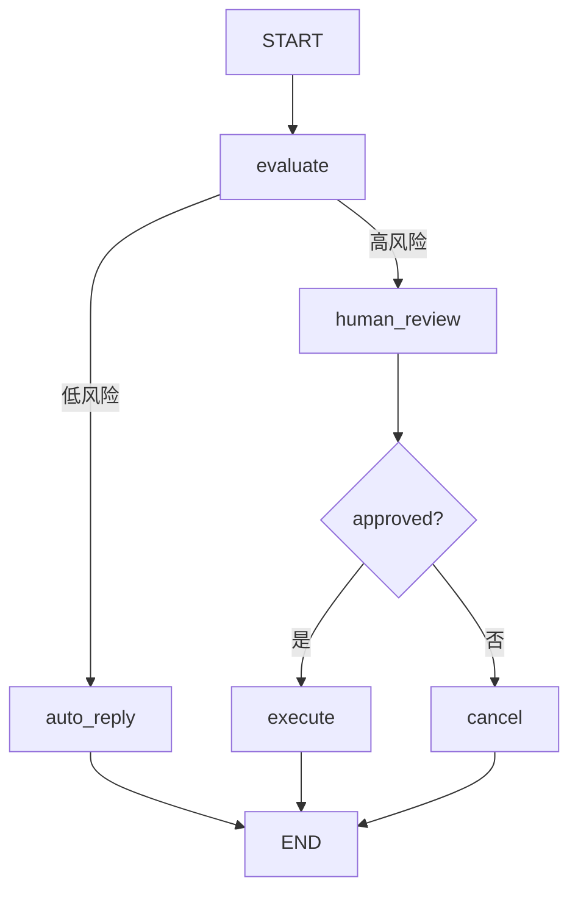

# LangSmith Studio

## 什么是 LangSmith Studio

LangSmith Studio 是一个**免费的可视化开发界面**，用于在本地机器上开发和测试 LangGraph Agent。它连接到你本地运行的 Agent，实时展示每一步的执行细节：

- 发送给模型的提示词（Prompts）
- 工具调用及其返回结果
- 节点间的状态流转
- 最终输出

你不需要额外写代码或部署到远程服务器，就能完整观察 Agent 的行为。

**前端类比**：如果你用过 React DevTools + Chrome DevTools 的组合，LangSmith Studio 就是 LangGraph 世界的等价物。

| 前端工具              | Studio 对应能力           | 说明                         |
| --------------------- | ------------------------- | ---------------------------- |
| React DevTools        | 图结构可视化              | 查看组件树 → 查看节点拓扑    |
| Chrome DevTools State  | 状态检查器                | 查看 Redux state → 查看图状态 |
| Network 面板          | 执行轨迹追踪              | 查看 API 请求 → 查看 LLM 调用 |
| Console 面板          | 日志与事件流              | console.log → 节点输入输出    |
| Elements 面板编辑     | 状态修改与分叉            | 直接编辑 DOM → 直接修改 state |

**LangGraph 原生语义**：Studio 不是一个简单的日志查看器。它基于 LangGraph 的 checkpointer 机制，能够在任意执行点进行状态回溯、修改和分叉，实现真正的"时间旅行调试"（time-travel debugging）。

## 启动 Studio

### 前置条件

1. 项目中有 `langgraph.json` 配置文件
2. 已安装 LangGraph CLI
3. 有一个 LangSmith 账号（免费注册）

### 安装 CLI

```bash
pip install -U "langgraph-cli[inmem]"
```

`[inmem]` 选项包含了内存版 checkpointer，适合本地开发。

### 启动开发服务器

```bash
# 在项目根目录（包含 langgraph.json 的目录）执行
langgraph dev
```

启动后，CLI 会输出一个本地 URL（通常是 `http://127.0.0.1:2024`），同时自动打开 Studio 界面（使用 LangSmith 提供的 Web 界面连接到你的本地服务器）。

**前端类比**：这就像 `npm run dev` 启动 Next.js 开发服务器。`langgraph dev` 做了类似的事：启动一个本地运行时，支持热重载（代码修改后自动加载），并提供可视化界面。

**LangGraph 原生语义**：`langgraph dev` 实际上启动了一个本地的 LangGraph API Server，Studio 作为客户端连接到这个 Server。这意味着 Studio 使用的是和生产环境完全一致的 API 接口。

### langgraph.json 配置回顾

```json
{
  "dependencies": ["."],
  "graphs": {
    "agent": "./my_agent/agent.py:graph"
  },
  "env": ".env"
}
```

Studio 通过这个配置文件找到你的图定义。`graphs` 中的每个条目都会在 Studio 中显示为一个可交互的图。

## 可视化调试：查看图结构与状态流转

### 图拓扑视图

Studio 会自动将你的图渲染为交互式流程图：

- **节点**以方块显示，标注名称
- **边**以箭头连接，条件边会标注分支条件
- **START** 和 **END** 作为特殊节点标识入口和出口
- **当前执行位置**会高亮显示



在 Studio 中，上面这种流程图是**自动生成**的，你不需要手动画 Mermaid。

### 执行轨迹追踪

当你在 Studio 中发送一条消息给 Agent，界面会实时展示：

1. **输入状态**：进入每个节点时的完整 state
2. **节点执行细节**：
   - LLM 调用的完整 prompt 和 response
   - 工具调用的参数和返回值
   - 状态更新的 diff
3. **输出状态**：离开每个节点后的 state 变化
4. **路由决策**：条件边选择了哪条路径及原因

**前端类比**：这就像 Chrome DevTools 的 Network 面板 + Redux DevTools 的 action 日志的结合体。你能看到每个"请求"（节点执行）的详细内容，也能看到每次"状态变更"（state update）。

## 原型设计与实验

### 交互式测试

Studio 提供了一个聊天界面，你可以直接与 Agent 对话来测试不同的输入场景：

1. 在 Studio 界面输入测试消息
2. 观察 Agent 的完整执行过程
3. 检查每个中间步骤是否符合预期
4. 修改输入，重新测试

### 多场景快速验证

你可以快速切换不同的测试场景，验证 Agent 在各种输入下的行为：

```python
# 你的 Agent 可能需要处理这些不同场景：
# 场景 1："帮我查询订单状态"  → 应该调用查询工具
# 场景 2："我要退款"          → 应该触发人工审批
# 场景 3："今天天气怎么样"    → 应该调用天气 API
```

在 Studio 中，每个场景都可以即时测试，无需编写测试代码。

**前端类比**：类似 Storybook 的交互式 Story 测试。你可以给组件不同的 props 看它怎么渲染，在 Studio 中你给 Agent 不同的输入看它怎么执行。

**LangGraph 原生语义**：Studio 中的每次对话都会创建一个独立的 `thread_id`，你可以随时切换回之前的会话继续测试。

## 状态检查与修改

### 查看中间状态

在执行过程中的任意步骤，你可以点击某个节点查看：

- 该节点接收的完整输入状态
- 该节点产生的状态更新
- 更新后的完整状态快照

### 修改状态并分叉

这是 Studio 最强大的功能之一。你可以：

1. **暂停执行**：在任意节点后暂停
2. **修改状态**：直接编辑当前 state 中的任何字段
3. **分叉执行**：基于修改后的状态创建一个新的执行分支
4. **对比结果**：观察修改后的执行路径与原路径的差异

```python
# 假设 Agent 在 evaluate 节点产生了 risk_score = 30（走了自动回复）
# 你可以在 Studio 中把 risk_score 改成 90，看它是否正确走人工审核
```

**前端类比**：这就像在 React DevTools 中直接修改组件的 props 或 state，观察 UI 如何变化。但 Studio 更强大——它能基于修改后的状态继续执行后续流程。

**LangGraph 原生语义**：状态修改利用了 `update_state` API，分叉利用了 checkpoint 的分支机制。这不是 UI 层的 hack，而是 LangGraph 运行时原生支持的能力。

### 时间旅行调试

你可以回到执行历史中的任意一个 checkpoint：

1. 查看当时的完整状态
2. 从那个点重新执行
3. 修改状态后从那个点分叉

这对调试"Agent 在第 3 步做了错误决策"这类问题非常有效——你可以直接回到第 3 步，检查当时的 state，理解为什么做出了那个决策。

## 与本地开发的集成

### 开发工作流

推荐的开发循环：

```
编写代码 → langgraph dev → Studio 测试 → 发现问题 → 修改代码 → 自动热重载 → 再次测试
```

1. **编写/修改** Agent 代码（节点函数、图结构等）
2. **保存文件**：`langgraph dev` 会自动检测变更并热重载
3. **在 Studio 中测试**：发送消息，观察执行过程
4. **发现问题**：利用状态检查定位具体节点的问题
5. **修改代码**：回到编辑器修改
6. **循环迭代**

### 与代码测试的配合

Studio 适合探索性测试和调试，但不能替代自动化测试：

| 场景         | Studio       | pytest       |
| ------------ | ------------ | ------------ |
| 探索新功能   | 最佳         | 次优         |
| 调试复杂问题 | 最佳         | 辅助         |
| 回归测试     | 不适合       | 最佳         |
| CI/CD        | 不适合       | 最佳         |
| 状态分叉实验 | 最佳         | 需要手写代码 |

### 环境变量

Studio 通过 `langgraph.json` 中指定的 `.env` 文件加载环境变量。确保你的 API keys 配置正确：

```bash
# .env
OPENAI_API_KEY=sk-...
LANGSMITH_API_KEY=lsv2_...
LANGSMITH_TRACING=true
```

## 常见使用场景

### 场景 1：调试条件路由

你的 Agent 总是走错分支？在 Studio 中：

1. 执行一次正常流程
2. 点击条件边节点，查看路由函数的输入 state
3. 检查 state 中的决策字段值是否符合预期
4. 如果不对，回溯到产生该值的节点，检查其逻辑

### 场景 2：优化提示词

模型的输出质量不佳？在 Studio 中：

1. 查看发送给模型的完整 prompt
2. 检查 system message、few-shot examples 是否正确注入
3. 修改代码中的 prompt 模板
4. 热重载后立即重新测试

### 场景 3：验证工具调用

Agent 的工具调用参数不对？在 Studio 中：

1. 找到工具调用节点
2. 查看模型返回的 tool_call 参数
3. 查看工具的实际返回值
4. 判断是模型生成参数有误还是工具实现有问题

## 局限性

- Studio 是开发工具，不适合生产环境监控（那是 LangSmith Observability 的工作）
- 本地 Studio 的性能受限于你的机器配置
- 需要网络连接来访问 LangSmith Web 界面（但 Agent 本身运行在本地）

## 先修与下一步

**先修内容**：
- [快速开始](/ai/langgraph/guide/quickstart) — 确保你有可运行的图
- [应用结构](/ai/langgraph/guide/application-structure) — 需要正确的 `langgraph.json`

**下一步**：
- [Agent Chat UI](/ai/langgraph/guide/chat-ui) — 为 Agent 构建交互界面
- [可观测性](/ai/langgraph/guide/observability) — 从开发调试进阶到生产监控
- [部署](/ai/langgraph/guide/deployment) — 将本地 Agent 部署上线

## 参考

- [LangSmith Studio](https://langchain-ai.github.io/langgraph/concepts/langgraph_studio/)
- [LangGraph CLI](https://langchain-ai.github.io/langgraph/cloud/reference/cli/)
- [LangSmith](https://smith.langchain.com/)
