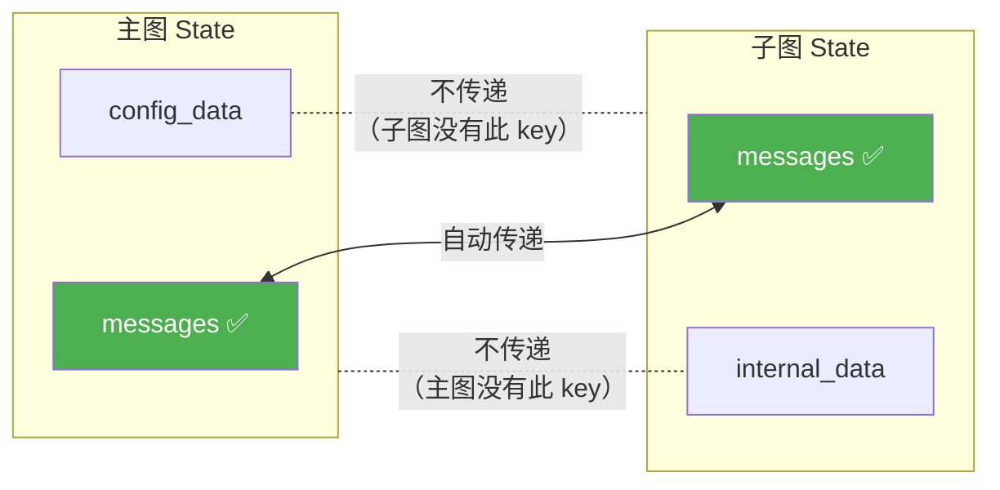
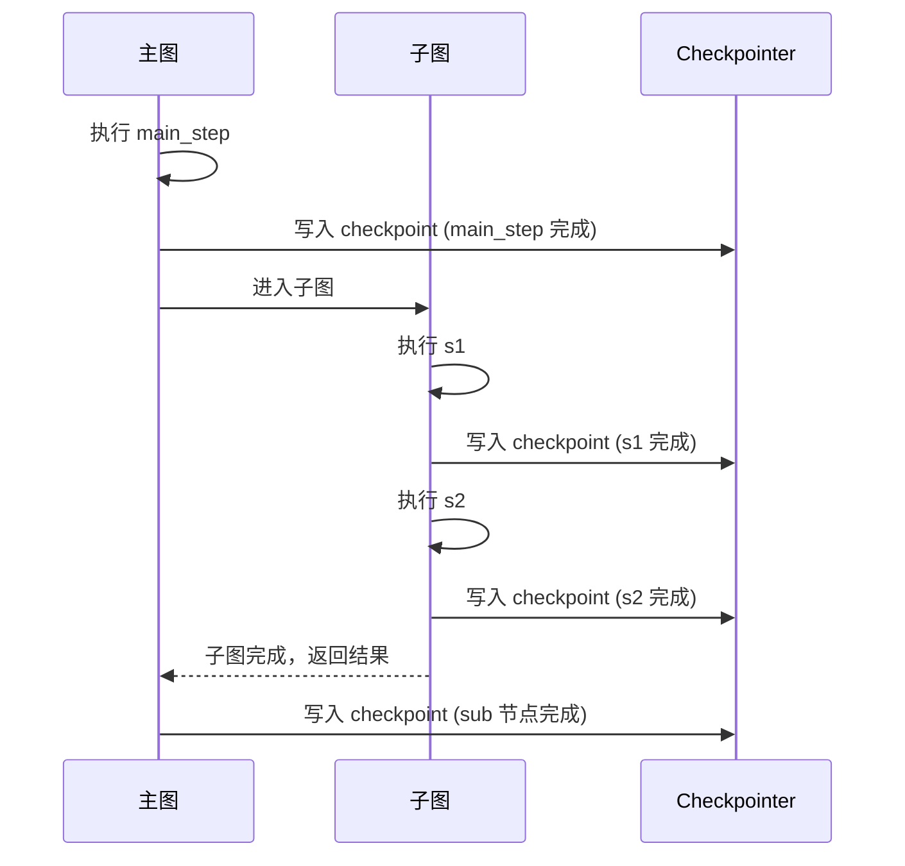
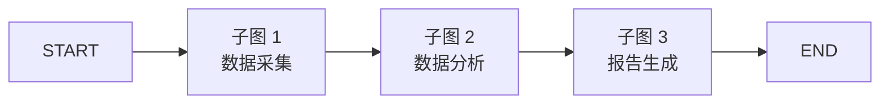
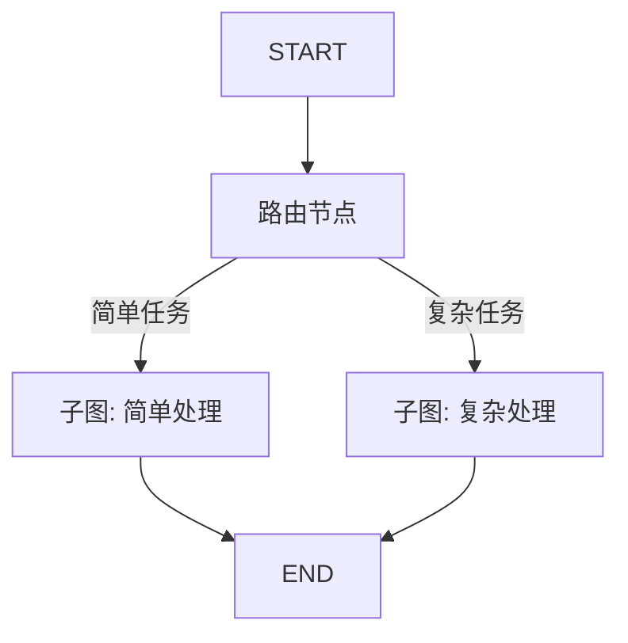
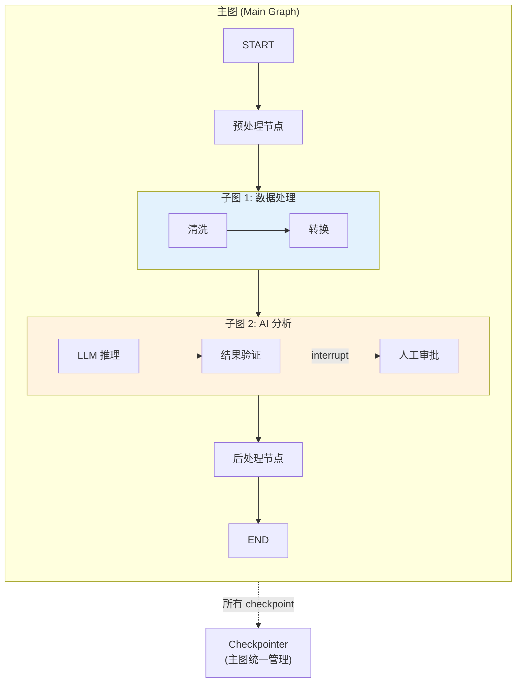

# Subgraphs 子图

> 如果你是 React 开发者，你一定理解"组件组合"的力量——把复杂 UI 拆成独立、可复用的组件。LangGraph 的 Subgraph 做同一件事：把复杂的 Agent 工作流拆成独立、可复用、可独立测试的子图。

## 前端类比：先建立直觉

| 前端概念 | LangGraph 概念 | 说明 |
|---------|---------------|------|
| React 子组件 | Subgraph | 封装独立逻辑的子工作流 |
| `props` 传递 | State 映射 | 父图向子图传递数据 |
| `children` 返回值 | 子图输出合并到父图 state | 子图结果回传 |
| 组件组合 `<A><B/></A>` | 图嵌套图 | 主图引用子图作为节点 |
| Micro-frontends | 独立子图 + 接口协议 | 独立开发部署的子工作流 |

**LangGraph 原生语义**：Subgraph 是一个编译好的 `CompiledGraph`，它可以作为主图中的一个节点。主图和子图可以有不同的 State schema——LangGraph 会自动处理共享 key 的数据传递。子图拥有独立的执行上下文，但共享主图的 checkpointer。

[🔗 Subgraphs 官方指南](https://langchain-ai.github.io/langgraph/how-tos/subgraph/){target="_blank" rel="noopener"}

---

## 1. 从节点调用图 (Invoke a Graph from a Node)

最灵活的方式——在节点函数内部手动调用另一个图：

```python
from langgraph.graph import StateGraph, START, END
from typing import TypedDict

# === 子图定义 ===
class SubState(TypedDict):
    sub_input: str
    sub_output: str

def sub_process(state: SubState):
    return {"sub_output": f"已处理: {state['sub_input']}"}

sub_builder = StateGraph(SubState)
sub_builder.add_node("process", sub_process)
sub_builder.add_edge(START, "process")
sub_builder.add_edge("process", END)
sub_graph = sub_builder.compile()

# === 主图定义 ===
class MainState(TypedDict):
    query: str
    result: str

def call_subgraph(state: MainState):
    """在节点内手动调用子图"""
    # 手动映射：主图 state → 子图 state
    sub_input = {"sub_input": state["query"], "sub_output": ""}

    # 调用子图
    sub_result = sub_graph.invoke(sub_input)

    # 手动映射：子图 state → 主图 state
    return {"result": sub_result["sub_output"]}

main_builder = StateGraph(MainState)
main_builder.add_node("process", call_subgraph)
main_builder.add_edge(START, "process")
main_builder.add_edge("process", END)

main_graph = main_builder.compile()

result = main_graph.invoke({"query": "分析 LangGraph", "result": ""})
print(result["result"])  # "已处理: 分析 LangGraph"
```

### 优势与适用场景

- **完全控制数据映射**：主图和子图的 state schema 可以完全不同
- **条件调用**：可以根据状态决定是否调用子图
- **多次调用**：同一个子图可以在循环中多次调用

**前端类比**：这类似于在 React 中使用自定义 Hook——你在组件内调用 Hook，手动传入参数、手动使用返回值：

```javascript
// 前端类比
function MainComponent() {
  const query = "分析 LangGraph";
  const result = useSubProcess(query); // 手动调用，手动传参
  return <div>{result}</div>;
}
```

---

## 2. 将图作为节点添加 (Add a Graph as a Node)

更简洁的方式——直接把编译好的子图当作节点添加到主图中：

```python
from langgraph.graph import StateGraph, START, END, MessagesState

# === 子图：对话摘要 ===
def summarize(state: MessagesState):
    msgs = state["messages"]
    summary = f"对话包含 {len(msgs)} 条消息"
    return {"messages": [{"role": "assistant", "content": summary}]}

summary_builder = StateGraph(MessagesState)
summary_builder.add_node("summarize", summarize)
summary_builder.add_edge(START, "summarize")
summary_builder.add_edge("summarize", END)
summary_graph = summary_builder.compile()

# === 子图：情感分析 ===
def analyze_sentiment(state: MessagesState):
    return {"messages": [{"role": "assistant", "content": "情感: 正面"}]}

sentiment_builder = StateGraph(MessagesState)
sentiment_builder.add_node("analyze", analyze_sentiment)
sentiment_builder.add_edge(START, "analyze")
sentiment_builder.add_edge("analyze", END)
sentiment_graph = sentiment_builder.compile()

# === 主图：组合子图 ===
def router(state: MessagesState):
    return {"messages": [{"role": "assistant", "content": "路由完成"}]}

main_builder = StateGraph(MessagesState)
main_builder.add_node("route", router)
main_builder.add_node("summary", summary_graph)      # 直接添加子图！
main_builder.add_node("sentiment", sentiment_graph)    # 直接添加子图！

main_builder.add_edge(START, "route")
main_builder.add_edge("route", "summary")
main_builder.add_edge("summary", "sentiment")
main_builder.add_edge("sentiment", END)

graph = main_builder.compile()

result = graph.invoke({"messages": [{"role": "user", "content": "你好"}]})
for msg in result["messages"]:
    print(f"  [{msg.type if hasattr(msg, 'type') else 'dict'}] {msg.content if hasattr(msg, 'content') else msg['content']}")
```

### 自动数据传递规则

当子图作为节点添加时，LangGraph 会**自动映射共享的 state key**：



规则：
1. **同名 key 自动传递**：主图和子图中同名的 key 会自动映射
2. **不同名 key 互相不见**：主图独有的 key 不会传给子图，反之亦然
3. **子图修改会反映到主图**：子图对共享 key 的修改会合并回主图

**前端类比**：这类似于 React Context 的行为——子组件只能访问到 Provider 提供的 Context 值，其他值对它不可见。

---

## 3. 添加持久化

子图的持久化通过主图的 checkpointer 统一管理：

```python
from langgraph.graph import StateGraph, START, END, MessagesState
from langgraph.checkpoint.memory import InMemorySaver

# 子图
def sub_step_1(state: MessagesState):
    return {"messages": [{"role": "assistant", "content": "子图步骤 1"}]}

def sub_step_2(state: MessagesState):
    return {"messages": [{"role": "assistant", "content": "子图步骤 2"}]}

sub_builder = StateGraph(MessagesState)
sub_builder.add_node("s1", sub_step_1)
sub_builder.add_node("s2", sub_step_2)
sub_builder.add_edge(START, "s1")
sub_builder.add_edge("s1", "s2")
sub_builder.add_edge("s2", END)
sub_graph = sub_builder.compile()  # 子图不需要自己的 checkpointer

# 主图
def main_step(state: MessagesState):
    return {"messages": [{"role": "assistant", "content": "主图步骤"}]}

main_builder = StateGraph(MessagesState)
main_builder.add_node("main", main_step)
main_builder.add_node("sub", sub_graph)
main_builder.add_edge(START, "main")
main_builder.add_edge("main", "sub")
main_builder.add_edge("sub", END)

# checkpointer 只在主图编译时设置
checkpointer = InMemorySaver()
graph = main_builder.compile(checkpointer=checkpointer)

config = {"configurable": {"thread_id": "with-subgraph-1"}}
result = graph.invoke(
    {"messages": [{"role": "user", "content": "测试持久化"}]},
    config
)

# checkpoint 会记录子图的执行过程
for state in graph.get_state_history(config):
    step = state.metadata.get("step", "?")
    print(f"Step {step}: next={state.next}, msgs={len(state.values.get('messages', []))}")
```

### 关键点

- **Checkpointer 在主图层设置**：子图自动共享主图的 checkpointer
- **子图的每个 superstep 也会产生 checkpoint**：细粒度的恢复能力
- **中断恢复穿透子图**：即使崩溃发生在子图内部，也能从断点恢复



---

## 4. 查看 Subgraph 状态

使用 `get_state` 查看包含子图的执行状态：

```python
# 查看主图当前状态
main_state = graph.get_state(config)
print(f"主图状态: {main_state.values}")
print(f"主图下一步: {main_state.next}")

# 查看子图的状态（通过 subgraphs=True）
for state in graph.get_state_history(config):
    step = state.metadata.get("step", "?")
    source = state.metadata.get("source", "?")
    # metadata 中会标记这个 checkpoint 来自哪个子图
    langgraph_node = state.metadata.get("langgraph_node", "root")
    print(f"Step {step} | node={langgraph_node} | source={source}")
```

### 在子图中使用 interrupt

子图中的 `interrupt` 会"冒泡"到主图的调用方：

```python
from langgraph.types import interrupt, Command

def sub_with_approval(state: MessagesState):
    """子图中的审批节点"""
    decision = interrupt({
        "source": "subgraph",
        "question": "子图需要审批才能继续",
        "context": state["messages"][-1].content if state["messages"] else ""
    })
    return {"messages": [{"role": "assistant", "content": f"审批结果: {decision}"}]}

sub_builder = StateGraph(MessagesState)
sub_builder.add_node("approve", sub_with_approval)
sub_builder.add_edge(START, "approve")
sub_builder.add_edge("approve", END)
sub_graph = sub_builder.compile()

# 主图
main_builder = StateGraph(MessagesState)
main_builder.add_node("pre_process", lambda s: {"messages": [{"role": "assistant", "content": "预处理完成"}]})
main_builder.add_node("sub", sub_graph)
main_builder.add_node("post_process", lambda s: {"messages": [{"role": "assistant", "content": "后处理完成"}]})
main_builder.add_edge(START, "pre_process")
main_builder.add_edge("pre_process", "sub")
main_builder.add_edge("sub", "post_process")
main_builder.add_edge("post_process", END)

checkpointer = InMemorySaver()
graph = main_builder.compile(checkpointer=checkpointer)

config = {"configurable": {"thread_id": "sub-interrupt-demo"}}

# 第一次执行 — 在子图的 interrupt 处暂停
result = graph.invoke(
    {"messages": [{"role": "user", "content": "开始处理"}]},
    config
)
# 返回 __interrupt__ 信息

# 恢复 — Command 自动路由到子图中的 interrupt
final = graph.invoke(Command(resume="approved"), config)
print(final["messages"][-1])
# "后处理完成"
```

---

## 5. Stream Subgraph 输出

使用 `subgraphs=True` 参数可以看到子图内部的执行流：

```python
from langgraph.graph import StateGraph, START, END, MessagesState
from langgraph.checkpoint.memory import InMemorySaver

# 子图
def sub_a(state: MessagesState):
    return {"messages": [{"role": "assistant", "content": "子图-A 完成"}]}

def sub_b(state: MessagesState):
    return {"messages": [{"role": "assistant", "content": "子图-B 完成"}]}

sub_builder = StateGraph(MessagesState)
sub_builder.add_node("a", sub_a)
sub_builder.add_node("b", sub_b)
sub_builder.add_edge(START, "a")
sub_builder.add_edge("a", "b")
sub_builder.add_edge("b", END)
sub_graph = sub_builder.compile()

# 主图
def main_pre(state: MessagesState):
    return {"messages": [{"role": "assistant", "content": "主图预处理"}]}

main_builder = StateGraph(MessagesState)
main_builder.add_node("pre", main_pre)
main_builder.add_node("sub", sub_graph)
main_builder.add_edge(START, "pre")
main_builder.add_edge("pre", "sub")
main_builder.add_edge("sub", END)

checkpointer = InMemorySaver()
graph = main_builder.compile(checkpointer=checkpointer)

config = {"configurable": {"thread_id": "stream-sub-demo"}}

# subgraphs=True 展开子图内部事件
print("=== 执行流 ===")
for namespace, mode, chunk in graph.stream(
    {"messages": [{"role": "user", "content": "hello"}]},
    config,
    stream_mode="updates",
    subgraphs=True
):
    if namespace:
        # namespace 是元组，标识子图路径
        path = " > ".join(str(n) for n in namespace)
        print(f"  [子图: {path}] {list(chunk.keys())}")
    else:
        print(f"  [主图] {list(chunk.keys())}")
```

输出示例：
```
=== 执行流 ===
  [主图] ['pre']
  [子图: sub:abc123] ['a']
  [子图: sub:abc123] ['b']
  [主图] ['sub']
```

### 异步流式 + LLM token

```python
# 如果子图中有 LLM 调用，可以用 messages mode 获取 token
async for namespace, mode, chunk in graph.astream(
    {"messages": [{"role": "user", "content": "讲个故事"}]},
    config,
    stream_mode=["updates", "messages"],
    subgraphs=True
):
    if mode == "messages":
        msg, metadata = chunk
        node = metadata.get("langgraph_node", "?")
        if msg.content:
            print(f"[{node}] {msg.content}", end="", flush=True)
    elif mode == "updates":
        if namespace:
            print(f"\n>>> 子图更新: {list(chunk.keys())}")
        else:
            print(f"\n>>> 主图更新: {list(chunk.keys())}")
```

---

## 6. 子图组合模式

### 模式 1：串行子图



```python
main_builder.add_node("collect", collect_graph)
main_builder.add_node("analyze", analyze_graph)
main_builder.add_node("report", report_graph)
main_builder.add_edge(START, "collect")
main_builder.add_edge("collect", "analyze")
main_builder.add_edge("analyze", "report")
main_builder.add_edge("report", END)
```

### 模式 2：条件子图



```python
from typing import Literal

def route_task(state) -> Literal["simple", "complex"]:
    return "complex" if state.get("complexity", 0) > 5 else "simple"

main_builder.add_node("simple", simple_graph)
main_builder.add_node("complex", complex_graph)
main_builder.add_conditional_edges("route", route_task)
```

### 模式 3：嵌套子图

```python
# 三层嵌套：main → sub → subsub
subsub_graph = subsub_builder.compile()
sub_builder.add_node("nested", subsub_graph)  # 子图中包含子图
sub_graph = sub_builder.compile()
main_builder.add_node("sub", sub_graph)       # 主图中包含子图
```

**前端类比**：这就像 React 的嵌套组件 `<App><Dashboard><Chart/></Dashboard></App>` — 每层组件封装自己的逻辑，通过 props/context 传递数据。

---

## 7. 最佳实践

### 何时使用子图

| 场景 | 推荐 | 理由 |
|------|------|------|
| 逻辑复杂度高 | 子图 | 拆分降低单图复杂度 |
| 需要复用 | 子图 | 同一子图在多处使用 |
| 团队协作 | 子图 | 不同团队维护不同子图 |
| 逻辑简单 | 普通节点 | 子图引入额外复杂度 |
| State schema 完全不同 | 节点内 invoke | 手动控制数据映射 |

### State 设计原则

```python
# ✅ 好的做法：子图有自己的"内部 state"
class SubState(TypedDict):
    messages: list  # 与主图共享
    internal_cache: dict  # 子图内部使用

# ❌ 不好的做法：子图暴露所有内部细节给主图
class LeakySubState(TypedDict):
    messages: list
    temp_var_1: str  # 这些不应该泄露到主图
    temp_var_2: int
    debug_info: dict
```

### 测试策略

```python
# 子图可以独立测试
def test_summary_subgraph():
    """独立测试子图"""
    result = summary_graph.invoke({
        "messages": [
            {"role": "user", "content": "hello"},
            {"role": "assistant", "content": "hi"},
        ]
    })
    assert "2" in result["messages"][-1].content  # 包含消息数量

def test_main_graph():
    """测试主图（包含子图）"""
    result = main_graph.invoke({
        "messages": [{"role": "user", "content": "test"}]
    })
    # 验证端到端行为
    assert len(result["messages"]) > 1
```

**前端类比**：这就像 React 测试中既有组件单元测试（Testing Library），又有集成测试（Playwright/Cypress）。子图 = 单元测试，主图 = 集成测试。

---

## 8. 子图架构全景



---

## 要点回顾

| 方式 | 代码 | 适用场景 |
|------|------|---------|
| 节点内调用 | `sub_graph.invoke(...)` 在节点函数中 | State schema 完全不同 |
| 作为节点添加 | `builder.add_node("sub", sub_graph)` | 共享 State key |
| 持久化 | 主图设置 checkpointer，子图自动共享 | 需要中断恢复 |
| 流式输出 | `subgraphs=True` | 观察子图内部执行 |
| interrupt | 自动冒泡到主图 | 子图内的人机交互 |

---

## 先修与下一步

- **先修**：[Graph API 基础](/ai/langgraph/guide/graph-api) | [持久化](/ai/langgraph/guide/persistence)
- **下一步**：[进阶编排模式](/ai/langgraph/guide/workflows-agents) | [Streaming 流式处理](/ai/langgraph/guide/streaming) | [生产实践](/ai/langgraph/guide/application-structure)
