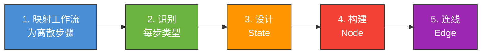
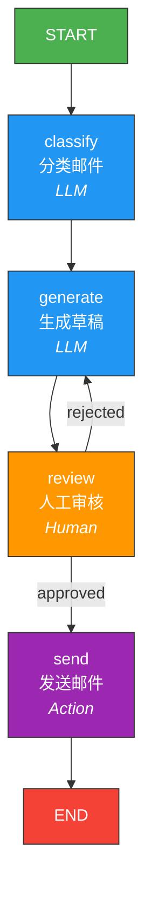
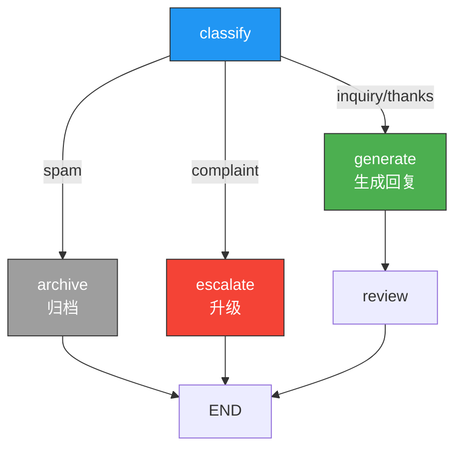
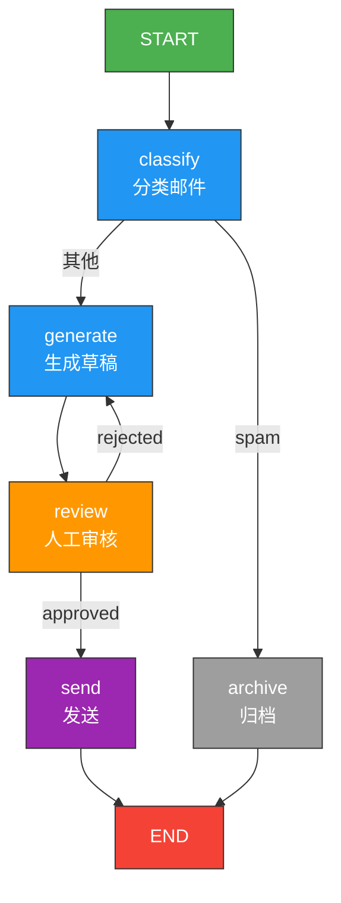
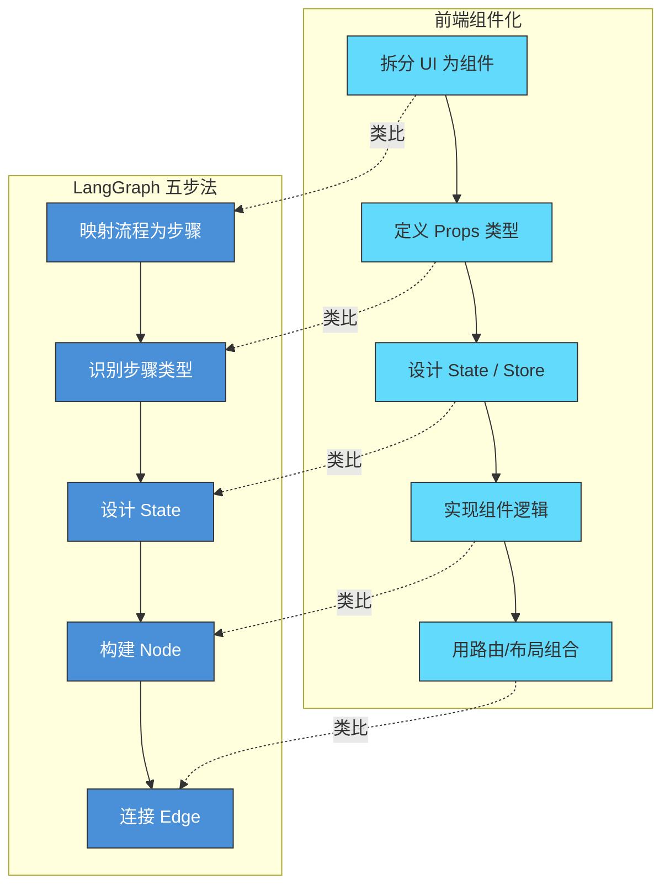

# LangGraph 思维方式

> 本页对应官方 "Thinking in LangGraph" 教程。核心理念：**从你想要自动化的流程出发，而不是从技术实现出发**。

## 1. 起点：从流程出发

很多开发者的第一反应是："我要用 LangGraph 做一个 Agent"。但更好的思考方式是：

**"我有一个流程，需要自动化。这个流程中的某些步骤需要 LLM。"**

这个认知转变至关重要。LangGraph 不是"让 LLM 更聪明"的工具，而是"让包含 LLM 的流程可控运行"的框架。

> **前端类比**：类似从"我要用 React"转变为"我有一个 UI 需求，React 是实现它的工具"。先想清楚用户流程，再选择技术方案。
>
> **LangGraph 原生语义**：官方强调 "Start from the process you want to automate"。LangGraph 是流程编排引擎，LLM 只是流程中的一种节点类型。

## 2. 五步设计法

官方推荐的设计流程可以总结为 5 步：



> **前端类比**：这和前端的组件化思维非常相似——**拆分（步骤）-> 类型化（组件类型）-> 状态管理（State）-> 实现（Node）-> 组合（Edge）**。就像你把一个复杂页面拆成多个组件，给每个组件定义 props 类型，设计全局状态，实现组件逻辑，最后用路由和布局组合起来。

### 2.1 第一步：映射工作流为离散步骤

把你要自动化的流程写成一系列清晰的步骤。不要考虑代码，只考虑"人类做这件事的步骤"。

**示例：邮件处理 Agent**

一个人类客服处理邮件的流程是：

1. 读取邮件内容
2. 判断邮件类别（投诉/咨询/感谢/垃圾邮件）
3. 根据类别生成回复草稿
4. 人工审核草稿
5. 发送回复

这 5 个步骤就是你的工作流的"骨架"。

### 2.2 第二步：识别每步类型

LangGraph 的每个步骤（节点）可以是以下四种类型之一：

| 类型 | 说明 | 示例 |
|------|------|------|
| **LLM Call** | 需要 LLM 推理或生成 | 分类邮件、生成回复草稿 |
| **Data Processing** | 纯数据操作，无需 LLM | 解析邮件头、格式化输出 |
| **External Action** | 调用外部系统/API | 发送邮件、查询数据库 |
| **User Input** | 等待人类输入 | 审核草稿、确认发送 |

把步骤标注上类型：

1. 读取邮件内容 -> **Data Processing**
2. 判断邮件类别 -> **LLM Call**
3. 生成回复草稿 -> **LLM Call**
4. 人工审核草稿 -> **User Input** (Human-in-the-loop)
5. 发送回复 -> **External Action**

> **前端类比**：
> | LangGraph 节点类型 | 前端类比 |
> |-------------------|----------|
> | LLM Call | API 请求（`fetch` / `axios`） |
> | Data Processing | 纯函数 / utility 函数 |
> | External Action | 副作用操作（发送 analytics、调用第三方 SDK） |
> | User Input | 表单交互 / `window.confirm()` |

### 2.3 第三步：设计 State

State 是节点间共享数据的"总线"。设计 State 时遵循两个原则。

#### 原则一：只放跨节点共享的数据

不是所有变量都应该放进 State。只有**需要在节点之间传递**的数据才放进去。

```python
from typing import TypedDict
from langgraph.graph import MessagesState


# 好：只保留跨节点需要的字段
class EmailState(TypedDict):
    email_content: str          # 原始邮件内容
    category: str               # 分类结果
    draft_reply: str            # 回复草稿
    approved: bool              # 审核结果
    final_reply: str            # 最终回复


# 不好：塞了太多节点内部的中间变量
class BadEmailState(TypedDict):
    email_content: str
    email_headers: dict         # 只有 parse 节点用，不需要共享
    category: str
    category_confidence: float  # 只有 classify 节点用
    prompt_template: str        # 配置信息，不应在 state 里
    draft_reply: str
    draft_v1: str               # 草稿的中间版本，不需要共享
    draft_v2: str
    approved: bool
    final_reply: str
```

#### 原则二：保持原始数据，按需格式化

State 中存储**原始数据**，在节点内部按需格式化为 prompt。不要在 State 里存已经拼好的 prompt 字符串。

```python
# 好：state 存原始数据
class EmailState(TypedDict):
    email_content: str    # 原始邮件
    category: str         # "complaint" | "inquiry" | "thanks" | "spam"
    draft_reply: str      # 草稿原文


# 在节点内部按需构造 prompt
def generate_reply(state: EmailState):
    prompt = f"""你是一名专业客服。
邮件类别：{state['category']}
原始邮件：{state['email_content']}
请生成一封礼貌的回复邮件。"""

    response = llm.invoke(prompt)
    return {"draft_reply": response.content}
```

```python
# 不好：state 里存了拼好的 prompt
class BadState(TypedDict):
    formatted_prompt: str   # 已拼好的 prompt，无法被其他节点复用
```

> **前端类比**：
> - 原则一 = React 中"状态提升"的反面——**不要把所有东西都放到全局状态**，只共享真正需要共享的数据
> - 原则二 = 在 Redux store 中存**原始数据**（normalized state），在组件中用 selector 按需格式化展示

### 2.4 第四步：构建 Node

每个节点是一个函数：接收完整 state，返回局部更新。

```python
from langchain.chat_models import init_chat_model

llm = init_chat_model("gpt-4o-mini")


def parse_email(state: EmailState):
    """步骤1：解析邮件内容（Data Processing）"""
    # 假设邮件内容已在 state 中
    return {}  # 不需要更新 state


def classify_email(state: EmailState):
    """步骤2：分类邮件（LLM Call）"""
    response = llm.invoke(
        f"将以下邮件分类为 complaint/inquiry/thanks/spam 之一，只返回类别名：\n{state['email_content']}"
    )
    return {"category": response.content.strip().lower()}


def generate_reply(state: EmailState):
    """步骤3：生成回复草稿（LLM Call）"""
    response = llm.invoke(
        f"你是专业客服。邮件类别：{state['category']}。原始邮件：{state['email_content']}。请生成回复。"
    )
    return {"draft_reply": response.content}


def human_review(state: EmailState):
    """步骤4：人工审核（User Input）"""
    from langgraph.types import interrupt

    decision = interrupt({
        "message": "请审核以下回复草稿",
        "draft": state["draft_reply"],
        "category": state["category"]
    })
    return {"approved": decision.get("approved", False),
            "final_reply": decision.get("edited_reply", state["draft_reply"])}


def send_email(state: EmailState):
    """步骤5：发送邮件（External Action）"""
    if state["approved"]:
        # 实际发送邮件的逻辑
        print(f"发送回复: {state['final_reply']}")
    return {}
```

### 2.5 第五步：连线（Edge）

用边把节点连接起来，定义执行流向：

```python
from langgraph.graph import StateGraph, START, END


builder = StateGraph(EmailState)

# 添加节点
builder.add_node("classify", classify_email)
builder.add_node("generate", generate_reply)
builder.add_node("review", human_review)
builder.add_node("send", send_email)

# 添加边
builder.add_edge(START, "classify")
builder.add_edge("classify", "generate")
builder.add_edge("generate", "review")

# 条件边：根据审核结果决定下一步
def after_review(state: EmailState):
    if state["approved"]:
        return "send"
    return "generate"  # 不通过则重新生成

builder.add_conditional_edges("review", after_review, ["send", "generate"])
builder.add_edge("send", END)
```

### 完整流程图



## 3. State 设计深入

### 3.1 使用 Annotated 定义 Reducer

当多个节点需要向同一个字段追加数据（而非覆盖）时，需要定义 reducer：

```python
import operator
from typing import Annotated, TypedDict


class ResearchState(TypedDict):
    topic: str
    # 多个节点可以向 findings 追加内容，使用 operator.add 作为 reducer
    findings: Annotated[list[str], operator.add]
    summary: str
```

| Reducer | 行为 | 适用场景 |
|---------|------|----------|
| 默认（无） | 新值覆盖旧值 | 大多数字段 |
| `operator.add` | 列表追加 | 并行收集结果 |
| `add_messages` | 消息追加（带去重） | 聊天消息列表 |

> **前端类比**：reducer 的概念直接来自 Redux。默认行为 = `state.field = action.payload`；`operator.add` = `state.list.push(...action.payload)`；`add_messages` = 一个智能的消息合并 reducer，会处理 ID 去重。

### 3.2 输入/输出 Schema 分离

节点内部需要更多字段，但对外只暴露必要的输入输出：

```python
class EmailInput(TypedDict):
    email_content: str


class EmailOutput(TypedDict):
    final_reply: str
    category: str


class EmailInternal(EmailInput, EmailOutput):
    draft_reply: str
    approved: bool
    review_notes: str  # 内部字段，不暴露


builder = StateGraph(
    EmailInternal,
    input_schema=EmailInput,
    output_schema=EmailOutput,
)
```

> **前端类比**：这类似 TypeScript 的 `Pick<T, K>` 或 `Omit<T, K>`——你有一个完整的内部类型，但对外只暴露部分字段。也类似 GraphQL 中 query 只选择需要的字段。

## 4. 错误处理

### 4.1 节点级重试

外部 API 调用可能失败，LangGraph 支持节点级重试策略：

```python
from langgraph.pregel import RetryPolicy

builder.add_node(
    "classify",
    classify_email,
    retry=RetryPolicy(
        max_attempts=3,           # 最多重试 3 次
        initial_interval=1.0,     # 初始等待 1 秒
        backoff_factor=2.0,       # 指数退避因子
    )
)
```

### 4.2 在节点内处理错误

```python
def classify_email(state: EmailState):
    """带错误处理的分类节点"""
    try:
        response = llm.invoke(
            f"分类邮件: {state['email_content']}"
        )
        category = response.content.strip().lower()

        # 验证分类结果
        valid_categories = {"complaint", "inquiry", "thanks", "spam"}
        if category not in valid_categories:
            category = "inquiry"  # 默认兜底

        return {"category": category}

    except Exception as e:
        # 记录错误，使用默认分类
        print(f"分类失败: {e}")
        return {"category": "inquiry"}
```

### 4.3 条件路由处理异常路径

```python
def route_after_classify(state: EmailState):
    """根据分类结果路由"""
    if state["category"] == "spam":
        return "archive"    # 垃圾邮件直接归档
    elif state["category"] == "complaint":
        return "escalate"   # 投诉升级处理
    else:
        return "generate"   # 其他正常生成回复

builder.add_conditional_edges(
    "classify",
    route_after_classify,
    ["archive", "escalate", "generate"]
)
```



> **前端类比**：这和前端的错误边界（Error Boundary）+ 条件路由类似。节点级重试 = axios 的 retry interceptor；条件路由 = React Router 的 `loader` 根据数据决定跳转方向。

## 5. 完整示例：邮件处理 Agent

把上面所有概念组合在一起：

```python
from typing import TypedDict
from langchain.chat_models import init_chat_model
from langgraph.graph import StateGraph, START, END
from langgraph.types import interrupt
from langgraph.checkpoint.memory import MemorySaver
from langgraph.pregel import RetryPolicy


# --- 模型 ---
llm = init_chat_model("gpt-4o-mini")


# --- State ---
class EmailState(TypedDict):
    email_content: str
    category: str
    draft_reply: str
    approved: bool
    final_reply: str


# --- Nodes ---
def classify_email(state: EmailState):
    """LLM 分类邮件"""
    response = llm.invoke(
        f"将邮件分类为 complaint/inquiry/thanks/spam。只返回类别名。\n邮件：{state['email_content']}"
    )
    category = response.content.strip().lower()
    valid = {"complaint", "inquiry", "thanks", "spam"}
    return {"category": category if category in valid else "inquiry"}


def generate_reply(state: EmailState):
    """LLM 生成回复草稿"""
    response = llm.invoke(
        f"你是专业客服。邮件类别：{state['category']}。"
        f"原始邮件：{state['email_content']}。"
        f"请生成一封礼貌、专业的回复。"
    )
    return {"draft_reply": response.content}


def human_review(state: EmailState):
    """人工审核"""
    decision = interrupt({
        "message": "请审核回复草稿",
        "category": state["category"],
        "draft": state["draft_reply"],
    })
    return {
        "approved": decision.get("approved", False),
        "final_reply": decision.get("edited_reply", state["draft_reply"]),
    }


def send_reply(state: EmailState):
    """发送回复"""
    print(f"[发送邮件] 类别={state['category']}, 内容={state['final_reply'][:50]}...")
    return {}


def archive_spam(state: EmailState):
    """归档垃圾邮件"""
    print(f"[归档] 垃圾邮件已归档")
    return {}


# --- 路由逻辑 ---
def route_by_category(state: EmailState):
    if state["category"] == "spam":
        return "archive"
    return "generate"


def route_after_review(state: EmailState):
    if state["approved"]:
        return "send"
    return "generate"


# --- 构建图 ---
builder = StateGraph(EmailState)

builder.add_node("classify", classify_email, retry=RetryPolicy(max_attempts=3))
builder.add_node("generate", generate_reply, retry=RetryPolicy(max_attempts=3))
builder.add_node("review", human_review)
builder.add_node("send", send_reply)
builder.add_node("archive", archive_spam)

builder.add_edge(START, "classify")
builder.add_conditional_edges("classify", route_by_category, ["generate", "archive"])
builder.add_edge("generate", "review")
builder.add_conditional_edges("review", route_after_review, ["send", "generate"])
builder.add_edge("send", END)
builder.add_edge("archive", END)

# 编译（带持久化，支持 HITL）
graph = builder.compile(checkpointer=MemorySaver())


# --- 运行 ---
config = {"configurable": {"thread_id": "email-001"}}

# 第一次调用：会在 review 节点暂停
result = graph.invoke(
    {"email_content": "你们的产品太烂了！我要退款！"},
    config=config,
)
print("中断点:", result.get("__interrupt__"))

# 人工审核后恢复执行
from langgraph.types import Command

final = graph.invoke(
    Command(resume={"approved": True}),
    config=config,
)
print("最终状态:", final)
```

### 完整流程图



## 6. 总结与关键洞察

### 五步法速查卡

| 步骤 | 做什么 | 关键问题 |
|------|--------|----------|
| 1. 映射 | 列出流程步骤 | "人类做这件事的步骤是什么？" |
| 2. 分类 | 标注步骤类型 | "这步需要 LLM / 数据处理 / API / 人类？" |
| 3. State | 设计共享状态 | "节点间需要传递哪些数据？" |
| 4. Node | 实现节点函数 | "每个节点的输入输出是什么？" |
| 5. Edge | 连接节点 | "执行顺序和条件分支是什么？" |

### 关键洞察

1. **从流程出发，不从技术出发**。先用人话写清楚步骤，再映射到代码。
2. **State 要精简**。只放跨节点共享的数据，保持原始格式。
3. **节点职责单一**。一个节点只做一件事，返回局部更新。
4. **错误处理前置**。用重试策略处理不稳定的外部调用，用条件边处理异常路径。
5. **HITL 是一等公民**。在关键决策点加入人工审核，不是事后补救。

### 与前端组件化思维的完整类比



---

**先修**：
- [快速上手](/ai/langgraph/guide/quickstart) — 已经跑通第一个 Agent

**下一步**：
- [工作流与 Agent 模式](/ai/langgraph/guide/workflows-agents) — 掌握 6 种常见编排模式
- [API 选型指南](/ai/langgraph/guide/choosing-apis) — Graph API vs Functional API 深入对比

**参考**：
- [Thinking in LangGraph (Official)](https://langchain-ai.github.io/langgraph/concepts/thinking-in-langgraph/)
- [LangGraph State Design](https://langchain-ai.github.io/langgraph/concepts/low_level/)
