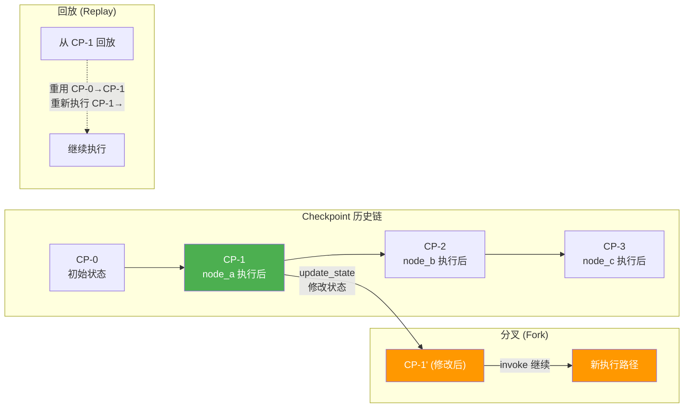
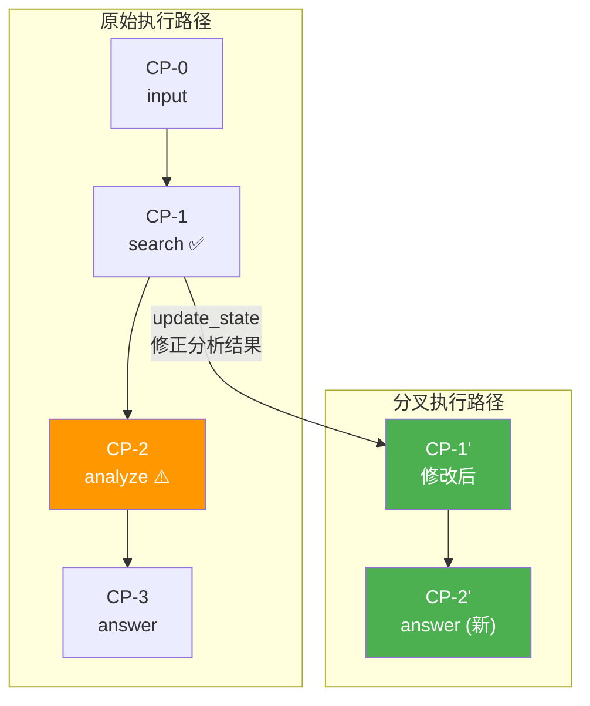

# Time Travel（时间旅行）

> 如果你用过 Redux DevTools 的 time travel debugging，你已经理解了 LangGraph Time Travel 的核心思想：记录每一步状态变化，随时回到任意历史时刻，修改状态后创建新的执行分支。

## 前端类比：先建立直觉

| 前端概念 | LangGraph 概念 | 说明 |
|---------|---------------|------|
| Redux DevTools 时间旅行 | Time Travel | 回溯到任意历史状态 |
| Action 列表 | `get_state_history()` | 查看所有历史 checkpoint |
| Jump to state | `checkpoint_id` 回放 | 跳到指定历史快照 |
| Dispatch action 修改 state | `update_state()` | 在历史点注入修改 |
| 从修改点继续 | Fork（分叉） | 从修改后的状态创建新执行分支 |

**LangGraph 原生语义**：Time Travel 建立在 checkpoint 链之上。每个 superstep 产生一个 checkpoint，这些 checkpoint 形成一条链（通过 `parent_config` 链接）。你可以回溯到任意 checkpoint，查看当时的状态，修改它，然后从那个点开始一条新的执行路径——这就是"分叉"（fork）。

---

## 1. Time Travel 核心概念

### 三种操作



| 操作 | 说明 | 方法 |
|------|------|------|
| **回放 (Replay)** | 从历史 checkpoint 重新执行 | `invoke(None, config={checkpoint_id: ...})` |
| **查看 (Inspect)** | 查看任意历史状态 | `get_state(config)` / `get_state_history(config)` |
| **分叉 (Fork)** | 修改历史状态后创建新分支 | `update_state(config, values)` + `invoke` |

---

## 2. 四步使用法

### Step 1：运行图

```python
from langgraph.graph import StateGraph, START, END
from langgraph.checkpoint.memory import InMemorySaver
from typing import TypedDict, Annotated
from operator import add

class State(TypedDict):
    input: str
    steps: Annotated[list[str], add]
    result: str

def analyze(state: State):
    return {"steps": ["analyzed"], "result": f"分析了 '{state['input']}'"}

def enrich(state: State):
    return {"steps": ["enriched"], "result": f"丰富了 {state['result']}"}

def summarize(state: State):
    return {"steps": ["summarized"], "result": f"总结：{state['result']}"}

builder = StateGraph(State)
builder.add_node("analyze", analyze)
builder.add_node("enrich", enrich)
builder.add_node("summarize", summarize)

builder.add_edge(START, "analyze")
builder.add_edge("analyze", "enrich")
builder.add_edge("enrich", "summarize")
builder.add_edge("summarize", END)

checkpointer = InMemorySaver()
graph = builder.compile(checkpointer=checkpointer)

# 正常执行
config = {"configurable": {"thread_id": "tt-demo-001"}}
result = graph.invoke(
    {"input": "LangGraph 架构", "steps": [], "result": ""},
    config
)
print(f"最终结果: {result['result']}")
print(f"执行步骤: {result['steps']}")
# 最终结果: 总结：丰富了 分析了 'LangGraph 架构'
# 执行步骤: ['analyzed', 'enriched', 'summarized']
```

### Step 2：定位 Checkpoint

```python
# 列出所有历史 checkpoint
print("=== 执行历史 ===")
checkpoints = []
for state in graph.get_state_history(config):
    step = state.metadata.get("step", "?")
    source = state.metadata.get("source", "?")
    cp_id = state.config["configurable"]["checkpoint_id"]
    checkpoints.append(state)
    print(f"  Step {step} | source={source} | checkpoint={cp_id}")
    print(f"    values: steps={state.values.get('steps', [])}")
    print(f"    next: {state.next}")
    print()

# 输出示例（从新到旧）：
# Step 3 | source=loop | checkpoint=cp-003
#   values: steps=['analyzed', 'enriched', 'summarized']
#   next: ()
#
# Step 2 | source=loop | checkpoint=cp-002
#   values: steps=['analyzed', 'enriched']
#   next: ('summarize',)
#
# Step 1 | source=loop | checkpoint=cp-001
#   values: steps=['analyzed']
#   next: ('enrich',)
#
# Step 0 | source=input | checkpoint=cp-000
#   values: steps=[]
#   next: ('analyze',)
```

**前端类比**：这等价于在 Redux DevTools 中查看 action 历史列表。每个条目显示：
- `step` → action 序号
- `values` → 该时刻的 store state
- `next` → 下一个将要 dispatch 的 action

### Step 3：可选修改状态

```python
# 找到 "enrich" 之前的 checkpoint（Step 1，analyze 完成后）
target_checkpoint = None
for state in graph.get_state_history(config):
    if state.next and "enrich" in state.next:
        target_checkpoint = state
        break

if target_checkpoint:
    target_config = target_checkpoint.config
    print(f"目标 checkpoint: {target_config['configurable']['checkpoint_id']}")
    print(f"当时的状态: {target_checkpoint.values}")

    # 修改状态：注入不同的分析结果
    graph.update_state(
        target_config,
        values={"result": "（人工修正）重新分析了架构"},
        as_node="analyze"  # 伪装成 analyze 节点的输出
    )
    print("状态已修改！")
```

`update_state` 的 `as_node` 参数告诉 LangGraph "这个修改应该被视为哪个节点的输出"。这决定了恢复执行时从哪个节点的下一步开始。

### Step 4：从 Checkpoint 恢复执行

```python
# 从修改后的 checkpoint 继续执行
# 传入 None 表示"不提供新输入，从 checkpoint 恢复"
forked_result = graph.invoke(None, target_config)

print(f"分叉后结果: {forked_result['result']}")
# 分叉后结果: 总结：丰富了 （人工修正）重新分析了架构
# 注意：analyze 没有重新执行，从 enrich 开始继续
```

---

## 3. 完整代码示例：调试一个有问题的执行

一个常见的 time travel 使用场景是"发现输出不对，回到出问题的节点重新来过"：

```python
from langgraph.graph import StateGraph, START, END
from langgraph.checkpoint.memory import InMemorySaver
from typing import TypedDict, Annotated
from operator import add

class DebugState(TypedDict):
    query: str
    search_results: list[str]
    analysis: str
    answer: str
    steps: Annotated[list[str], add]

def search(state: DebugState):
    """搜索步骤"""
    results = [f"搜索结果-{i}" for i in range(3)]
    return {"search_results": results, "steps": ["search"]}

def analyze(state: DebugState):
    """分析步骤 — 假设这里出了问题"""
    # 模拟分析结果不理想
    analysis = f"基于 {len(state['search_results'])} 条结果的分析（质量较低）"
    return {"analysis": analysis, "steps": ["analyze"]}

def answer(state: DebugState):
    """回答步骤"""
    return {"answer": f"回答: {state['analysis']}", "steps": ["answer"]}

builder = StateGraph(DebugState)
builder.add_node("search", search)
builder.add_node("analyze", analyze)
builder.add_node("answer", answer)
builder.add_edge(START, "search")
builder.add_edge("search", "analyze")
builder.add_edge("analyze", "answer")
builder.add_edge("answer", END)

checkpointer = InMemorySaver()
graph = builder.compile(checkpointer=checkpointer)

config = {"configurable": {"thread_id": "debug-session-1"}}

# 执行
result = graph.invoke(
    {"query": "什么是 LangGraph？", "search_results": [], "analysis": "", "answer": "", "steps": []},
    config
)
print(f"原始回答: {result['answer']}")
# 原始回答: 回答: 基于 3 条结果的分析（质量较低）

# 开发者发现"分析质量较低"，决定回到 analyze 之前修改
print("\n--- Time Travel: 修复分析步骤 ---")

# 找到 analyze 之前的 checkpoint
for state in graph.get_state_history(config):
    if state.next and "analyze" in state.next:
        # 注入更好的分析结果
        graph.update_state(
            state.config,
            values={"analysis": "基于 3 条结果的高质量深度分析"},
            as_node="analyze"  # 作为 analyze 的输出
        )
        # 从修改点继续
        fixed_result = graph.invoke(None, state.config)
        print(f"修复后回答: {fixed_result['answer']}")
        # 修复后回答: 回答: 基于 3 条结果的高质量深度分析
        break
```

---

## 4. 回放与分叉流程



### 关键行为

1. **回放（Replay）不会重新执行已完成的节点**：LangGraph 智能地重用已有的 checkpoint 数据
2. **分叉（Fork）创建新的 checkpoint 链**：从修改点开始，后续的 checkpoint 都是新的
3. **原始 checkpoint 不受影响**：分叉不会修改或删除原始执行历史
4. **分叉可以嵌套**：你可以从一个分叉创建另一个分叉

---

## 5. 高级用法

### 比较不同分支的结果

```python
# 在同一个 thread 上创建多个分叉，比较结果
results = {}

for state in graph.get_state_history(config):
    if state.next and "analyze" in state.next:
        # 分叉 1：保守分析
        graph.update_state(
            state.config,
            values={"analysis": "保守分析：只采用高置信度结果"},
            as_node="analyze"
        )
        r1 = graph.invoke(None, state.config)
        results["conservative"] = r1["answer"]

        # 分叉 2：激进分析
        graph.update_state(
            state.config,
            values={"analysis": "激进分析：综合所有可能的关联"},
            as_node="analyze"
        )
        r2 = graph.invoke(None, state.config)
        results["aggressive"] = r2["answer"]
        break

print("保守方案:", results["conservative"])
print("激进方案:", results["aggressive"])
```

### 与 HITL 结合使用

```python
from langgraph.types import interrupt, Command

def review_node(state):
    """人工审查节点 + time travel 能力"""
    review = interrupt({
        "type": "review",
        "content": state["analysis"],
        "options": ["accept", "redo_from_search", "redo_from_analyze"]
    })

    if review == "accept":
        return state
    elif review == "redo_from_search":
        # 提示用户使用 time travel 回到 search 步骤
        return {"analysis": "需要重新搜索"}
    else:
        return {"analysis": "需要重新分析"}
```

---

## 6. 生产环境使用建议

### 何时使用 Time Travel

| 场景 | 推荐用法 |
|------|---------|
| 调试 Agent 输出质量问题 | 回溯到出问题的节点，检查输入输出 |
| A/B 测试不同策略 | 从同一 checkpoint 分叉，注入不同参数 |
| 人工修正后重跑 | `update_state` 修正错误，从修正点继续 |
| 审计与合规 | `get_state_history` 查看完整决策链 |
| 教学与演示 | 逐步回放展示 Agent 的推理过程 |

### 注意事项

1. **Checkpoint 存储开销**：每个 superstep 一个 checkpoint，长流程会积累大量数据
2. **不要在性能敏感路径使用 `get_state_history`**：它需要遍历整个 checkpoint 链
3. **分叉不会清理原始数据**：需要自行实现 checkpoint 清理策略
4. **状态修改的一致性**：`update_state` 时确保修改后的值与 state schema 兼容

### 监控建议

```python
# 检查 thread 的 checkpoint 数量（用于监控和清理）
checkpoint_count = sum(1 for _ in graph.get_state_history(config))
print(f"Thread {config['configurable']['thread_id']} 有 {checkpoint_count} 个 checkpoint")

if checkpoint_count > 100:
    print("⚠️ Checkpoint 数量较多，考虑清理")
```

---

## 7. 与 Redux DevTools 的深度对比

| 维度 | Redux DevTools | LangGraph Time Travel |
|------|---------------|----------------------|
| 存储位置 | 浏览器内存 | Checkpointer（内存/SQLite/Postgres） |
| 持久性 | 刷新即丢失 | 按 checkpointer 配置持久化 |
| 粒度 | 每个 dispatch | 每个 superstep |
| 修改能力 | 手动 dispatch action | `update_state()` |
| 分叉 | 不原生支持 | 原生支持，保留完整历史 |
| 多用户 | 单浏览器 | 多 thread，完全隔离 |
| 性能影响 | 仅开发环境 | 生产环境可用（注意存储开销） |

**LangGraph 原生语义**：与 Redux DevTools 最大的不同在于——LangGraph 的 time travel 是**生产级能力**，不仅仅是调试工具。它支撑着 HITL、容错恢复、A/B 测试等核心业务场景。

---

## 要点回顾

| 操作 | 方法 | 用途 |
|------|------|------|
| 查看历史 | `get_state_history(config)` | 遍历所有 checkpoint |
| 查看当前状态 | `get_state(config)` | 获取最新 checkpoint |
| 回放 | `invoke(None, {checkpoint_id: ...})` | 从指定 checkpoint 继续执行 |
| 分叉 | `update_state()` + `invoke(None, ...)` | 修改历史状态后创建新路径 |

---

## 先修与下一步

- **先修**：[持久化](/ai/langgraph/guide/persistence) | [Interrupts (HITL)](/ai/langgraph/guide/interrupts)
- **下一步**：[Memory 记忆系统](/ai/langgraph/guide/memory) | [Subgraphs 子图](/ai/langgraph/guide/subgraphs)
