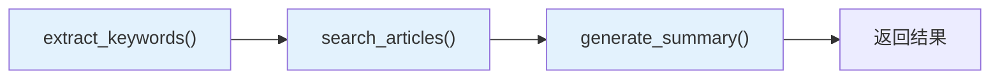
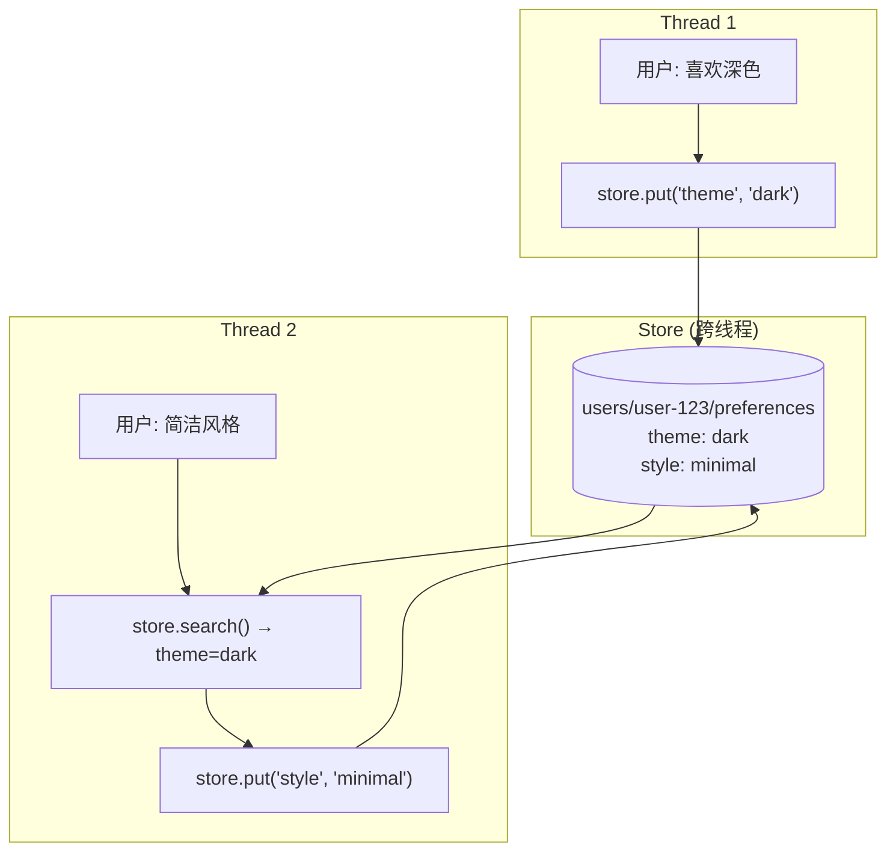

# Functional API 实战指南

> 本篇是 Functional API 的完整实操手册。从最基础的 `@entrypoint + @task` 组合到高级的记忆系统和并行执行，每个章节都有可运行的完整代码。

## 基础工作流构建

### 最小可运行示例

```python
from langgraph.func import entrypoint, task
from langgraph.checkpoint.memory import InMemorySaver


@task
def greet(name: str) -> str:
    return f"你好, {name}!"


@entrypoint(checkpointer=InMemorySaver())
def hello_workflow(name: str) -> str:
    result = greet(name).result()
    return result


# 执行
config = {"configurable": {"thread_id": "demo"}}
output = hello_workflow.invoke("前端开发者", config)
print(output)  # '你好, 前端开发者!'
```

### 多步骤工作流

```python
import time
from langgraph.func import entrypoint, task
from langgraph.checkpoint.memory import InMemorySaver


@task
def extract_keywords(text: str) -> list[str]:
    """Step 1: 提取关键词"""
    time.sleep(0.5)  # 模拟 AI 调用
    words = text.split()
    return [w for w in words if len(w) > 3]


@task
def search_articles(keywords: list[str]) -> list[dict]:
    """Step 2: 根据关键词搜索文章"""
    time.sleep(0.5)
    return [
        {"title": f"关于 {kw} 的深度解析", "relevance": 0.9}
        for kw in keywords[:3]
    ]


@task
def generate_summary(articles: list[dict]) -> str:
    """Step 3: 生成摘要"""
    time.sleep(0.5)
    titles = [a["title"] for a in articles]
    return f"综合 {len(articles)} 篇文章的摘要：{', '.join(titles)}"


@entrypoint(checkpointer=InMemorySaver())
def research_workflow(query: str) -> dict:
    """
    研究工作流：提取关键词 → 搜索文章 → 生成摘要
    """
    # 顺序执行三个 task
    keywords = extract_keywords(query).result()
    articles = search_articles(keywords).result()
    summary = generate_summary(articles).result()

    return {
        "query": query,
        "keywords": keywords,
        "article_count": len(articles),
        "summary": summary,
    }


# 执行
config = {"configurable": {"thread_id": "research-001"}}
result = research_workflow.invoke("LangGraph 工作流编排框架使用指南", config)
print(result["summary"])
```



### 条件分支

标准 Python 的 `if/else` 就是条件分支：

```python
@task
def classify_intent(text: str) -> str:
    """分类用户意图"""
    if "退款" in text or "退货" in text:
        return "refund"
    elif "故障" in text or "修复" in text:
        return "support"
    else:
        return "general"


@task
def handle_refund(text: str) -> str:
    return f"退款处理中: {text}"


@task
def handle_support(text: str) -> str:
    return f"技术支持已受理: {text}"


@task
def handle_general(text: str) -> str:
    return f"感谢您的反馈: {text}"


@entrypoint(checkpointer=InMemorySaver())
def customer_service(user_input: str) -> dict:
    intent = classify_intent(user_input).result()

    # 标准 if/else 分支 — 比 add_conditional_edges 更直观
    if intent == "refund":
        response = handle_refund(user_input).result()
    elif intent == "support":
        response = handle_support(user_input).result()
    else:
        response = handle_general(user_input).result()

    return {"intent": intent, "response": response}
```

## 人机交互（interrupt + resume）

### 基本的审批流程

```python
import uuid
from langgraph.func import entrypoint, task
from langgraph.types import interrupt, Command
from langgraph.checkpoint.memory import InMemorySaver


@task
def generate_report(data: dict) -> dict:
    """生成报告"""
    return {
        "title": f"月度报告 - {data['month']}",
        "content": f"总收入: {data['revenue']}万元",
        "status": "draft",
    }


@entrypoint(checkpointer=InMemorySaver())
def report_workflow(data: dict) -> dict:
    # Step 1: 生成报告
    report = generate_report(data).result()

    # Step 2: 暂停等待人工审批
    approval = interrupt({
        "report": report,
        "action": "请审核报告。输入 'approve' 批准，或输入修改意见。",
    })

    # Step 3: 处理审批结果
    if approval == "approve":
        report["status"] = "approved"
    else:
        report["status"] = "revised"
        report["revision_note"] = approval

    return report


# === 使用示例 ===

config = {"configurable": {"thread_id": str(uuid.uuid4())}}

# 第一次调用：生成报告并暂停
print("=== 第一次调用 ===")
for chunk in report_workflow.stream(
    {"month": "2026-02", "revenue": 150},
    config,
):
    print(chunk)
# 输出包含 __interrupt__，工作流暂停

# 人工审核后恢复
print("\n=== 恢复执行 ===")
for chunk in report_workflow.stream(
    Command(resume="approve"),
    config,
):
    print(chunk)
# 输出: {'report_workflow': {'title': '...', 'status': 'approved'}}
```

### 多轮交互

```python
@task
def draft_email(topic: str) -> str:
    return f"关于 {topic} 的邮件草稿：\n\n尊敬的客户，..."


@task
def revise_email(draft: str, feedback: str) -> str:
    return f"{draft}\n\n[根据反馈修改: {feedback}]"


@entrypoint(checkpointer=InMemorySaver())
def email_workflow(topic: str) -> dict:
    draft = draft_email(topic).result()
    max_revisions = 3

    for i in range(max_revisions):
        # 每轮都暂停等待反馈
        feedback = interrupt({
            "draft": draft,
            "revision": i + 1,
            "action": "输入 'send' 发送，或输入修改意见",
        })

        if feedback == "send":
            return {"email": draft, "status": "sent", "revisions": i}

        # 根据反馈修改
        draft = revise_email(draft, feedback).result()

    return {"email": draft, "status": "sent_after_max_revisions", "revisions": max_revisions}


# 使用
config = {"configurable": {"thread_id": str(uuid.uuid4())}}

# 第一轮
for chunk in email_workflow.stream("项目进度汇报", config):
    print(chunk)

# 第一次修改
for chunk in email_workflow.stream(Command(resume="请加上具体数据"), config):
    print(chunk)

# 满意了，发送
for chunk in email_workflow.stream(Command(resume="send"), config):
    print(chunk)
```

## 短期记忆（previous 参数使用）

`previous` 参数让 entrypoint 在同一个 thread 的多次调用之间保持状态：

### 聊天记忆

```python
from typing import Any
from langgraph.func import entrypoint, task
from langgraph.checkpoint.memory import InMemorySaver


@task
def generate_response(messages: list[dict]) -> str:
    """模拟 LLM 响应"""
    last = messages[-1]["content"]
    return f"AI 回复: 收到你说的「{last}」"


@entrypoint(checkpointer=InMemorySaver())
def chatbot(
    user_message: str,
    *,
    previous: Any = None,
) -> entrypoint.final[dict, list[dict]]:
    """
    聊天机器人，使用 previous 维护对话历史

    返回类型:
    - entrypoint.final[dict, list[dict]]
    - value (dict): 返回给调用者
    - save (list[dict]): 保存到 checkpoint（完整消息历史）
    """
    # 恢复历史消息
    messages = previous or []

    # 添加用户消息
    messages.append({"role": "user", "content": user_message})

    # 生成回复
    response = generate_response(messages).result()
    messages.append({"role": "assistant", "content": response})

    # value: 返回当前回复
    # save: 保存完整消息历史到 checkpoint
    return entrypoint.final(
        value={"response": response, "history_length": len(messages)},
        save=messages,
    )


# 使用
config = {"configurable": {"thread_id": "chat-001"}}

r1 = chatbot.invoke("你好", config)
print(r1)  # {'response': 'AI 回复: ...', 'history_length': 2}

r2 = chatbot.invoke("LangGraph 是什么？", config)
print(r2)  # {'response': '...', 'history_length': 4}

r3 = chatbot.invoke("能详细说说吗？", config)
print(r3)  # {'response': '...', 'history_length': 6}
```

> **前端类比**：`previous` + `entrypoint.final` 的模式类似 React 的 `useReducer`。`previous` 是上一个 state，`entrypoint.final.save` 是新 state，`entrypoint.final.value` 是渲染给用户的值。这样你可以解耦"给用户看的"和"持久化存储的"。
>
> **LangGraph 原生语义**：如果不用 `entrypoint.final`，`previous` 默认等于上次的返回值。使用 `entrypoint.final` 可以让 `previous` 等于 `save` 的值，而返回给调用者 `value` 的值。

## 长期记忆（store 使用 + 语义搜索）

`store` 提供跨线程的持久化存储，支持 namespace 组织和可选的语义搜索。

```python
from langgraph.func import entrypoint, task
from langgraph.checkpoint.memory import InMemorySaver
from langgraph.store.memory import InMemoryStore
from langgraph.store.base import BaseStore


store = InMemoryStore()
checkpointer = InMemorySaver()


@task
def extract_preferences(message: str) -> dict:
    """从用户消息中提取偏好"""
    preferences = {}
    if "深色" in message or "dark" in message.lower():
        preferences["theme"] = "dark"
    if "简洁" in message:
        preferences["style"] = "minimal"
    return preferences


@entrypoint(checkpointer=checkpointer, store=store)
def personalized_assistant(
    input_data: dict,
    *,
    store: BaseStore,
) -> dict:
    user_id = input_data["user_id"]
    message = input_data["message"]

    # 读取用户偏好（跨线程持久化）
    namespace = ("users", user_id, "preferences")
    existing_prefs = store.search(namespace)

    # 提取新偏好
    new_prefs = extract_preferences(message).result()

    # 保存新偏好
    for key, value in new_prefs.items():
        store.put(namespace, key, {"value": value})

    # 合并已有偏好
    all_prefs = {item.key: item.value for item in existing_prefs}
    all_prefs.update(new_prefs)

    return {
        "response": f"已了解您的偏好: {all_prefs}",
        "preferences": all_prefs,
    }


# 第一次对话（线程 1）
config1 = {"configurable": {"thread_id": "thread-1"}}
r1 = personalized_assistant.invoke(
    {"user_id": "user-123", "message": "我喜欢深色主题"},
    config1,
)
print(r1["preferences"])  # {'theme': 'dark'}

# 第二次对话（不同线程，但同一个用户）
config2 = {"configurable": {"thread_id": "thread-2"}}
r2 = personalized_assistant.invoke(
    {"user_id": "user-123", "message": "帮我做简洁风格的报告"},
    config2,
)
print(r2["preferences"])  # {'theme': 'dark', 'style': 'minimal'}
```



## Streaming（自定义 stream 数据）

### 使用 StreamWriter

```python
from langgraph.func import entrypoint, task
from langgraph.types import StreamWriter
from langgraph.checkpoint.memory import InMemorySaver


@task
def slow_analysis(data: str) -> dict:
    import time
    time.sleep(1)
    return {"analysis": f"分析结果: {data}"}


@entrypoint(checkpointer=InMemorySaver())
def streaming_workflow(
    input_data: dict,
    *,
    writer: StreamWriter,
) -> dict:
    writer({"status": "开始处理", "progress": 0})

    # Step 1
    writer({"status": "正在分析数据...", "progress": 30})
    result1 = slow_analysis(input_data["data"]).result()

    # Step 2
    writer({"status": "正在生成报告...", "progress": 60})
    result2 = slow_analysis(result1["analysis"]).result()

    # Step 3
    writer({"status": "完成!", "progress": 100})

    return {"final": result2}


# 消费自定义流
config = {"configurable": {"thread_id": "stream-demo"}}

for chunk in streaming_workflow.stream(
    {"data": "测试数据"},
    config,
    stream_mode=["custom", "updates"],
):
    print(chunk)
# ('custom', {'status': '开始处理', 'progress': 0})
# ('custom', {'status': '正在分析数据...', 'progress': 30})
# ('updates', {'slow_analysis': {'analysis': '分析结果: 测试数据'}})
# ...
```

### Stream Mode 选项

```python
# 只看自定义数据
for chunk in workflow.stream(input_data, config, stream_mode="custom"):
    print(chunk)

# 只看状态更新
for chunk in workflow.stream(input_data, config, stream_mode="updates"):
    print(chunk)

# 同时看多种流
for chunk in workflow.stream(
    input_data, config,
    stream_mode=["custom", "updates", "messages"],
):
    mode, data = chunk
    print(f"[{mode}] {data}")
```

## 并行 task 执行

Task 返回 future 对象，可以实现并行执行：

```python
import time
from langgraph.func import entrypoint, task
from langgraph.checkpoint.memory import InMemorySaver


@task
def fetch_from_api(api_name: str) -> dict:
    """模拟 API 调用（1 秒延迟）"""
    time.sleep(1)
    return {"source": api_name, "data": f"{api_name} 的数据"}


@entrypoint(checkpointer=InMemorySaver())
def parallel_fetch(apis: list[str]) -> dict:
    """并行获取多个 API 的数据"""
    start = time.time()

    # 同时启动所有 task（不等待）
    futures = [fetch_from_api(api) for api in apis]

    # 一次性等待所有结果
    results = [f.result() for f in futures]

    elapsed = time.time() - start

    return {
        "results": results,
        "elapsed": round(elapsed, 2),
        "message": f"并行获取 {len(apis)} 个 API，耗时 {elapsed:.1f}s（串行需 {len(apis)}s）",
    }


config = {"configurable": {"thread_id": "parallel-demo"}}
result = parallel_fetch.invoke(
    ["weather", "news", "stocks", "calendar"],
    config,
)
print(result["message"])
# 并行获取 4 个 API，耗时 1.0s（串行需 4s）
```

> **前端类比**：这和 `Promise.all()` 的模式完全一致。先启动所有异步操作（得到 Promise/Future），然后一次性等待全部完成。

## 错误处理与恢复

### Task 级重试

```python
from langgraph.func import task
from langgraph.types import RetryPolicy


@task(retry=RetryPolicy(max_attempts=3, initial_interval=1.0, backoff_factor=2.0))
def unreliable_api_call(url: str) -> dict:
    """可能失败的 API 调用，自动重试 3 次"""
    import random
    if random.random() < 0.5:
        raise ConnectionError(f"连接 {url} 失败")
    return {"url": url, "status": "ok"}
```

### 工作流级错误恢复

```python
from langgraph.func import entrypoint, task
from langgraph.checkpoint.memory import InMemorySaver


@task
def risky_operation(data: str) -> str:
    if not data:
        raise ValueError("数据不能为空")
    return f"处理完成: {data}"


@entrypoint(checkpointer=InMemorySaver())
def resilient_workflow(input_data: dict) -> dict:
    try:
        result = risky_operation(input_data.get("data", "")).result()
        return {"status": "success", "result": result}
    except ValueError as e:
        return {"status": "error", "message": str(e)}


# 如果工作流因为未捕获的异常失败：
config = {"configurable": {"thread_id": "error-demo"}}

# 修复底层问题后，传 None 重试
try:
    result = resilient_workflow.invoke({"data": ""}, config)
except Exception:
    # 修复数据后重试
    result = resilient_workflow.invoke(None, config)
```

## 与 Graph API 的互操作

Functional API 和 Graph API 共享 Pregel 运行时，可以自由组合：

### 在 Graph 节点中调用 Functional 工作流

```python
from langgraph.graph import StateGraph, START, END, MessagesState
from langgraph.func import entrypoint, task
from langgraph.checkpoint.memory import InMemorySaver


# Functional API 部分
@task
def extract_entities(text: str) -> list[str]:
    return [w for w in text.split() if w[0].isupper()]


@entrypoint()
def entity_extractor(text: str) -> list[str]:
    return extract_entities(text).result()


# Graph API 部分
class PipelineState(MessagesState):
    entities: list[str]


def process_message(state: PipelineState) -> dict:
    last_msg = state["messages"][-1]
    # 在 Graph 节点中调用 Functional 工作流
    entities = entity_extractor.invoke(last_msg.content)
    return {"entities": entities}


def respond(state: PipelineState) -> dict:
    entities = state.get("entities", [])
    return {
        "messages": [
            {"role": "ai", "content": f"识别到实体: {entities}"}
        ]
    }


builder = StateGraph(PipelineState)
builder.add_node("process", process_message)
builder.add_node("respond", respond)
builder.add_edge(START, "process")
builder.add_edge("process", "respond")
builder.add_edge("respond", END)

graph = builder.compile(checkpointer=InMemorySaver())
```

### 在 Functional 工作流中调用 Graph

```python
@entrypoint(checkpointer=InMemorySaver())
def orchestrator(input_data: dict) -> dict:
    # 调用预构建的 Graph
    graph_result = some_compiled_graph.invoke(
        {"messages": [{"role": "user", "content": input_data["query"]}]}
    )
    return {"graph_output": graph_result}
```

## 完整端到端示例：智能文档审核系统

```python
import uuid
import time
from typing import Any
from langgraph.func import entrypoint, task
from langgraph.types import interrupt, Command, StreamWriter
from langgraph.checkpoint.memory import InMemorySaver
from langgraph.store.memory import InMemoryStore
from langgraph.store.base import BaseStore


@task
def analyze_document(doc: str) -> dict:
    """分析文档质量"""
    time.sleep(0.5)
    word_count = len(doc.split())
    return {
        "word_count": word_count,
        "quality_score": min(word_count / 100, 1.0),
        "issues": ["段落过短"] if word_count < 50 else [],
    }


@task
def auto_improve(doc: str, issues: list[str]) -> str:
    """自动改进文档"""
    time.sleep(0.5)
    improvements = " ".join(f"[已修复: {issue}]" for issue in issues)
    return f"{doc}\n\n{improvements}"


@task
def format_for_publish(doc: str, metadata: dict) -> dict:
    """格式化发布"""
    return {
        "content": doc,
        "metadata": metadata,
        "published_at": "2026-02-21T12:00:00Z",
    }


store = InMemoryStore()
checkpointer = InMemorySaver()


@entrypoint(checkpointer=checkpointer, store=store)
def document_review(
    input_data: dict,
    *,
    previous: Any = None,
    store: BaseStore,
    writer: StreamWriter,
) -> dict:
    doc = input_data["document"]
    author = input_data["author"]

    # 读取作者历史统计
    namespace = ("authors", author, "stats")
    history = store.search(namespace)
    review_count = len(history)

    writer({"status": "开始审核", "author_reviews": review_count})

    # Step 1: 分析文档
    writer({"status": "分析文档质量..."})
    analysis = analyze_document(doc).result()

    writer({"status": f"质量评分: {analysis['quality_score']:.0%}"})

    # Step 2: 如果有问题，自动改进
    if analysis["issues"]:
        writer({"status": "发现问题，自动改进中..."})
        doc = auto_improve(doc, analysis["issues"]).result()

    # Step 3: 人工审核
    decision = interrupt({
        "document": doc,
        "analysis": analysis,
        "action": "输入 'publish' 发布，或输入修改意见",
    })

    if decision == "publish":
        # Step 4: 格式化发布
        writer({"status": "格式化发布中..."})
        result = format_for_publish(doc, {
            "author": author,
            "quality_score": analysis["quality_score"],
        }).result()

        # 记录到作者统计
        store.put(namespace, str(review_count + 1), {
            "quality_score": analysis["quality_score"],
            "status": "published",
        })

        return {"status": "published", "result": result}
    else:
        return {"status": "revision_needed", "feedback": decision}


# === 执行示例 ===
config = {"configurable": {"thread_id": str(uuid.uuid4())}}

# 1. 提交文档审核
print("=== 提交审核 ===")
for chunk in document_review.stream(
    {
        "document": "这是一篇关于 LangGraph 的文档",
        "author": "alice",
    },
    config,
    stream_mode=["custom", "updates"],
):
    print(chunk)

# 2. 人工审核通过
print("\n=== 发布 ===")
for chunk in document_review.stream(
    Command(resume="publish"),
    config,
    stream_mode=["custom", "updates"],
):
    print(chunk)
```

---

**先修内容**：[Functional API 概念详解](./functional-api)

**下一步**：[Runtime (Pregel)](./runtime) | [Streaming 流式处理](./streaming)
