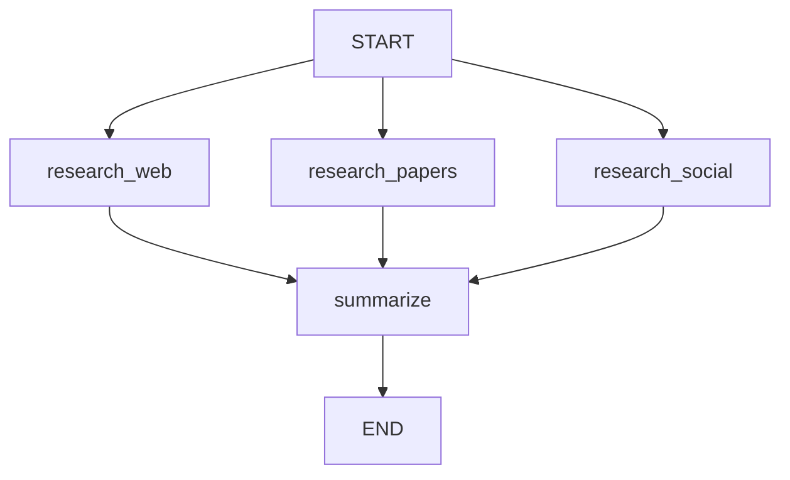
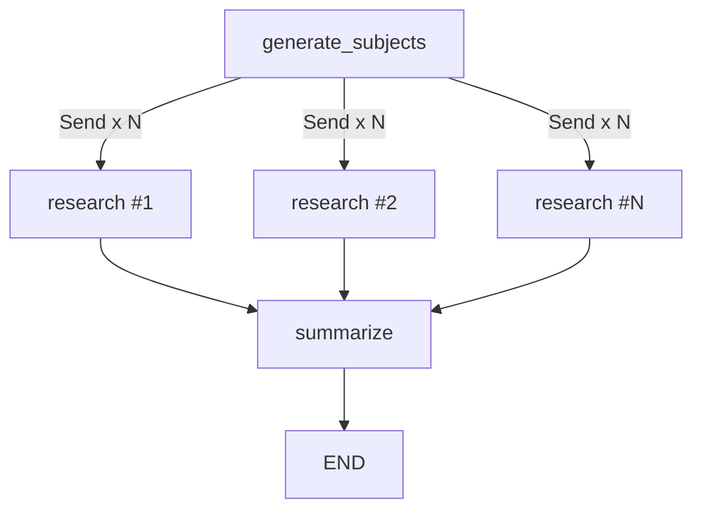
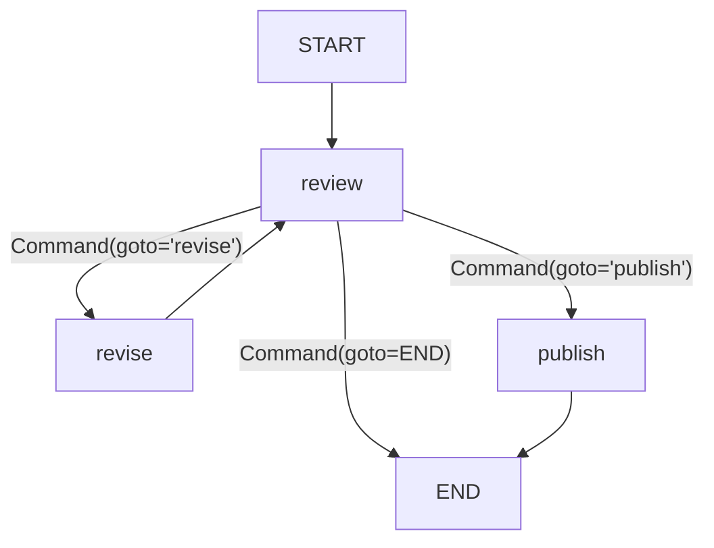
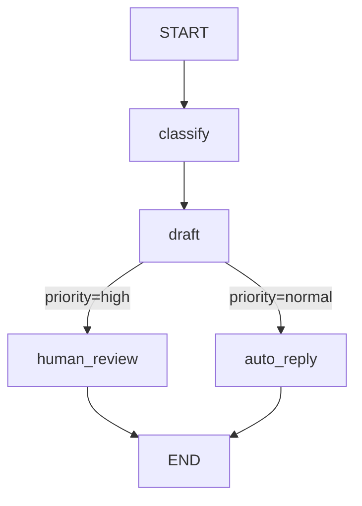

# Graph API 实战指南

> 本篇是 Graph API 的完整实操手册。每个章节配有可运行的代码示例，从最基础的状态定义到高级的 map-reduce 和 Command 模式，逐步深入。

## 定义与更新状态

### 定义 State

```python
from typing import TypedDict, Annotated
from langgraph.graph import StateGraph, START, END


class OrderState(TypedDict):
    """订单处理状态"""
    order_id: str
    items: list[str]
    total: float
    status: str


def init_order(state: OrderState) -> dict:
    return {"status": "initialized", "total": 0.0}


builder = StateGraph(OrderState)
builder.add_node("init", init_order)
builder.add_edge(START, "init")
builder.add_edge("init", END)

graph = builder.compile()
result = graph.invoke({"order_id": "ORD-001", "items": ["苹果", "香蕉"]})
print(result)
# {'order_id': 'ORD-001', 'items': ['苹果', '香蕉'], 'total': 0.0, 'status': 'initialized'}
```

### 更新 State

节点函数返回一个字典，只包含需要更新的字段。默认行为是 **last-write-wins**（覆盖）。

```python
def calculate_total(state: OrderState) -> dict:
    """只返回需要更新的字段"""
    price_map = {"苹果": 5.0, "香蕉": 3.0, "橙子": 4.0}
    total = sum(price_map.get(item, 0) for item in state["items"])
    return {"total": total, "status": "calculated"}


def finalize(state: OrderState) -> dict:
    return {"status": f"完成，总价 {state['total']} 元"}
```

### Reducers

当需要**累积**而非覆盖更新时，使用 Reducers。

```python
import operator
from langgraph.graph import add_messages


class AggregateState(TypedDict):
    # 默认：last-write-wins
    current_step: str

    # operator.add：列表拼接
    logs: Annotated[list[str], operator.add]

    # add_messages：消息列表智能合并
    messages: Annotated[list, add_messages]

    # 自定义 reducer
    counter: Annotated[int, lambda old, new: (old or 0) + new]


def step_a(state: AggregateState) -> dict:
    return {
        "current_step": "A",
        "logs": ["step A 执行完毕"],
        "counter": 1,
    }


def step_b(state: AggregateState) -> dict:
    return {
        "current_step": "B",
        "logs": ["step B 执行完毕"],  # 会和 step_a 的 logs 拼接
        "counter": 1,                 # counter 会累加到 2
    }


builder = StateGraph(AggregateState)
builder.add_node("step_a", step_a)
builder.add_node("step_b", step_b)
builder.add_edge(START, "step_a")
builder.add_edge("step_a", "step_b")
builder.add_edge("step_b", END)

graph = builder.compile()
result = graph.invoke({"current_step": "", "logs": [], "counter": 0})
print(result["logs"])
# ['step A 执行完毕', 'step B 执行完毕']
print(result["counter"])
# 2
```

### Overwrite 默认值

如果你需要在特定条件下完全覆盖（而非累积）一个带 reducer 的字段，可以使用特殊的覆盖语义：

```python
from langgraph.graph import add_messages
from langchain_core.messages import RemoveMessage


def clear_messages(state: AggregateState) -> dict:
    """使用 RemoveMessage 来删除特定消息"""
    return {
        "messages": [
            RemoveMessage(id=msg.id) for msg in state["messages"]
        ]
    }
```

### Input/Output Schemas

你可以分离输入和输出的 schema，隐藏中间状态：

```python
class InputState(TypedDict):
    """对外暴露的输入 schema"""
    user_query: str


class OutputState(TypedDict):
    """对外暴露的输出 schema"""
    answer: str
    confidence: float


class InternalState(InputState, OutputState):
    """内部完整状态，包含中间字段"""
    search_results: list[str]
    draft_answer: str
    iteration_count: int


# 用 InternalState 构建图，但指定 input/output
builder = StateGraph(
    InternalState,
    input=InputState,
    output=OutputState,
)
```

### Private State

私有状态字段不会出现在图的输入输出中，只在内部节点间传递：

```python
class PublicState(TypedDict):
    query: str
    answer: str


class PrivateState(PublicState):
    # 这些字段只在内部使用
    _search_cache: dict
    _retry_count: int
    _intermediate_results: list


builder = StateGraph(
    PrivateState,
    input=PublicState,
    output=PublicState,
)
```

### Pydantic Models

使用 Pydantic 模型获得运行时类型验证：

```python
from pydantic import BaseModel, Field
from langgraph.graph import StateGraph, START, END


class ChatState(BaseModel):
    messages: list = Field(default_factory=list)
    context: str = ""
    temperature: float = Field(default=0.7, ge=0.0, le=2.0)


def add_message(state: ChatState) -> dict:
    return {
        "messages": state.messages + [
            {"role": "ai", "content": "Hello there!"}
        ]
    }


builder = StateGraph(ChatState)
builder.add_node("add_message", add_message)
builder.add_edge(START, "add_message")
builder.add_edge("add_message", END)
graph = builder.compile()

result = graph.invoke(
    ChatState(
        messages=[{"role": "user", "content": "Hi"}],
        context="Customer support chat",
    )
)
print(result)
```

## 添加运行时配置

通过 `context_schema` 传递运行时参数（如模型选择、调试开关）：

```python
from dataclasses import dataclass
from langgraph.graph import StateGraph, MessagesState, START, END
from langgraph.runtime import Runtime
from langchain.chat_models import init_chat_model


@dataclass
class AppContext:
    model_provider: str = "openai"
    temperature: float = 0.7


MODELS = {
    "openai": init_chat_model("gpt-4o-mini"),
    "anthropic": init_chat_model("claude-haiku-4-5-20251001"),
}


def call_model(state: MessagesState, runtime: Runtime[AppContext]) -> dict:
    model = MODELS[runtime.context.model_provider]
    response = model.invoke(state["messages"])
    return {"messages": [response]}


builder = StateGraph(MessagesState, context_schema=AppContext)
builder.add_node("model", call_model)
builder.add_edge(START, "model")
builder.add_edge("model", END)

graph = builder.compile()

# 使用 OpenAI
result1 = graph.invoke(
    {"messages": [{"role": "user", "content": "hi"}]},
    context=AppContext(model_provider="openai"),
)

# 切换到 Anthropic
result2 = graph.invoke(
    {"messages": [{"role": "user", "content": "hi"}]},
    context={"model_provider": "anthropic"},
)
```

## 添加重试策略

为可能失败的节点配置自动重试：

```python
from langgraph.types import RetryPolicy


# 创建重试策略
retry = RetryPolicy(
    max_attempts=3,           # 最多重试 3 次
    initial_interval=1.0,     # 初始等待 1 秒
    backoff_factor=2.0,       # 指数退避倍数
    max_interval=10.0,        # 最大等待 10 秒
)

builder.add_node(
    "call_api",
    call_api_fn,
    retry=retry,
)
```

## 添加节点缓存

对昂贵的计算结果进行缓存：

```python
from langgraph.types import CachePolicy

builder.add_node(
    "embedding",
    compute_embedding,
    cache_policy=CachePolicy(ttl=600),  # 缓存 10 分钟
)
```

## 创建步骤序列

使用 `add_sequence` 快速定义线性流程：

```python
def step1(state: OrderState) -> dict:
    return {"status": "step1_done"}

def step2(state: OrderState) -> dict:
    return {"status": "step2_done"}

def step3(state: OrderState) -> dict:
    return {"status": "step3_done"}


builder = StateGraph(OrderState)
builder.add_node("step1", step1)
builder.add_node("step2", step2)
builder.add_node("step3", step3)

# 快捷方式：等价于三条 add_edge
builder.add_sequence(["step1", "step2", "step3"])

# 仍然需要手动连接 START 和 END
builder.add_edge(START, "step1")
builder.add_edge("step3", END)
```

## 创建分支

### 并行分支

从一个节点出发添加多条边，目标节点会在同一个 superstep 中并行执行：

```python
import operator
from typing import Annotated, TypedDict


class ResearchState(TypedDict):
    topic: str
    findings: Annotated[list[str], operator.add]
    summary: str


def research_web(state: ResearchState) -> dict:
    return {"findings": [f"Web 搜索结果: {state['topic']}"]}

def research_papers(state: ResearchState) -> dict:
    return {"findings": [f"论文搜索结果: {state['topic']}"]}

def research_social(state: ResearchState) -> dict:
    return {"findings": [f"社交媒体搜索结果: {state['topic']}"]}

def summarize(state: ResearchState) -> dict:
    return {"summary": f"综合 {len(state['findings'])} 个来源的结果"}


builder = StateGraph(ResearchState)
builder.add_node("web", research_web)
builder.add_node("papers", research_papers)
builder.add_node("social", research_social)
builder.add_node("summarize", summarize)

# 并行：START 同时连向三个节点
builder.add_edge(START, "web")
builder.add_edge(START, "papers")
builder.add_edge(START, "social")

# 汇合：三个节点都连向 summarize
builder.add_edge("web", "summarize")
builder.add_edge("papers", "summarize")
builder.add_edge("social", "summarize")
builder.add_edge("summarize", END)

graph = builder.compile()
result = graph.invoke({"topic": "LangGraph", "findings": []})
print(result["findings"])
# ['Web 搜索结果: LangGraph', '论文搜索结果: LangGraph', '社交媒体搜索结果: LangGraph']
```



### 延迟分支

某些分支可以在后续 superstep 中执行，实现延迟（lazy）执行：

```python
def maybe_enrich(state: ResearchState) -> dict:
    if len(state["findings"]) < 3:
        return {"findings": ["补充搜索结果"]}
    return {}
```

### 条件分支

根据状态动态选择不同路径：

```python
def route_by_priority(state: OrderState) -> str:
    if state["total"] > 1000:
        return "vip_handler"
    elif state["total"] > 100:
        return "standard_handler"
    else:
        return "basic_handler"


builder.add_conditional_edges(
    "calculate_total",
    route_by_priority,
    {
        "vip_handler": "vip_handler",
        "standard_handler": "standard_handler",
        "basic_handler": "basic_handler",
    }
)
```

## Map-Reduce 和 Send API

Send API 实现动态 fan-out / fan-in 模式：

```python
import operator
from typing import Annotated, TypedDict
from langgraph.types import Send
from langgraph.graph import StateGraph, START, END


class OverallState(TypedDict):
    subjects: list[str]
    research_results: Annotated[list[str], operator.add]
    final_summary: str


class ResearchSubState(TypedDict):
    subject: str


def generate_subjects(state: OverallState) -> dict:
    return {"subjects": ["量子计算", "AI 伦理", "太空殖民"]}


def fan_out_to_research(state: OverallState) -> list[Send]:
    """动态创建多个 Send，每个 subject 一个"""
    return [
        Send("research", {"subject": s})
        for s in state["subjects"]
    ]


def research(state: ResearchSubState) -> dict:
    """每个 Send 实例独立执行"""
    return {
        "research_results": [
            f"{state['subject']} 的研究报告: 关键发现..."
        ]
    }


def summarize_all(state: OverallState) -> dict:
    return {
        "final_summary": f"共 {len(state['research_results'])} 篇报告的综合摘要"
    }


builder = StateGraph(OverallState)
builder.add_node("generate_subjects", generate_subjects)
builder.add_node("research", research)
builder.add_node("summarize", summarize_all)

builder.add_edge(START, "generate_subjects")
builder.add_conditional_edges("generate_subjects", fan_out_to_research)
builder.add_edge("research", "summarize")
builder.add_edge("summarize", END)

graph = builder.compile()
result = graph.invoke({
    "subjects": [],
    "research_results": [],
    "final_summary": "",
})
print(result["research_results"])
# ['量子计算 的研究报告: ...', 'AI 伦理 的研究报告: ...', '太空殖民 的研究报告: ...']
```



## 创建和控制循环

### 基本循环

```python
from langgraph.graph import StateGraph, START, END
from typing import TypedDict


class LoopState(TypedDict):
    value: int
    history: list[int]


def increment(state: LoopState) -> dict:
    new_val = state["value"] + 1
    return {
        "value": new_val,
        "history": state.get("history", []) + [new_val],
    }


def should_continue(state: LoopState) -> str:
    if state["value"] < 5:
        return "increment"  # 继续循环
    return "end"            # 退出循环


builder = StateGraph(LoopState)
builder.add_node("increment", increment)
builder.add_edge(START, "increment")
builder.add_conditional_edges(
    "increment",
    should_continue,
    {"increment": "increment", "end": END},
)

graph = builder.compile()
result = graph.invoke({"value": 0, "history": []})
print(result["history"])  # [1, 2, 3, 4, 5]
```

### 递归限制

LangGraph 默认递归限制为 25 步。可以在调用时调整：

```python
result = graph.invoke(
    {"value": 0, "history": []},
    config={"recursion_limit": 100},  # 放宽到 100 步
)
```

> **注意**：如果超过递归限制，LangGraph 会抛出 `GraphRecursionError`。这是一个安全机制，防止 Agent 陷入无限循环。

## 异步

Graph API 完全支持异步节点：

```python
import asyncio
from langgraph.graph import StateGraph, START, END, MessagesState


async def async_llm_call(state: MessagesState) -> dict:
    """异步节点"""
    await asyncio.sleep(0.1)  # 模拟异步 API 调用
    return {
        "messages": [
            {"role": "ai", "content": "异步响应"}
        ]
    }


builder = StateGraph(MessagesState)
builder.add_node("llm", async_llm_call)
builder.add_edge(START, "llm")
builder.add_edge("llm", END)

graph = builder.compile()

# 异步调用
result = await graph.ainvoke({"messages": [{"role": "user", "content": "hi"}]})

# 异步流式
async for chunk in graph.astream(
    {"messages": [{"role": "user", "content": "hi"}]},
    stream_mode="updates",
):
    print(chunk)
```

## 使用 Command 组合控制流与状态更新

`Command` 让你在一个返回值中同时完成状态更新和路由决策：

```python
from langgraph.types import Command
from langgraph.graph import StateGraph, START, END
from typing import TypedDict


class ReviewState(TypedDict):
    document: str
    review_status: str
    feedback: str
    revision_count: int


def review_node(state: ReviewState) -> Command:
    # 模拟审核逻辑
    score = len(state["document"]) % 10

    if score >= 7:
        return Command(
            update={
                "review_status": "approved",
                "feedback": "文档质量优秀",
            },
            goto="publish",
        )
    elif state.get("revision_count", 0) >= 3:
        return Command(
            update={
                "review_status": "rejected",
                "feedback": "修改次数过多，终止审核",
            },
            goto=END,
        )
    else:
        return Command(
            update={
                "review_status": "needs_revision",
                "feedback": f"评分 {score}/10，请修改",
                "revision_count": state.get("revision_count", 0) + 1,
            },
            goto="revise",
        )


def revise_node(state: ReviewState) -> dict:
    return {
        "document": state["document"] + " [已修改]",
    }


def publish_node(state: ReviewState) -> dict:
    return {"review_status": "published"}


builder = StateGraph(ReviewState)
builder.add_node("review", review_node)
builder.add_node("revise", revise_node)
builder.add_node("publish", publish_node)

builder.add_edge(START, "review")
builder.add_edge("revise", "review")  # 修改后重新审核
builder.add_edge("publish", END)

graph = builder.compile()

result = graph.invoke({
    "document": "初稿内容",
    "review_status": "",
    "feedback": "",
    "revision_count": 0,
})
print(result["review_status"])
print(result["feedback"])
```



## 可视化图

### Mermaid 格式

```python
graph = builder.compile()

# 获取 Mermaid 定义
mermaid_str = graph.get_graph().draw_mermaid()
print(mermaid_str)
```

### PNG 格式

```python
# 需要 pygraphviz 或 grandalf
png_bytes = graph.get_graph().draw_mermaid_png()

# 保存到文件
with open("graph.png", "wb") as f:
    f.write(png_bytes)

# 在 Jupyter 中直接显示
from IPython.display import Image, display
display(Image(png_bytes))
```

### ASCII 格式

```python
# 简单的 ASCII 图
graph.get_graph().print_ascii()
```

## 完整端到端示例：客户工单处理

```python
import operator
from typing import Annotated, TypedDict
from langgraph.graph import StateGraph, START, END
from langgraph.checkpoint.memory import InMemorySaver
from langgraph.types import Command, interrupt


class TicketState(TypedDict):
    user_input: str
    category: str
    priority: str
    draft_reply: str
    final_reply: str
    audit_log: Annotated[list[str], operator.add]


def classify(state: TicketState) -> dict:
    text = state["user_input"]
    if "退款" in text or "发票" in text:
        category = "billing"
    elif "故障" in text or "错误" in text:
        category = "technical"
    else:
        category = "general"

    priority = "high" if "紧急" in text else "normal"

    return {
        "category": category,
        "priority": priority,
        "audit_log": [f"分类完成: {category}/{priority}"],
    }


def draft(state: TicketState) -> dict:
    templates = {
        "billing": "关于您的账单问题，我们已记录。",
        "technical": "技术团队将尽快排查您反馈的问题。",
        "general": "感谢您的反馈，我们已收到。",
    }
    reply = templates.get(state["category"], "已收到您的消息。")
    return {
        "draft_reply": reply,
        "audit_log": [f"草稿生成完毕"],
    }


def human_review(state: TicketState) -> dict:
    """人工审核节点"""
    decision = interrupt({
        "draft": state["draft_reply"],
        "category": state["category"],
        "action": "请审核回复草稿，输入修改后的回复或 'approve'",
    })

    if decision == "approve":
        return {
            "final_reply": state["draft_reply"],
            "audit_log": ["人工审核: 通过"],
        }
    else:
        return {
            "final_reply": decision,
            "audit_log": [f"人工审核: 已修改回复"],
        }


def route_by_priority(state: TicketState) -> str:
    if state["priority"] == "high":
        return "human_review"
    return "auto_reply"


def auto_reply(state: TicketState) -> dict:
    return {
        "final_reply": state["draft_reply"],
        "audit_log": ["自动回复: 已发送"],
    }


builder = StateGraph(TicketState)
builder.add_node("classify", classify)
builder.add_node("draft", draft)
builder.add_node("human_review", human_review)
builder.add_node("auto_reply", auto_reply)

builder.add_edge(START, "classify")
builder.add_edge("classify", "draft")
builder.add_conditional_edges("draft", route_by_priority)
builder.add_edge("human_review", END)
builder.add_edge("auto_reply", END)

graph = builder.compile(checkpointer=InMemorySaver())
```



---

**先修内容**：[Graph API 概念详解](./graph-api)

**下一步**：[Functional API 概念详解](./functional-api) | [Streaming 流式处理](./streaming)
