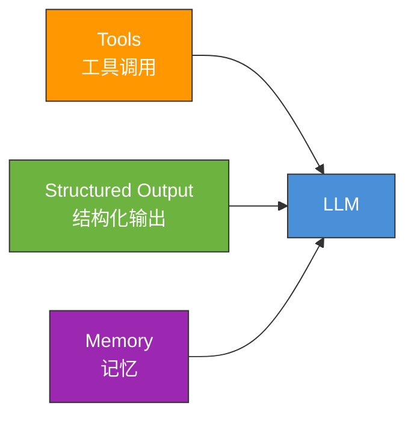
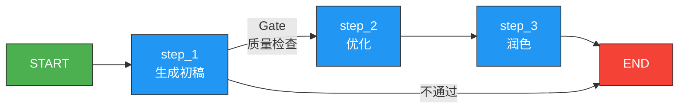
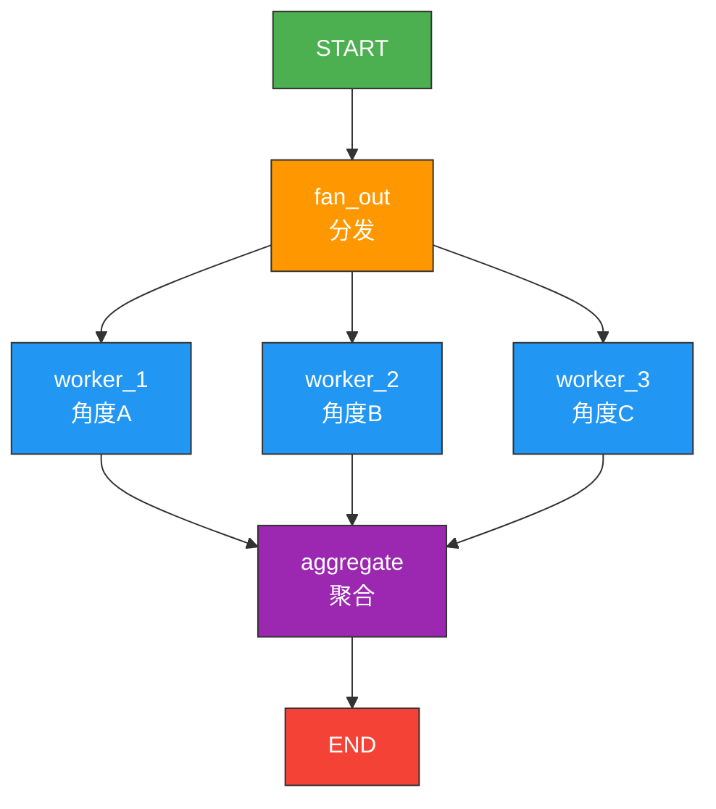
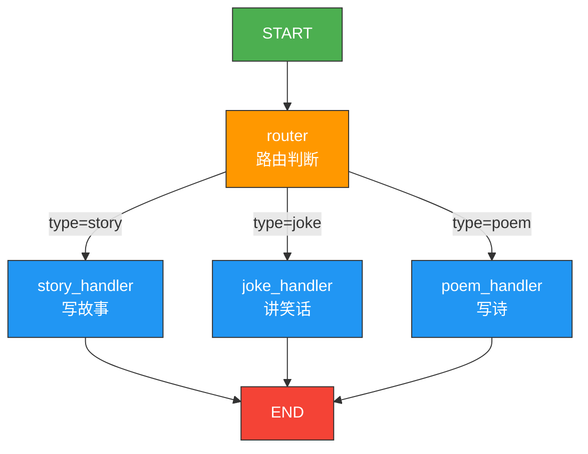
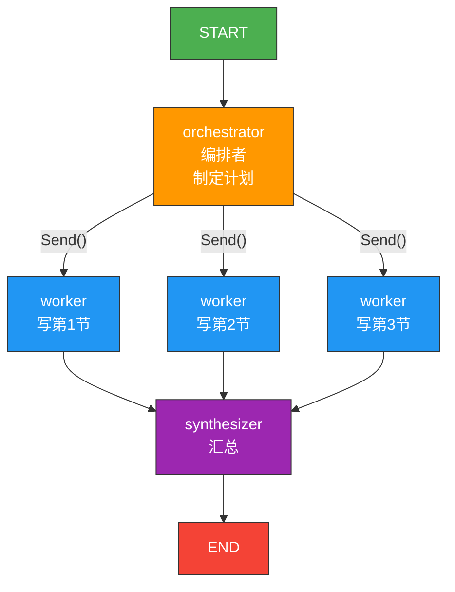
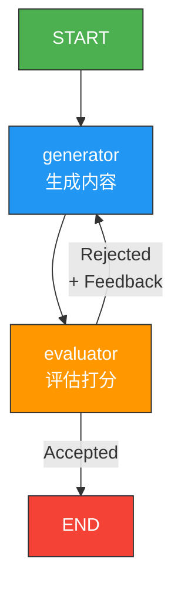
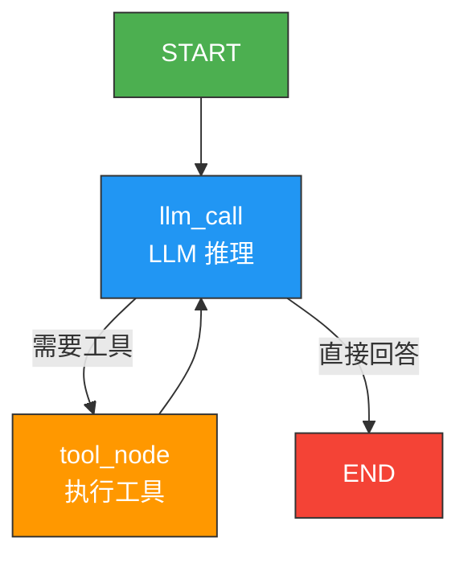
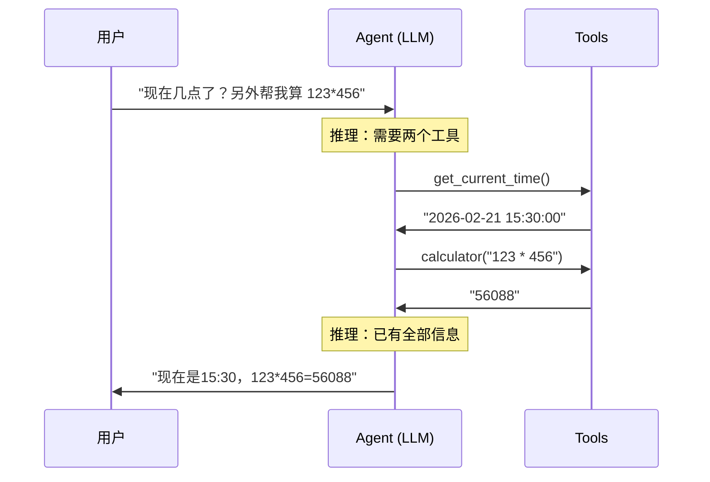
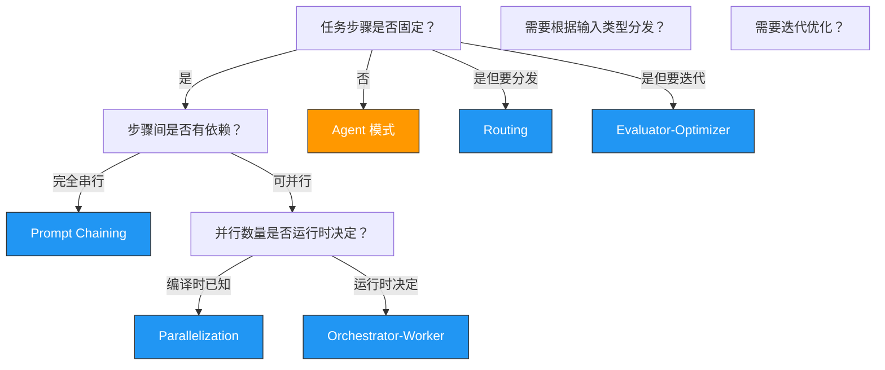

# 工作流与 Agent 模式

> 本页对应官方 "Workflows + Agents" 教程。介绍从简单到复杂的 6 种编排模式，以及完整的 Agent 模式。每种模式都会给出 Mermaid 流程图、代码示例和前端类比。

## 0. 全局预设：模型初始化

以下所有示例共享同一个模型初始化：

```python
from dotenv import load_dotenv
load_dotenv()

from langchain.chat_models import init_chat_model

llm = init_chat_model("gpt-4o-mini")
```

## 1. LLM 增强（Augmented LLM）

在讨论编排模式之前，先理解 LLM 本身可以被"增强"的三种方式。这是所有模式的基础。

### 1.1 工具调用（Tool Calling）

让 LLM 具备调用外部函数的能力：

```python
from langchain.tools import tool


@tool
def search_web(query: str) -> str:
    """搜索网页获取最新信息。"""
    return f"搜索结果: {query} 的相关信息..."


@tool
def get_weather(city: str) -> str:
    """获取指定城市的天气。"""
    return f"{city}: 晴，25度"


# 绑定工具到模型
llm_with_tools = llm.bind_tools([search_web, get_weather])
```

### 1.2 结构化输出（Structured Output）

让 LLM 返回符合 schema 的结构化数据：

```python
from pydantic import BaseModel, Field


class Sentiment(BaseModel):
    score: float = Field(description="情感分数，-1到1")
    label: str = Field(description="情感标签：positive/negative/neutral")
    reason: str = Field(description="判断理由")


# 让模型返回结构化对象
structured_llm = llm.with_structured_output(Sentiment)
result = structured_llm.invoke("今天天气真好，心情愉快！")
print(result.label)   # "positive"
print(result.score)   # 0.9
```

### 1.3 记忆（Memory）

通过 Checkpointer 和 Store 赋予 LLM 短期和长期记忆能力。（详见 [Memory 记忆系统](/ai/langgraph/guide/memory)）



> **前端类比**：LLM 增强就像给一个基础的 HTTP client 添加能力——Tools = axios interceptors（自动调用外部 API）；Structured Output = zod schema validation（确保响应符合类型）；Memory = 请求缓存层（记住之前的交互）。

## 2. 模式一：Prompt Chaining（串联模式）

### 理念

把一个大任务拆成多个小步骤，每步使用一次 LLM 调用，上一步的输出作为下一步的输入。可以在步骤之间加"闸门"做质量检查。

### 流程图



### 代码示例

```python
from typing import TypedDict
from langgraph.graph import StateGraph, START, END


class JokeState(TypedDict):
    topic: str
    joke: str
    improved_joke: str
    final_joke: str


def generate_joke(state: JokeState):
    """第一步：生成初始笑话"""
    msg = llm.invoke(f"用中文写一个关于{state['topic']}的短笑话")
    return {"joke": msg.content}


def check_quality(state: JokeState):
    """闸门：检查笑话是否有梗"""
    if "？" in state["joke"] or "！" in state["joke"]:
        return "Pass"
    return "Fail"


def improve_joke(state: JokeState):
    """第二步：加入文字游戏"""
    msg = llm.invoke(f"让这个笑话更有趣，加入谐音梗：{state['joke']}")
    return {"improved_joke": msg.content}


def polish_joke(state: JokeState):
    """第三步：最终润色"""
    msg = llm.invoke(f"给这个笑话加一个出人意料的反转：{state['improved_joke']}")
    return {"final_joke": msg.content}


# 构建图
builder = StateGraph(JokeState)
builder.add_node("generate", generate_joke)
builder.add_node("improve", improve_joke)
builder.add_node("polish", polish_joke)

builder.add_edge(START, "generate")
builder.add_conditional_edges(
    "generate", check_quality,
    {"Pass": END, "Fail": "improve"}
)
builder.add_edge("improve", "polish")
builder.add_edge("polish", END)

chain = builder.compile()

result = chain.invoke({"topic": "程序员"})
print(result.get("final_joke") or result["joke"])
```

> **前端类比**：Prompt Chaining 类似 **Express.js 中间件链**。每个中间件处理请求后传给下一个，中间可以有条件中断（如 auth 校验不通过直接返回 401）。
>
> **LangGraph 原生语义**：这是最简单的编排模式。每个节点是一次 LLM 调用，`add_conditional_edges` 充当闸门。适合步骤固定、质量有要求的多步生成任务。

### 适用场景

- 多步文本生成（大纲 -> 初稿 -> 润色）
- 带质量校验的数据提取流水线
- 翻译 -> 校对 -> 本地化

---

## 3. 模式二：Parallelization（并行模式）

### 理念

将互不依赖的任务并行执行，然后合并结果。分为两种子模式：
- **Sectioning（分段）**：同一输入，不同处理角度
- **Voting（投票）**：同一任务多次执行，取最佳

### 流程图



### 代码示例

```python
import operator
from typing import Annotated, TypedDict
from langgraph.graph import StateGraph, START, END


class AnalysisState(TypedDict):
    text: str
    analyses: Annotated[list[str], operator.add]  # 并行结果累加
    summary: str


def analyze_sentiment(state: AnalysisState):
    """分析情感"""
    result = llm.invoke(f"分析以下文本的情感倾向：{state['text']}")
    return {"analyses": [f"[情感] {result.content}"]}


def analyze_key_topics(state: AnalysisState):
    """提取关键主题"""
    result = llm.invoke(f"提取以下文本的3个关键主题：{state['text']}")
    return {"analyses": [f"[主题] {result.content}"]}


def analyze_style(state: AnalysisState):
    """分析写作风格"""
    result = llm.invoke(f"分析以下文本的写作风格特点：{state['text']}")
    return {"analyses": [f"[风格] {result.content}"]}


def synthesize(state: AnalysisState):
    """汇总所有分析结果"""
    all_analyses = "\n".join(state["analyses"])
    result = llm.invoke(f"基于以下多维度分析，写一个综合总结：\n{all_analyses}")
    return {"summary": result.content}


# 构建图
builder = StateGraph(AnalysisState)
builder.add_node("sentiment", analyze_sentiment)
builder.add_node("topics", analyze_key_topics)
builder.add_node("style", analyze_style)
builder.add_node("synthesize", synthesize)

# 并行：START 同时连到三个分析节点
builder.add_edge(START, "sentiment")
builder.add_edge(START, "topics")
builder.add_edge(START, "style")

# 三个节点都完成后，汇总
builder.add_edge("sentiment", "synthesize")
builder.add_edge("topics", "synthesize")
builder.add_edge("style", "synthesize")

builder.add_edge("synthesize", END)

parallel_graph = builder.compile()

result = parallel_graph.invoke({"text": "这篇关于AI的文章写得很有深度..."})
print(result["summary"])
```

**关键点**：`Annotated[list[str], operator.add]` 告诉 LangGraph，当多个节点同时更新 `analyses` 字段时，用列表拼接（而非覆盖）。

> **前端类比**：并行模式 = **`Promise.all()`**。你启动多个异步任务，等全部完成后汇总结果。`operator.add` reducer = 把多个 Promise 的结果 `concat` 到一个数组。
>
> **LangGraph 原生语义**：LangGraph 的运行时（Pregel）原生支持并行——当多条边从同一个节点出发时，目标节点会并行执行。`Annotated` + reducer 确保并行更新不会冲突。

### 适用场景

- 多角度分析同一数据
- 投票式质量提升（3 个 LLM 各写一版，选最好的）
- 并行数据采集和汇总

---

## 4. 模式三：Routing（路由模式）

### 理念

根据输入内容的特征，动态选择不同的处理路径。类似"智能分发器"。

### 流程图



### 代码示例

```python
from typing import TypedDict
from typing_extensions import Literal
from pydantic import BaseModel, Field
from langchain.messages import HumanMessage, SystemMessage
from langgraph.graph import StateGraph, START, END


# 用结构化输出做路由决策
class Route(BaseModel):
    step: Literal["poem", "story", "joke"] = Field(
        description="根据用户请求选择处理类型"
    )


router_llm = llm.with_structured_output(Route)


class RouterState(TypedDict):
    input: str
    decision: str
    output: str


def route_input(state: RouterState):
    """路由节点：LLM 判断输入类型"""
    decision = router_llm.invoke([
        SystemMessage(content="根据用户请求，选择 story/joke/poem"),
        HumanMessage(content=state["input"]),
    ])
    return {"decision": decision.step}


def write_story(state: RouterState):
    result = llm.invoke(f"写一个关于以下主题的短故事：{state['input']}")
    return {"output": result.content}


def tell_joke(state: RouterState):
    result = llm.invoke(f"讲一个关于以下主题的笑话：{state['input']}")
    return {"output": result.content}


def write_poem(state: RouterState):
    result = llm.invoke(f"写一首关于以下主题的诗：{state['input']}")
    return {"output": result.content}


def route_decision(state: RouterState):
    """条件边函数：返回目标节点名"""
    return {
        "story": "write_story",
        "joke": "tell_joke",
        "poem": "write_poem",
    }[state["decision"]]


# 构建图
builder = StateGraph(RouterState)
builder.add_node("router", route_input)
builder.add_node("write_story", write_story)
builder.add_node("tell_joke", tell_joke)
builder.add_node("write_poem", write_poem)

builder.add_edge(START, "router")
builder.add_conditional_edges(
    "router", route_decision,
    {"write_story": "write_story", "tell_joke": "tell_joke", "write_poem": "write_poem"}
)
builder.add_edge("write_story", END)
builder.add_edge("tell_joke", END)
builder.add_edge("write_poem", END)

router_graph = builder.compile()

result = router_graph.invoke({"input": "给我讲个关于猫的笑话"})
print(result["output"])
```

> **前端类比**：路由模式 = **React Router / Express Router**。根据请求路径（这里是输入内容的"类型"）分发到不同的 handler。`with_structured_output` = 路由 matcher，确保返回的路由名合法。
>
> **LangGraph 原生语义**：路由模式用 `add_conditional_edges` 实现。条件边函数返回目标节点名，运行时据此跳转。这是 LangGraph 最常用的控制流模式之一。

### 适用场景

- 客服意图识别后分发到不同处理流
- 内容类型分类后走不同生成管线
- 多模型选择（根据任务复杂度选择不同的模型）

---

## 5. 模式四：Orchestrator-Worker（编排者-工人模式）

### 理念

一个"编排者"分析任务并制定计划，然后将子任务分发给多个"工人"并行执行，最后汇总结果。

### 流程图



### 代码示例

```python
import operator
from typing import Annotated, TypedDict
from pydantic import BaseModel, Field
from langchain.messages import HumanMessage, SystemMessage
from langgraph.graph import StateGraph, START, END
from langgraph.types import Send


# 结构化输出：编排者的计划
class Section(BaseModel):
    name: str = Field(description="章节名称")
    description: str = Field(description="章节内容要求")


class ReportPlan(BaseModel):
    sections: list[Section] = Field(description="报告的章节列表")


planner = llm.with_structured_output(ReportPlan)


# 主图状态
class ReportState(TypedDict):
    topic: str
    sections: list[Section]
    completed_sections: Annotated[list[str], operator.add]
    final_report: str


# Worker 状态（子图）
class WorkerState(TypedDict):
    section: Section
    completed_sections: Annotated[list[str], operator.add]


def orchestrator(state: ReportState):
    """编排者：制定报告计划"""
    plan = planner.invoke([
        SystemMessage(content="为报告制定 3-4 个章节的大纲。"),
        HumanMessage(content=f"报告主题：{state['topic']}"),
    ])
    return {"sections": plan.sections}


def worker(state: WorkerState):
    """工人：撰写单个章节"""
    result = llm.invoke([
        SystemMessage(content="根据章节名称和描述撰写内容。使用 Markdown 格式。"),
        HumanMessage(content=f"章节：{state['section'].name}\n要求：{state['section'].description}"),
    ])
    return {"completed_sections": [f"## {state['section'].name}\n\n{result.content}"]}


def synthesizer(state: ReportState):
    """汇总：组合所有章节"""
    report = "\n\n---\n\n".join(state["completed_sections"])
    return {"final_report": f"# {state['topic']}\n\n{report}"}


def assign_workers(state: ReportState):
    """动态分配 worker：每个章节一个 Send"""
    return [Send("worker", {"section": s}) for s in state["sections"]]


# 构建图
builder = StateGraph(ReportState)
builder.add_node("orchestrator", orchestrator)
builder.add_node("worker", worker)
builder.add_node("synthesizer", synthesizer)

builder.add_edge(START, "orchestrator")
builder.add_conditional_edges("orchestrator", assign_workers, ["worker"])
builder.add_edge("worker", "synthesizer")
builder.add_edge("synthesizer", END)

report_graph = builder.compile()

result = report_graph.invoke({"topic": "LLM 在企业中的应用"})
print(result["final_report"])
```

**关键 API：`Send()`**

`Send("worker", {"section": s})` 是 LangGraph 的动态并行 API。它为每个子任务创建一个 worker 实例，并行执行后自动汇聚。

> **前端类比**：Orchestrator-Worker = **Web Worker 模式**。主线程（orchestrator）分析任务，创建多个 Web Worker（worker）并行处理，然后在主线程汇总结果。`Send()` API 类似 `new Worker()` + `postMessage()`。
>
> 也可以类比 **`Promise.all()` + `map()`**：`sections.map(s => fetch(s))` 并行请求，然后 `Promise.all()` 等待全部完成。
>
> **LangGraph 原生语义**：`Send()` 是 LangGraph 处理动态并行的核心 API。与静态并行（多条 `add_edge`）不同，`Send()` 的并行数量在运行时才确定，取决于编排者的输出。

### 适用场景

- 长文档/报告生成（规划 -> 并行写各章节 -> 组合）
- 多源数据采集（确定要查的来源 -> 并行采集 -> 汇总）
- 代码生成（规划模块 -> 并行生成各模块 -> 组装）

---

## 6. 模式五：Evaluator-Optimizer（评估器-优化器模式）

### 理念

一个"生成器"产出内容，一个"评估器"打分并给出改进建议，不通过则迭代优化，直到满足质量标准。

### 流程图



### 代码示例

```python
from typing import TypedDict
from typing_extensions import Literal
from pydantic import BaseModel, Field
from langgraph.graph import StateGraph, START, END


class CopyState(TypedDict):
    topic: str
    copy: str
    feedback: str
    grade: str


class Evaluation(BaseModel):
    grade: Literal["pass", "fail"] = Field(description="文案是否达标")
    feedback: str = Field(description="改进建议")


evaluator_llm = llm.with_structured_output(Evaluation)


def generate_copy(state: CopyState):
    """生成/改进文案"""
    if state.get("feedback"):
        # 有反馈，基于反馈改进
        msg = llm.invoke(
            f"重写以下文案，注意改进建议：\n"
            f"主题：{state['topic']}\n"
            f"当前文案：{state['copy']}\n"
            f"改进建议：{state['feedback']}"
        )
    else:
        # 首次生成
        msg = llm.invoke(f"为以下主题写一段营销文案：{state['topic']}")

    return {"copy": msg.content}


def evaluate_copy(state: CopyState):
    """评估文案质量"""
    result = evaluator_llm.invoke(
        f"评估以下营销文案的质量。考虑吸引力、清晰度、行动号召力。\n文案：{state['copy']}"
    )
    return {"grade": result.grade, "feedback": result.feedback}


def should_retry(state: CopyState):
    """根据评估结果决定是否重试"""
    if state["grade"] == "pass":
        return END
    return "generate"


# 构建图
builder = StateGraph(CopyState)
builder.add_node("generate", generate_copy)
builder.add_node("evaluate", evaluate_copy)

builder.add_edge(START, "generate")
builder.add_edge("generate", "evaluate")
builder.add_conditional_edges(
    "evaluate", should_retry,
    {END: END, "generate": "generate"}
)

optimizer = builder.compile()

result = optimizer.invoke({"topic": "新款智能手表"})
print(result["copy"])
```

> **前端类比**：Evaluator-Optimizer = **ESLint autofix 循环**。代码生成 -> lint 检查 -> 有错误则自动修复 -> 再检查 -> 直到全部通过。也类似 CI pipeline 的"测试不通过就修复后重新提交"。
>
> **LangGraph 原生语义**：这是一个**带循环的图**。`add_conditional_edges` 可以把执行流导回到之前的节点，形成迭代循环。注意要设置最大迭代次数（通过 `recursion_limit` 参数），避免无限循环。

### 注意事项

```python
# 设置递归限制，防止无限循环
result = optimizer.invoke(
    {"topic": "新款智能手表"},
    config={"recursion_limit": 10}  # 最多循环 10 次
)
```

### 适用场景

- 文案生成 + 质量把控
- 代码生成 + 单元测试验证
- 翻译 + 回译质量检查

---

## 7. 模式六：Agent 模式（ReAct 循环）

### 理念

Agent 是最灵活的模式——LLM 自主决定是否调用工具、调用哪个工具、调用几次。这是一个开放的 Reasoning + Acting 循环。

### 与工作流的本质区别

| 维度 | 工作流（Workflow） | Agent |
|------|-------------------|-------|
| **控制流** | 开发者预定义 | LLM 动态决定 |
| **执行路径** | 确定性的 | 不确定的 |
| **循环次数** | 固定或有限 | 取决于任务复杂度 |
| **适用场景** | 流程明确的任务 | 开放域、探索性任务 |

### 流程图



### 代码示例

```python
from langchain.tools import tool
from langgraph.graph import StateGraph, MessagesState, START, END
from langgraph.prebuilt import ToolNode


# 定义多种工具
@tool
def search(query: str) -> str:
    """搜索网页获取信息。"""
    # 模拟搜索
    results = {
        "python": "Python 是一种解释型编程语言",
        "langgraph": "LangGraph 是 LLM 编排框架",
    }
    for key, val in results.items():
        if key in query.lower():
            return val
    return f"未找到 '{query}' 的相关结果"


@tool
def calculator(expression: str) -> str:
    """计算数学表达式。"""
    try:
        return str(eval(expression))
    except Exception as e:
        return f"计算错误: {e}"


@tool
def get_current_time() -> str:
    """获取当前时间。"""
    from datetime import datetime
    return datetime.now().strftime("%Y-%m-%d %H:%M:%S")


tools = [search, calculator, get_current_time]
llm_with_tools = llm.bind_tools(tools)
tool_node = ToolNode(tools)


def agent_call(state: MessagesState):
    """Agent 核心：调用 LLM，让它决定下一步"""
    response = llm_with_tools.invoke(state["messages"])
    return {"messages": [response]}


def should_continue(state: MessagesState):
    """检查是否需要继续工具循环"""
    last = state["messages"][-1]
    if last.tool_calls:
        return "tools"
    return END


# 构建 Agent
builder = StateGraph(MessagesState)
builder.add_node("agent", agent_call)
builder.add_node("tools", tool_node)

builder.add_edge(START, "agent")
builder.add_conditional_edges("agent", should_continue, ["tools", END])
builder.add_edge("tools", "agent")

agent = builder.compile()

# 运行
result = agent.invoke({
    "messages": [
        {"role": "user", "content": "现在几点了？另外帮我算一下 123 * 456"}
    ]
})
print(result["messages"][-1].content)
```

### 执行过程详解



> **前端类比**：Agent 模式类似一个**智能的 API 网关 + 路由器**。不同于预定义的路由规则，Agent 是一个"会思考的路由器"——它根据请求内容自主决定调用哪些后端服务、调用几次、以什么顺序调用。
>
> 更直接的类比：Agent = **浏览器中的 Service Worker**。它拦截所有请求，自主决定从缓存返回、发起网络请求、还是合成响应。
>
> **LangGraph 原生语义**：Agent 模式的核心是 **LLM 驱动的条件循环**。`should_continue` 不是开发者硬编码的规则，而是根据 LLM 的输出（有无 `tool_calls`）动态判断。这使得 Agent 能处理事先未预见的任务组合。

---

## 8. 模式总览对比

| 模式 | 控制流 | 复杂度 | 确定性 | 前端类比 |
|------|--------|--------|--------|----------|
| **Prompt Chaining** | 顺序 + 闸门 | 低 | 高 | 中间件链 |
| **Parallelization** | 扇出-汇聚 | 中 | 高 | `Promise.all()` |
| **Routing** | 条件分发 | 中 | 高 | Router |
| **Orchestrator-Worker** | 动态并行 | 高 | 中 | Web Worker 池 |
| **Evaluator-Optimizer** | 迭代循环 | 中 | 中 | lint autofix |
| **Agent** | LLM 自主 | 最高 | 低 | 智能网关 |

### 如何选择



### 组合使用

在实际项目中，这些模式经常**组合使用**。例如：

- **Routing + Prompt Chaining**：先路由到不同处理流，每个处理流内部是串联模式
- **Orchestrator-Worker + Evaluator**：编排者分发任务给 worker，每个 worker 内部有评估循环
- **Agent + Routing**：Agent 调用工具时，工具内部用路由模式分发

```python
# 示例：Agent 内嵌 Routing
# Agent 的工具之一是一个子图（路由模式）
@tool
def content_creator(request: str) -> str:
    """创建内容：支持故事、笑话、诗歌"""
    result = router_graph.invoke({"input": request})
    return result["output"]
```

## 9. 本页总结

1. **增强 LLM** 是所有模式的基础：工具调用、结构化输出、记忆
2. **6 种模式**覆盖了从简单到复杂的编排需求
3. 模式之间可以**自由组合**，实际项目往往是混合使用
4. 从最简单的模式开始，**按需升级**到更复杂的模式
5. Agent 模式灵活但不可控，工作流模式确定但不灵活——根据场景选择

---

**先修**：
- [快速上手](/ai/langgraph/guide/quickstart) — 已经跑通 Agent
- [LangGraph 思维方式](/ai/langgraph/guide/thinking-in-langgraph) — 理解五步设计法

**下一步**：
- [API 选型指南](/ai/langgraph/guide/choosing-apis) — Graph API vs Functional API 深入对比
- [持久化](/ai/langgraph/guide/persistence) — 让图具备状态恢复能力
- [Streaming 流式处理](/ai/langgraph/guide/streaming) — 实时输出状态和 token

**参考**：
- [Workflows + Agents (Official)](https://langchain-ai.github.io/langgraph/concepts/workflows-agents/)
- [LangGraph Send API](https://langchain-ai.github.io/langgraph/concepts/low_level/#send)
- [LangGraph Prebuilt Components](https://langchain-ai.github.io/langgraph/reference/prebuilt/)
