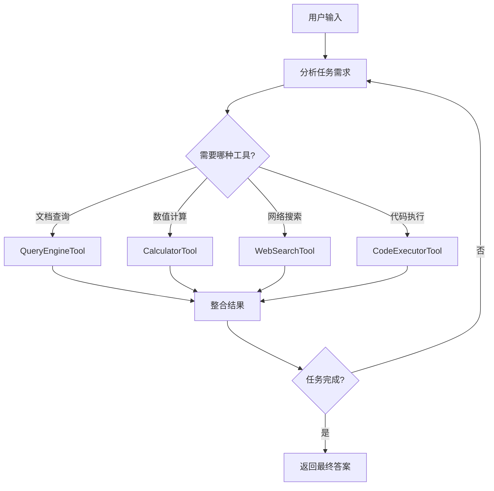
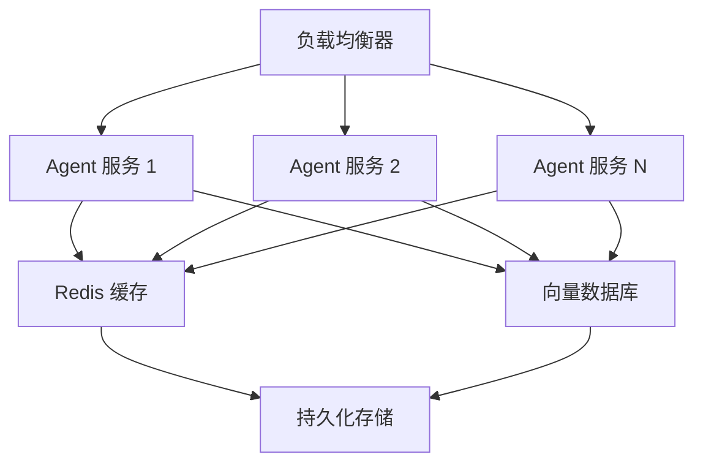

# Agent 进阶

## 概述

本章将深入探讨 LlamaIndex Agent 的高级特性，帮助你构建更复杂、更可靠的智能代理系统。

**学习目标**：
- 掌握多工具 Agent 的设计与实现
- 理解 Agent 的流式输出机制
- 学会使用可观测性工具调试 Agent
- 了解 Agent 与 RAG 的深度集成

## 核心概念

### 多工具协作

当 Agent 配备多个工具时，它需要在每一步决策中选择最合适的工具。这就像一个经验丰富的工匠，面对不同的工作会自动选择合适的工具。

下图展示了多工具 Agent 的决策流程：



**说明**：Agent 会根据任务需求自动选择合适的工具，可能需要多次调用不同工具才能完成复杂任务。

### 工具编排模式

在复杂场景中，工具之间可能存在依赖关系。理解这些模式有助于设计更好的 Agent 系统：

| 模式 | 描述 | 示例 |
|------|------|------|
| 串行调用 | 一个工具的输出作为另一个的输入 | 先查询文档 → 再计算统计数据 |
| 并行调用 | 同时调用多个独立工具 | 同时查询多个数据源 |
| 条件调用 | 根据中间结果决定后续工具 | 如果金额 > 1000，则需要审批 |

## 代码示例

### 示例 1: 复杂多工具 Agent

> 适用版本: LlamaIndex 0.10.x+

```python
from llama_index.core import VectorStoreIndex, SimpleDirectoryReader
from llama_index.core.tools import QueryEngineTool, FunctionTool
from llama_index.core.agent import ReActAgent
from llama_index.llms.openai import OpenAI
import json
from datetime import datetime

# ========== 创建多个 RAG 工具 ==========
# 产品文档
product_docs = SimpleDirectoryReader("./product_docs").load_data()
product_index = VectorStoreIndex.from_documents(product_docs)
product_engine = product_index.as_query_engine(similarity_top_k=3)

product_tool = QueryEngineTool.from_defaults(
    query_engine=product_engine,
    name="product_knowledge",
    description=(
        "查询产品功能、使用方法、技术规格等信息。"
        "适用于回答'产品如何使用'、'功能特性'等问题。"
    ),
)

# 销售数据
sales_docs = SimpleDirectoryReader("./sales_reports").load_data()
sales_index = VectorStoreIndex.from_documents(sales_docs)
sales_engine = sales_index.as_query_engine(similarity_top_k=3)

sales_tool = QueryEngineTool.from_defaults(
    query_engine=sales_engine,
    name="sales_data",
    description=(
        "查询销售报告、业绩数据、市场分析等信息。"
        "适用于回答'销售情况'、'市场表现'等问题。"
    ),
)

# ========== 创建函数工具 ==========
def calculate_growth(current: float, previous: float) -> str:
    """计算增长率。

    Args:
        current: 当前值
        previous: 前一期值

    Returns:
        增长率百分比字符串
    """
    if previous == 0:
        return "无法计算：前一期值为0"
    growth = ((current - previous) / previous) * 100
    return f"{growth:.2f}%"

def get_current_date() -> str:
    """获取当前日期和时间。

    Returns:
        当前日期时间字符串
    """
    return datetime.now().strftime("%Y-%m-%d %H:%M:%S")

def format_report(title: str, content: str) -> str:
    """格式化报告输出。

    Args:
        title: 报告标题
        content: 报告内容

    Returns:
        格式化后的报告
    """
    border = "=" * 50
    return f"\n{border}\n{title}\n{border}\n{content}\n{border}\n"

# 创建函数工具列表
function_tools = [
    FunctionTool.from_defaults(calculate_growth),
    FunctionTool.from_defaults(get_current_date),
    FunctionTool.from_defaults(format_report),
]

# ========== 创建复杂多工具 Agent ==========
all_tools = [product_tool, sales_tool] + function_tools

agent = ReActAgent.from_tools(
    tools=all_tools,
    llm=OpenAI(model="gpt-4o-mini"),
    verbose=True,
    max_iterations=15,
)

# 运行复杂查询
response = agent.chat(
    "请查询一下我们产品的核心功能，然后查看本季度销售数据，"
    "计算与上季度相比的增长率，最后生成一份简要报告。"
)
print(response)
```

**说明**：
1. Agent 会自动规划任务步骤：产品查询 → 销售查询 → 增长计算 → 报告生成
2. 每个工具有明确的职责和描述，帮助 Agent 正确选择
3. `max_iterations=15` 允许更多步骤完成复杂任务

### 示例 2: 流式输出（Streaming）

> 适用版本: LlamaIndex 0.10.x+

```python
from llama_index.core.tools import FunctionTool
from llama_index.core.agent import ReActAgent
from llama_index.llms.openai import OpenAI

# 定义工具
def search_web(query: str) -> str:
    """模拟网络搜索。"""
    return f"关于 '{query}' 的搜索结果：这是一些相关信息..."

tools = [FunctionTool.from_defaults(search_web)]

# 创建 Agent
agent = ReActAgent.from_tools(
    tools=tools,
    llm=OpenAI(model="gpt-4o-mini"),
    verbose=True,
)

# 使用流式输出
print("=== 流式输出演示 ===")
response_stream = agent.stream_chat("请搜索一下 Python 的最新版本是什么？")

# 逐步打印流式响应
for token in response_stream.response_gen:
    print(token, end="", flush=True)

print("\n=== 流式输出结束 ===")
```

**说明**：
1. `stream_chat()` 返回一个流式响应对象
2. 可以通过 `response_gen` 迭代器逐 token 获取输出
3. 流式输出提供更好的用户体验，用户无需等待完整响应

### 示例 3: Agent 可观测性与调试

> 适用版本: LlamaIndex 0.10.x+

```python
from llama_index.core.tools import FunctionTool
from llama_index.core.agent import ReActAgent
from llama_index.llms.openai import OpenAI
from llama_index.core.callbacks import CallbackManager, LlamaDebugHandler
from llama_index.core import Settings
import logging

# ========== 方式 1: 使用 LlamaDebugHandler ==========
# 创建调试处理器
debug_handler = LlamaDebugHandler(print_trace_on_end=True)
callback_manager = CallbackManager([debug_handler])

# 设置全局回调管理器
Settings.callback_manager = callback_manager

# 定义工具
def add(x: int, y: int) -> int:
    """加法运算。"""
    return x + y

tools = [FunctionTool.from_defaults(add)]

# 创建带调试的 Agent
agent = ReActAgent.from_tools(
    tools=tools,
    llm=OpenAI(model="gpt-4o-mini"),
    verbose=True,  # 开启详细日志
    callback_manager=callback_manager,
)

# 运行并查看调试信息
response = agent.chat("计算 123 + 456")

# 获取事件追踪
print("\n=== 事件追踪 ===")
for event in debug_handler.get_event_pairs():
    print(f"事件类型: {event[0].event_type}")
    print(f"持续时间: {event[1].time - event[0].time:.2f}s")
    print("---")

# ========== 方式 2: 自定义日志 ==========
# 配置日志
logging.basicConfig(level=logging.DEBUG)
logger = logging.getLogger("llama_index.agent")
logger.setLevel(logging.DEBUG)

# 现在 Agent 的运行过程会输出详细日志
```

**说明**：
1. `LlamaDebugHandler` 可以记录所有事件，便于分析 Agent 行为
2. `verbose=True` 会在控制台打印思考过程
3. 可以通过 `get_event_pairs()` 获取每个步骤的耗时

### 示例 4: Agent 与 RAG 深度集成

> 适用版本: LlamaIndex 0.10.x+

```python
from llama_index.core import VectorStoreIndex, SimpleDirectoryReader
from llama_index.core.tools import QueryEngineTool, FunctionTool
from llama_index.core.agent import ReActAgent
from llama_index.core.query_engine import SubQuestionQueryEngine
from llama_index.core.tools import ToolMetadata
from llama_index.llms.openai import OpenAI

# ========== 创建多个专业索引 ==========
# 人力资源文档
hr_docs = SimpleDirectoryReader("./hr_docs").load_data()
hr_index = VectorStoreIndex.from_documents(hr_docs)

# 财务文档
finance_docs = SimpleDirectoryReader("./finance_docs").load_data()
finance_index = VectorStoreIndex.from_documents(finance_docs)

# 技术文档
tech_docs = SimpleDirectoryReader("./tech_docs").load_data()
tech_index = VectorStoreIndex.from_documents(tech_docs)

# ========== 创建子问题查询引擎 ==========
# 这个引擎可以将复杂问题分解为子问题，分别查询不同索引
query_engine_tools = [
    QueryEngineTool(
        query_engine=hr_index.as_query_engine(),
        metadata=ToolMetadata(
            name="hr_knowledge",
            description="查询人力资源相关信息，如招聘、培训、绩效等",
        ),
    ),
    QueryEngineTool(
        query_engine=finance_index.as_query_engine(),
        metadata=ToolMetadata(
            name="finance_knowledge",
            description="查询财务相关信息，如预算、报销、审计等",
        ),
    ),
    QueryEngineTool(
        query_engine=tech_index.as_query_engine(),
        metadata=ToolMetadata(
            name="tech_knowledge",
            description="查询技术相关信息，如架构、API、开发规范等",
        ),
    ),
]

# 创建子问题查询引擎
sub_question_engine = SubQuestionQueryEngine.from_defaults(
    query_engine_tools=query_engine_tools,
    llm=OpenAI(model="gpt-4o-mini"),
)

# ========== 将子问题引擎包装为 Agent 工具 ==========
comprehensive_tool = QueryEngineTool.from_defaults(
    query_engine=sub_question_engine,
    name="comprehensive_search",
    description=(
        "综合查询公司所有知识库，包括人力资源、财务、技术文档。"
        "适用于需要跨领域整合信息的复杂问题。"
        "会自动将问题分解为子问题并整合答案。"
    ),
)

# ========== 创建 Agent ==========
def summarize(text: str, max_words: int = 100) -> str:
    """将文本总结为指定字数。"""
    words = text.split()
    if len(words) <= max_words:
        return text
    return " ".join(words[:max_words]) + "..."

agent = ReActAgent.from_tools(
    tools=[comprehensive_tool, FunctionTool.from_defaults(summarize)],
    llm=OpenAI(model="gpt-4o-mini"),
    verbose=True,
    max_iterations=10,
)

# 运行跨领域查询
response = agent.chat(
    "我想了解：1) 新员工入职流程 2) 新员工的IT设备申请流程 3) 预算审批流程。"
    "请整合这些信息给我一个完整的新员工指南摘要。"
)
print(response)
```

**说明**：
1. `SubQuestionQueryEngine` 可以自动将复杂问题分解为子问题
2. 每个子问题会被路由到最相关的索引进行查询
3. 最终结果会被整合成一个完整的答案
4. Agent 可以进一步对结果进行后处理（如总结）

### 示例 5: 对话记忆与上下文管理

> 适用版本: LlamaIndex 0.10.x+

```python
from llama_index.core.tools import FunctionTool
from llama_index.core.agent import ReActAgent
from llama_index.core.memory import ChatMemoryBuffer
from llama_index.llms.openai import OpenAI

# 定义工具
def get_user_info(user_id: str) -> str:
    """获取用户信息。"""
    users = {
        "001": "张三，VIP用户，累计消费10000元",
        "002": "李四，普通用户，累计消费500元",
    }
    return users.get(user_id, "未找到用户")

tools = [FunctionTool.from_defaults(get_user_info)]

# 创建带记忆的 Agent
memory = ChatMemoryBuffer.from_defaults(
    token_limit=3000,  # 限制记忆的 token 数量
)

agent = ReActAgent.from_tools(
    tools=tools,
    llm=OpenAI(model="gpt-4o-mini"),
    memory=memory,
    verbose=True,
)

# 多轮对话演示
print("=== 第一轮对话 ===")
response1 = agent.chat("请查询用户 001 的信息")
print(f"回复: {response1}\n")

print("=== 第二轮对话 ===")
response2 = agent.chat("这个用户是VIP吗？")  # Agent 会记住上下文
print(f"回复: {response2}\n")

print("=== 第三轮对话 ===")
response3 = agent.chat("和用户 002 比较一下消费情况")  # 引用之前的信息
print(f"回复: {response3}\n")

# 查看对话历史
print("=== 对话历史 ===")
for msg in memory.get_all():
    print(f"[{msg.role}]: {msg.content[:100]}...")
```

**说明**：
1. `ChatMemoryBuffer` 用于管理对话历史
2. `token_limit` 限制记忆大小，避免上下文过长
3. Agent 可以引用之前对话中的信息，实现连续对话

## 避坑指南

### ❌ 多工具冲突与选择混乱

**现象**: Agent 在多个功能相似的工具之间反复切换，或选择了错误的工具。

**根因**: 工具描述存在重叠，Agent 无法明确区分使用场景。

**解决方案**:
```python
# ❌ 错误：描述重叠
tool1 = QueryEngineTool.from_defaults(
    query_engine=engine1,
    name="docs1",
    description="查询公司文档",
)
tool2 = QueryEngineTool.from_defaults(
    query_engine=engine2,
    name="docs2",
    description="搜索公司资料",
)

# ✅ 正确：描述明确区分
hr_tool = QueryEngineTool.from_defaults(
    query_engine=hr_engine,
    name="hr_policies",
    description=(
        "专门查询人力资源相关文档。"
        "包括：请假政策、薪酬福利、晋升流程、绩效考核。"
        "不适用于：技术问题、财务问题。"
    ),
)
tech_tool = QueryEngineTool.from_defaults(
    query_engine=tech_engine,
    name="tech_docs",
    description=(
        "专门查询技术文档。"
        "包括：API文档、架构设计、开发规范、部署指南。"
        "不适用于：人事问题、财务问题。"
    ),
)
```

**预防措施**: 每个工具的 description 应该包含"适用于"和"不适用于"两部分。

### ❌ 流式输出中断

**现象**: 流式输出在中途停止，没有完整的响应。

**根因**: 网络超时、API 限流、或客户端提前断开连接。

**解决方案**:
```python
import time

def stream_with_retry(agent, query, max_retries=3):
    """带重试的流式输出。"""
    for attempt in range(max_retries):
        try:
            response_stream = agent.stream_chat(query)
            full_response = ""
            for token in response_stream.response_gen:
                full_response += token
                print(token, end="", flush=True)
            return full_response
        except Exception as e:
            print(f"\n重试 {attempt + 1}/{max_retries}: {e}")
            time.sleep(2 ** attempt)  # 指数退避
    raise Exception("流式输出失败，已达最大重试次数")

# 使用带重试的流式输出
result = stream_with_retry(agent, "你的问题")
```

**预防措施**: 实现重试机制和超时处理，确保流式输出的稳定性。

### ❌ 对话历史导致的上下文污染

**现象**: Agent 在长对话中混淆了不同话题，或引用了不相关的历史信息。

**根因**: 对话历史过长，包含了太多无关信息。

**解决方案**:
```python
from llama_index.core.memory import ChatMemoryBuffer

# ✅ 使用有限的记忆窗口
memory = ChatMemoryBuffer.from_defaults(
    token_limit=2000,  # 较小的 token 限制
)

# ✅ 在需要时重置记忆
def start_new_topic(agent):
    """开始新话题时重置记忆。"""
    agent.memory.reset()
    print("对话历史已清空，开始新话题")

# ✅ 选择性保留关键信息
def summarize_and_reset(agent):
    """总结历史并重置。"""
    history = agent.memory.get_all()
    # 可以让 LLM 总结关键信息
    summary = summarize_history(history)
    agent.memory.reset()
    agent.memory.put({"role": "system", "content": f"之前的对话摘要：{summary}"})
```

**预防措施**: 定期清理或总结对话历史，避免无关信息累积。

## 生产最佳实践

### Agent 监控指标

**场景**: 监控生产环境中 Agent 的运行状态

**推荐做法**:

| 指标 | 描述 | 告警阈值 |
|------|------|----------|
| 平均响应时间 | 从收到请求到返回结果的时间 | > 30s |
| 工具调用次数 | 每次请求的平均工具调用次数 | > 10 次/请求 |
| 错误率 | 请求失败的比例 | > 5% |
| Token 消耗 | 每次请求的平均 Token 消耗 | > 10000 |
| 循环检测 | 连续调用相同工具的次数 | > 3 次 |

### 成本控制策略

**场景**: 控制 Agent 的 API 调用成本

**推荐做法**:

```python
from llama_index.core.agent import ReActAgent
from llama_index.llms.openai import OpenAI

# ✅ 使用更经济的模型
llm = OpenAI(
    model="gpt-4o-mini",  # 比 gpt-4 便宜得多
    temperature=0,  # 降低随机性，减少无效重试
)

# ✅ 限制迭代次数
agent = ReActAgent.from_tools(
    tools=tools,
    llm=llm,
    max_iterations=8,  # 限制最大步骤
)

# ✅ 缓存常见查询结果
from functools import lru_cache

@lru_cache(maxsize=100)
def cached_search(query: str) -> str:
    """缓存搜索结果。"""
    return do_actual_search(query)

# ✅ 批量处理请求
def batch_process(queries: list) -> list:
    """批量处理多个查询。"""
    results = []
    for query in queries:
        results.append(agent.chat(query))
    return results
```

| 策略 | 节省幅度 | 适用场景 |
|------|----------|----------|
| 使用 gpt-4o-mini | ~90% | 大多数任务 |
| 限制迭代次数 | ~30% | 简单任务 |
| 结果缓存 | ~50% | 重复查询多 |
| 批量处理 | ~20% | 并发请求 |

### 高可用架构

**场景**: 确保 Agent 服务的稳定性



**推荐做法**:

1. **水平扩展**: 部署多个 Agent 实例，通过负载均衡分发请求
2. **缓存层**: 使用 Redis 缓存常见查询结果和会话状态
3. **降级策略**: 当 Agent 不可用时，回退到简单的 RAG 查询
4. **熔断机制**: 当错误率过高时，暂时停止服务并快速恢复

## 小结

本章介绍了 LlamaIndex Agent 的高级特性：

1. **多工具协作**: 组合多种工具完成复杂任务
2. **流式输出**: 提供更好的用户体验
3. **可观测性**: 调试和追踪 Agent 行为
4. **RAG 集成**: 让 Agent 具备知识查询能力
5. **对话记忆**: 实现连续多轮对话

## 下一步

- [生产部署](/ai/llamaindex/guide/production) - 学习如何将 Agent 部署到生产环境
