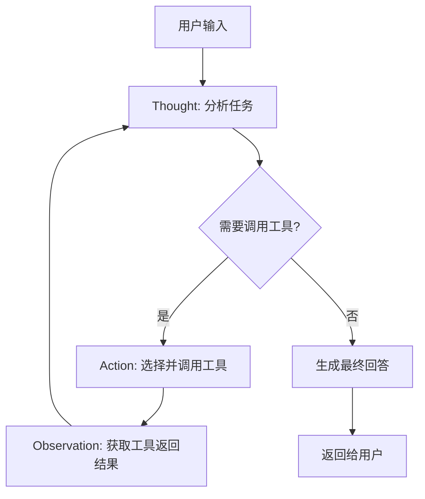

# Agent 基础

## 概述

本章将介绍 LlamaIndex 的 Agent 模式，帮助你理解如何构建能够自主思考、调用工具、执行多步骤任务的智能代理系统。

**学习目标**：
- 理解 Agent 和 ReAct 模式的核心概念
- 掌握 FunctionTool 和 QueryEngineTool 的使用
- 能够构建一个基本的 ReAct Agent

## 核心概念

### 什么是 Agent？

[🔗 LlamaIndex Agent 官方文档](https://docs.llamaindex.ai/en/stable/module_guides/deploying/agents/){target="_blank" rel="noopener"}

**Agent**（智能代理）就像一个**能自主思考和行动的 AI 助手**。

想象你有一个聪明的私人助理：当你说"帮我查一下明天北京的天气，然后推荐合适的穿搭"，这个助理会：
1. 先去查天气（调用天气 API）
2. 根据天气结果，思考适合的穿搭
3. 给你一个综合性的建议

这就是 Agent 的工作方式 —— 它不只是简单地回答问题，而是能够**分析任务、规划步骤、调用工具、整合结果**。

### 什么是 ReAct？

**ReAct**（Reasoning + Acting）就像一个**"思考-行动-观察"的循环**。

就像你解决一道数学应用题：
1. **Thought（思考）**：这道题需要先算什么？
2. **Action（行动）**：执行计算
3. **Observation（观察）**：看看结果对不对
4. **重复**：根据结果决定下一步

下图展示了 ReAct Agent 的工作流程：



**说明**：Agent 在每个循环中先思考（Thought），决定是否需要调用工具（Action），然后观察结果（Observation），直到能够给出最终答案。

### 什么是 Tool？

[🔗 Tool 抽象与内置工具](https://docs.llamaindex.ai/en/stable/module_guides/deploying/agents/tools/){target="_blank" rel="noopener"}

**Tool**（工具）就像**Agent 工具箱里的工具**。

就像装修房子需要锤子、螺丝刀、电钻一样，Agent 也需要各种"工具"来完成任务：
- **FunctionTool**：自定义函数工具（如计算器、天气查询）
- **QueryEngineTool**：RAG 查询工具（让 Agent 能够查询你的私有文档）

## 代码示例

### 示例 1: 创建简单的 FunctionTool

> 适用版本: LlamaIndex 0.10.x+

```python
from llama_index.core.tools import FunctionTool
from llama_index.core.agent import ReActAgent
from llama_index.llms.openai import OpenAI

# 定义一个简单的加法函数
def add(x: int, y: int) -> int:
    """将两个数字相加并返回结果。

    Args:
        x: 第一个数字
        y: 第二个数字

    Returns:
        两个数字的和
    """
    return x + y

# 定义一个乘法函数
def multiply(x: int, y: int) -> int:
    """将两个数字相乘并返回结果。

    Args:
        x: 第一个数字
        y: 第二个数字

    Returns:
        两个数字的乘积
    """
    return x * y

# 将函数包装成工具
tools = [
    FunctionTool.from_defaults(add),
    FunctionTool.from_defaults(multiply),
]

# 创建 ReAct Agent
agent = ReActAgent.from_tools(
    tools=tools,
    llm=OpenAI(model="gpt-4o-mini"),
    verbose=True,  # 开启详细日志，可以看到思考过程
)

# 运行 Agent
response = agent.chat("计算 (3 + 5) * 2 等于多少？")
print(response)
```

**说明**：
1. 函数的 **docstring 非常重要**，Agent 会根据它来理解工具的用途
2. `verbose=True` 可以让你看到 Agent 的思考过程，便于调试
3. Agent 会自动分析问题，先调用 `add(3, 5)` 得到 8，再调用 `multiply(8, 2)` 得到 16

### 示例 2: 创建 QueryEngineTool（RAG 工具）

> 适用版本: LlamaIndex 0.10.x+

```python
from llama_index.core import VectorStoreIndex, SimpleDirectoryReader
from llama_index.core.tools import QueryEngineTool
from llama_index.core.agent import ReActAgent
from llama_index.llms.openai import OpenAI

# 加载文档并创建索引
documents = SimpleDirectoryReader("./company_docs").load_data()
index = VectorStoreIndex.from_documents(documents)

# 创建查询引擎
query_engine = index.as_query_engine(similarity_top_k=3)

# 将查询引擎包装成工具
doc_tool = QueryEngineTool.from_defaults(
    query_engine=query_engine,
    name="company_knowledge",  # 工具名称
    description="查询公司内部文档，包括政策、流程、规章制度等信息。当用户询问公司相关问题时使用此工具。",
)

# 创建带有 RAG 能力的 Agent
agent = ReActAgent.from_tools(
    tools=[doc_tool],
    llm=OpenAI(model="gpt-4o-mini"),
    verbose=True,
)

# 运行 Agent
response = agent.chat("公司的年假政策是什么？")
print(response)
```

**说明**：
1. `name` 参数用于给工具命名，Agent 会在日志中显示
2. `description` 非常关键，它告诉 Agent **何时**应该使用这个工具
3. Agent 会根据用户问题，自动判断是否需要调用 RAG 工具

### 示例 3: 组合多种工具

> 适用版本: LlamaIndex 0.10.x+

```python
from llama_index.core import VectorStoreIndex, SimpleDirectoryReader
from llama_index.core.tools import QueryEngineTool, FunctionTool
from llama_index.core.agent import ReActAgent
from llama_index.llms.openai import OpenAI

# ========== 创建 RAG 工具 ==========
# 技术文档
tech_docs = SimpleDirectoryReader("./tech_docs").load_data()
tech_index = VectorStoreIndex.from_documents(tech_docs)
tech_engine = tech_index.as_query_engine(similarity_top_k=3)

tech_tool = QueryEngineTool.from_defaults(
    query_engine=tech_engine,
    name="technical_docs",
    description="查询技术文档和 API 参考资料。当用户询问技术实现、API 使用方法时调用。",
)

# ========== 创建函数工具 ==========
def calculate(expression: str) -> str:
    """计算数学表达式并返回结果。

    Args:
        expression: 数学表达式字符串，如 '2 + 3 * 4'

    Returns:
        计算结果的字符串表示
    """
    try:
        # 安全地计算表达式
        result = eval(expression, {"__builtins__": {}}, {})
        return str(result)
    except Exception as e:
        return f"计算错误: {e}"

calculator_tool = FunctionTool.from_defaults(
    fn=calculate,
    name="calculator",
    description="计算数学表达式。当需要进行数值计算时使用。",
)

# ========== 创建多工具 Agent ==========
agent = ReActAgent.from_tools(
    tools=[tech_tool, calculator_tool],
    llm=OpenAI(model="gpt-4o-mini"),
    verbose=True,
    max_iterations=10,  # 最大迭代次数，防止无限循环
)

# 运行 Agent
response = agent.chat(
    "根据技术文档，如果每个 API 请求的平均响应时间是 200ms，"
    "那么处理 1000 个请求需要多少秒？"
)
print(response)
```

**说明**：
1. Agent 会先查询技术文档获取响应时间信息
2. 然后调用计算器工具进行数学计算
3. `max_iterations` 设置最大迭代次数，防止 Agent 陷入无限循环

### 示例 4: 异步运行 Agent

> 适用版本: LlamaIndex 0.10.x+

```python
import asyncio
from llama_index.core.tools import FunctionTool
from llama_index.core.agent import ReActAgent
from llama_index.llms.openai import OpenAI

# 定义工具函数
def get_weather(city: str) -> str:
    """获取指定城市的天气信息。

    Args:
        city: 城市名称

    Returns:
        天气信息字符串
    """
    # 这里模拟天气 API 返回
    weather_data = {
        "北京": "晴天，气温 25°C",
        "上海": "多云，气温 28°C",
        "广州": "小雨，气温 30°C",
    }
    return weather_data.get(city, f"未找到 {city} 的天气信息")

# 创建工具和 Agent
tools = [FunctionTool.from_defaults(get_weather)]
agent = ReActAgent.from_tools(
    tools=tools,
    llm=OpenAI(model="gpt-4o-mini"),
    verbose=True,
)

# 异步运行
async def main():
    response = await agent.achat("北京今天天气怎么样？适合户外活动吗？")
    print(response)

# 运行异步函数
asyncio.run(main())
```

**说明**：
1. 使用 `achat()` 方法进行异步调用
2. 异步模式适合需要并发处理多个请求的场景
3. 在 Jupyter Notebook 中，可以直接使用 `await agent.achat(...)`

## 避坑指南

### ❌ 工具参数类型错误

**现象**:
```
Error: Tool execution failed - invalid argument type
```

**根因**: 工具函数的参数类型注解与实际传入的值类型不匹配。LLM 生成的参数可能是字符串，但函数期望整数。

**解决方案**:
```python
# ❌ 错误：没有类型转换
def add(x: int, y: int) -> int:
    return x + y

# ✅ 正确：添加类型转换和异常处理
def add(x: int, y: int) -> int:
    """将两个数字相加。"""
    try:
        return int(x) + int(y)
    except ValueError as e:
        raise ValueError(f"参数必须是数字: {e}")
```

**预防措施**: 在工具函数中添加类型转换和输入验证，增强鲁棒性。

### ❌ Agent 陷入无限循环

**现象**: Agent 不断重复调用同一个工具，永远无法给出最终答案。

**根因**:
1. 工具的 description 描述不够清晰
2. 任务过于复杂或模糊
3. 没有设置 `max_iterations` 限制

**解决方案**:
```python
# ✅ 设置最大迭代次数
agent = ReActAgent.from_tools(
    tools=tools,
    llm=OpenAI(model="gpt-4o-mini"),
    max_iterations=10,  # 限制最大迭代次数
    verbose=True,
)

# ✅ 优化工具描述，明确使用场景
doc_tool = QueryEngineTool.from_defaults(
    query_engine=query_engine,
    name="company_docs",
    description=(
        "仅用于查询公司内部文档。"
        "输入应该是一个清晰的问题。"
        "如果文档中没有相关信息，返回'未找到相关信息'。"
    ),
)
```

**预防措施**: 始终设置 `max_iterations`，并编写清晰、具体的工具描述。

### ❌ Token 超限导致请求失败

**现象**:
```
Error: This model's maximum context length is 128000 tokens
```

**根因**: Agent 的对话历史过长，或者工具返回的内容过多，超出了模型的上下文窗口限制。

**解决方案**:
```python
from llama_index.core.memory import ChatMemoryBuffer

# ✅ 限制对话历史长度
memory = ChatMemoryBuffer.from_defaults(token_limit=4000)

agent = ReActAgent.from_tools(
    tools=tools,
    llm=OpenAI(model="gpt-4o-mini"),
    memory=memory,  # 使用有限的记忆
    verbose=True,
)

# ✅ 在工具函数中限制返回内容长度
def search_docs(query: str) -> str:
    """搜索文档。"""
    result = do_search(query)
    # 截断过长的结果
    if len(result) > 2000:
        result = result[:2000] + "...(结果已截断)"
    return result
```

**预防措施**: 使用 `ChatMemoryBuffer` 限制记忆长度，并在工具函数中控制返回内容的大小。

### ❌ 工具描述不当导致选择错误

**现象**: Agent 总是选择错误的工具，或者明明应该使用工具却不使用。

**根因**: 工具的 `description` 写得不够清晰，Agent 无法正确判断何时使用。

**解决方案**:
```python
# ❌ 错误：描述太简单
doc_tool = QueryEngineTool.from_defaults(
    query_engine=query_engine,
    name="docs",
    description="查询文档",  # 太模糊
)

# ✅ 正确：描述详细且明确
doc_tool = QueryEngineTool.from_defaults(
    query_engine=query_engine,
    name="company_policy_docs",
    description=(
        "用于查询公司的政策和规章制度文档。"
        "可以回答关于请假政策、报销流程、绩效考核等问题。"
        "不适用于技术问题或产品文档查询。"
    ),
)
```

**预防措施**: 工具描述应该包含：用途、适用场景、不适用场景。

## 生产最佳实践

### 工具设计原则

**场景**: 设计可靠、可维护的 Agent 工具系统

**推荐做法**:

| 原则 | 说明 | 示例 |
|------|------|------|
| 单一职责 | 每个工具只做一件事 | 分离"查询"和"计算"工具 |
| 清晰描述 | 描述包含用途、输入、输出 | "计算数学表达式，输入如 '2+3'，返回结果数字" |
| 错误处理 | 工具内部捕获异常 | try-except 包装，返回友好错误信息 |
| 输入验证 | 验证参数类型和范围 | 检查数字是否在合理范围内 |
| 限制输出 | 控制返回内容大小 | 截断超过 2000 字符的结果 |

### Agent 配置建议

**场景**: 生产环境中的 Agent 配置

**推荐做法**:

| 参数 | 推荐值 | 说明 |
|------|--------|------|
| max_iterations | 10-15 | 防止无限循环，根据任务复杂度调整 |
| timeout | 120 | 设置超时时间（秒） |
| verbose | False (生产) | 生产环境关闭详细日志 |
| token_limit | 4000-8000 | 根据模型上下文窗口设置 |

**权衡**: `max_iterations` 设置过低可能导致复杂任务无法完成，设置过高可能浪费 Token 和时间。建议根据实际任务复杂度进行调整。

## 小结

本章介绍了 LlamaIndex Agent 的基础知识：

1. **Agent** 是能自主思考和行动的 AI 助手
2. **ReAct** 是一种"思考-行动-观察"的推理模式
3. **FunctionTool** 用于包装自定义函数
4. **QueryEngineTool** 让 Agent 具备 RAG 能力
5. 合理的工具描述和参数设置是 Agent 稳定运行的关键

## 下一步

- [Agent 进阶](/ai/llamaindex/guide/agent-advanced) - 学习多工具协作、流式输出、可观测性
