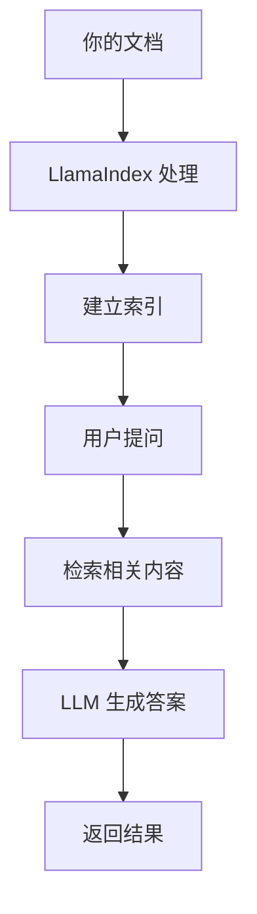

# 环境搭建

## 概述

本章将帮助你从零开始搭建 LlamaIndex 开发环境。完成本章后，你将能够：

- 安装并配置 Python 环境
- 安装 LlamaIndex 及其依赖
- 配置 OpenAI API Key
- 运行第一个验证程序

## 前置要求

在开始之前，请确保你具备以下条件：

| 要求 | 说明 |
|------|------|
| Python 3.8+ | 推荐 Python 3.10 或 3.11 |
| pip 或 uv | Python 包管理器 |
| OpenAI API Key | 用于调用 LLM（也可使用本地模型替代） |

## 核心概念

### 什么是 LlamaIndex？

**LlamaIndex** 就像一个**智能图书管理员**。当你有大量文档（书籍、PDF、网页）时，图书管理员会：

1. **整理归档**：将文档切分成小段落并建立索引
2. **快速检索**：根据你的问题找到最相关的内容
3. **智能回答**：将找到的内容交给 AI 生成最终答案

这个过程就是 **RAG（检索增强生成）**，我们将在下一章详细介绍。



**图表说明**: LlamaIndex 负责文档处理、索引构建和检索，最终由 LLM 生成答案。

## 安装步骤

### 步骤 1: 创建虚拟环境

> 适用版本: Python 3.8+

```python
# 使用 venv 创建虚拟环境（推荐）
python -m venv .venv

# Windows 激活
.venv\Scripts\activate

# macOS/Linux 激活
source .venv/bin/activate
```

**说明**: 虚拟环境可以隔离项目依赖，避免与系统 Python 冲突。

### 步骤 2: 安装 LlamaIndex

> 适用版本: LlamaIndex 0.10.x+

```python
# 安装核心包和 OpenAI 集成
pip install llama-index llama-index-llms-openai llama-index-embeddings-openai

# 或使用 uv（更快）
uv pip install llama-index llama-index-llms-openai llama-index-embeddings-openai
```

**说明**: LlamaIndex 0.10+ 采用模块化设计，需要单独安装 LLM 和 Embedding 集成包。

### 步骤 3: 配置 API Key

> 适用版本: LlamaIndex 0.10.x+

```python
# 方法 1: 设置环境变量（推荐）
# Windows PowerShell
$env:OPENAI_API_KEY="sk-your-api-key-here"

# Windows CMD
set OPENAI_API_KEY=sk-your-api-key-here

# macOS/Linux
export OPENAI_API_KEY="sk-your-api-key-here"

# 方法 2: 在代码中设置
import os
os.environ["OPENAI_API_KEY"] = "sk-your-api-key-here"
```

**说明**: 推荐使用环境变量，避免将 API Key 硬编码在代码中。

### 步骤 4: 验证安装

> 适用版本: LlamaIndex 0.10.x+

```python
# 验证安装是否成功
from llama_index.core import VectorStoreIndex, Document
from llama_index.llms.openai import OpenAI

# 创建一个简单的测试文档
documents = [Document(text="LlamaIndex 是一个用于构建 RAG 应用的框架。")]

# 创建索引
index = VectorStoreIndex.from_documents(documents)

# 创建查询引擎
query_engine = index.as_query_engine()

# 执行查询
response = query_engine.query("LlamaIndex 是什么？")
print(response)
```

**预期输出**:

```
LlamaIndex 是一个用于构建 RAG 应用的框架。
```

## 本地模型替代方案

如果你无法访问 OpenAI API，可以使用 Ollama 运行本地模型：

### 安装 Ollama

> 适用版本: Ollama 0.1.x+

```bash
# macOS/Linux
curl -fsSL https://ollama.com/install.sh | sh

# Windows: 从 https://ollama.com/download 下载安装包

# 下载模型
ollama pull llama3.2
ollama pull nomic-embed-text
```

### 配置 LlamaIndex 使用 Ollama

> 适用版本: LlamaIndex 0.10.x+

```python
# 安装 Ollama 集成包
pip install llama-index-llms-ollama llama-index-embeddings-ollama

# 配置使用本地模型
from llama_index.core import Settings
from llama_index.llms.ollama import Ollama
from llama_index.embeddings.ollama import OllamaEmbedding

# 设置 LLM
Settings.llm = Ollama(model="llama3.2", request_timeout=120.0)

# 设置 Embedding 模型
Settings.embed_model = OllamaEmbedding(model_name="nomic-embed-text")
```

**说明**: Ollama 提供完全本地化的 LLM 体验，无需网络连接和 API 费用。

## 避坑指南

### ❌ 常见问题 1: Python 版本不兼容

**现象**:

```
ERROR: Package 'llama-index' requires Python >=3.8
```

**根因**: 系统 Python 版本过低。

**解决方案**:

```bash
# 检查 Python 版本
python --version

# 如果版本低于 3.8，请安装新版本
# 推荐使用 pyenv 管理多个 Python 版本
```

**预防措施**: 始终使用 Python 3.10 或 3.11，这是目前兼容性最好的版本。

### ❌ 常见问题 2: 依赖冲突

**现象**:

```
ERROR: Cannot install llama-index because these package versions have conflicting dependencies
```

**根因**: 虚拟环境中存在版本冲突的包。

**解决方案**:

```bash
# 创建全新的虚拟环境
python -m venv .venv-new
source .venv-new/bin/activate  # 或 Windows: .venv-new\Scripts\activate

# 重新安装
pip install llama-index llama-index-llms-openai
```

**预防措施**: 每个项目使用独立的虚拟环境。

### ❌ 常见问题 3: API Key 无效

**现象**:

```
openai.AuthenticationError: Incorrect API key provided
```

**根因**: API Key 格式错误或已过期。

**解决方案**:

```python
# 验证 API Key 格式
import os
api_key = os.environ.get("OPENAI_API_KEY", "")
print(f"API Key 长度: {len(api_key)}")
print(f"API Key 前缀: {api_key[:7] if len(api_key) > 7 else 'N/A'}")

# 正确的 API Key 应该以 'sk-' 开头
```

**预防措施**: 从 OpenAI 官网重新生成 API Key，确保复制完整。

### ❌ 常见问题 4: 网络连接问题

**现象**:

```
openai.APIConnectionError: Connection error
```

**根因**: 网络无法访问 OpenAI API。

**解决方案**:

```python
# 方法 1: 配置代理
import os
os.environ["HTTP_PROXY"] = "http://127.0.0.1:7890"
os.environ["HTTPS_PROXY"] = "http://127.0.0.1:7890"

# 方法 2: 使用 Ollama 本地模型（见上文）
```

**预防措施**: 准备好本地模型作为备选方案。

## 生产最佳实践

### 环境配置

| 配置项 | 推荐值 | 说明 |
|--------|--------|------|
| Python 版本 | 3.10 或 3.11 | 最佳兼容性 |
| 虚拟环境 | venv 或 uv | 隔离项目依赖 |
| 依赖锁定 | requirements.txt 或 pyproject.toml | 确保可复现性 |

### 依赖管理

```bash
# 导出依赖（锁定版本）
pip freeze > requirements.txt

# 或使用 uv（推荐）
uv pip compile pyproject.toml -o requirements.txt
```

## 小结

本章我们完成了：

1. ✅ 创建 Python 虚拟环境
2. ✅ 安装 LlamaIndex 核心包
3. ✅ 配置 OpenAI API Key
4. ✅ 运行验证程序
5. ✅ 了解本地模型替代方案

## 下一步

现在你的环境已经准备就绪，让我们开始学习 [RAG 基础概念](/ai/llamaindex/guide/rag-basics)，理解 LlamaIndex 的核心工作原理。
