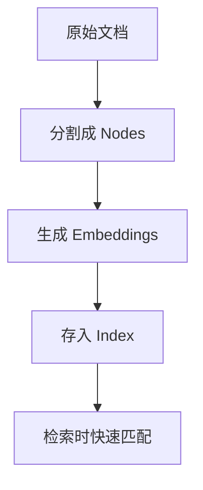
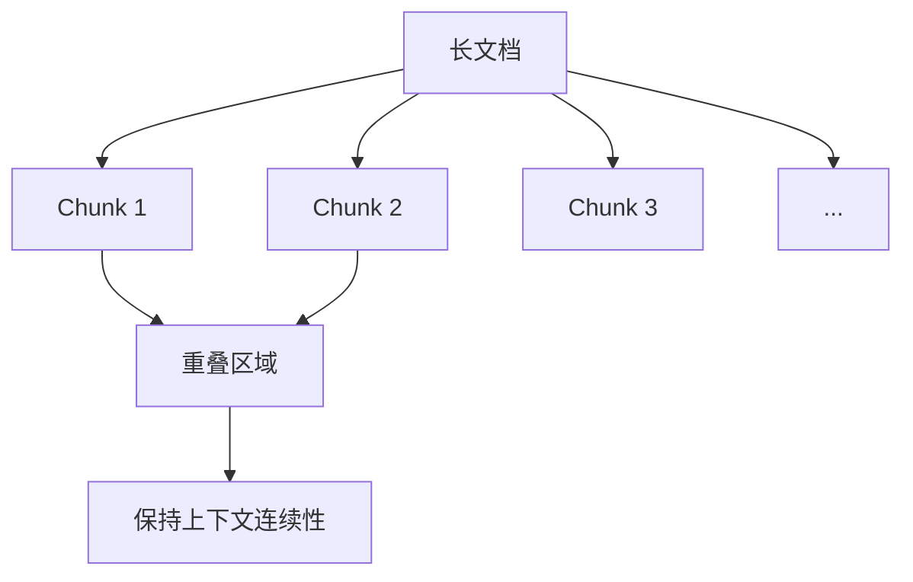
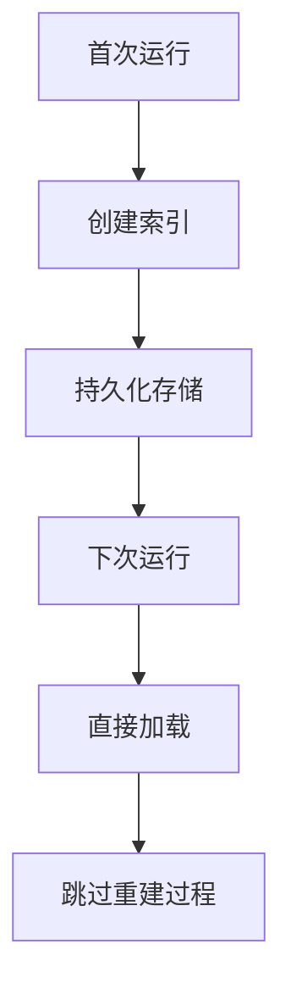

# 索引构建

## 概述

本章将帮助你深入理解 LlamaIndex 的 **Index（索引）** 机制。完成本章后，你将能够：

- 理解不同索引类型的适用场景
- 配置 Chunk 切分策略
- 选择合适的 Embedding 模型
- 实现索引的持久化存储

## 核心概念

### 什么是 Index？

**Index（索引）** 就像**书籍的目录页**。当你想在一本厚厚的书中找到特定内容时，不会逐页翻阅，而是先查目录，快速定位到相关章节。

LlamaIndex 的索引将文档内容组织成可快速检索的结构：



**图表说明**: 索引将文档转换为可高效检索的结构，核心是将文本转为向量并建立检索映射。

### 索引类型对比

| 索引类型 | 类比 | 适用场景 | 优点 | 缺点 |
|----------|------|----------|------|------|
| VectorStoreIndex | 语义检索系统 | 问答、语义搜索 | 语义理解能力强 | 需要 Embedding |
| SummaryIndex | 全文阅读 | 文档总结、全面分析 | 不遗漏信息 | 大文档成本高 |
| KeywordTableIndex | 关键词索引 | 关键词精确匹配 | 速度快、成本低 | 无语义理解 |

## 代码示例

### 示例 1: VectorStoreIndex 基础用法

> 适用版本: LlamaIndex 0.10.x+

```python
from llama_index.core import VectorStoreIndex, SimpleDirectoryReader

# 加载文档
documents = SimpleDirectoryReader("./data/").load_data()

# 创建向量索引
# 底层自动完成：
# 1. 将 documents 切分成 nodes
# 2. 为每个 node 生成 embedding
# 3. 建立向量检索索引
index = VectorStoreIndex.from_documents(documents)

# 创建查询引擎
query_engine = index.as_query_engine()

# 执行查询
response = query_engine.query("文档的核心内容是什么？")
print(response)
```

**说明**: VectorStoreIndex 是最常用的索引类型，适用于大多数 RAG 场景。

### 示例 2: 从 Nodes 创建索引

> 适用版本: LlamaIndex 0.10.x+

```python
from llama_index.core import VectorStoreIndex, SimpleDirectoryReader
from llama_index.core.node_parser import SentenceSplitter

# 加载文档
documents = SimpleDirectoryReader("./data/").load_data()

# 使用自定义分割器将文档切成 nodes
splitter = SentenceSplitter(
    chunk_size=512,    # 每个 chunk 最大 512 个 token
    chunk_overlap=50,  # 相邻 chunk 重叠 50 个 token
)
nodes = splitter.get_nodes_from_documents(documents)

print(f"生成了 {len(nodes)} 个节点")

# 从 nodes 创建索引
index = VectorStoreIndex(nodes)
```

**说明**: 手动控制 Node 生成过程，可以精细调整切分策略。

### 示例 3: SummaryIndex 用法

> 适用版本: LlamaIndex 0.10.x+

```python
from llama_index.core import SummaryIndex, SimpleDirectoryReader

# 加载文档
documents = SimpleDirectoryReader("./data/").load_data()

# 创建总结索引
# SummaryIndex 会在查询时遍历所有节点
index = SummaryIndex.from_documents(documents)

# 创建查询引擎
query_engine = index.as_query_engine(
    response_mode="tree_summarize"  # 使用树状总结模式
)

# 适合总结类问题
response = query_engine.query("请总结这份文档的主要观点")
print(response)
```

**说明**: SummaryIndex 适合需要全面分析的场景，但 token 消耗较大。

## Chunk 策略详解

### 什么是 Chunk？

**Chunk** 就像**把长文章切成小段落**。切得太长，检索精度下降；切得太短，上下文不完整。



**图表说明**: Chunk 之间的重叠确保重要信息不会因切分而丢失。

### Chunk 参数详解

| 参数 | 说明 | 推荐值 |
|------|------|--------|
| chunk_size | 每个 chunk 的最大 token 数 | 512-1024 |
| chunk_overlap | 相邻 chunk 的重叠 token 数 | 50-200 |

### 示例 4: 自定义 Chunk 策略

> 适用版本: LlamaIndex 0.10.x+

```python
from llama_index.core import VectorStoreIndex, SimpleDirectoryReader
from llama_index.core.node_parser import SentenceSplitter

# 方法 1: 使用 SentenceSplitter
splitter = SentenceSplitter(
    chunk_size=1024,
    chunk_overlap=200,
    paragraph_separator="\n\n",  # 段落分隔符
)

# 方法 2: 基于语义的分割
from llama_index.core.node_parser import SemanticSplitterNodeParser
from llama_index.embeddings.openai import OpenAIEmbedding

semantic_splitter = SemanticSplitterNodeParser(
    buffer_size=1,  # 句子缓冲区大小
    breakpoint_percentile_threshold=95,  # 断点阈值
    embed_model=OpenAIEmbedding(),
)

# 加载文档并应用分割器
documents = SimpleDirectoryReader("./data/").load_data()
nodes = splitter.get_nodes_from_documents(documents)

# 创建索引
index = VectorStoreIndex(nodes)
```

**说明**: SemanticSplitter 根据语义相似度智能分割，效果更好但速度较慢。

## Embedding 模型选择

### 什么是 Embedding？

**Embedding** 就像**给每段文字一个坐标地址**。语义相似的文字，地址距离更近。

### 常用 Embedding 模型

| 模型 | 提供商 | 特点 | 推荐场景 |
|------|--------|------|----------|
| text-embedding-3-small | OpenAI | 高质量、低成本 | 通用场景 |
| text-embedding-3-large | OpenAI | 最高质量 | 高精度需求 |
| bge-small-zh-v1.5 | BAAI | 中文优化 | 中文场景 |
| nomic-embed-text | Ollama | 完全本地 | 隐私敏感场景 |

### 示例 5: 配置 Embedding 模型

> 适用版本: LlamaIndex 0.10.x+

```python
from llama_index.core import VectorStoreIndex, SimpleDirectoryReader, Settings
from llama_index.embeddings.openai import OpenAIEmbedding

# 方法 1: 使用 OpenAI Embedding
Settings.embed_model = OpenAIEmbedding(
    model="text-embedding-3-small",
    dimensions=512,  # 可选：减少维度降低存储
)

# 方法 2: 使用中文优化模型
from llama_index.embeddings.huggingface import HuggingFaceEmbedding

Settings.embed_model = HuggingFaceEmbedding(
    model_name="BAAI/bge-small-zh-v1.5"
)

# 方法 3: 使用 Ollama 本地模型
from llama_index.embeddings.ollama import OllamaEmbedding

Settings.embed_model = OllamaEmbedding(
    model_name="nomic-embed-text"
)

# 创建索引（会使用配置的 Embedding 模型）
documents = SimpleDirectoryReader("./data/").load_data()
index = VectorStoreIndex.from_documents(documents)
```

**说明**: 通过 Settings 全局配置 Embedding 模型，所有后续操作自动使用。

## 索引持久化

### 为什么需要持久化？

每次创建索引都需要：
1. 重新加载文档
2. 重新切分成 Nodes
3. 重新生成 Embeddings（需要调用 API）

持久化可以保存这些结果，下次直接加载。



**图表说明**: 持久化避免了重复的索引构建过程，节省时间和 API 调用成本。

### 示例 6: 本地持久化

> 适用版本: LlamaIndex 0.10.x+

```python
from llama_index.core import VectorStoreIndex, SimpleDirectoryReader
from llama_index.core import StorageContext, load_index_from_storage
from pathlib import Path

PERSIST_DIR = "./storage"

def get_or_create_index():
    """获取或创建索引"""
    if Path(PERSIST_DIR).exists():
        # 加载已有索引
        print("加载已保存的索引...")
        storage_context = StorageContext.from_defaults(persist_dir=PERSIST_DIR)
        index = load_index_from_storage(storage_context)
    else:
        # 创建新索引
        print("创建新索引...")
        documents = SimpleDirectoryReader("./data/").load_data()
        index = VectorStoreIndex.from_documents(documents)

        # 持久化保存
        index.storage_context.persist(persist_dir=PERSIST_DIR)
        print(f"索引已保存到 {PERSIST_DIR}")

    return index

# 使用
index = get_or_create_index()
query_engine = index.as_query_engine()
```

**说明**: 检查存储目录是否存在，存在则加载，否则创建并保存。

### 示例 7: 向量数据库持久化

> 适用版本: LlamaIndex 0.10.x+

```python
# 安装: pip install llama-index-vector-stores-chroma chromadb
import chromadb
from llama_index.core import VectorStoreIndex, SimpleDirectoryReader
from llama_index.vector_stores.chroma import ChromaVectorStore
from llama_index.core import StorageContext

# 创建 Chroma 客户端（持久化到本地）
chroma_client = chromadb.PersistentClient(path="./chroma_db")
chroma_collection = chroma_client.get_or_create_collection("my_documents")

# 创建向量存储
vector_store = ChromaVectorStore(chroma_collection=chroma_collection)
storage_context = StorageContext.from_defaults(vector_store=vector_store)

# 加载文档并创建索引
documents = SimpleDirectoryReader("./data/").load_data()
index = VectorStoreIndex.from_documents(
    documents,
    storage_context=storage_context,
)

# 后续可以直接从 Chroma 加载
# vector_store = ChromaVectorStore(chroma_collection=chroma_collection)
# index = VectorStoreIndex.from_vector_store(vector_store)
```

**说明**: Chroma 是一个轻量级向量数据库，适合开发和小规模生产使用。

## 增量更新索引

### 示例 8: 添加新文档到现有索引

> 适用版本: LlamaIndex 0.10.x+

```python
from llama_index.core import VectorStoreIndex, Document

# 假设已有索引
index = VectorStoreIndex.from_documents([
    Document(text="原始文档内容")
])

# 添加新文档
new_doc = Document(text="这是新添加的文档内容")
index.insert(new_doc)

# 批量添加
new_docs = [
    Document(text="新文档 1"),
    Document(text="新文档 2"),
]
for doc in new_docs:
    index.insert(doc)

# 保存更新后的索引
index.storage_context.persist(persist_dir="./storage")
```

**说明**: 使用 `insert()` 方法可以向现有索引添加新文档，无需重建整个索引。

## 避坑指南

### ❌ 常见问题 1: Embedding 维度不匹配

**现象**:

```
ValueError: Embedding dimension mismatch
```

**根因**: 保存索引时和加载索引时使用了不同的 Embedding 模型。

**解决方案**:

```python
# 确保加载时使用相同的 Embedding 模型
from llama_index.core import Settings
from llama_index.embeddings.openai import OpenAIEmbedding

# 加载索引前配置相同的模型
Settings.embed_model = OpenAIEmbedding(model="text-embedding-3-small")

# 然后加载索引
storage_context = StorageContext.from_defaults(persist_dir="./storage")
index = load_index_from_storage(storage_context)
```

**预防措施**: 在项目中固定 Embedding 模型版本，记录在配置文件中。

### ❌ 常见问题 2: 持久化权限问题

**现象**:

```
PermissionError: [Errno 13] Permission denied
```

**根因**: 没有写入目录的权限。

**解决方案**:

```python
from pathlib import Path

persist_dir = Path("./storage")

# 确保目录存在且有写入权限
persist_dir.mkdir(parents=True, exist_ok=True)

# 检查权限
if not persist_dir.is_dir():
    raise ValueError(f"无法创建目录: {persist_dir}")
```

**预防措施**: 使用 pathlib 创建目录，检查写入权限。

### ❌ 常见问题 3: Chunk 过大导致检索失败

**现象**: 检索结果不相关，或返回空结果。

**根因**: chunk_size 设置过大，导致单个 chunk 包含过多不相关内容。

**解决方案**:

```python
from llama_index.core.node_parser import SentenceSplitter

# 减小 chunk_size
splitter = SentenceSplitter(
    chunk_size=256,  # 减小到 256
    chunk_overlap=50,
)
```

**预防措施**: 从较小的 chunk_size 开始测试，逐步调整。

### ❌ 常见问题 4: Embedding API 调用失败

**现象**:

```
openai.RateLimitError: Rate limit exceeded
```

**根因**: 大量文档同时请求 Embedding API 触发限流。

**解决方案**:

```python
from llama_index.core import VectorStoreIndex

# 设置 API 调用限制
index = VectorStoreIndex.from_documents(
    documents,
    show_progress=True,  # 显示进度
)

# 或使用本地 Embedding 避免 API 限流
from llama_index.embeddings.huggingface import HuggingFaceEmbedding
Settings.embed_model = HuggingFaceEmbedding(model_name="BAAI/bge-small-en-v1.5")
```

**预防措施**: 大规模索引构建使用本地 Embedding 模型。

## 生产最佳实践

### 索引配置推荐

| 配置项 | 推荐值 | 说明 |
|--------|--------|------|
| chunk_size | 512-1024 | 平衡精度和上下文 |
| chunk_overlap | 50-200 | 保持信息连续性 |
| embed_model | text-embedding-3-small | 性价比最高 |
| 持久化 | Chroma / Qdrant | 生产环境推荐 |

### 向量数据库选型

| 数据库 | 特点 | 推荐场景 |
|--------|------|----------|
| Chroma | 轻量级、易上手 | 开发、小规模生产 |
| Qdrant | 高性能、云原生 | 中大规模生产 |
| Pinecone | 全托管、零运维 | 无运维需求场景 |
| Milvus | 分布式、高扩展 | 超大规模场景 |

## 小结

本章我们学习了：

1. ✅ **索引类型**：VectorStoreIndex、SummaryIndex 的选择
2. ✅ **Chunk 策略**：chunk_size 和 chunk_overlap 的配置
3. ✅ **Embedding 模型**：不同模型的特点和选择
4. ✅ **索引持久化**：本地存储和向量数据库

## 下一步

现在你已经掌握了索引构建，让我们继续学习 [查询引擎](/ai/llamaindex/guide/query-engine)，了解如何优化检索和回答质量。
