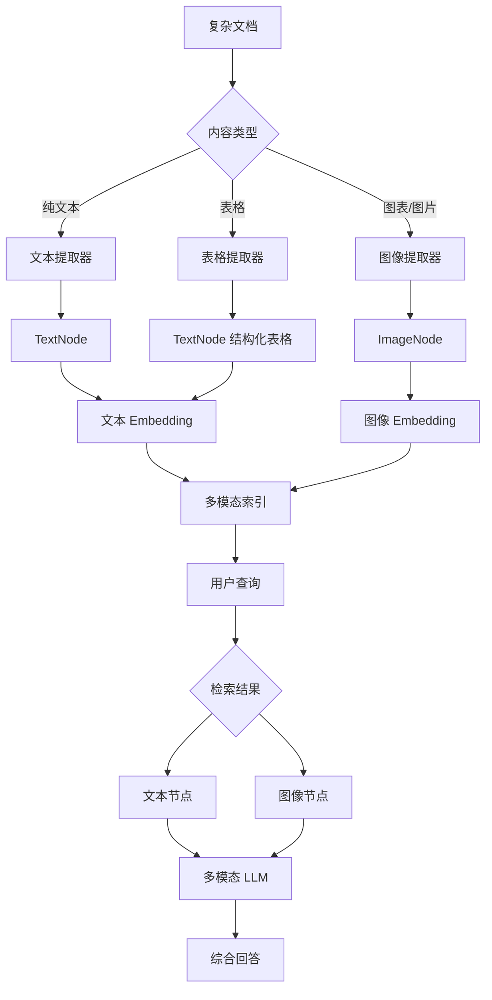
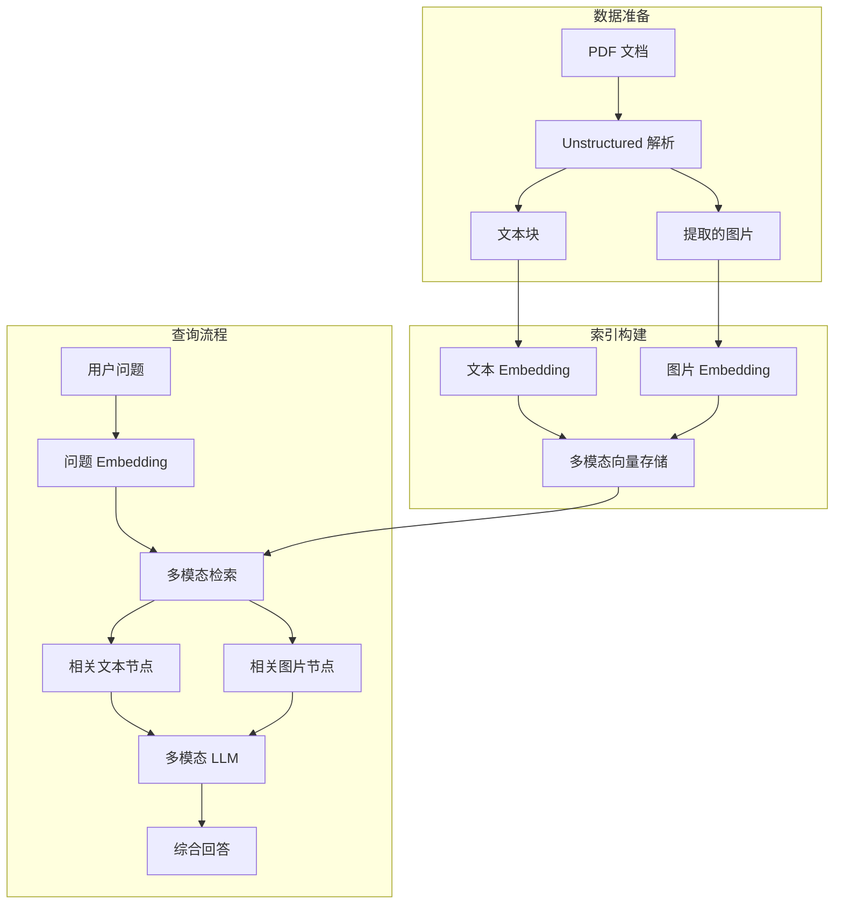

# 多模态 RAG

## 概述

本章将帮助你掌握 **多模态 RAG（Multimodal RAG）** 技术。完成本章后，你将能够：

- 理解多模态 RAG 的工作原理
- 从 PDF 中提取表格和图表
- 使用视觉 LLM 进行图片理解
- 构建能同时处理文本和图像的 RAG 系统

## 核心概念

### 什么是多模态 RAG？

**多模态 RAG** 就像一个**既能阅读文字又能看懂图片的助手**。

想象你有一份包含文字说明和数据图表的财务报告。传统 RAG 只能读懂文字部分，对于图表中的趋势、表格中的数字无能为力。多模态 RAG 则能：

- 📝 理解文字内容
- 📊 解读图表趋势
- 📋 提取表格数据
- 🖼️ 分析图片含义



**图表说明**: 多模态 RAG 将文档中的不同内容类型分别处理，统一索引，最终通过多模态 LLM 综合生成答案。

### TextNode vs ImageNode

| 节点类型 | 存储内容 | 用途 |
|---------|---------|------|
| **TextNode** | 文本内容 + 元数据 | 传统文本检索 |
| **ImageNode** | 图片路径/Base64 + 元数据 | 图像检索和理解 |

LlamaIndex 通过不同的 Node 类型来统一管理多模态数据。

---

## PDF 文档解析

### 解析器选型

| 解析器 | 适用场景 | 优势 | 劣势 |
|--------|---------|------|------|
| **PyPDF / PyMuPDF** | 简单纯文本 PDF | 速度快、无依赖 | 无法处理图表 |
| **Unstructured** | 复杂文档（表格/图表） | 开源免费、功能强 | 安装稍复杂 |
| **LlamaParse** | 高精度需求 | 精度最高 | 收费服务 |

### 示例 1: 使用 PyMuPDF 解析简单 PDF

> 适用版本: LlamaIndex 0.10.x+

```bash
# 安装依赖
pip install llama-index-readers-file pymupdf
```

```python
from llama_index.core import VectorStoreIndex
from llama_index.readers.file import PyMuPDFReader

# 加载 PDF
reader = PyMuPDFReader()
documents = reader.load_data(file_path="./report.pdf")

print(f"加载了 {len(documents)} 个页面")

# 创建索引
index = VectorStoreIndex.from_documents(documents)

# 查询
query_engine = index.as_query_engine()
response = query_engine.query("报告的主要结论是什么？")
print(response)
```

**说明**: PyMuPDF 适合纯文本 PDF，速度快但无法提取图表内容。

### 示例 2: 使用 Unstructured 提取表格和图表

> 适用版本: LlamaIndex 0.10.x+

Unstructured 是处理复杂文档的**开源利器**，支持提取表格、图表等结构化内容。

```bash
# 安装依赖
pip install unstructured[pdf]
pip install llama-index-readers-file
# 如果需要 OCR 功能
pip install pytesseract pdf2image
```

```python
from unstructured.partition.pdf import partition_pdf
from llama_index.core import Document, VectorStoreIndex

# 使用 Unstructured 解析 PDF
elements = partition_pdf(
    filename="./financial_report.pdf",
    strategy="auto",  # auto 策略会智能选择解析方式
    extract_images_in_pdf=True,  # 提取图片
    infer_table_structure=True,  # 推断表格结构
    chunking_strategy="by_title",  # 按标题分块
)

# 查看提取的元素类型
for element in elements[:10]:
    print(f"类型: {type(element).__name__}, 内容预览: {str(element)[:100]}...")

# 转换为 LlamaIndex Document
documents = []
for element in elements:
    doc = Document(
        text=str(element),
        metadata={
            "element_type": type(element).__name__,
            "source": "financial_report.pdf",
        }
    )
    documents.append(doc)

print(f"共提取 {len(documents)} 个文档片段")

# 创建索引
index = VectorStoreIndex.from_documents(documents)
```

**说明**: Unstructured 会自动识别文档中的不同元素类型（标题、段落、表格等）。

### 示例 3: 表格数据提取

> 适用版本: LlamaIndex 0.10.x+

```python
from unstructured.partition.pdf import partition_pdf
from unstructured.documents.elements import Table

# 解析 PDF 并专注于表格
elements = partition_pdf(
    filename="./data_report.pdf",
    strategy="hi_res",  # 高精度模式，更好的表格识别
    infer_table_structure=True,
)

# 筛选出表格元素
tables = [el for el in elements if isinstance(el, Table)]

print(f"发现 {len(tables)} 个表格")

for i, table in enumerate(tables):
    print(f"\n--- 表格 {i+1} ---")
    print(table.text)

    # 获取表格的 HTML 结构（如果可用）
    if hasattr(table, 'metadata') and hasattr(table.metadata, 'text_as_html'):
        print("HTML 结构:")
        print(table.metadata.text_as_html)
```

**说明**: 使用 `hi_res` 策略可以获得更好的表格识别效果，但处理速度较慢。

### 示例 4: 使用 LlamaParse（高精度方案）

> 适用版本: LlamaIndex 0.10.x+

LlamaParse 是 LlamaIndex 官方的云端解析服务，精度最高但需要付费。

```bash
pip install llama-parse
```

```python
import os
from llama_parse import LlamaParse
from llama_index.core import VectorStoreIndex

# 设置 API Key
os.environ["LLAMA_CLOUD_API_KEY"] = "your-api-key"

# 创建解析器
parser = LlamaParse(
    result_type="markdown",  # 输出为 Markdown 格式
    verbose=True,
)

# 解析 PDF
documents = parser.load_data("./complex_report.pdf")

print(f"解析完成，共 {len(documents)} 个文档")

# 创建索引并查询
index = VectorStoreIndex.from_documents(documents)
query_engine = index.as_query_engine()
response = query_engine.query("报告中的关键数据是什么？")
print(response)
```

**说明**: LlamaParse 提供免费额度（每月 1000 页），超出后按 $3/1000 页收费。

---

## 图片理解

### 多模态 LLM 配置

LlamaIndex 支持多种多模态 LLM：

| LLM | 提供商 | 特点 |
|-----|--------|------|
| **GPT-4V / GPT-4o** | OpenAI | 综合能力强 |
| **Claude 3 Vision** | Anthropic | 长上下文、高质量 |
| **Gemini Pro Vision** | Google | 成本较低 |
| **LLaVA** | 开源 | 可本地运行 |

### 示例 5: 使用 GPT-4V 分析图片

> 适用版本: LlamaIndex 0.10.x+

```bash
pip install llama-index-multi-modal-llms-openai
```

```python
from llama_index.multi_modal_llms.openai import OpenAIMultiModal
from llama_index.core.schema import ImageDocument

# 创建多模态 LLM
mm_llm = OpenAIMultiModal(
    model="gpt-4o",  # 或 "gpt-4-vision-preview"
    max_new_tokens=1000,
)

# 加载图片（支持本地路径或 URL）
image_doc = ImageDocument(image_path="./chart.png")

# 分析图片
response = mm_llm.complete(
    prompt="请详细描述这张图表，包括趋势、关键数据点和可能的结论。",
    image_documents=[image_doc],
)

print(response.text)
```

**说明**: GPT-4o 对图表、流程图等技术图片的理解能力很强。

### 示例 6: 使用 Claude 3 Vision

> 适用版本: LlamaIndex 0.10.x+

```bash
pip install llama-index-multi-modal-llms-anthropic
```

```python
from llama_index.multi_modal_llms.anthropic import AnthropicMultiModal
from llama_index.core.schema import ImageDocument

# 创建多模态 LLM
mm_llm = AnthropicMultiModal(
    model="claude-3-sonnet-20240229",  # 或 claude-3-opus
    max_tokens=1000,
)

# 加载图片
image_doc = ImageDocument(image_path="./diagram.png")

# 分析图片
response = mm_llm.complete(
    prompt="这张图展示了什么？请解释其中的关键概念和流程。",
    image_documents=[image_doc],
)

print(response.text)
```

### 示例 7: 从图片提取结构化数据

> 适用版本: LlamaIndex 0.10.x+

```python
from llama_index.multi_modal_llms.openai import OpenAIMultiModal
from llama_index.core.schema import ImageDocument
from llama_index.core.program import MultiModalLLMCompletionProgram
from pydantic import BaseModel
from typing import List

# 定义输出结构
class ChartData(BaseModel):
    """图表数据结构"""
    title: str
    chart_type: str  # 如 "bar", "line", "pie"
    data_points: List[dict]
    trend: str
    key_insights: List[str]

# 创建多模态 LLM
mm_llm = OpenAIMultiModal(model="gpt-4o", max_new_tokens=1000)

# 加载图片
image_doc = ImageDocument(image_path="./sales_chart.png")

# 创建结构化提取程序
program = MultiModalLLMCompletionProgram.from_defaults(
    output_cls=ChartData,
    image_documents=[image_doc],
    prompt_template_str="""
    分析这张图表，提取以下信息：
    1. 图表标题
    2. 图表类型
    3. 关键数据点
    4. 整体趋势
    5. 主要洞察

    请以 JSON 格式返回结果。
    """,
    multi_modal_llm=mm_llm,
)

# 执行提取
result = program()
print(f"图表标题: {result.title}")
print(f"图表类型: {result.chart_type}")
print(f"趋势: {result.trend}")
print(f"关键洞察: {result.key_insights}")
```

**说明**: 结合 Pydantic 模型，可以从图片中提取结构化数据，便于后续处理。

---

## 多模态索引与检索

### 多模态 RAG 架构



### 示例 8: 构建多模态 RAG Pipeline

> 适用版本: LlamaIndex 0.10.x+

```python
import os
from pathlib import Path
from llama_index.core import VectorStoreIndex, SimpleDirectoryReader
from llama_index.core.schema import ImageDocument, TextNode
from llama_index.multi_modal_llms.openai import OpenAIMultiModal

# 准备数据目录
data_dir = Path("./multimodal_data")
text_dir = data_dir / "texts"
image_dir = data_dir / "images"

# 加载文本文档
text_documents = SimpleDirectoryReader(str(text_dir)).load_data()

# 加载图片文档
image_documents = []
for img_path in image_dir.glob("*.png"):
    image_documents.append(
        ImageDocument(
            image_path=str(img_path),
            metadata={"source": img_path.name}
        )
    )

print(f"加载了 {len(text_documents)} 个文本文档")
print(f"加载了 {len(image_documents)} 个图片文档")

# 合并所有文档
all_documents = text_documents + image_documents

# 创建索引
index = VectorStoreIndex.from_documents(all_documents)

# 配置多模态 LLM
mm_llm = OpenAIMultiModal(model="gpt-4o", max_new_tokens=1000)

# 创建多模态查询引擎
query_engine = index.as_query_engine(
    multi_modal_llm=mm_llm,
    similarity_top_k=5,  # 检索 top 5 相关内容
)

# 执行查询
response = query_engine.query("根据文档和图表，总结主要发现")
print(response)
```

### 示例 9: 完整端到端 Pipeline

> 适用版本: LlamaIndex 0.10.x+

```python
from pathlib import Path
from unstructured.partition.pdf import partition_pdf
from llama_index.core import Document, VectorStoreIndex
from llama_index.core.schema import ImageDocument
from llama_index.multi_modal_llms.openai import OpenAIMultiModal

def build_multimodal_index(pdf_path: str, output_dir: str = "./extracted"):
    """
    从 PDF 构建多模态索引的完整流程

    Args:
        pdf_path: PDF 文件路径
        output_dir: 提取图片的输出目录
    """
    output_path = Path(output_dir)
    output_path.mkdir(exist_ok=True)

    # Step 1: 解析 PDF
    print("正在解析 PDF...")
    elements = partition_pdf(
        filename=pdf_path,
        strategy="hi_res",
        extract_images_in_pdf=True,
        extract_image_block_output_dir=str(output_path),
        infer_table_structure=True,
    )

    # Step 2: 整理文本节点
    text_documents = []
    for element in elements:
        doc = Document(
            text=str(element),
            metadata={
                "element_type": type(element).__name__,
                "source": pdf_path,
            }
        )
        text_documents.append(doc)

    print(f"提取了 {len(text_documents)} 个文本片段")

    # Step 3: 整理图片节点
    image_documents = []
    for img_path in output_path.glob("*.png"):
        image_documents.append(
            ImageDocument(
                image_path=str(img_path),
                metadata={"source": pdf_path}
            )
        )

    print(f"提取了 {len(image_documents)} 张图片")

    # Step 4: 构建索引
    all_documents = text_documents + image_documents
    index = VectorStoreIndex.from_documents(all_documents)

    return index


def query_multimodal(index, question: str):
    """执行多模态查询"""
    mm_llm = OpenAIMultiModal(model="gpt-4o", max_new_tokens=1000)

    query_engine = index.as_query_engine(
        multi_modal_llm=mm_llm,
        similarity_top_k=5,
    )

    response = query_engine.query(question)
    return response


# 使用示例
if __name__ == "__main__":
    # 构建索引
    index = build_multimodal_index("./annual_report.pdf")

    # 查询
    response = query_multimodal(
        index,
        "根据报告中的图表，分析今年的业绩表现"
    )
    print(response)
```

---

## 避坑指南

### ❌ 常见问题 1: 图片加载失败

**现象**:

```
FileNotFoundError: [Errno 2] No such file or directory
```

**解决方案**:

```python
from pathlib import Path

# 使用绝对路径
image_path = Path("./images/chart.png").resolve()
image_doc = ImageDocument(image_path=str(image_path))

# 或检查文件是否存在
if not image_path.exists():
    raise FileNotFoundError(f"图片不存在: {image_path}")
```

### ❌ 常见问题 2: 图片格式不支持

**现象**: 某些图片无法被多模态 LLM 处理。

**解决方案**:

```python
from PIL import Image

def convert_to_png(image_path: str) -> str:
    """将图片转换为 PNG 格式"""
    img = Image.open(image_path)
    png_path = image_path.rsplit(".", 1)[0] + ".png"
    img.save(png_path, "PNG")
    return png_path

# 支持的格式：PNG, JPEG, GIF, WebP
# 建议统一使用 PNG 格式
```

### ❌ 常见问题 3: Unstructured 安装问题

**现象**: 安装 Unstructured 时依赖报错。

**解决方案**:

```bash
# Windows 用户
pip install "unstructured[pdf]"
# 可能需要安装 poppler
# 下载: https://github.com/oschwartz10612/poppler-windows/releases

# macOS 用户
brew install poppler
pip install "unstructured[pdf]"

# Linux 用户
sudo apt-get install poppler-utils
pip install "unstructured[pdf]"
```

### ❌ 常见问题 4: 多模态 LLM 成本过高

**现象**: 处理大量图片时 API 费用激增。

**缓解策略**:

1. **图片压缩**: 在发送前压缩图片尺寸
2. **批量处理**: 多张相关图片合并处理
3. **缓存结果**: 对相同图片缓存分析结果

```python
from PIL import Image

def resize_image(image_path: str, max_size: int = 1024) -> str:
    """压缩图片以减少 API 成本"""
    img = Image.open(image_path)

    # 如果图片过大，等比缩放
    if max(img.size) > max_size:
        ratio = max_size / max(img.size)
        new_size = (int(img.size[0] * ratio), int(img.size[1] * ratio))
        img = img.resize(new_size, Image.Resampling.LANCZOS)

    resized_path = image_path.rsplit(".", 1)[0] + "_resized.png"
    img.save(resized_path, "PNG", optimize=True)
    return resized_path
```

---

## 生产最佳实践

### 解析策略选择

| 文档类型 | 推荐解析器 | 说明 |
|---------|-----------|------|
| 纯文本 PDF | PyMuPDF | 速度快，成本低 |
| 带表格 PDF | Unstructured `hi_res` | 表格识别准确 |
| 扫描件 PDF | Unstructured + OCR | 需要 Tesseract |
| 高精度需求 | LlamaParse | 收费但精度最高 |

### 性能优化

1. **预处理缓存**: 将解析结果缓存，避免重复处理
2. **异步处理**: 大文档使用异步解析
3. **分页处理**: 超大 PDF 分页处理，避免内存溢出

```python
# 异步处理示例
import asyncio
from llama_parse import LlamaParse

async def parse_pdf_async(file_path: str):
    parser = LlamaParse(result_type="markdown")
    documents = await parser.aload_data(file_path)
    return documents

# 批量异步处理
async def parse_multiple_pdfs(file_paths: list):
    tasks = [parse_pdf_async(fp) for fp in file_paths]
    results = await asyncio.gather(*tasks)
    return results
```

---

## 小结

本章我们学习了：

1. ✅ **多模态 RAG 概念**: 理解如何处理文本和图像混合内容
2. ✅ **PDF 解析**: 使用 Unstructured 和 LlamaParse 提取表格和图表
3. ✅ **图片理解**: 配置 GPT-4V/Claude 3 进行视觉分析
4. ✅ **多模态索引**: 构建能检索文本和图像的 RAG 系统

## 下一步

恭喜你完成了 LlamaIndex 进阶教程！你现在可以：

- 回顾 [生产部署](/ai/llamaindex/guide/production) 了解更多优化技巧
- 探索 [Agent 进阶](/ai/llamaindex/guide/agent-advanced) 构建更复杂的应用
- 参考官方文档获取最新 API 更新
