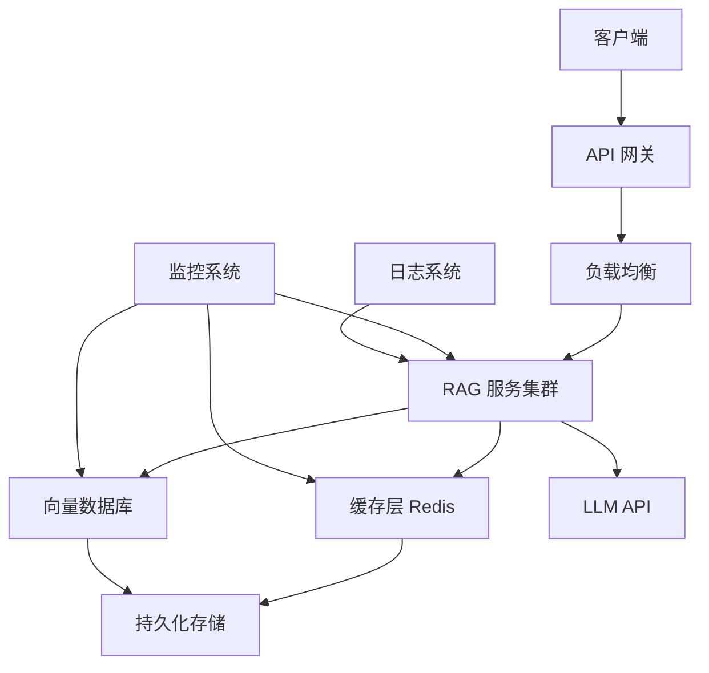

# 生产部署

## 概述

本章将介绍如何将 LlamaIndex RAG 应用部署到生产环境，涵盖性能优化、成本控制、安全合规、监控告警等关键主题。

**学习目标**：
- 掌握生产环境的性能优化策略
- 理解 LLM API 成本控制方法
- 学会配置监控和告警
- 了解安全合规最佳实践

## 核心概念

### 生产级 RAG 应用架构

生产环境中的 RAG 应用需要考虑可扩展性、可靠性和可维护性。下图展示了一个典型的生产架构：



**说明**：
- **API 网关**：统一入口，处理认证、限流、日志
- **负载均衡**：分发请求到多个服务实例
- **缓存层**：减少重复计算和 API 调用
- **向量数据库**：存储和检索向量索引
- **监控系统**：实时监控服务健康状态

### 关键性能指标

| 指标 | 描述 | 目标值 |
|------|------|--------|
| P50 延迟 | 50% 请求的响应时间 | < 2s |
| P99 延迟 | 99% 请求的响应时间 | < 10s |
| 吞吐量 | 每秒处理的请求数 | > 100 QPS |
| 可用性 | 服务正常运行时间比例 | > 99.9% |
| 错误率 | 请求失败的比例 | < 0.1% |

## 代码示例

### 示例 1: 缓存策略配置

> 适用版本: LlamaIndex 0.10.x+

```python
import hashlib
import json
from functools import lru_cache
from typing import Optional
import redis
from llama_index.core import VectorStoreIndex, SimpleDirectoryReader
from llama_index.llms.openai import OpenAI

# ========== 内存缓存（适合单实例） ==========
@lru_cache(maxsize=1000)
def cached_query(query_hash: str) -> str:
    """基于查询哈希的内存缓存。"""
    # 这里的实际查询逻辑
    pass

def get_query_hash(query: str) -> str:
    """计算查询的哈希值。"""
    return hashlib.md5(query.encode()).hexdigest()

# ========== Redis 缓存（适合分布式） ==========
class RedisCache:
    """Redis 缓存管理器。"""

    def __init__(self, host: str = "localhost", port: int = 6379, ttl: int = 3600):
        self.client = redis.Redis(host=host, port=port, decode_responses=True)
        self.ttl = ttl  # 缓存过期时间（秒）

    def get(self, key: str) -> Optional[str]:
        """获取缓存。"""
        return self.client.get(key)

    def set(self, key: str, value: str) -> None:
        """设置缓存。"""
        self.client.setex(key, self.ttl, value)

    def exists(self, key: str) -> bool:
        """检查缓存是否存在。"""
        return self.client.exists(key) > 0

# ========== 带缓存的 RAG 服务 ==========
class CachedRAGService:
    """带缓存的 RAG 服务。"""

    def __init__(self, index: VectorStoreIndex, cache: RedisCache):
        self.index = index
        self.cache = cache
        self.query_engine = index.as_query_engine(similarity_top_k=3)

    def query(self, question: str) -> str:
        """带缓存的查询。"""
        # 计算缓存键
        cache_key = f"rag:query:{get_query_hash(question)}"

        # 检查缓存
        cached_result = self.cache.get(cache_key)
        if cached_result:
            print(f"[缓存命中] {question[:30]}...")
            return cached_result

        # 执行实际查询
        print(f"[缓存未命中] {question[:30]}...")
        response = self.query_engine.query(question)
        result = str(response)

        # 存入缓存
        self.cache.set(cache_key, result)
        return result

# 使用示例
documents = SimpleDirectoryReader("./data").load_data()
index = VectorStoreIndex.from_documents(documents)
cache = RedisCache(host="localhost", port=6379, ttl=3600)
service = CachedRAGService(index, cache)

# 第一次查询（缓存未命中）
result1 = service.query("公司的年假政策是什么？")

# 第二次相同查询（缓存命中）
result2 = service.query("公司的年假政策是什么？")
```

**说明**：
1. `lru_cache` 适合单实例部署的内存缓存
2. Redis 缓存适合分布式部署，多实例共享
3. TTL 设置应根据数据更新频率调整

### 示例 2: 批量处理与异步优化

> 适用版本: LlamaIndex 0.10.x+

```python
import asyncio
from typing import List
from llama_index.core import VectorStoreIndex, SimpleDirectoryReader
from llama_index.llms.openai import OpenAI

# ========== 异步查询 ==========
async def async_query(query_engine, question: str) -> str:
    """异步执行单个查询。"""
    response = await query_engine.aquery(question)
    return str(response)

async def batch_async_queries(query_engine, questions: List[str]) -> List[str]:
    """批量异步查询。"""
    tasks = [async_query(query_engine, q) for q in questions]
    results = await asyncio.gather(*tasks)
    return results

# ========== 批量嵌入优化 ==========
from llama_index.core import Settings
from llama_index.embeddings.openai import OpenAIEmbedding

# 配置批量嵌入
Settings.embed_model = OpenAIEmbedding(
    model="text-embedding-3-small",
    embed_batch_size=100,  # 批量处理 100 个文本
)

# ========== 使用示例 ==========
async def main():
    # 加载数据
    documents = SimpleDirectoryReader("./data").load_data()
    index = VectorStoreIndex.from_documents(documents)
    query_engine = index.as_query_engine(similarity_top_k=3)

    # 批量查询
    questions = [
        "公司的年假政策是什么？",
        "如何申请报销？",
        "绩效考核的标准是什么？",
    ]

    results = await batch_async_queries(query_engine, questions)

    for q, r in zip(questions, results):
        print(f"Q: {q}")
        print(f"A: {r[:100]}...")
        print("---")

# 运行
asyncio.run(main())
```

**说明**：
1. `aquery()` 是异步查询方法，适合并发处理多个请求
2. `asyncio.gather()` 可以并行执行多个异步任务
3. `embed_batch_size` 控制 Embedding 的批量大小

### 示例 3: 成本监控与控制

> 适用版本: LlamaIndex 0.10.x+

```python
from llama_index.core.callbacks import CallbackManager, TokenCountingHandler
from llama_index.core import Settings, VectorStoreIndex, SimpleDirectoryReader
from llama_index.llms.openai import OpenAI
import tiktoken

# ========== Token 计数器 ==========
# 创建 Token 计数处理器
token_counter = TokenCountingHandler(
    tokenizer=tiktoken.encoding_for_model("gpt-4o-mini").encode
)

# 设置回调管理器
callback_manager = CallbackManager([token_counter])
Settings.callback_manager = callback_manager

# 配置 LLM
Settings.llm = OpenAI(model="gpt-4o-mini")

# ========== 成本计算器 ==========
class CostCalculator:
    """LLM API 成本计算器。"""

    # 价格（每 1M tokens，美元）
    PRICING = {
        "gpt-4o": {"input": 2.50, "output": 10.00},
        "gpt-4o-mini": {"input": 0.15, "output": 0.60},
        "gpt-4-turbo": {"input": 10.00, "output": 30.00},
        "text-embedding-3-small": {"input": 0.02, "output": 0},
        "text-embedding-3-large": {"input": 0.13, "output": 0},
    }

    def __init__(self, model: str = "gpt-4o-mini"):
        self.model = model
        self.pricing = self.PRICING.get(model, {"input": 0, "output": 0})

    def calculate(self, input_tokens: int, output_tokens: int) -> float:
        """计算成本（美元）。"""
        input_cost = (input_tokens / 1_000_000) * self.pricing["input"]
        output_cost = (output_tokens / 1_000_000) * self.pricing["output"]
        return input_cost + output_cost

# ========== 使用示例 ==========
# 创建索引和查询引擎
documents = SimpleDirectoryReader("./data").load_data()
index = VectorStoreIndex.from_documents(documents)
query_engine = index.as_query_engine(similarity_top_k=3)

# 执行查询
response = query_engine.query("公司的年假政策是什么？")

# 获取 Token 统计
print("=== Token 统计 ===")
print(f"Embedding Tokens: {token_counter.total_embedding_token_count}")
print(f"LLM Prompt Tokens: {token_counter.prompt_llm_token_count}")
print(f"LLM Completion Tokens: {token_counter.completion_llm_token_count}")
print(f"Total LLM Tokens: {token_counter.total_llm_token_count}")

# 计算成本
calculator = CostCalculator("gpt-4o-mini")
cost = calculator.calculate(
    token_counter.prompt_llm_token_count,
    token_counter.completion_llm_token_count
)
print(f"\n预估成本: ${cost:.6f}")

# 重置计数器（用于下一次统计）
token_counter.reset_counts()
```

**说明**：
1. `TokenCountingHandler` 自动统计所有 Token 消耗
2. 成本计算基于 OpenAI 官方定价
3. 定期监控成本可以及时发现异常使用

### 示例 4: 容器化部署 (Docker)

> 适用版本: LlamaIndex 0.10.x+

**Dockerfile**:
```dockerfile
# Dockerfile
FROM python:3.11-slim

# 设置工作目录
WORKDIR /app

# 安装系统依赖
RUN apt-get update && apt-get install -y \
    build-essential \
    && rm -rf /var/lib/apt/lists/*

# 复制依赖文件
COPY requirements.txt .

# 安装 Python 依赖
RUN pip install --no-cache-dir -r requirements.txt

# 复制应用代码
COPY . .

# 暴露端口
EXPOSE 8000

# 启动命令
CMD ["uvicorn", "main:app", "--host", "0.0.0.0", "--port", "8000"]
```

**requirements.txt**:
```text
llama-index-core>=0.10.0
llama-index-llms-openai>=0.1.0
llama-index-embeddings-openai>=0.1.0
fastapi>=0.100.0
uvicorn>=0.23.0
redis>=4.0.0
python-dotenv>=1.0.0
```

**main.py (FastAPI 服务)**:
```python
from fastapi import FastAPI, HTTPException
from pydantic import BaseModel
from llama_index.core import VectorStoreIndex, StorageContext, load_index_from_storage
from llama_index.core import Settings
from llama_index.llms.openai import OpenAI
from llama_index.embeddings.openai import OpenAIEmbedding
import os
from dotenv import load_dotenv

# 加载环境变量
load_dotenv()

# 初始化 FastAPI
app = FastAPI(title="RAG Service", version="1.0.0")

# 配置 LlamaIndex
Settings.llm = OpenAI(model="gpt-4o-mini")
Settings.embed_model = OpenAIEmbedding(model="text-embedding-3-small")

# 加载索引（启动时）
index = None

@app.on_event("startup")
async def startup():
    global index
    storage_context = StorageContext.from_defaults(persist_dir="./storage")
    index = load_index_from_storage(storage_context)
    print("Index loaded successfully")

# 请求模型
class QueryRequest(BaseModel):
    question: str
    top_k: int = 3

class QueryResponse(BaseModel):
    answer: str
    sources: list[str]

# API 端点
@app.post("/query", response_model=QueryResponse)
async def query(request: QueryRequest):
    if not index:
        raise HTTPException(status_code=503, detail="Index not loaded")

    query_engine = index.as_query_engine(similarity_top_k=request.top_k)
    response = query_engine.query(request.question)

    # 提取来源
    sources = []
    if response.source_nodes:
        sources = [node.node.get_content()[:100] for node in response.source_nodes]

    return QueryResponse(answer=str(response), sources=sources)

# 健康检查
@app.get("/health")
async def health():
    return {"status": "healthy", "index_loaded": index is not None}
```

**docker-compose.yml**:
```yaml
version: '3.8'

services:
  rag-service:
    build: .
    ports:
      - "8000:8000"
    environment:
      - OPENAI_API_KEY=${OPENAI_API_KEY}
    volumes:
      - ./storage:/app/storage
      - ./data:/app/data
    depends_on:
      - redis
    restart: unless-stopped
    healthcheck:
      test: ["CMD", "curl", "-f", "http://localhost:8000/health"]
      interval: 30s
      timeout: 10s
      retries: 3

  redis:
    image: redis:7-alpine
    ports:
      - "6379:6379"
    volumes:
      - redis_data:/data
    restart: unless-stopped

volumes:
  redis_data:
```

**说明**：
1. 使用 FastAPI 构建 REST API 服务
2. Docker Compose 编排多个服务
3. 健康检查确保服务可用性

### 示例 5: 监控与告警配置

> 适用版本: LlamaIndex 0.10.x+

```python
import time
import logging
from typing import Optional
from dataclasses import dataclass, field
from collections import deque
from threading import Lock

# 配置日志
logging.basicConfig(
    level=logging.INFO,
    format='%(asctime)s - %(name)s - %(levelname)s - %(message)s'
)
logger = logging.getLogger("rag-service")

# ========== 指标收集器 ==========
@dataclass
class Metrics:
    """服务指标。"""
    request_count: int = 0
    error_count: int = 0
    total_latency: float = 0.0
    total_tokens: int = 0

    # 延迟分布（最近 100 个请求）
    latencies: deque = field(default_factory=lambda: deque(maxlen=100))

    # 线程安全锁
    _lock: Lock = field(default_factory=Lock)

    def record_request(self, latency: float, tokens: int, error: bool = False):
        """记录一次请求。"""
        with self._lock:
            self.request_count += 1
            self.total_latency += latency
            self.total_tokens += tokens
            self.latencies.append(latency)
            if error:
                self.error_count += 1

    def get_stats(self) -> dict:
        """获取统计信息。"""
        with self._lock:
            if self.request_count == 0:
                return {"message": "No requests yet"}

            sorted_latencies = sorted(self.latencies)
            p50_idx = int(len(sorted_latencies) * 0.5)
            p99_idx = int(len(sorted_latencies) * 0.99)

            return {
                "request_count": self.request_count,
                "error_count": self.error_count,
                "error_rate": self.error_count / self.request_count,
                "avg_latency": self.total_latency / self.request_count,
                "p50_latency": sorted_latencies[p50_idx] if sorted_latencies else 0,
                "p99_latency": sorted_latencies[p99_idx] if sorted_latencies else 0,
                "total_tokens": self.total_tokens,
                "avg_tokens_per_request": self.total_tokens / self.request_count,
            }

# 全局指标实例
metrics = Metrics()

# ========== 告警规则 ==========
class AlertManager:
    """告警管理器。"""

    def __init__(self):
        self.rules = []

    def add_rule(self, name: str, condition: callable, message: str):
        """添加告警规则。"""
        self.rules.append({
            "name": name,
            "condition": condition,
            "message": message,
        })

    def check_alerts(self, stats: dict) -> list:
        """检查所有告警规则。"""
        alerts = []
        for rule in self.rules:
            if rule["condition"](stats):
                alert = {
                    "name": rule["name"],
                    "message": rule["message"],
                    "stats": stats,
                }
                alerts.append(alert)
                logger.warning(f"[ALERT] {rule['name']}: {rule['message']}")
        return alerts

# 配置告警规则
alert_manager = AlertManager()

# 错误率告警
alert_manager.add_rule(
    name="high_error_rate",
    condition=lambda s: s.get("error_rate", 0) > 0.05,
    message="错误率超过 5%",
)

# 延迟告警
alert_manager.add_rule(
    name="high_latency",
    condition=lambda s: s.get("p99_latency", 0) > 10,
    message="P99 延迟超过 10 秒",
)

# Token 消耗告警
alert_manager.add_rule(
    name="high_token_usage",
    condition=lambda s: s.get("avg_tokens_per_request", 0) > 5000,
    message="平均 Token 消耗超过 5000",
)

# ========== 带监控的查询函数 ==========
def monitored_query(query_engine, question: str) -> str:
    """带监控的查询。"""
    start_time = time.time()
    error = False
    tokens = 0

    try:
        response = query_engine.query(question)
        # 假设可以从 response 获取 token 数
        tokens = getattr(response, 'token_count', 1000)
        return str(response)
    except Exception as e:
        error = True
        logger.error(f"Query failed: {e}")
        raise
    finally:
        latency = time.time() - start_time
        metrics.record_request(latency, tokens, error)

        # 每 10 次请求检查一次告警
        if metrics.request_count % 10 == 0:
            stats = metrics.get_stats()
            alerts = alert_manager.check_alerts(stats)
            if alerts:
                # 这里可以发送告警通知（邮件、Slack 等）
                pass

# ========== 指标导出（Prometheus 格式） ==========
def export_prometheus_metrics() -> str:
    """导出 Prometheus 格式的指标。"""
    stats = metrics.get_stats()
    if "message" in stats:
        return ""

    output = []
    output.append(f"rag_request_total {stats['request_count']}")
    output.append(f"rag_error_total {stats['error_count']}")
    output.append(f"rag_latency_avg {stats['avg_latency']:.4f}")
    output.append(f"rag_latency_p50 {stats['p50_latency']:.4f}")
    output.append(f"rag_latency_p99 {stats['p99_latency']:.4f}")
    output.append(f"rag_tokens_total {stats['total_tokens']}")

    return "\n".join(output)
```

**说明**：
1. `Metrics` 类收集关键性能指标
2. `AlertManager` 根据规则触发告警
3. 支持导出 Prometheus 格式指标

## 避坑指南

### ❌ 冷启动性能问题

**现象**: 服务重启后，第一批请求响应很慢（10-30 秒）。

**根因**: 索引加载、模型初始化、连接建立等都在第一次请求时发生。

**解决方案**:
```python
# ✅ 预热脚本
async def warmup(query_engine, sample_queries: list):
    """服务启动时预热。"""
    print("Warming up...")
    for query in sample_queries:
        try:
            await query_engine.aquery(query)
        except Exception as e:
            print(f"Warmup query failed: {e}")
    print("Warmup complete")

# 在 FastAPI startup 事件中调用
@app.on_event("startup")
async def startup():
    global index, query_engine
    # 加载索引
    storage_context = StorageContext.from_defaults(persist_dir="./storage")
    index = load_index_from_storage(storage_context)
    query_engine = index.as_query_engine(similarity_top_k=3)

    # 预热
    await warmup(query_engine, [
        "测试查询 1",
        "测试查询 2",
    ])
```

**预防措施**: 服务启动时执行预热请求，确保所有组件已初始化。

### ❌ 内存泄漏

**现象**: 服务运行一段时间后，内存占用持续增长，最终 OOM。

**根因**: 对话历史无限增长、缓存未设置上限、大文件处理后未释放内存。

**解决方案**:
```python
# ✅ 限制对话历史
from llama_index.core.memory import ChatMemoryBuffer

memory = ChatMemoryBuffer.from_defaults(token_limit=4000)

# ✅ 限制缓存大小
from functools import lru_cache

@lru_cache(maxsize=1000)  # 最多缓存 1000 个结果
def cached_query(query_hash: str) -> str:
    pass

# ✅ 定期清理
import gc

def cleanup():
    """定期清理内存。"""
    gc.collect()  # 强制垃圾回收

# 每处理 100 个请求执行一次清理
if request_count % 100 == 0:
    cleanup()
```

**预防措施**: 设置缓存上限，定期清理不需要的对象。

### ❌ API 限流与重试

**现象**: 高并发时出现 `429 Too Many Requests` 错误。

**根因**: 超出了 OpenAI API 的速率限制。

**解决方案**:
```python
import time
from tenacity import retry, stop_after_attempt, wait_exponential

# ✅ 使用指数退避重试
@retry(
    stop=stop_after_attempt(3),
    wait=wait_exponential(multiplier=1, min=4, max=60),
)
def query_with_retry(query_engine, question: str) -> str:
    """带重试的查询。"""
    return str(query_engine.query(question))

# ✅ 请求限流
from threading import Semaphore

# 最多同时 5 个并发请求
rate_limiter = Semaphore(5)

def rate_limited_query(query_engine, question: str) -> str:
    """带限流的查询。"""
    with rate_limiter:
        return str(query_engine.query(question))
```

**预防措施**: 实现重试机制和请求限流，避免触发 API 限制。

## 生产最佳实践

### 资源规格建议

**场景**: 选择合适的服务器配置

| 规模 | CPU | 内存 | 存储 | 并发用户 |
|------|-----|------|------|----------|
| 小型 | 2 核 | 4GB | 20GB SSD | 10-50 |
| 中型 | 4 核 | 8GB | 50GB SSD | 50-200 |
| 大型 | 8 核 | 16GB | 100GB SSD | 200-1000 |

**权衡**: 内存主要用于索引缓存，文档量大时需要更多内存。

### 向量数据库选型

**场景**: 根据规模选择合适的向量数据库

| 数据库 | 适用规模 | 优点 | 缺点 |
|--------|----------|------|------|
| Chroma | < 100 万向量 | 简单易用，无需部署 | 性能有限 |
| Qdrant | 100 万-1 亿向量 | 高性能，支持过滤 | 需要运维 |
| Pinecone | 任意规模 | 全托管，免运维 | 成本较高 |
| Milvus | 1 亿+ 向量 | 分布式，高可扩展 | 部署复杂 |

### 安全合规清单

**场景**: 确保 RAG 应用符合安全合规要求

| 项目 | 要求 | 实现方式 |
|------|------|----------|
| 数据加密 | 静态数据和传输数据加密 | TLS + 存储加密 |
| 访问控制 | 按角色限制访问权限 | JWT + RBAC |
| 审计日志 | 记录所有查询和操作 | 结构化日志 |
| 数据脱敏 | 敏感信息不返回给用户 | 后处理过滤 |
| API 密钥 | 安全存储 API 密钥 | 环境变量/密钥管理服务 |

### 扩缩容策略

**场景**: 根据负载自动调整资源

```yaml
# Kubernetes HPA 配置示例
apiVersion: autoscaling/v2
kind: HorizontalPodAutoscaler
metadata:
  name: rag-service-hpa
spec:
  scaleTargetRef:
    apiVersion: apps/v1
    kind: Deployment
    name: rag-service
  minReplicas: 2
  maxReplicas: 10
  metrics:
  - type: Resource
    resource:
      name: cpu
      target:
        type: Utilization
        averageUtilization: 70
  - type: Resource
    resource:
      name: memory
      target:
        type: Utilization
        averageUtilization: 80
```

| 指标 | 扩容阈值 | 缩容阈值 | 冷却时间 |
|------|----------|----------|----------|
| CPU | > 70% | < 30% | 5 分钟 |
| 内存 | > 80% | < 40% | 10 分钟 |
| 请求延迟 | P99 > 5s | P99 < 1s | 5 分钟 |

## 小结

本章介绍了 LlamaIndex RAG 应用的生产部署最佳实践：

1. **缓存策略**: 使用 Redis 缓存减少重复查询
2. **性能优化**: 异步处理、批量操作提升吞吐量
3. **成本控制**: Token 监控、模型选择控制成本
4. **容器化**: Docker + FastAPI 构建生产级服务
5. **监控告警**: 指标收集、告警规则确保服务稳定

## 恭喜完成！

你已经完成了 LlamaIndex 教程的全部学习！现在你可以：

- 构建基础 RAG 应用
- 从多种数据源加载和索引数据
- 调优查询引擎提升检索质量
- 构建智能 Agent 系统
- 将应用部署到生产环境

**推荐下一步**：
- 查阅 [LlamaIndex 官方文档](https://docs.llamaindex.ai/) 了解更多高级特性
- 加入 [LlamaIndex Discord 社区](https://discord.gg/llamaindex) 与其他开发者交流
