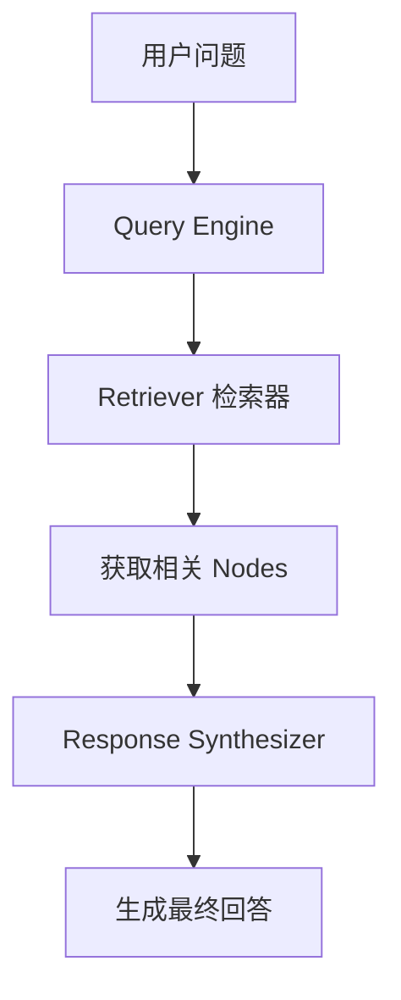
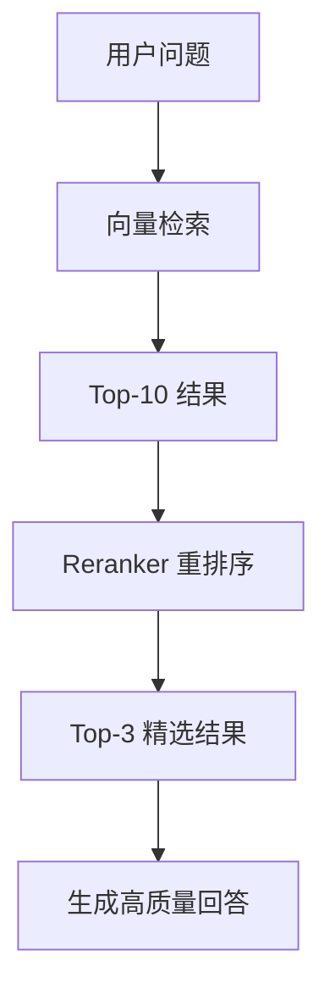

# 查询引擎

## 概述

本章将帮助你深入理解 **Query Engine（查询引擎）** 的工作原理和优化技巧。完成本章后，你将能够：

- 理解 Query Engine 的核心参数
- 配置不同的响应模式
- 使用重排序提升检索精度
- 实现流式响应和引用来源

## 核心概念

### 什么是 Query Engine？

[🔗 Query Engine 官方文档](https://docs.llamaindex.ai/en/stable/module_guides/deploying/query_engine/){target="_blank" rel="noopener"}

**Query Engine** 就像一个**智能问答助手**。当你提出问题时，助手会：

1. 理解你的问题
2. 从知识库中找到相关内容
3. 组织信息并生成回答



**图表说明**: Query Engine 协调 Retriever 和 Response Synthesizer，完成从问题到答案的完整流程。

### 核心组件

| 组件 | 作用 | 类比 |
|------|------|------|
| Retriever | 检索相关内容 | 图书管理员找书 |
| Response Synthesizer | 生成回答 | 作者写总结 |
| Node Postprocessor | 后处理检索结果 | 编辑精选内容 |

## 代码示例

### 示例 1: 基础配置

> 适用版本: LlamaIndex 0.10.x+

```python
from llama_index.core import VectorStoreIndex, SimpleDirectoryReader

# 加载文档并创建索引
documents = SimpleDirectoryReader("./data/").load_data()
index = VectorStoreIndex.from_documents(documents)

# 创建查询引擎（使用默认配置）
query_engine = index.as_query_engine()

# 执行查询
response = query_engine.query("这份文档的主要观点是什么？")
print(response)
```

**说明**: 默认配置适用于大多数场景，但了解可调参数能帮助你优化效果。

### 示例 2: 配置检索参数

> 适用版本: LlamaIndex 0.10.x+

```python
from llama_index.core import VectorStoreIndex, SimpleDirectoryReader

documents = SimpleDirectoryReader("./data/").load_data()
index = VectorStoreIndex.from_documents(documents)

# 配置检索参数
query_engine = index.as_query_engine(
    similarity_top_k=5,           # 检索最相关的 5 个 chunks
    response_mode="compact",      # 响应模式
    verbose=True,                 # 显示详细信息
)

response = query_engine.query("文档中提到了哪些关键技术？")
print(response)
```

**说明**: `similarity_top_k` 控制检索数量，太小可能遗漏信息，太大可能引入噪音。

## Response Mode 详解

[🔗 Response Synthesizer 模式详解](https://docs.llamaindex.ai/en/stable/module_guides/deploying/query_engine/response_modes/){target="_blank" rel="noopener"}

### 响应模式对比

| 模式 | 说明 | 适用场景 | Token 消耗 |
|------|------|----------|------------|
| `compact` | 压缩所有 chunks 后生成回答 | 通用场景 | 中 |
| `refine` | 逐个 chunk 迭代优化回答 | 需要精确答案 | 高 |
| `tree_summarize` | 层级总结后生成回答 | 文档总结 | 高 |
| `simple_summarize` | 简单拼接后总结 | 快速响应 | 低 |
| `no_text` | 只返回检索结果不生成回答 | 调试检索 | 无 |

### 示例 3: 使用不同响应模式

> 适用版本: LlamaIndex 0.10.x+

```python
from llama_index.core import VectorStoreIndex, SimpleDirectoryReader

documents = SimpleDirectoryReader("./data/").load_data()
index = VectorStoreIndex.from_documents(documents)

# 模式 1: compact（默认）- 平衡质量和速度
compact_engine = index.as_query_engine(
    response_mode="compact",
    similarity_top_k=3,
)

# 模式 2: refine - 迭代优化，质量更高
refine_engine = index.as_query_engine(
    response_mode="refine",
    similarity_top_k=5,
)

# 模式 3: tree_summarize - 适合总结类问题
summarize_engine = index.as_query_engine(
    response_mode="tree_summarize",
    similarity_top_k=10,
)

# 对比效果
question = "请总结这份文档的核心内容"
print("Compact 模式:", compact_engine.query(question))
print("Refine 模式:", refine_engine.query(question))
print("Summarize 模式:", summarize_engine.query(question))
```

**说明**: 根据问题类型选择合适的响应模式，总结类问题推荐 `tree_summarize`。

## 重排序优化

### 为什么需要重排序？

向量相似度搜索可能返回语义相似但不相关的结果。重排序（Reranker）可以：

1. 使用更精确的模型重新评分
2. 过滤掉不相关的结果
3. 提升最终回答质量



**图表说明**: 重排序在向量检索后进行二次筛选，提升结果相关性。

### 示例 4: 使用 Cohere Reranker

> 适用版本: LlamaIndex 0.10.x+

```python
# 安装: pip install llama-index-postprocessor-cohere-rerank
from llama_index.core import VectorStoreIndex, SimpleDirectoryReader
from llama_index.postprocessor.cohere_rerank import CohereRerank

# 设置 Cohere API Key
import os
os.environ["COHERE_API_KEY"] = "your-cohere-api-key"

documents = SimpleDirectoryReader("./data/").load_data()
index = VectorStoreIndex.from_documents(documents)

# 创建重排序器
cohere_rerank = CohereRerank(
    api_key=os.environ["COHERE_API_KEY"],
    top_n=3,  # 重排序后保留 top 3
)

# 配置查询引擎使用重排序
query_engine = index.as_query_engine(
    similarity_top_k=10,  # 先检索 10 个
    node_postprocessors=[cohere_rerank],  # 应用重排序
)

response = query_engine.query("文档的关键结论是什么？")
print(response)
```

**说明**: 先检索较多结果，再用 Reranker 精选，平衡召回率和精确度。

### 示例 5: 使用本地重排序模型

> 适用版本: LlamaIndex 0.10.x+

```python
# 安装: pip install llama-index-postprocessor-flag-embedding-reranker
from llama_index.core import VectorStoreIndex, SimpleDirectoryReader
from llama_index.postprocessor.flag_embedding_reranker import FlagEmbeddingReranker

documents = SimpleDirectoryReader("./data/").load_data()
index = VectorStoreIndex.from_documents(documents)

# 使用本地 BGE Reranker（无需 API）
reranker = FlagEmbeddingReranker(
    model="BAAI/bge-reranker-base",
    top_n=3,
)

query_engine = index.as_query_engine(
    similarity_top_k=10,
    node_postprocessors=[reranker],
)

response = query_engine.query("项目的技术架构是什么？")
print(response)
```

**说明**: BGE Reranker 完全本地运行，无需 API 调用，适合隐私敏感场景。

## 流式响应

### 为什么使用流式响应？

传统模式需要等待完整回答生成，用户体验较差。流式响应可以：

1. 实时显示生成的文字
2. 提升用户感知速度
3. 便于构建交互式应用

### 示例 6: 配置流式响应

> 适用版本: LlamaIndex 0.10.x+

```python
from llama_index.core import VectorStoreIndex, SimpleDirectoryReader

documents = SimpleDirectoryReader("./data/").load_data()
index = VectorStoreIndex.from_documents(documents)

# 启用流式响应
query_engine = index.as_query_engine(streaming=True)

# 执行流式查询
streaming_response = query_engine.query("请详细解释文档的核心概念")

# 逐字输出
for text in streaming_response.response_gen:
    print(text, end="", flush=True)

print()  # 换行
```

**说明**: 流式响应让用户在生成过程中就能看到内容，提升交互体验。

## 引用来源

### 示例 7: 显示回答来源

> 适用版本: LlamaIndex 0.10.x+

```python
from llama_index.core import VectorStoreIndex, SimpleDirectoryReader

documents = SimpleDirectoryReader("./data/").load_data()
index = VectorStoreIndex.from_documents(documents)

query_engine = index.as_query_engine(
    similarity_top_k=3,
)

response = query_engine.query("文档的主要结论是什么？")

# 输出回答
print("回答:", response.response)
print("\n来源:")

# 输出来源信息
for i, node in enumerate(response.source_nodes, 1):
    print(f"\n[{i}] 相关度: {node.score:.4f}")
    print(f"    文件: {node.node.metadata.get('file_name', 'unknown')}")
    print(f"    内容: {node.node.text[:100]}...")
```

**说明**: 通过 `source_nodes` 可以获取每个回答片段的原始来源，增强可信度。

## Query Engine 配置完整示例

### 示例 8: 生产级配置

> 适用版本: LlamaIndex 0.10.x+

```python
from llama_index.core import VectorStoreIndex, SimpleDirectoryReader, Settings
from llama_index.llms.openai import OpenAI
from llama_index.embeddings.openai import OpenAIEmbedding
from llama_index.postprocessor.flag_embedding_reranker import FlagEmbeddingReranker

# 配置模型
Settings.llm = OpenAI(model="gpt-4o-mini", temperature=0.1)
Settings.embed_model = OpenAIEmbedding(model="text-embedding-3-small")

# 加载文档并创建索引
documents = SimpleDirectoryReader("./data/").load_data()
index = VectorStoreIndex.from_documents(documents)

# 创建重排序器
reranker = FlagEmbeddingReranker(
    model="BAAI/bge-reranker-base",
    top_n=5,
)

# 创建生产级查询引擎
query_engine = index.as_query_engine(
    similarity_top_k=10,              # 初始检索数量
    response_mode="compact",          # 响应模式
    streaming=True,                   # 启用流式
    node_postprocessors=[reranker],   # 重排序
)

# 执行查询
response = query_engine.query("请分析文档的核心观点和建议")

# 流式输出
for text in response.response_gen:
    print(text, end="", flush=True)
```

**说明**: 这个配置结合了重排序、流式响应和合理的检索参数，适合生产环境。

## 避坑指南

### ❌ 常见问题 1: 回答不相关

**现象**: LLM 的回答与问题关联度低，或包含无关信息。

**根因**: `similarity_top_k` 过小，或检索到的 chunks 不相关。

**解决方案**:

```python
# 1. 增加检索数量
query_engine = index.as_query_engine(similarity_top_k=10)

# 2. 添加重排序
from llama_index.postprocessor.flag_embedding_reranker import FlagEmbeddingReranker
reranker = FlagEmbeddingReranker(model="BAAI/bge-reranker-base", top_n=3)
query_engine = index.as_query_engine(
    similarity_top_k=10,
    node_postprocessors=[reranker],
)

# 3. 检查检索结果
response = query_engine.query("你的问题")
for node in response.source_nodes:
    print(f"相关度: {node.score}, 内容: {node.node.text[:100]}")
```

**预防措施**: 始终检查 source_nodes 确认检索质量。

### ❌ 常见问题 2: 上下文过长报错

**现象**:

```
openai.BadRequestError: This model's maximum context length is 8192 tokens
```

**根因**: 检索的 chunks 过多或过长，超出 LLM 上下文限制。

**解决方案**:

```python
# 1. 减少检索数量
query_engine = index.as_query_engine(similarity_top_k=3)

# 2. 使用 refine 模式（逐个处理，不会超限）
query_engine = index.as_query_engine(
    similarity_top_k=10,
    response_mode="refine",
)

# 3. 在索引时减小 chunk_size
from llama_index.core.node_parser import SentenceSplitter
splitter = SentenceSplitter(chunk_size=256, chunk_overlap=50)
```

**预防措施**: 监控 token 使用量，根据模型限制调整参数。

### ❌ 常见问题 3: 响应超时

**现象**:

```
openai.APITimeoutError: Request timed out
```

**根因**: LLM 生成时间过长，或网络不稳定。

**解决方案**:

```python
from llama_index.llms.openai import OpenAI
from llama_index.core import Settings

# 增加超时时间
Settings.llm = OpenAI(
    model="gpt-4o-mini",
    timeout=120,  # 超时时间（秒）
    max_retries=3,  # 重试次数
)

# 或使用流式响应避免超时感知
query_engine = index.as_query_engine(streaming=True)
```

**预防措施**: 生产环境设置合理的超时和重试策略。

### ❌ 常见问题 4: 回答缺乏深度

**现象**: 回答过于简短或表面，缺乏详细分析。

**根因**: 使用了 `simple_summarize` 模式，或 LLM temperature 过高。

**解决方案**:

```python
from llama_index.llms.openai import OpenAI
from llama_index.core import Settings

# 使用更强的模型和更低的 temperature
Settings.llm = OpenAI(model="gpt-4o", temperature=0.1)

# 使用 refine 模式获得更详细的回答
query_engine = index.as_query_engine(
    similarity_top_k=8,
    response_mode="refine",
)
```

**预防措施**: 重要问题使用 refine 模式和高质量模型。

## 生产最佳实践

### 参数推荐

| 参数 | 推荐值 | 说明 |
|------|--------|------|
| similarity_top_k | 5-10 | 初始检索数量 |
| reranker top_n | 3-5 | 重排序后保留数量 |
| response_mode | compact | 通用场景 |
| streaming | true | 提升用户体验 |
| temperature | 0.1-0.3 | 降低随机性 |

### 性能优化

```python
# 1. 使用缓存减少重复查询
from llama_index.core import Settings
Settings.llm = OpenAI(model="gpt-4o-mini")

# 2. 批量查询优化
questions = ["问题1", "问题2", "问题3"]
responses = [query_engine.query(q) for q in questions]

# 3. 异步查询
import asyncio

async def async_query(engine, question):
    return await engine.aquery(question)

# 并发执行多个查询
responses = await asyncio.gather(*[
    async_query(query_engine, q) for q in questions
])
```

## 小结

本章我们学习了：

1. ✅ **Query Engine 核心参数**：similarity_top_k、response_mode
2. ✅ **响应模式选择**：compact、refine、tree_summarize
3. ✅ **重排序优化**：Cohere Reranker、BGE Reranker
4. ✅ **流式响应与引用来源**：提升用户体验和可信度

## 下一步

现在你已经掌握了查询引擎优化，让我们继续学习 [Agent 基础](/ai/llamaindex/guide/agent-basics)，构建能自主思考和行动的智能代理。
