# RAG 基础概念

## 概述

本章将帮助你理解 **RAG（Retrieval-Augmented Generation，检索增强生成）** 的核心原理。完成本章后，你将能够：

- 用通俗语言解释 RAG 是什么
- 理解 RAG 的工作流程
- 构建一个能对本地文档进行问答的 RAG 应用
- 掌握 LlamaIndex 的核心组件

## 核心概念

### 什么是 RAG？

**RAG** 就像**考试前查阅笔记再答题**。

想象你在参加一场开卷考试：

1. **传统 LLM**（闭卷）：只能依靠大脑里记住的知识回答问题
2. **RAG**（开卷）：可以先查阅笔记，找到相关内容，再结合理解回答问题

```mermaid
graph TD
    A[用户提问] --> B{选择模式}
    B -->|传统 LLM| C[仅依靠模型记忆]
    B -->|RAG| D[检索相关文档]
    D --> E[获取上下文]
    E --> F[结合上下文生成答案]
    C --> G[可能产生幻觉]
    F --> H[准确且有据可查]
```



**图表说明**: RAG 通过检索外部知识增强 LLM 的回答能力，减少"幻觉"（编造信息）的发生。

### 为什么需要 RAG？

| 问题 | 传统 LLM | RAG |
|------|----------|-----|
| 知识过时 | 只知道训练截止日期前的信息 | 可以检索最新文档 |
| 私有数据 | 无法访问企业内部文档 | 可以索引任意私有数据 |
| 准确性 | 可能"编造"答案 | 答案有据可查 |
| 可解释性 | 无法追溯信息来源 | 可以引用原始文档 |

### RAG 的工作流程

RAG 的核心流程可以分为两个阶段：

```mermaid
graph TD
    subgraph 索引阶段
        A1[原始文档] --> A2[切分成小块 Chunks]
        A2 --> A3[生成 Embedding 向量]
        A3 --> A4[存入向量数据库]
    end

    subgraph 查询阶段
        B1[用户问题] --> B2[生成问题 Embedding]
        B2 --> B3[向量相似度搜索]
        B3 --> B4[获取相关 Chunks]
        B4 --> B5[构建 Prompt]
        B5 --> B6[LLM 生成答案]
    end

    A4 -.-> B3
```

**图表说明**:
- **索引阶段**：将文档切分、向量化并存储，类似图书馆建立索引卡片
- **查询阶段**：将问题向量化，检索相关内容，让 LLM 生成答案

## LlamaIndex 核心组件

[🔗 LlamaIndex RAG 概念与流程](https://docs.llamaindex.ai/en/stable/understanding/){target="_blank" rel="noopener"}

### 组件概览

LlamaIndex 将 RAG 流程封装成几个核心组件：

| 组件 | 类比 | 作用 |
|------|------|------|
| **Document** | 一本书 | 原始数据的容器 |
| **Node** | 书中的段落 | 切分后的文本块 |
| **Index** | 书的目录 | 高效检索的数据结构 |
| **Query Engine** | 问答助手 | 处理用户查询并返回答案 |
| **Retriever** | 图书管理员 | 负责找到相关内容 |

### 组件关系图

```mermaid
graph TD
    A[Documents 文档] --> B[Nodes 节点]
    B --> C[Index 索引]
    C --> D[Retriever 检索器]
    D --> E[Query Engine 查询引擎]
    E --> F[Response 响应]

    G[用户问题] --> E
```



**图表说明**: 数据从 Document 流向 Node，建立 Index 后，Query Engine 通过 Retriever 检索相关内容并生成响应。

## 代码示例

### 示例 1: 最小 RAG 应用

> 适用版本: LlamaIndex 0.10.x+

[🔗 VectorStoreIndex API 参考](https://docs.llamaindex.ai/en/stable/module_guides/indexing/vector_store_index/){target="_blank" rel="noopener"}

```python
# 导入必要的模块
from llama_index.core import VectorStoreIndex, SimpleDirectoryReader

# 步骤 1: 加载文档
# SimpleDirectoryReader 会读取指定目录下的所有文件
documents = SimpleDirectoryReader("./data/").load_data()

# 步骤 2: 创建索引
# VectorStoreIndex 会自动：
# - 将文档切分成 Nodes
# - 为每个 Node 生成 Embedding
# - 建立向量索引
index = VectorStoreIndex.from_documents(documents)

# 步骤 3: 创建查询引擎
query_engine = index.as_query_engine()

# 步骤 4: 执行查询
response = query_engine.query("这份文档的主要内容是什么？")
print(response)
```

**说明**: 这是最简洁的 RAG 实现，仅需 4 行核心代码。LlamaIndex 在底层完成了所有复杂的处理。

### 示例 2: 对 PDF 文件进行问答

> 适用版本: LlamaIndex 0.10.x+

```python
# 安装 PDF 解析依赖
# pip install pypdf

from llama_index.core import VectorStoreIndex, SimpleDirectoryReader

# 加载 PDF 文件
# 将你的 PDF 放入 ./pdf_docs/ 目录
documents = SimpleDirectoryReader(
    input_dir="./pdf_docs/",
    required_exts=[".pdf"],  # 只读取 PDF 文件
).load_data()

print(f"加载了 {len(documents)} 个文档")

# 创建索引
index = VectorStoreIndex.from_documents(documents)

# 创建查询引擎
query_engine = index.as_query_engine()

# 交互式问答
while True:
    question = input("\n请输入问题（输入 'quit' 退出）: ")
    if question.lower() == 'quit':
        break

    response = query_engine.query(question)
    print(f"\n回答: {response}")
```

**说明**: 这个示例展示了如何对 PDF 文档进行问答，是最常见的 RAG 应用场景。

### 示例 3: 使用本地模型

> 适用版本: LlamaIndex 0.10.x+

```python
from llama_index.core import VectorStoreIndex, SimpleDirectoryReader, Settings
from llama_index.llms.ollama import Ollama
from llama_index.embeddings.ollama import OllamaEmbedding

# 配置使用 Ollama 本地模型
Settings.llm = Ollama(model="llama3.2", request_timeout=120.0)
Settings.embed_model = OllamaEmbedding(model_name="nomic-embed-text")

# 加载文档
documents = SimpleDirectoryReader("./data/").load_data()

# 创建索引
index = VectorStoreIndex.from_documents(documents)

# 查询
query_engine = index.as_query_engine()
response = query_engine.query("文档的核心观点是什么？")
print(response)
```

**说明**: 使用 Ollama 可以完全在本地运行 RAG 应用，无需网络连接和 API 费用。

## 深入理解 Embedding

### 什么是 Embedding？

**Embedding** 就像**将文字转化为计算机能理解的坐标位置**。

想象一个城市地图：
- "咖啡馆"和"星巴克"在地图上距离很近（语义相似）
- "咖啡馆"和"汽车"在地图上距离很远（语义不同）

```mermaid
graph TD
    A[文本: 咖啡馆] --> B[Embedding 模型]
    B --> C["向量: [0.23, 0.87, ...]"]

    D[文本: 星巴克] --> E[Embedding 模型]
    E --> F["向量: [0.25, 0.85, ...]"]

    G[相似度计算] --> H[距离很近 = 语义相似]
    C --> G
    F --> G
```



**图表说明**: Embedding 将文本转换为高维向量，语义相似的文本在向量空间中距离更近。

### 向量相似度搜索

当用户提问时：
1. 将问题转换为 Embedding 向量
2. 在索引中找到距离最近的几个文档块
3. 将这些块作为上下文发送给 LLM

## 避坑指南

### ❌ 常见问题 1: 回答"我不知道"

**现象**:

```
LLM 回答: "根据提供的上下文，我无法找到相关信息..."
```

**根因**: 文档没有正确加载，或检索没有找到相关内容。

**解决方案**:

```python
# 检查文档是否正确加载
documents = SimpleDirectoryReader("./data/").load_data()
print(f"加载了 {len(documents)} 个文档")

# 检查第一个文档的内容
if documents:
    print(f"第一个文档预览: {documents[0].text[:200]}")
```

**预防措施**: 始终验证文档加载结果，确保数据正确导入。

### ❌ 常见问题 2: 回答与问题无关

**现象**: LLM 的回答虽然看起来合理，但与用户的实际问题不相关。

**根因**: 检索的 top_k 设置过小，或 chunk_size 不合理。

**解决方案**:

```python
# 增加检索数量
query_engine = index.as_query_engine(
    similarity_top_k=5  # 默认是 2，增加到 5
)

# 或在创建索引时调整 chunk 大小
from llama_index.core.node_parser import SentenceSplitter

# 使用更大的 chunk
splitter = SentenceSplitter(chunk_size=1024, chunk_overlap=200)
```

**预防措施**: 根据文档特点调整 chunk_size 和 top_k。

### ❌ 常见问题 3: 中文处理效果差

**现象**: 对中文文档的问答效果明显不如英文。

**根因**: 默认的 Embedding 模型对中文支持有限。

**解决方案**:

```python
# 使用支持中文的 Embedding 模型
from llama_index.embeddings.huggingface import HuggingFaceEmbedding

Settings.embed_model = HuggingFaceEmbedding(
    model_name="BAAI/bge-small-zh-v1.5"
)
```

**预防措施**: 中文场景优先选择专门优化的中文 Embedding 模型。

### ❌ 常见问题 4: 内存不足

**现象**:

```
MemoryError: Unable to allocate array
```

**根因**: 一次性加载过多文档。

**解决方案**:

```python
# 分批处理大量文档
from llama_index.core import StorageContext

# 创建可持久化的索引
storage_context = StorageContext.from_defaults()
index = VectorStoreIndex.from_documents(
    documents[:100],  # 先处理前 100 个
    storage_context=storage_context,
)

# 持久化保存
index.storage_context.persist(persist_dir="./storage")
```

**预防措施**: 大规模文档处理时使用持久化存储和分批处理。

## 生产最佳实践

### 参数推荐

| 参数 | 推荐值 | 说明 |
|------|--------|------|
| chunk_size | 512-1024 | 平衡检索精度和上下文长度 |
| chunk_overlap | 50-200 | 避免重要信息被切断 |
| similarity_top_k | 3-5 | 避免过多不相关结果干扰 |

### 索引持久化

```python
# 保存索引，避免每次重新构建
index.storage_context.persist(persist_dir="./storage")

# 加载已保存的索引
from llama_index.core import StorageContext, load_index_from_storage

storage_context = StorageContext.from_defaults(persist_dir="./storage")
index = load_index_from_storage(storage_context)
```

### 性能优化

```python
# 使用流式响应，提升用户体验
query_engine = index.as_query_engine(streaming=True)

streaming_response = query_engine.query("你的问题")
for text in streaming_response.response_gen:
    print(text, end="", flush=True)
```

## 小结

本章我们学习了：

1. ✅ **RAG 概念**：考试前查笔记再答题的智能问答模式
2. ✅ **核心组件**：Document、Node、Index、Query Engine
3. ✅ **Embedding**：将文字转化为计算机能理解的坐标
4. ✅ **实战应用**：对本地 PDF 进行问答

### RAG 核心要点回顾

```mermaid
graph TD
    A[文档] -->|切分| B[Chunks]
    B -->|向量化| C[Embeddings]
    C -->|存储| D[Vector Index]
    E[问题] -->|向量化| F[Query Embedding]
    F -->|相似度搜索| D
    D -->|Top-K| G[相关上下文]
    G -->|Prompt| H[LLM]
    H --> I[答案]
```



## 下一步

现在你已经理解了 RAG 的核心原理，接下来让我们学习：

- [数据加载](/ai/llamaindex/guide/data-connectors) - 掌握多种数据源的加载方法
- [索引构建](/ai/llamaindex/guide/index-building) - 深入理解索引类型和持久化策略
