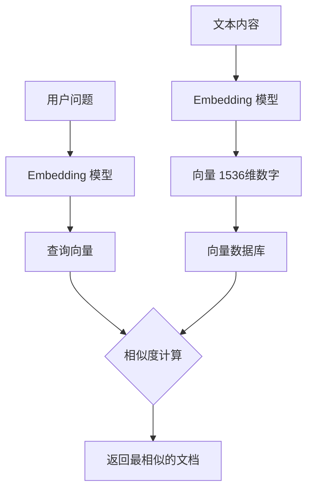
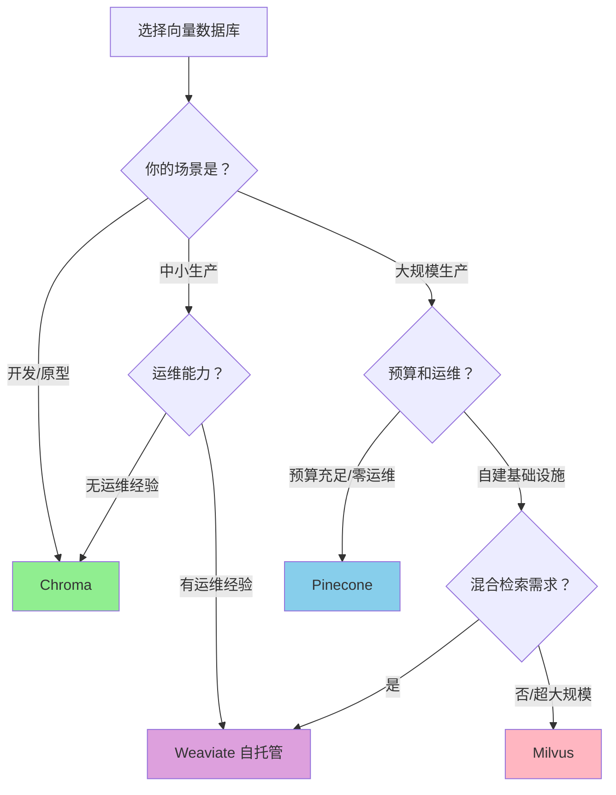
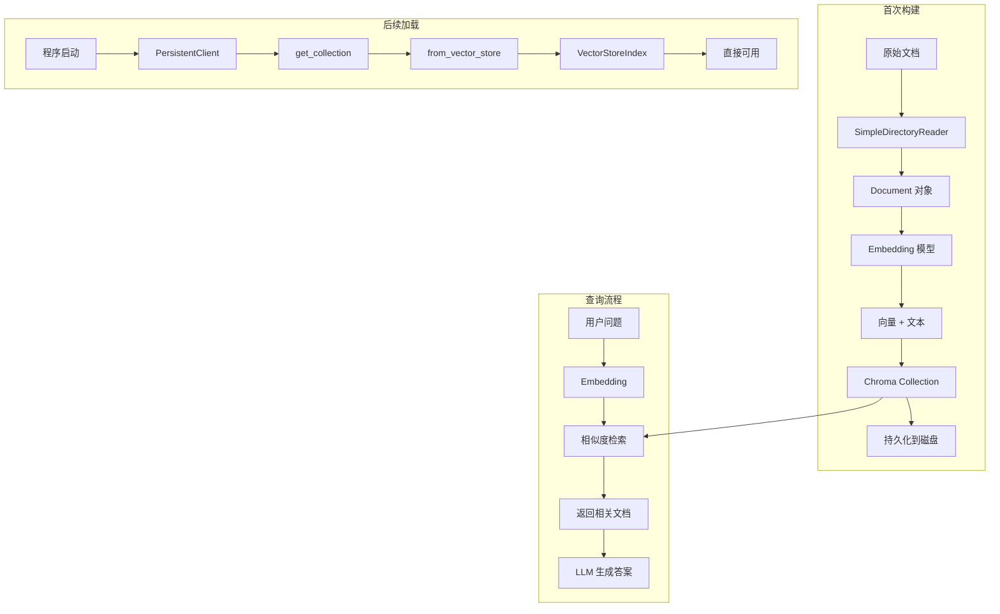

# 向量数据库选型

## 概述

本章将帮助你理解 **向量数据库** 在 RAG 应用中的核心作用，并掌握如何选择适合自己场景的数据库。完成本章后，你将能够：

- 理解向量数据库的工作原理
- 对比四大主流向量数据库的优劣
- 熟练使用 Chroma 进行开发和生产部署
- 根据规模选择合适的迁移路径

## 核心概念

### 什么是向量数据库？

[🔗 LlamaIndex 向量存储集成](https://docs.llamaindex.ai/en/stable/module_guides/storing/vector_stores/){target="_blank" rel="noopener"}

**向量数据库** 就像**图书馆的智能检索系统**。

想象你走进一个巨大的图书馆，想找一本"关于人工智能改变医疗行业"的书。传统方式是按书名或作者查找（关键词匹配），但这样可能错过很多相关内容。

向量数据库的做法不同：它把每本书的"含义"转换成一串数字（向量），然后找到与你的问题"含义最接近"的那些书。



**图表说明**: 向量数据库存储文本的"语义表示"（向量），通过相似度计算找到最相关的内容。

### 为什么需要向量数据库？

在之前的教程中，我们使用的是**内存存储**：

```python
# 内存存储：程序关闭后数据丢失
index = VectorStoreIndex.from_documents(documents)
```

内存存储的问题：
- ❌ 程序重启后需要重新构建索引
- ❌ 需要重新调用 Embedding API（费时费钱）
- ❌ 无法处理大规模数据

向量数据库解决这些问题：
- ✅ 持久化存储，重启后秒级加载
- ✅ 增量更新，无需全量重建
- ✅ 支持亿级向量高效检索

## 四大向量数据库对比

### 功能对比

| 特性 | Chroma | Pinecone | Milvus | Weaviate |
|------|--------|----------|--------|----------|
| **开源** | ✅ Apache 2.0 | ❌ 专有 | ✅ Apache 2.0 | ✅ BSD-3 |
| **部署方式** | 嵌入式/服务器 | 仅云服务 | 自托管/云 | 自托管/云 |
| **索引类型** | HNSW | 专有 | HNSW/IVF/SCANN 等 | HNSW |
| **混合检索** | ⚠️ 有限支持 | ❌ | ✅ | ✅ 最佳 |
| **分布式** | ❌ 单机 | ✅ 自动 | ✅ 原生支持 | ✅ 集群模式 |
| **多租户** | ❌ | ✅ | ✅ | ✅ |

### 性能基准

| 指标 | Chroma | Pinecone | Milvus | Weaviate |
|------|--------|----------|--------|----------|
| **查询延迟 P50** | ~15ms | ~30ms* | ~10ms | ~20ms |
| **查询延迟 P99** | ~50ms | ~80ms* | ~40ms | ~40ms |
| **插入吞吐** | 2-5k/秒 | 取决于配额 | 20-50k/秒 | 20-50k/秒 |
| **适用规模** | <1000 万向量 | 10 亿+ | 10 亿+ | 10 亿+ |

> *Pinecone 延迟包含网络开销，本地部署的数据库延迟更低

### 使用场景匹配



**图表说明**: 根据你的项目阶段、规模和运维能力选择合适的向量数据库。

### 成本分析

| 数据库 | 免费额度 | 付费模式 | 1000 万向量月成本估算 |
|--------|----------|----------|---------------------|
| **Chroma** | 完全免费 | 无 | $0（自托管服务器费用） |
| **Pinecone** | 10 万向量 | 按用量计费 | ~$70-150/月 |
| **Milvus** | 完全免费 | Zilliz Cloud 托管 | ~$100-200/月（云托管） |
| **Weaviate** | 完全免费 | Weaviate Cloud | ~$80-150/月（云托管） |

**推荐策略**:
- 开发阶段：使用 Chroma，零成本
- 生产验证：继续 Chroma 或 Pinecone 免费额度
- 规模扩展：根据规模和预算选择 Pinecone/Weaviate/Milvus

---

## Chroma 完整指南

[🔗 Chroma Vector Store 集成文档](https://docs.llamaindex.ai/en/stable/examples/vector_stores/ChromaIndexDemo/){target="_blank" rel="noopener"}

Chroma 是零基础学员的**最佳起点**。它具备以下优势：

- 🚀 **零配置启动**: `pip install chromadb` 即可使用
- 🐍 **Pythonic API**: 代码简洁直观
- 🔗 **深度集成**: LlamaIndex 官方一等支持
- 💾 **灵活存储**: 内存模式和持久化模式自由切换

### 安装

```bash
# 安装 Chroma
pip install chromadb

# 安装 LlamaIndex Chroma 集成
pip install llama-index-vector-stores-chroma
```

### 示例 1: 内存模式（开发调试）

> 适用版本: LlamaIndex 0.10.x+

```python
import chromadb
from llama_index.core import VectorStoreIndex, SimpleDirectoryReader
from llama_index.vector_stores.chroma import ChromaVectorStore
from llama_index.core import StorageContext

# 创建内存客户端
# EphemeralClient = 数据仅在内存中，程序关闭后丢失
chroma_client = chromadb.EphemeralClient()

# 创建集合（类似数据库的"表"）
chroma_collection = chroma_client.create_collection("my_documents")

# 创建向量存储
vector_store = ChromaVectorStore(chroma_collection=chroma_collection)
storage_context = StorageContext.from_defaults(vector_store=vector_store)

# 加载文档并创建索引
documents = SimpleDirectoryReader("./data/").load_data()
index = VectorStoreIndex.from_documents(
    documents,
    storage_context=storage_context,
)

# 查询
query_engine = index.as_query_engine()
response = query_engine.query("文档的核心内容是什么？")
print(response)
```

**说明**: `EphemeralClient` 适合快速开发和测试，无需关心数据持久化。

### 示例 2: 持久化模式（生产推荐）

> 适用版本: LlamaIndex 0.10.x+

```python
import chromadb
from llama_index.core import VectorStoreIndex, SimpleDirectoryReader
from llama_index.vector_stores.chroma import ChromaVectorStore
from llama_index.core import StorageContext

# 创建持久化客户端
# 数据保存到 ./chroma_db 目录
chroma_client = chromadb.PersistentClient(path="./chroma_db")

# 获取或创建集合
# get_or_create_collection: 如果存在则获取，不存在则创建
chroma_collection = chroma_client.get_or_create_collection("my_documents")

# 创建向量存储
vector_store = ChromaVectorStore(chroma_collection=chroma_collection)
storage_context = StorageContext.from_defaults(vector_store=vector_store)

# 加载文档并创建索引
documents = SimpleDirectoryReader("./data/").load_data()
index = VectorStoreIndex.from_documents(
    documents,
    storage_context=storage_context,
)

print("索引已创建并保存到 ./chroma_db")
```

**说明**: `PersistentClient` 会将数据持久化到磁盘，程序重启后可直接加载。

### 示例 3: 从现有 Chroma 加载索引

> 适用版本: LlamaIndex 0.10.x+

```python
import chromadb
from llama_index.core import VectorStoreIndex
from llama_index.vector_stores.chroma import ChromaVectorStore

# 连接到已有的 Chroma 数据库
chroma_client = chromadb.PersistentClient(path="./chroma_db")

# 获取已有集合
chroma_collection = chroma_client.get_collection("my_documents")

# 从向量存储创建索引（无需重新 embedding）
vector_store = ChromaVectorStore(chroma_collection=chroma_collection)
index = VectorStoreIndex.from_vector_store(vector_store)

# 直接查询
query_engine = index.as_query_engine()
response = query_engine.query("文档的核心内容是什么？")
print(response)
```

**说明**: 第二次运行程序时，使用 `from_vector_store()` 直接加载索引，跳过文档解析和 embedding 过程。

### 示例 4: 元数据过滤

> 适用版本: LlamaIndex 0.10.x+

Chroma 支持基于元数据的过滤查询，这在多文档场景中非常有用：

```python
import chromadb
from llama_index.core import VectorStoreIndex, Document
from llama_index.vector_stores.chroma import ChromaVectorStore
from llama_index.core import StorageContext
from llama_index.core.vector_stores import MetadataFilters, MetadataFilter

# 创建带元数据的文档
documents = [
    Document(
        text="LlamaIndex 是一个强大的 RAG 框架",
        metadata={"category": "技术", "year": 2024}
    ),
    Document(
        text="Python 是最流行的 AI 开发语言",
        metadata={"category": "技术", "year": 2023}
    ),
    Document(
        text="2024 年人工智能发展迅速",
        metadata={"category": "新闻", "year": 2024}
    ),
]

# 创建索引
chroma_client = chromadb.EphemeralClient()
chroma_collection = chroma_client.create_collection("filtered_docs")
vector_store = ChromaVectorStore(chroma_collection=chroma_collection)
storage_context = StorageContext.from_defaults(vector_store=vector_store)

index = VectorStoreIndex.from_documents(
    documents,
    storage_context=storage_context,
)

# 带过滤条件的查询
filters = MetadataFilters(
    filters=[
        MetadataFilter(key="category", value="技术"),
        MetadataFilter(key="year", value=2024),
    ]
)

query_engine = index.as_query_engine(filters=filters)
response = query_engine.query("有什么技术相关的内容？")
print(response)
# 只会检索 category="技术" 且 year=2024 的文档
```

**说明**: 元数据过滤可以缩小检索范围，提高检索精度和速度。

### 示例 5: 批量操作与增量更新

> 适用版本: LlamaIndex 0.10.x+

```python
import chromadb
from llama_index.core import VectorStoreIndex, Document
from llama_index.vector_stores.chroma import ChromaVectorStore
from llama_index.core import StorageContext

# 创建持久化客户端
chroma_client = chromadb.PersistentClient(path="./chroma_db")
chroma_collection = chroma_client.get_or_create_collection("incremental_docs")
vector_store = ChromaVectorStore(chroma_collection=chroma_collection)
storage_context = StorageContext.from_defaults(vector_store=vector_store)

# 首次创建索引
initial_docs = [Document(text="初始文档 1"), Document(text="初始文档 2")]
index = VectorStoreIndex.from_documents(
    initial_docs,
    storage_context=storage_context,
)
print(f"初始文档数: {len(initial_docs)}")

# 增量添加新文档
new_docs = [
    Document(text="新增文档 1"),
    Document(text="新增文档 2"),
    Document(text="新增文档 3"),
]

for doc in new_docs:
    index.insert(doc)

print(f"新增文档数: {len(new_docs)}")

# 检查集合中的文档总数
print(f"Chroma 集合总文档数: {chroma_collection.count()}")
```

**说明**: 使用 `insert()` 方法可以增量添加文档，无需重建整个索引。

### Chroma 数据流



**图表说明**: Chroma 的完整工作流程，包括首次构建、后续加载和查询过程。

---

## 避坑指南

### ❌ 常见问题 1: 集合已存在错误

**现象**:

```
ValueError: Collection my_documents already exists
```

**根因**: 使用 `create_collection()` 但集合已存在。

**解决方案**:

```python
# ❌ 错误写法
chroma_collection = chroma_client.create_collection("my_documents")

# ✅ 正确写法：使用 get_or_create_collection
chroma_collection = chroma_client.get_or_create_collection("my_documents")
```

### ❌ 常见问题 2: Embedding 维度不匹配

**现象**:

```
ValueError: Embedding dimension mismatch: expected 1536, got 384
```

**根因**: 创建索引时和加载索引时使用了不同的 Embedding 模型。

**解决方案**:

```python
from llama_index.core import Settings
from llama_index.embeddings.openai import OpenAIEmbedding

# 确保始终使用相同的 Embedding 模型
Settings.embed_model = OpenAIEmbedding(model="text-embedding-3-small")

# 然后再加载或创建索引
```

**预防措施**: 在项目配置文件中固定 Embedding 模型，不要在代码中硬编码。

### ❌ 常见问题 3: 持久化路径权限问题

**现象**:

```
PermissionError: [Errno 13] Permission denied: './chroma_db'
```

**解决方案**:

```python
from pathlib import Path

# 确保目录存在且有写入权限
persist_dir = Path("./chroma_db")
persist_dir.mkdir(parents=True, exist_ok=True)

# 使用绝对路径更稳妥
chroma_client = chromadb.PersistentClient(path=str(persist_dir.resolve()))
```

### ❌ 常见问题 4: 大规模数据性能下降

**现象**: 当向量数量超过 100 万后，查询变慢。

**解决方案**:

1. **检查硬件**: Chroma 在 SSD 上性能更好
2. **分集合存储**: 按业务维度拆分到多个 Collection
3. **考虑迁移**: 如果规模持续增长，评估迁移到 Milvus/Weaviate

```python
# 分集合存储示例
tech_collection = chroma_client.get_or_create_collection("tech_docs")
news_collection = chroma_client.get_or_create_collection("news_docs")
```

---

## 生产最佳实践

### 配置推荐

| 场景 | Chroma 配置 | 说明 |
|------|------------|------|
| 本地开发 | EphemeralClient | 快速迭代，无需清理 |
| 测试环境 | PersistentClient + 临时目录 | 每次测试前清理 |
| 生产环境 | PersistentClient + SSD | 使用高速存储 |

### 从 Chroma 迁移

当你的数据规模超过 Chroma 的适用范围时，可以考虑迁移：

```python
# 导出 Chroma 数据的通用模式
def export_from_chroma(chroma_collection):
    """从 Chroma 导出所有数据"""
    results = chroma_collection.get(
        include=["documents", "metadatas", "embeddings"]
    )
    return {
        "ids": results["ids"],
        "documents": results["documents"],
        "metadatas": results["metadatas"],
        "embeddings": results["embeddings"],
    }

# 导出后可导入到其他向量数据库
# 如 Pinecone、Milvus、Weaviate
```

### 迁移路径建议

| 当前规模 | 迁移目标 | 迁移复杂度 |
|---------|---------|-----------|
| <100 万向量 | 保持 Chroma | 无需迁移 |
| 100-1000 万向量 | Weaviate/Qdrant | 中等 |
| >1000 万向量 | Pinecone/Milvus | 较高 |

---

## 小结

本章我们学习了：

1. ✅ **向量数据库概念**: 理解向量检索的工作原理
2. ✅ **四大数据库对比**: Chroma、Pinecone、Milvus、Weaviate 的优劣分析
3. ✅ **Chroma 完整用法**: 从内存模式到持久化，从基础查询到元数据过滤
4. ✅ **生产最佳实践**: 避坑指南和迁移策略

## 下一步

现在你已经掌握了向量数据库的使用，接下来学习 [多模态 RAG](/ai/llamaindex/guide/multimodal-rag)，了解如何处理包含图片和图表的文档。
