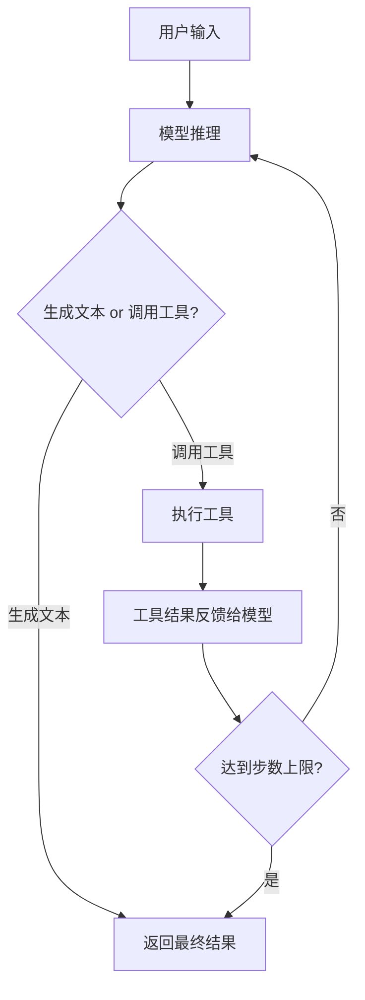

# 构建 Agent

本章介绍两种构建 Agent 的方式：使用底层的 `generateText` + 工具循环，以及使用封装好的 `ToolLoopAgent`。

[🔗 AI SDK 构建 Agent 官方文档](https://ai-sdk.dev/docs/agents/building-agents){target="_blank" rel="noopener"}

## 方式一：generateText + maxSteps

最基础的 Agent 构建方式是使用 `generateText`，配合 `tools` 和 `maxSteps`（或 `stopWhen`）参数，让模型自主决定是否调用工具：

```typescript
import { generateText, tool, stepCountIs } from 'ai'
import { z } from 'zod'
import * as mathjs from 'mathjs'

const problem = '如果收入是 5000 元，支出是 3500 元，利润是多少？'

const { text, steps } = await generateText({
  model: 'openai/gpt-4o',
  system: '你是一个数学问题求解器。逐步推理，必要时使用计算器。',
  prompt: problem,
  tools: {
    calculate: tool({
      description: '计算数学表达式',
      inputSchema: z.object({ expression: z.string() }),
      execute: async ({ expression }) => mathjs.evaluate(expression),
    }),
  },
  stopWhen: stepCountIs(5), // 最多 5 步
})

console.log(text)
// => "利润 = 收入 - 支出 = 5000 - 3500 = 1500 元"

console.log(`共执行 ${steps.length} 步`)
```

### 执行流程

每一"步"（step）中，模型会做出一个决策：

1. **生成文本** — 任务完成，返回最终回答
2. **调用工具** — 执行工具后，将结果反馈给模型，进入下一步



### 停止条件

使用 `stopWhen` 搭配 `stepCountIs()` 控制最大步数：

```typescript
import { stepCountIs } from 'ai'

const { text } = await generateText({
  model: 'openai/gpt-4o',
  prompt: '...',
  tools: { /* ... */ },
  stopWhen: stepCountIs(10), // 最多 10 步
})
```

> `maxSteps` 也可直接使用，效果等价。`stopWhen` 提供了更灵活的停止条件组合能力。

## 方式二：ToolLoopAgent

`ToolLoopAgent` 是 AI SDK 提供的标准 Agent 实现，封装了工具循环的所有细节：

```typescript
import { ToolLoopAgent, stepCountIs, tool } from 'ai'
import { z } from 'zod'

const agent = new ToolLoopAgent({
  model: 'openai/gpt-4o',
  instructions: '你是一个有帮助的助手，可以搜索和计算。',
  tools: {
    search: tool({
      description: '搜索信息',
      inputSchema: z.object({ query: z.string() }),
      execute: async ({ query }) => {
        // 实际应用中调用搜索 API
        return `关于 "${query}" 的搜索结果：...`
      },
    }),
    calculate: tool({
      description: '数学计算',
      inputSchema: z.object({ expression: z.string() }),
      execute: async ({ expression }) => String(eval(expression)),
    }),
  },
  stopWhen: stepCountIs(20),
})

// 非流式调用
const result = await agent.generate({
  prompt: '搜索 2024 年中国 GDP，然后计算同比增长率',
})
console.log(result.text)

// 流式调用
const stream = await agent.stream({
  prompt: '搜索 2024 年中国 GDP，然后计算同比增长率',
})
```

### ToolLoopAgent vs 手动 generateText

| 特性 | `ToolLoopAgent` | 手动 `generateText` |
|------|----------------|---------------------|
| 循环管理 | 内置 | 需手动实现 |
| 接口一致性 | 实现 `Agent` 接口 | 无标准接口 |
| 流式支持 | `.generate()` / `.stream()` | 需分别使用 `generateText` / `streamText` |
| 可组合性 | 可作为子 Agent 被其他 Agent 使用 | 需额外封装 |
| 灵活性 | 标准化，覆盖常见场景 | 完全自定义 |

## 工具注册与执行

### 定义工具

使用 `tool()` 函数定义工具，核心是 `description`（供模型理解）和 `inputSchema`（参数验证）：

```typescript
import { tool } from 'ai'
import { z } from 'zod'

const weatherTool = tool({
  description: '获取指定城市的天气信息',
  inputSchema: z.object({
    city: z.string().describe('城市名称'),
    unit: z.enum(['C', 'F']).describe('温度单位').default('C'),
  }),
  execute: async ({ city, unit }) => {
    // 调用天气 API
    const response = await fetch(`https://api.weather.com/v1/${city}`)
    const data = await response.json()
    return {
      city,
      temperature: unit === 'C' ? data.tempC : data.tempF,
      condition: data.condition,
    }
  },
})
```

### 工具输入校验

`inputSchema` 使用 Zod schema，模型生成的参数会自动校验。`.describe()` 提供的描述信息会传递给模型，帮助它理解参数含义：

```typescript
const searchTool = tool({
  description: '在知识库中搜索相关文档',
  inputSchema: z.object({
    query: z.string().describe('搜索关键词'),
    limit: z.number().min(1).max(20).default(5).describe('返回结果数量'),
    category: z
      .enum(['tech', 'science', 'general'])
      .optional()
      .describe('搜索类别'),
  }),
  execute: async ({ query, limit, category }) => {
    // 搜索实现
  },
})
```

### 多工具并行调用

模型可以在单步中同时调用多个工具（取决于模型能力）：

```typescript
import { generateText, tool } from 'ai'
import { z } from 'zod'

const result = await generateText({
  model: 'openai/gpt-4o',
  tools: {
    weather: tool({
      description: '获取城市天气',
      inputSchema: z.object({
        city: z.string().describe('城市名'),
      }),
      execute: async ({ city }) => ({
        city,
        temperature: 25,
        description: '晴天',
      }),
    }),
  },
  prompt: '北京和上海今天的天气怎么样？',
})

// 模型会并行调用两次 weather 工具
console.log(result.toolCalls)
// [
//   { toolName: 'weather', input: { city: '北京' } },
//   { toolName: 'weather', input: { city: '上海' } }
// ]
```

## 手动实现 Agent 循环

如果需要完全自定义控制流，可以手动实现 Agent 循环：

```typescript
import { generateText, type ModelMessage } from 'ai'

const messages: ModelMessage[] = [
  { role: 'user', content: '帮我分析这个数据集...' },
]

let step = 0
const maxSteps = 10

while (step < maxSteps) {
  const result = await generateText({
    model: 'openai/gpt-4o',
    messages,
    tools: {
      // 你的工具定义
    },
  })

  // 将模型响应加入消息历史
  messages.push(...result.response.messages)

  // 如果模型生成了文本（而非工具调用），说明任务完成
  if (result.text) {
    console.log('最终回答:', result.text)
    break
  }

  step++
}
```

这种方式提供了最大的灵活性：

- 可以在每步之间插入自定义逻辑
- 可以动态修改消息历史
- 可以根据中间结果改变工具集

## 下一步

- [工作流模式](/ai/vercel-ai-sdk/guide/workflow-patterns) — 学习顺序、路由、并行、编排器-工作者四种模式
- [Agent 进阶](/ai/vercel-ai-sdk/guide/agent-advanced) — 探索记忆系统、子 Agent 和高级控制
- [工具系统](/ai/vercel-ai-sdk/guide/tool-calling) — 深入了解工具定义与执行机制
