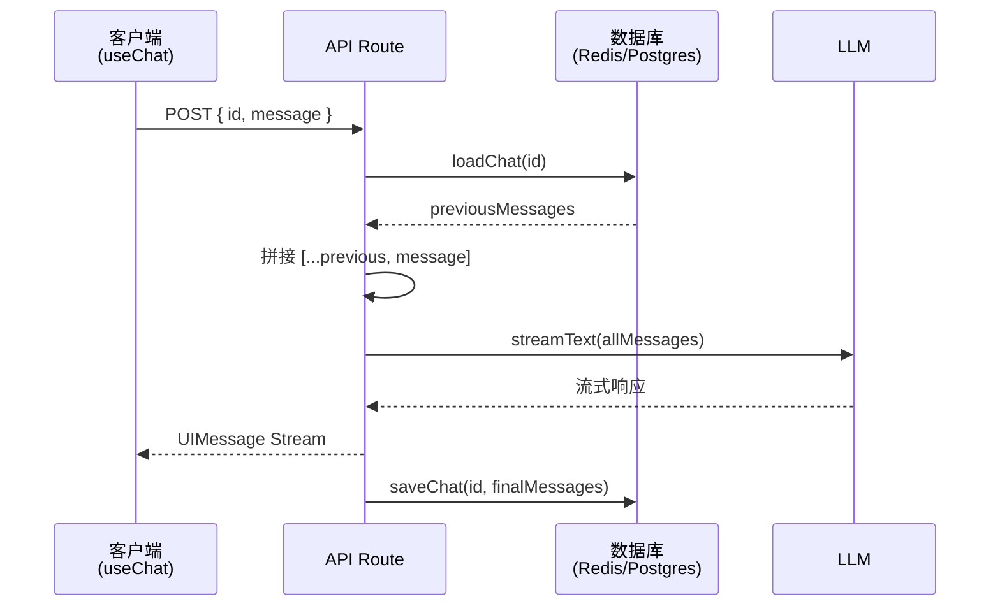

# 聊天进阶

> 基础聊天机器人只能处理单次会话。生产级应用还需要 **消息持久化**（刷新不丢失历史）、**流恢复**（断线自动重连）、**工具调用展示**（将 AI 工具调用渲染为可视化组件）等能力。本篇逐一讲解这些进阶场景。

## 1. 消息持久化

[🔗 消息持久化文档](https://ai-sdk.dev/docs/ai-sdk-ui/chatbot-message-persistence){target="_blank" rel="noopener"} 的核心思路是：**客户端只发送最新一条消息，服务端负责加载和保存完整对话历史**。

### 1.1 架构设计



### 1.2 客户端实现

客户端使用 `prepareSendMessagesRequest` 只发送最新消息和聊天 ID：

```tsx
'use client'

import { UIMessage, useChat } from '@ai-sdk/react'
import { DefaultChatTransport } from 'ai'
import { useState } from 'react'

export default function Chat({
  id,
  initialMessages,
}: {
  id?: string
  initialMessages?: UIMessage[]
}) {
  const [input, setInput] = useState('')
  const { sendMessage, messages } = useChat({
    id,
    messages: initialMessages,
    transport: new DefaultChatTransport({
      api: '/api/chat',
      // 只发送最新消息 + 聊天 ID，减少传输量
      prepareSendMessagesRequest: ({ id, messages }) => ({
        body: {
          id,
          message: messages[messages.length - 1],
        },
      }),
    }),
  })

  return (
    <div>
      {messages.map(m => (
        <div key={m.id}>
          {m.role === 'user' ? '你：' : 'AI：'}
          {m.parts
            .map(part => (part.type === 'text' ? part.text : ''))
            .join('')}
        </div>
      ))}

      <form
        onSubmit={e => {
          e.preventDefault()
          if (input.trim()) {
            sendMessage({ text: input })
            setInput('')
          }
        }}
      >
        <input value={input} onChange={e => setInput(e.target.value)} />
        <button type="submit">发送</button>
      </form>
    </div>
  )
}
```

### 1.3 服务端实现

服务端负责加载历史、验证消息、生成响应、保存结果：

```typescript
// app/api/chat/route.ts
import {
  convertToModelMessages,
  streamText,
  UIMessage,
  validateUIMessages,
} from 'ai'
import { openai } from '@ai-sdk/openai'
import { loadChat, saveChat } from '@/utils/chat-store'

export async function POST(req: Request) {
  const { message, id } = await req.json()

  // 1. 从数据库加载历史消息
  const previousMessages = await loadChat(id)

  // 2. 拼接新消息
  const messages = [...previousMessages, message]

  // 3. 验证消息（确保工具调用等数据结构正确）
  const validatedMessages = await validateUIMessages({ messages })

  // 4. 调用 LLM
  const result = streamText({
    model: openai('gpt-4o'),
    messages: convertToModelMessages(validatedMessages),
  })

  // 5. 返回流式响应，并在完成时保存
  return result.toUIMessageStreamResponse({
    originalMessages: validatedMessages,
    onFinish: ({ messages }) => {
      saveChat({ chatId: id, messages })
    },
  })
}
```

### 1.4 页面加载时恢复聊天

在 Next.js 的 Server Component 中加载历史消息并传给客户端组件：

```tsx
// app/chat/[id]/page.tsx
import { loadChat } from '@/utils/chat-store'
import Chat from '@/components/chat'

export default async function ChatPage({
  params,
}: {
  params: Promise<{ id: string }>
}) {
  const { id } = await params
  const messages = await loadChat(id)
  return <Chat id={id} initialMessages={messages} />
}
```

## 2. 流恢复（Resume Streams）

[🔗 流恢复文档](https://ai-sdk.dev/docs/ai-sdk-ui/chatbot-resume-streams){target="_blank" rel="noopener"} 解决了一个常见问题：**用户在 AI 生成过程中刷新页面，响应不会丢失**。

### 2.1 工作原理

流恢复的核心机制：

1. **流创建**：POST 请求时，将 SSE 流存储为可恢复流（Resumable Stream），生成 `streamId`
2. **流追踪**：将 `activeStreamId` 保存到聊天数据中
3. **客户端重连**：页面刷新后，`useChat` 自动发起 GET 请求恢复流
4. **流恢复**：服务端根据 `activeStreamId` 找到缓存的流并继续推送
5. **清理**：流完成后，清除 `activeStreamId`

### 2.2 客户端启用流恢复

只需设置 `resume: true`：

```tsx
'use client'

import { useChat } from '@ai-sdk/react'
import { DefaultChatTransport, type UIMessage } from 'ai'

export function Chat({
  chatData,
  resume = false,
}: {
  chatData: { id: string; messages: UIMessage[] }
  resume?: boolean
}) {
  const { messages, sendMessage, status } = useChat({
    id: chatData.id,
    messages: chatData.messages,
    resume, // 启用自动流恢复
    transport: new DefaultChatTransport({
      prepareSendMessagesRequest: ({ id, messages }) => ({
        body: {
          id,
          message: messages[messages.length - 1],
        },
      }),
    }),
  })

  return <div>{/* 聊天 UI */}</div>
}
```

### 2.3 服务端 POST 处理器

使用 `consumeSseStream` 回调创建可恢复流：

```typescript
// app/api/chat/[id]/route.ts
import { openai } from '@ai-sdk/openai'
import { readChat, saveChat } from '@/utils/chat-store'
import {
  convertToModelMessages,
  generateId,
  streamText,
  type UIMessage,
} from 'ai'
import { after } from 'next/server'
import { createResumableStreamContext } from 'resumable-stream'

export async function POST(req: Request) {
  const { message, id }: { message: UIMessage; id: string } = await req.json()

  const chat = await readChat(id)
  const messages = [...chat.messages, message]

  // 清除之前的活跃流
  saveChat({ id, messages, activeStreamId: null })

  const result = streamText({
    model: openai('gpt-4o'),
    messages: convertToModelMessages(messages),
  })

  return result.toUIMessageStreamResponse({
    originalMessages: messages,
    generateMessageId: generateId,
    onFinish: ({ messages }) => {
      // 流完成时清除活跃流 ID
      saveChat({ id, messages, activeStreamId: null })
    },
    async consumeSseStream({ stream }) {
      const streamId = generateId()

      // 创建可恢复流
      const streamContext = createResumableStreamContext({ waitUntil: after })
      await streamContext.createNewResumableStream(streamId, () => stream)

      // 记录活跃流 ID
      saveChat({ id, activeStreamId: streamId })
    },
  })
}
```

### 2.4 服务端 GET 处理器

GET 端点用于客户端重连时恢复流：

```typescript
// app/api/chat/[id]/stream/route.ts
import { readChat } from '@/utils/chat-store'
import { UI_MESSAGE_STREAM_HEADERS } from 'ai'
import { after } from 'next/server'
import { createResumableStreamContext } from 'resumable-stream'

export async function GET(
  _: Request,
  { params }: { params: Promise<{ id: string }> },
) {
  const { id } = await params
  const chat = await readChat(id)

  if (chat.activeStreamId == null) {
    // 没有活跃的流，返回 204
    return new Response(null, { status: 204 })
  }

  const streamContext = createResumableStreamContext({ waitUntil: after })

  return new Response(
    await streamContext.resumeExistingStream(chat.activeStreamId),
    { headers: UI_MESSAGE_STREAM_HEADERS },
  )
}
```

## 3. 工具调用展示

当 AI 调用工具时，消息的 `parts` 中会出现 `tool-call` 和 `tool-result` 类型的部分。你可以为不同工具渲染不同的 UI 组件。

### 3.1 渲染工具调用状态

AI SDK 为工具调用的 part 提供了 `state` 属性，反映工具的执行阶段：

```tsx
function ToolCallDisplay({ part }: { part: any }) {
  // 工具的 part.type 格式为 "tool-<toolName>"
  switch (part.state) {
    case 'input-available':
      // 工具正在执行，展示 loading
      return (
        <div className="flex items-center gap-2 text-gray-500">
          <span className="animate-spin">⏳</span>
          正在获取数据...
        </div>
      )

    case 'output-available':
      // 工具执行完成，展示结果
      return <div>{JSON.stringify(part.output)}</div>

    case 'output-error':
      // 工具执行出错
      return (
        <div className="text-red-500">
          工具调用失败: {part.errorText}
        </div>
      )

    default:
      return null
  }
}
```

### 3.2 为不同工具注册组件

```tsx
import { Weather } from '@/components/weather'
import { StockChart } from '@/components/stock-chart'

function MessageContent({ message }: { message: UIMessage }) {
  return (
    <div>
      {message.parts.map((part, index) => {
        // 文本部分
        if (part.type === 'text') {
          return <p key={index}>{part.text}</p>
        }

        // 天气工具
        if (part.type === 'tool-displayWeather') {
          switch (part.state) {
            case 'input-available':
              return <div key={index}>正在查询天气...</div>
            case 'output-available':
              return <Weather key={index} {...part.output} />
            case 'output-error':
              return <div key={index}>天气查询失败</div>
            default:
              return null
          }
        }

        // 股票工具
        if (part.type === 'tool-showStock') {
          switch (part.state) {
            case 'input-available':
              return <div key={index}>正在加载股票数据...</div>
            case 'output-available':
              return <StockChart key={index} data={part.output} />
            default:
              return null
          }
        }

        return null
      })}
    </div>
  )
}
```

## 4. 消息元数据

你可以在 `UIMessage` 上附加自定义元数据（如消息来源、置信度评分等），实现更丰富的消息展示。

### 4.1 定义元数据 Schema

```typescript
// utils/schemas.ts
import { z } from 'zod'

export const metadataSchema = z.object({
  confidence: z.number().optional(),
  model: z.string().optional(),
  sources: z
    .array(
      z.object({
        url: z.string(),
        title: z.string(),
      }),
    )
    .optional(),
})

export type MessageMetadata = z.infer<typeof metadataSchema>
```

### 4.2 服务端附加元数据

在 `toUIMessageStreamResponse` 中通过 `messageMetadata` 选项附加：

```typescript
// app/api/chat/route.ts
const result = streamText({
  model: openai('gpt-4o'),
  messages: convertToModelMessages(messages),
})

return result.toUIMessageStreamResponse({
  messageMetadata: {
    model: 'gpt-4o',
    confidence: 0.95,
  },
})
```

### 4.3 客户端读取元数据

```tsx
function MessageWithMeta({ message }: { message: UIMessage }) {
  const metadata = message.metadata as MessageMetadata | undefined

  return (
    <div>
      {/* 消息内容 */}
      {message.parts.map((part, i) =>
        part.type === 'text' ? <p key={i}>{part.text}</p> : null,
      )}

      {/* 元数据展示 */}
      {metadata && message.role === 'assistant' && (
        <div className="text-xs text-gray-400 mt-2 flex gap-4">
          {metadata.model && <span>模型: {metadata.model}</span>}
          {metadata.confidence && (
            <span>置信度: {(metadata.confidence * 100).toFixed(0)}%</span>
          )}
        </div>
      )}
    </div>
  )
}
```

## 5. 消息验证

当聊天历史中包含工具调用、自定义数据部分或元数据时，从数据库加载后需要验证其结构完整性：

```typescript
import { validateUIMessages } from 'ai'

const validatedMessages = await validateUIMessages({
  messages,
  tools,           // 确保工具调用匹配当前 schema
  metadataSchema,  // 验证元数据结构
  dataSchemas,     // 验证自定义数据部分
})
```

::: tip AI 概念说明
**消息验证** 是生产环境的关键环节。工具定义可能随版本迭代而变化（参数新增/删除），`validateUIMessages` 确保历史消息中的工具调用仍然符合当前的 Schema，避免运行时错误。
:::

## 下一步

- [生成式 UI](/ai/vercel-ai-sdk/guide/generative-ui) — 让 LLM 决定渲染 UI 组件
- [流式自定义数据](/ai/vercel-ai-sdk/guide/streaming-data) — 在 AI 响应中传输自定义结构化数据
- [流协议详解](/ai/vercel-ai-sdk/guide/stream-protocol) — 理解底层 UIMessage Stream 协议
