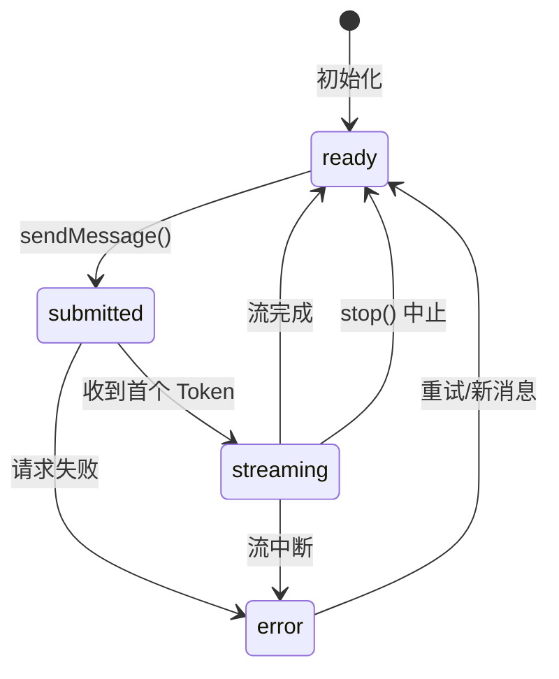

# 聊天机器人开发

> `useChat` 是 AI SDK 中最核心的前端 Hook。它封装了消息列表管理、流式通信、状态追踪等所有聊天所需的能力，让你只需关注 UI 渲染逻辑。

## 1. useChat 基础用法

[🔗 useChat API 参考](https://ai-sdk.dev/docs/reference/ai-sdk-ui/use-chat){target="_blank" rel="noopener"} 返回的核心属性：

| 属性/方法 | 类型 | 说明 |
|-----------|------|------|
| `messages` | `UIMessage[]` | 当前对话的消息列表 |
| `sendMessage` | `(msg) => void` | 发送新消息 |
| `status` | `string` | 当前状态：`ready`/`submitted`/`streaming`/`error` |
| `stop` | `() => void` | 中止当前流式响应 |
| `error` | `Error \| undefined` | 最近一次错误对象 |

### 最小示例

```tsx
'use client'

import { useChat } from '@ai-sdk/react'
import { DefaultChatTransport } from 'ai'
import { useState } from 'react'

export default function Chat() {
  const { messages, sendMessage, status } = useChat({
    transport: new DefaultChatTransport({
      api: '/api/chat',
    }),
  })
  const [input, setInput] = useState('')

  return (
    <div>
      {messages.map(message => (
        <div key={message.id}>
          {message.role === 'user' ? '你：' : 'AI：'}
          {message.parts.map((part, i) =>
            part.type === 'text' ? <span key={i}>{part.text}</span> : null,
          )}
        </div>
      ))}

      <form
        onSubmit={e => {
          e.preventDefault()
          if (input.trim()) {
            sendMessage({ text: input })
            setInput('')
          }
        }}
      >
        <input
          value={input}
          onChange={e => setInput(e.target.value)}
          disabled={status !== 'ready'}
          placeholder="输入消息..."
        />
        <button type="submit" disabled={status !== 'ready'}>
          发送
        </button>
      </form>
    </div>
  )
}
```

## 2. 服务端 API Route

聊天机器人需要一个服务端端点来调用 LLM。下面是一个 Next.js App Router 示例：

```typescript
// app/api/chat/route.ts
import { streamText, convertToModelMessages } from 'ai'
import { openai } from '@ai-sdk/openai'

export async function POST(req: Request) {
  const { messages } = await req.json()

  const result = streamText({
    model: openai('gpt-4o'),
    system: '你是一个友好的 AI 助手，用中文回答问题。',
    messages: convertToModelMessages(messages),
  })

  return result.toUIMessageStreamResponse()
}
```

::: warning 注意
`convertToModelMessages()` 将前端的 `UIMessage[]` 转换为 LLM 能理解的标准消息格式。这是连接前端 Hook 与后端 `streamText` 的关键桥梁。
:::

## 3. 消息渲染

### 3.1 UIMessage 结构

每条消息是一个 `UIMessage` 对象，内容通过 `parts` 数组组织：

```typescript
interface UIMessage {
  id: string          // 消息唯一 ID
  role: 'user' | 'assistant'  // 发送者角色
  parts: UIMessagePart[]      // 消息内容部分
}

// parts 可以是多种类型
type UIMessagePart =
  | { type: 'text'; text: string }
  | { type: 'tool-call'; toolName: string; args: unknown }
  | { type: 'tool-result'; toolName: string; result: unknown }
  | { type: 'source-url'; url: string; title?: string }
  // ... 更多类型
```

### 3.2 基于角色的样式渲染

```tsx
function MessageBubble({ message }: { message: UIMessage }) {
  const isUser = message.role === 'user'

  return (
    <div className={`flex ${isUser ? 'justify-end' : 'justify-start'} mb-4`}>
      <div
        className={`max-w-[70%] rounded-lg px-4 py-2 ${
          isUser
            ? 'bg-blue-500 text-white'
            : 'bg-gray-100 text-gray-900'
        }`}
      >
        {message.parts.map((part, i) => {
          switch (part.type) {
            case 'text':
              return <p key={i}>{part.text}</p>
            case 'tool-call':
              return (
                <div key={i} className="text-sm text-gray-500 italic">
                  正在调用工具: {part.toolName}...
                </div>
              )
            case 'tool-result':
              return (
                <pre key={i} className="text-xs bg-gray-200 p-2 rounded mt-1">
                  {JSON.stringify(part.result, null, 2)}
                </pre>
              )
            default:
              return null
          }
        })}
      </div>
    </div>
  )
}
```

## 4. 状态管理

### 4.1 status 生命周期

`useChat` 的 `status` 反映了对话的完整生命周期：



### 4.2 根据状态控制 UI

```tsx
export default function Chat() {
  const { messages, sendMessage, status, stop } = useChat({
    transport: new DefaultChatTransport({ api: '/api/chat' }),
  })
  const [input, setInput] = useState('')

  return (
    <div>
      {/* 消息列表 */}
      {messages.map(msg => (
        <MessageBubble key={msg.id} message={msg} />
      ))}

      {/* 加载/停止状态 */}
      {(status === 'submitted' || status === 'streaming') && (
        <div className="flex items-center gap-2 text-gray-500">
          {status === 'submitted' && <span>AI 正在思考...</span>}
          {status === 'streaming' && <span>AI 正在回答...</span>}
          <button
            onClick={() => stop()}
            className="text-red-500 text-sm underline"
          >
            停止生成
          </button>
        </div>
      )}

      {/* 输入框 */}
      <form
        onSubmit={e => {
          e.preventDefault()
          if (input.trim()) {
            sendMessage({ text: input })
            setInput('')
          }
        }}
      >
        <input
          value={input}
          onChange={e => setInput(e.target.value)}
          disabled={status !== 'ready'}
          placeholder={status === 'ready' ? '输入消息...' : '等待回复中...'}
        />
        <button type="submit" disabled={status !== 'ready'}>
          发送
        </button>
      </form>
    </div>
  )
}
```

## 5. 错误处理

### 5.1 显示错误信息

```tsx
export default function Chat() {
  const { messages, sendMessage, status, error } = useChat({
    transport: new DefaultChatTransport({ api: '/api/chat' }),
  })

  return (
    <div>
      {messages.map(msg => (
        <MessageBubble key={msg.id} message={msg} />
      ))}

      {/* 错误提示 */}
      {error && (
        <div className="bg-red-50 border border-red-200 rounded-lg p-4 my-4">
          <p className="text-red-700 font-medium">发生错误</p>
          <p className="text-red-600 text-sm mt-1">{error.message}</p>
          <button
            onClick={() => sendMessage({ text: '请重试' })}
            className="mt-2 text-sm text-red-700 underline"
          >
            重试
          </button>
        </div>
      )}

      {/* 输入区域 */}
      {/* ... */}
    </div>
  )
}
```

### 5.2 服务端错误处理

```typescript
// app/api/chat/route.ts
import { streamText, convertToModelMessages } from 'ai'
import { openai } from '@ai-sdk/openai'

export async function POST(req: Request) {
  try {
    const { messages } = await req.json()

    const result = streamText({
      model: openai('gpt-4o'),
      messages: convertToModelMessages(messages),
      maxTokens: 1000,
    })

    return result.toUIMessageStreamResponse()
  } catch (error) {
    return new Response(
      JSON.stringify({ error: 'AI 服务暂时不可用，请稍后重试' }),
      { status: 500, headers: { 'Content-Type': 'application/json' } },
    )
  }
}
```

## 6. 自定义请求配置

### 6.1 自定义请求头和请求体

通过 `DefaultChatTransport` 的 `prepareSendMessagesRequest` 配置请求细节：

```tsx
import { useChat } from '@ai-sdk/react'
import { DefaultChatTransport } from 'ai'

export default function Chat() {
  const { messages, sendMessage } = useChat({
    transport: new DefaultChatTransport({
      api: '/api/chat',
      headers: {
        Authorization: `Bearer ${token}`,
        'X-Custom-Header': 'value',
      },
      // 自定义请求体
      prepareSendMessagesRequest: ({ id, messages }) => ({
        body: {
          id,
          message: messages[messages.length - 1],
          model: 'gpt-4o',       // 自定义参数
          temperature: 0.7,
        },
      }),
    }),
  })

  // ...
}
```

### 6.2 初始消息与系统提示

```tsx
const { messages, sendMessage } = useChat({
  // 预设初始消息
  messages: [
    {
      id: 'welcome',
      role: 'assistant',
      parts: [{ type: 'text', text: '你好！我是你的 AI 助手，有什么可以帮你的吗？' }],
    },
  ],
  transport: new DefaultChatTransport({ api: '/api/chat' }),
})
```

## 7. 完整聊天机器人示例

将以上内容整合为一个完整的聊天机器人：

```tsx
'use client'

import { useChat } from '@ai-sdk/react'
import { DefaultChatTransport } from 'ai'
import { useState, useRef, useEffect } from 'react'

export default function Chatbot() {
  const { messages, sendMessage, status, stop, error } = useChat({
    transport: new DefaultChatTransport({ api: '/api/chat' }),
  })
  const [input, setInput] = useState('')
  const bottomRef = useRef<HTMLDivElement>(null)

  // 自动滚动到底部
  useEffect(() => {
    bottomRef.current?.scrollIntoView({ behavior: 'smooth' })
  }, [messages])

  const handleSubmit = (e: React.FormEvent) => {
    e.preventDefault()
    if (input.trim() && status === 'ready') {
      sendMessage({ text: input })
      setInput('')
    }
  }

  return (
    <div className="flex flex-col h-screen max-w-2xl mx-auto">
      {/* 消息区域 */}
      <div className="flex-1 overflow-y-auto p-4 space-y-4">
        {messages.map(message => (
          <div
            key={message.id}
            className={`flex ${
              message.role === 'user' ? 'justify-end' : 'justify-start'
            }`}
          >
            <div
              className={`max-w-[70%] rounded-lg px-4 py-2 ${
                message.role === 'user'
                  ? 'bg-blue-500 text-white'
                  : 'bg-gray-100 text-gray-900'
              }`}
            >
              {message.parts.map((part, i) =>
                part.type === 'text' ? <p key={i}>{part.text}</p> : null,
              )}
            </div>
          </div>
        ))}

        {/* 状态指示 */}
        {status === 'submitted' && (
          <div className="text-gray-400 text-sm animate-pulse">
            AI 正在思考...
          </div>
        )}

        {/* 错误提示 */}
        {error && (
          <div className="bg-red-50 text-red-600 p-3 rounded-lg text-sm">
            {error.message}
          </div>
        )}

        <div ref={bottomRef} />
      </div>

      {/* 输入区域 */}
      <div className="border-t p-4">
        {(status === 'submitted' || status === 'streaming') && (
          <button
            onClick={() => stop()}
            className="mb-2 text-sm text-gray-500 hover:text-red-500"
          >
            停止生成
          </button>
        )}

        <form onSubmit={handleSubmit} className="flex gap-2">
          <input
            value={input}
            onChange={e => setInput(e.target.value)}
            disabled={status !== 'ready'}
            placeholder="输入消息..."
            className="flex-1 border rounded-lg px-4 py-2"
          />
          <button
            type="submit"
            disabled={status !== 'ready' || !input.trim()}
            className="bg-blue-500 text-white px-6 py-2 rounded-lg disabled:opacity-50"
          >
            发送
          </button>
        </form>
      </div>
    </div>
  )
}
```

## 下一步

- [聊天进阶](/ai/vercel-ai-sdk/guide/chatbot-advanced) — 消息持久化、流恢复、工具调用展示
- [生成式 UI](/ai/vercel-ai-sdk/guide/generative-ui) — 让 LLM 决定渲染 UI 组件
- [流式自定义数据](/ai/vercel-ai-sdk/guide/streaming-data) — 在 AI 响应中附带自定义数据
