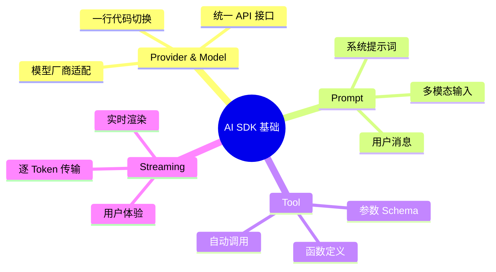
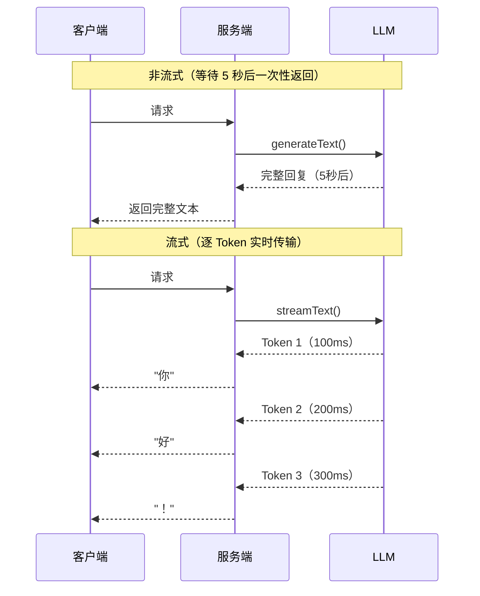
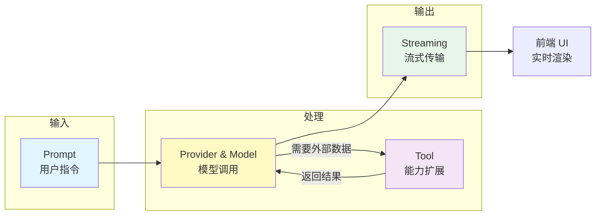

# 四大基础概念

AI SDK 的所有功能都围绕四个核心概念展开：**Provider 与 Model**（模型接入）、**Prompt**（指令输入）、**Tool**（能力扩展）和 **Streaming**（流式传输）。理解这四个概念，就掌握了 AI SDK 的核心心智模型。



## 1. Provider 与 Model

### 1.1 什么是 Provider

Provider 是 AI SDK 对模型厂商 API 的适配层。每个 Provider 包负责：

- 处理特定厂商的 API 认证和请求格式
- 将 AI SDK 的统一接口映射为厂商特定的 API 调用
- 处理响应解析和错误映射

```typescript
// 不同 Provider，统一使用方式
import { openai } from '@ai-sdk/openai'        // OpenAI Provider
import { anthropic } from '@ai-sdk/anthropic'  // Anthropic Provider
import { google } from '@ai-sdk/google'        // Google Provider

// 创建模型实例——语法完全一致
const gpt4o = openai('gpt-4o')
const claude = anthropic('claude-sonnet-4-5-20250929')
const gemini = google('gemini-2.0-flash')
```

::: tip 前端类比
Provider 就像前端的数据库驱动：Prisma 可以连接 PostgreSQL、MySQL、SQLite，接口不变；AI SDK 的 Provider 可以连接 OpenAI、Anthropic、Google，`streamText` / `generateText` 的调用方式也不变。
:::

**AI SDK 原生语义**：Provider 实现了 AI SDK 定义的 `LanguageModelV1` 接口规范。任何符合该接口的实现都可以作为 Provider，这意味着你甚至可以为私有模型编写自定义 Provider。AI SDK 提供了一系列官方 Provider（first-party）、OpenAI 兼容 Provider，以及社区维护的 Provider。

### 1.2 模型配置

你可以在创建模型时传入配置选项：

```typescript
import { openai } from '@ai-sdk/openai'

const model = openai('gpt-4o', {
  // 模型级别的默认参数
})
```

也可以在调用函数时覆盖参数：

```typescript
import { generateText } from 'ai'

const { text } = await generateText({
  model: openai('gpt-4o'),
  prompt: '你好',
  temperature: 0.7,    // 控制随机性（0=确定性，1=创造性）
  maxTokens: 1000,     // 最大输出 Token 数
})
```

### 1.3 自定义 Provider 实例

当你需要自定义 API Key、Base URL 或其他配置时：

```typescript
import { createOpenAI } from '@ai-sdk/openai'

// 创建自定义 OpenAI Provider 实例
const myOpenAI = createOpenAI({
  apiKey: process.env.MY_OPENAI_KEY,
  baseURL: 'https://my-proxy.example.com/v1',  // 自定义代理地址
})

const model = myOpenAI('gpt-4o')
```

### 1.4 主流 Provider 一览

| Provider 包 | 厂商 | 代表模型 | 安装 |
|-------------|------|---------|------|
| `@ai-sdk/openai` | OpenAI | GPT-4o, o1, GPT-4o-mini | `pnpm add @ai-sdk/openai` |
| `@ai-sdk/anthropic` | Anthropic | Claude 4 Sonnet/Opus | `pnpm add @ai-sdk/anthropic` |
| `@ai-sdk/google` | Google | Gemini 2.0 Flash/Pro | `pnpm add @ai-sdk/google` |
| `@ai-sdk/mistral` | Mistral | Mistral Large/Small | `pnpm add @ai-sdk/mistral` |
| `@ai-sdk/amazon-bedrock` | AWS | 多模型通过 Bedrock | `pnpm add @ai-sdk/amazon-bedrock` |
| `@ai-sdk/azure` | Azure | OpenAI 模型通过 Azure | `pnpm add @ai-sdk/azure` |

## 2. Prompt（提示词）

### 2.1 三种消息角色

AI SDK 支持标准的聊天消息格式，包含三种角色：

```typescript
import { generateText } from 'ai'
import { openai } from '@ai-sdk/openai'

const { text } = await generateText({
  model: openai('gpt-4o'),
  messages: [
    // system：定义 AI 的角色和行为规则
    { role: 'system', content: '你是一个专业的 TypeScript 教练。' },

    // user：用户的输入
    { role: 'user', content: '解释一下 TypeScript 的泛型。' },

    // assistant：AI 的历史回复（用于多轮对话）
    { role: 'assistant', content: '泛型是 TypeScript 的核心特性之一...' },

    // user：后续提问
    { role: 'user', content: '给我一个实际的例子。' },
  ],
})
```

::: tip 前端类比
`messages` 数组就像 Redux 的 action history——每条消息记录了"谁说了什么"，LLM 根据完整的历史上下文来生成下一条回复。`system` 消息相当于 Redux 的初始 state，定义了整体行为。
:::

**AI SDK 原生语义**：AI SDK 区分两种消息类型：`UIMessage`（前端格式，包含 `parts` 数组支持富文本）和 `ModelMessage`（模型格式，包含 `content` 字段）。`convertToModelMessages()` 函数负责两者之间的转换。在直接使用 Core API 时，你可以直接传入 `ModelMessage` 格式。

### 2.2 简写：prompt 参数

对于单轮对话，可以使用 `prompt` 简写代替 `messages`：

```typescript
// 简写方式——适合单轮调用
const { text } = await generateText({
  model: openai('gpt-4o'),
  prompt: '用一句话解释 React Server Components',
})

// 等价于
const { text } = await generateText({
  model: openai('gpt-4o'),
  messages: [
    { role: 'user', content: '用一句话解释 React Server Components' },
  ],
})
```

### 2.3 多模态 Prompt

AI SDK 支持在消息中包含图片、文件等多模态内容：

```typescript
import { generateText } from 'ai'
import { openai } from '@ai-sdk/openai'

const { text } = await generateText({
  model: openai('gpt-4o'),
  messages: [
    {
      role: 'user',
      content: [
        { type: 'text', text: '描述这张图片中的内容' },
        {
          type: 'image',
          image: new URL('https://example.com/photo.jpg'),
        },
      ],
    },
  ],
})
```

支持的内容类型：

| 类型 | 说明 | 支持的模型 |
|------|------|-----------|
| `text` | 文本内容 | 所有模型 |
| `image` | 图片（URL 或 Base64） | GPT-4o、Claude 4、Gemini 等 |
| `file` | 文件（PDF 等） | 部分模型 |

## 3. Tool（工具）

### 3.1 什么是 Tool

Tool 是你定义给 LLM 的**可调用函数**。LLM 根据用户意图决定是否调用 Tool、传入什么参数，AI SDK 负责执行并返回结果。

```typescript
import { generateText, tool } from 'ai'
import { openai } from '@ai-sdk/openai'
import { z } from 'zod'

const result = await generateText({
  model: openai('gpt-4o'),
  tools: {
    getWeather: tool({
      description: '获取指定城市的当前天气',     // LLM 根据描述判断何时调用
      parameters: z.object({                    // Zod Schema 定义参数
        city: z.string().describe('城市名称'),
      }),
      execute: async ({ city }) => {            // 实际执行逻辑
        // 调用真实的天气 API
        return { city, temperature: '22°C', condition: '晴' }
      },
    }),
  },
  prompt: '北京今天天气怎么样？',
})
```

::: tip 前端类比
Tool 的概念类似于 GraphQL 的 Resolver：你定义"这个函数做什么"（description）和"需要什么参数"（parameters），系统根据请求自动路由到正确的函数执行。LLM 扮演了"智能路由器"的角色——它读懂用户意图，自动选择并调用合适的 Tool。
:::

**AI SDK 原生语义**：Tool 是 AI SDK 中扩展 LLM 能力的核心机制。LLM 本身只能处理文本，但通过 Tool，它可以查询数据库、调用 API、执行计算等。工具调用的流程是：LLM 生成 tool call 请求 → AI SDK 执行 `execute` 函数 → 结果返回给 LLM → LLM 生成最终回复。

### 3.2 Tool 的三要素

| 要素 | 说明 | 类型 |
|------|------|------|
| `description` | 工具的自然语言描述，LLM 据此判断何时使用 | `string` |
| `parameters` | Zod Schema，定义参数类型和约束 | `z.ZodObject` |
| `execute` | 实际执行函数，接收校验后的参数 | `async (params) => result` |

::: info 更多细节
Tool 的完整用法（多工具协作、工具链、maxSteps 等）将在 [工具调用](/ai/vercel-ai-sdk/guide/tool-calling) 页面详细讲解。
:::

## 4. Streaming（流式传输）

### 4.1 为什么需要流式传输

LLM 生成文本通常需要数秒甚至数十秒。如果等生成完再一次性返回，用户会面对一个长时间的空白等待。流式传输让 AI 的回复逐字显示，极大提升用户体验。



### 4.2 `generateText` vs `streamText`

AI SDK 为每个核心操作都提供了"生成"和"流式"两个版本：

```typescript
import { generateText, streamText } from 'ai'
import { openai } from '@ai-sdk/openai'

// 非流式——等待完成后返回完整结果
const { text } = await generateText({
  model: openai('gpt-4o'),
  prompt: '写一首关于 TypeScript 的诗',
})
console.log(text) // 一次性输出完整诗歌

// 流式——逐 Token 返回
const result = streamText({
  model: openai('gpt-4o'),
  prompt: '写一首关于 TypeScript 的诗',
})

for await (const chunk of result.textStream) {
  process.stdout.write(chunk) // 逐字输出
}
```

| 函数 | 返回值 | 适用场景 |
|------|--------|---------|
| `generateText` | `Promise<{ text, ... }>` | 后台任务、不需要实时显示 |
| `streamText` | `StreamTextResult` | 聊天 UI、实时显示 |
| `generateObject` | `Promise<{ object, ... }>` | 结构化数据提取 |
| `streamObject` | `StreamObjectResult` | 逐步构建结构化数据 |

::: tip 前端类比
`generateText` vs `streamText` 的区别，就像 `fetch` 返回 `response.json()` vs `response.body.getReader()` 的区别——前者等待完整数据，后者逐块读取。`useChat` Hook 内部就是基于 `ReadableStream` 解析 SSE 流。
:::

**AI SDK 原生语义**：AI SDK 的流式传输基于 Web Streams API（`ReadableStream`）实现，与浏览器原生流 API 完全兼容。`streamText` 返回的 `StreamTextResult` 对象提供多种消费方式：`textStream`（纯文本流）、`fullStream`（包含工具调用等完整事件流）、`toUIMessageStreamResponse()`（转为 HTTP 流响应供 `useChat` 消费）。

### 4.3 与前端 Hook 的配合

流式传输的真正威力在于与前端 Hook 的无缝配合：

```typescript
// 服务端：返回流式响应
return result.toUIMessageStreamResponse()
```

```tsx
// 前端：useChat 自动处理流
const { messages, isLoading } = useChat()
// messages 的最后一条会实时更新，isLoading 自动切换
```

不需要手动处理 `EventSource`、`ReadableStream` 或 `TextDecoder`——AI SDK UI 层已经全部封装好了。

## 5. 四大概念协作关系



一次典型的 AI 交互流程：

1. **Prompt**：用户输入"北京天气怎么样"
2. **Provider & Model**：通过 OpenAI Provider 调用 GPT-4o
3. **Tool**：LLM 判断需要调用 `getWeather` 工具，AI SDK 执行并返回结果
4. **Streaming**：LLM 根据天气数据生成回复，逐 Token 流式传输到前端

## 下一步

- [文本生成](/ai/vercel-ai-sdk/guide/generating-text) — 深入掌握 `generateText` 和 `streamText`
- [结构化输出](/ai/vercel-ai-sdk/guide/structured-output) — 让 AI 返回结构化数据
- [工具调用](/ai/vercel-ai-sdk/guide/tool-calling) — 完整的 Tool 使用指南
- [UI 集成概览](/ai/vercel-ai-sdk/guide/ui-overview) — 了解所有前端 Hook

## 参考资源

- [Provider 与 Model 文档](https://ai-sdk.dev/docs/foundations/providers-and-models){target="_blank" rel="noopener"} — 官方 Provider 完整指南
- [Prompt 文档](https://ai-sdk.dev/docs/foundations/prompts){target="_blank" rel="noopener"} — 官方 Prompt 设计指南
- [Tool 文档](https://ai-sdk.dev/docs/foundations/tools){target="_blank" rel="noopener"} — 官方 Tool 完整文档
- [Streaming 文档](https://ai-sdk.dev/docs/foundations/streaming){target="_blank" rel="noopener"} — 官方 Streaming 详解
