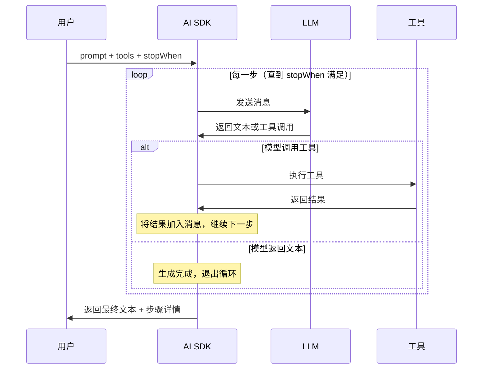

# 文本生成

## 概述

文本生成是 AI 应用最核心的能力。AI SDK 提供两个核心函数来实现文本生成：`generateText` 用于一次性生成完整文本，`streamText` 用于流式逐字输出。两者共享相同的参数接口，但在响应模式上有本质区别。

[🔗 generateText API 参考](https://ai-sdk.dev/docs/reference/ai-sdk-core/generate-text){target="_blank" rel="noopener"} | [🔗 streamText API 参考](https://ai-sdk.dev/docs/reference/ai-sdk-core/stream-text){target="_blank" rel="noopener"}

::: tip 前端类比
`generateText` 类似于 `fetch` 等待完整响应后返回，而 `streamText` 类似于 `ReadableStream` 的流式消费模式。如果你用过 `EventSource` 或 Server-Sent Events，那么 `streamText` 的体验几乎一样——数据到达一部分就渲染一部分，用户无需等待全部内容生成完毕。

**AI SDK 原生语义**：`streamText` 返回的 `textStream` 同时实现了 `AsyncIterable` 和 `ReadableStream` 接口，你可以用 `for await...of` 迭代，也可以直接当作 Web Stream 使用。
:::

## 核心参数

`generateText` 和 `streamText` 共享以下关键参数：

| 参数 | 类型 | 说明 |
| --- | --- | --- |
| `model` | `LanguageModel` | 使用的模型，如 `openai('gpt-4o')` |
| `prompt` | `string` | 简单文本提示（与 `messages` 二选一） |
| `messages` | `ModelMessage[]` | 多轮对话消息数组（与 `prompt` 二选一） |
| `system` | `string` | 系统提示词，定义 AI 的角色和行为约束 |
| `maxTokens` | `number` | 最大生成 token 数量 |
| `temperature` | `number` | 温度参数（0-2），越高输出越随机 |

## generateText：一次性生成

适用于后端处理、批量任务、不需要实时展示的场景：

```typescript
import { generateText } from 'ai'
import { openai } from '@ai-sdk/openai'

const { text, usage, finishReason } = await generateText({
  model: openai('gpt-4o'),
  system: '你是一位资深的前端技术专家。',
  prompt: '解释 React Server Components 的核心原理。',
  maxTokens: 1000,
  temperature: 0.7,
})

console.log(text) // 完整的生成文本
console.log(usage) // { promptTokens: 23, completionTokens: 456, totalTokens: 479 }
console.log(finishReason) // 'stop' | 'length' | 'tool-calls' | ...
```

### 使用 messages 进行多轮对话

```typescript
import { generateText } from 'ai'
import { openai } from '@ai-sdk/openai'

const { text } = await generateText({
  model: openai('gpt-4o'),
  system: '你是一位 TypeScript 编程助手。',
  messages: [
    { role: 'user', content: '什么是泛型？' },
    {
      role: 'assistant',
      content: '泛型是 TypeScript 中实现类型参数化的机制……',
    },
    { role: 'user', content: '能举一个实际的使用例子吗？' },
  ],
})
```

## streamText：流式生成

适用于聊天界面、实时交互等需要逐步展示内容的场景：

```typescript
import { streamText } from 'ai'
import { openai } from '@ai-sdk/openai'

const result = streamText({
  model: openai('gpt-4o'),
  prompt: '发明一个新节日并描述它的传统。',
})

// 方式 1：使用 async iterable 迭代
for await (const textPart of result.textStream) {
  process.stdout.write(textPart)
}
```

### 在 Next.js API 路由中使用

`streamText` 可以直接转换为多种响应格式，适配不同的前端消费方式：

```typescript
import { streamText } from 'ai'
import { openai } from '@ai-sdk/openai'

export async function POST(req: Request) {
  const { prompt }: { prompt: string } = await req.json()

  const result = streamText({
    model: openai('gpt-4o'),
    system: '你是一个有帮助的助手。',
    prompt,
  })

  // 转换为 UI 消息流响应，前端可用 useChat 消费
  return result.toUIMessageStreamResponse()
}
```

### 获取流式生成的元数据

流式生成完成后，可以通过 `await` 获取元数据：

```typescript
const result = streamText({
  model: openai('gpt-4o'),
  prompt: '写一首关于编程的诗。',
})

// 先消费流
for await (const textPart of result.textStream) {
  process.stdout.write(textPart)
}

// 流结束后获取元数据
console.log('\nUsage:', await result.usage)
console.log('Finish reason:', await result.finishReason)
```

## 多步生成（Multi-step）

通过 `stopWhen` 配合 `stepCountIs`，可以让模型在多个步骤中完成复杂任务。最常见的场景是结合工具调用——模型先调用工具获取数据，再基于工具结果生成最终回答：

```typescript
import { generateText, tool, stepCountIs } from 'ai'
import { openai } from '@ai-sdk/openai'
import { z } from 'zod'

const { text, steps } = await generateText({
  model: openai('gpt-4o'),
  tools: {
    weather: tool({
      description: '获取指定城市的天气信息',
      inputSchema: z.object({
        location: z.string().describe('城市名称'),
      }),
      execute: async ({ location }) => ({
        location,
        temperature: 72 + Math.floor(Math.random() * 21) - 10,
        condition: '晴天',
      }),
    }),
  },
  stopWhen: stepCountIs(5), // 最多执行 5 步
  prompt: '上海今天天气怎么样？',
})

// text: 模型基于工具结果生成的最终回答
// steps: 每一步的详细信息（工具调用、中间结果等）
console.log(text)
console.log(`总共执行了 ${steps.length} 步`)
```

### 多步生成流程



`streamText` 同样支持多步生成：

```typescript
import { streamText, tool, stepCountIs } from 'ai'
import { openai } from '@ai-sdk/openai'
import { z } from 'zod'

const result = streamText({
  model: openai('gpt-4o'),
  tools: {
    weather: tool({
      description: '获取天气信息',
      inputSchema: z.object({
        location: z.string().describe('城市名称'),
      }),
      execute: async ({ location }) => ({
        location,
        temperature: 25,
      }),
    }),
  },
  stopWhen: stepCountIs(5),
  prompt: '北京和上海今天哪个更热？',
})

for await (const textPart of result.textStream) {
  process.stdout.write(textPart)
}
```

## 最佳实践

### 选择 generateText 还是 streamText

| 场景 | 推荐函数 | 原因 |
| --- | --- | --- |
| 聊天界面 | `streamText` | 用户可以实时看到生成过程，体验更好 |
| 后端数据处理 | `generateText` | 无需流式输出，代码更简单 |
| API 网关 | `streamText` | 避免长时间等待导致超时 |
| 批量任务 | `generateText` | 逻辑简单，便于错误处理 |

### 提示词技巧

- **system** 用于定义角色和通用规则，在多轮对话中始终生效
- **temperature** 设为 0 获取确定性输出，设为 0.7-1.0 获取创意性输出
- **maxTokens** 建议始终设置上限，避免意外的长输出消耗过多 token

## 下一步

- [结构化输出](/ai/vercel-ai-sdk/guide/structured-output) — 让模型返回符合 Schema 的 JSON 对象
- [工具调用](/ai/vercel-ai-sdk/guide/tool-calling) — 让模型调用外部函数获取实时数据
- [多模态](/ai/vercel-ai-sdk/guide/multimodal) — 处理图片、语音等多种媒体类型
