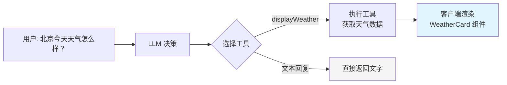
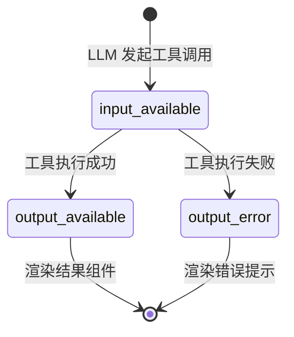

# 生成式 UI

> 传统聊天机器人只能返回文本。**生成式 UI**（Generative UI）让 LLM 通过工具调用决定渲染什么 UI 组件——天气卡片、股票图表、航班状态——真正实现"AI 驱动的界面"。

## 1. 什么是生成式 UI

[🔗 生成式 UI 文档](https://ai-sdk.dev/docs/ai-sdk-ui/generative-user-interfaces){target="_blank" rel="noopener"} 的核心理念：

**LLM 不仅生成文本，还能"生成界面"。** 具体来说：

1. LLM 通过工具调用表达"我需要展示一个天气卡片"
2. 服务端执行工具获取数据
3. 客户端根据工具名称和输出，渲染对应的 React 组件



::: tip AI 概念说明
**生成式 UI** 本质上是 **工具调用 + 组件映射**。LLM 并不直接返回 HTML 或 JSX，而是通过结构化的工具调用返回数据，由前端根据工具名称选择对应组件进行渲染。这种模式保持了类型安全和可预测性。
:::

## 2. 实现步骤

### 2.1 定义工具（服务端）

首先在服务端定义工具——LLM 可以调用的"能力"：

```typescript
// app/api/chat/route.ts
import { streamText, convertToModelMessages, tool } from 'ai'
import { openai } from '@ai-sdk/openai'
import { z } from 'zod'

export async function POST(req: Request) {
  const { messages } = await req.json()

  const result = streamText({
    model: openai('gpt-4o'),
    system: '你是一个天气助手，用户询问天气时使用 displayWeather 工具。',
    messages: convertToModelMessages(messages),
    tools: {
      displayWeather: tool({
        description: '显示指定城市的天气信息',
        parameters: z.object({
          city: z.string().describe('城市名称'),
          unit: z.enum(['C', 'F']).describe('温度单位').default('C'),
        }),
        execute: async ({ city, unit }) => {
          // 实际项目中调用天气 API
          const weatherData = await fetchWeather(city, unit)
          return {
            city,
            temperature: weatherData.temperature,
            unit,
            description: weatherData.description,
            humidity: weatherData.humidity,
            forecast: weatherData.forecast,
          }
        },
      }),
    },
  })

  return result.toUIMessageStreamResponse()
}
```

### 2.2 创建 UI 组件

为每个工具创建对应的 React 组件：

```tsx
// components/weather.tsx
interface WeatherProps {
  city: string
  temperature: number
  unit: 'C' | 'F'
  description: string
  humidity: number
  forecast: { day: string; temp: number; description: string }[]
}

export function Weather({
  city,
  temperature,
  unit,
  description,
  humidity,
  forecast,
}: WeatherProps) {
  return (
    <div className="border rounded-xl p-4 bg-gradient-to-br from-blue-50 to-blue-100 max-w-sm">
      <div className="flex justify-between items-start">
        <div>
          <h3 className="text-lg font-semibold">{city}</h3>
          <p className="text-gray-600">{description}</p>
        </div>
        <span className="text-3xl font-bold">
          {temperature}°{unit}
        </span>
      </div>

      <div className="mt-3 text-sm text-gray-500">
        湿度: {humidity}%
      </div>

      {forecast && (
        <div className="mt-4 flex gap-2">
          {forecast.map(day => (
            <div
              key={day.day}
              className="flex-1 text-center bg-white rounded-lg p-2"
            >
              <div className="text-xs text-gray-500">{day.day}</div>
              <div className="font-semibold">
                {day.temp}°{unit}
              </div>
              <div className="text-xs">{day.description}</div>
            </div>
          ))}
        </div>
      )}
    </div>
  )
}
```

### 2.3 客户端渲染（核心）

在消息渲染中，根据 `part.type` 匹配工具名称，渲染对应组件：

```tsx
'use client'

import { useChat } from '@ai-sdk/react'
import { useState } from 'react'
import { Weather } from '@/components/weather'

export default function Page() {
  const [input, setInput] = useState('')
  const { messages, sendMessage } = useChat()

  return (
    <div>
      {messages.map(message => (
        <div key={message.id}>
          <div className="font-semibold mb-1">
            {message.role === 'user' ? '你' : 'AI'}
          </div>
          <div>
            {message.parts.map((part, index) => {
              // 文本部分 → 直接渲染
              if (part.type === 'text') {
                return <span key={index}>{part.text}</span>
              }

              // 天气工具 → 渲染 Weather 组件
              if (part.type === 'tool-displayWeather') {
                switch (part.state) {
                  case 'input-available':
                    return (
                      <div key={index} className="animate-pulse text-gray-400">
                        正在查询天气...
                      </div>
                    )
                  case 'output-available':
                    return <Weather key={index} {...part.output} />
                  case 'output-error':
                    return (
                      <div key={index} className="text-red-500">
                        查询失败: {part.errorText}
                      </div>
                    )
                  default:
                    return null
                }
              }

              return null
            })}
          </div>
        </div>
      ))}

      <form
        onSubmit={e => {
          e.preventDefault()
          sendMessage({ text: input })
          setInput('')
        }}
      >
        <input
          value={input}
          onChange={e => setInput(e.target.value)}
          placeholder="问我天气..."
        />
        <button type="submit">发送</button>
      </form>
    </div>
  )
}
```

## 3. 多工具组件映射

实际应用中，你可能需要多个工具，每个工具对应不同的组件：

### 3.1 定义多个工具

```typescript
// app/api/chat/route.ts
const result = streamText({
  model: openai('gpt-4o'),
  system: `你是一个智能助手。
    - 用户问天气时使用 displayWeather 工具
    - 用户问股票时使用 showStock 工具
    - 用户问航班时使用 showFlight 工具
    - 其他问题直接文字回复`,
  messages: convertToModelMessages(messages),
  tools: {
    displayWeather: tool({
      description: '显示天气信息',
      parameters: z.object({
        city: z.string(),
      }),
      execute: async ({ city }) => {
        return await fetchWeather(city)
      },
    }),
    showStock: tool({
      description: '显示股票行情图表',
      parameters: z.object({
        symbol: z.string().describe('股票代码'),
        period: z.enum(['1d', '1w', '1m', '3m']).default('1w'),
      }),
      execute: async ({ symbol, period }) => {
        return await fetchStockData(symbol, period)
      },
    }),
    showFlight: tool({
      description: '显示航班状态',
      parameters: z.object({
        flightNumber: z.string().describe('航班号'),
      }),
      execute: async ({ flightNumber }) => {
        return await fetchFlightStatus(flightNumber)
      },
    }),
  },
})
```

### 3.2 组件注册表模式

推荐使用注册表模式统一管理工具组件映射：

```tsx
// components/tool-registry.tsx
import { Weather } from './weather'
import { StockChart } from './stock-chart'
import { FlightStatus } from './flight-status'
import type { ReactNode } from 'react'

// 工具组件注册表
const toolComponents: Record<
  string,
  {
    loading: (args: any) => ReactNode
    success: (output: any) => ReactNode
    error: (errorText: string) => ReactNode
  }
> = {
  displayWeather: {
    loading: args => <div>正在查询 {args.city} 的天气...</div>,
    success: output => <Weather {...output} />,
    error: text => <div className="text-red-500">天气查询失败: {text}</div>,
  },
  showStock: {
    loading: args => <div>正在加载 {args.symbol} 股票数据...</div>,
    success: output => <StockChart {...output} />,
    error: text => <div className="text-red-500">股票数据加载失败: {text}</div>,
  },
  showFlight: {
    loading: args => <div>正在查询航班 {args.flightNumber}...</div>,
    success: output => <FlightStatus {...output} />,
    error: text => <div className="text-red-500">航班查询失败: {text}</div>,
  },
}

// 通用工具渲染器
export function ToolRenderer({ part }: { part: any }) {
  // part.type 格式为 "tool-<toolName>"
  const toolName = part.type.replace('tool-', '')
  const component = toolComponents[toolName]

  if (!component) return null

  switch (part.state) {
    case 'input-available':
      return component.loading(part.input)
    case 'output-available':
      return component.success(part.output)
    case 'output-error':
      return component.error(part.errorText)
    default:
      return null
  }
}
```

### 3.3 在消息渲染中使用

```tsx
import { ToolRenderer } from '@/components/tool-registry'

function MessageContent({ message }: { message: UIMessage }) {
  return (
    <div>
      {message.parts.map((part, index) => {
        if (part.type === 'text') {
          return <p key={index}>{part.text}</p>
        }

        // 所有 tool-xxx 类型统一交给 ToolRenderer
        if (part.type.startsWith('tool-')) {
          return <ToolRenderer key={index} part={part} />
        }

        return null
      })}
    </div>
  )
}
```

## 4. 工具状态生命周期

每个工具调用都有完整的状态生命周期：



| 状态 | 含义 | 可用数据 |
|------|------|----------|
| `input-available` | LLM 决定调用此工具，参数已就绪 | `part.input`（工具参数） |
| `output-available` | 工具执行完成，结果可用 | `part.output`（执行结果） |
| `output-error` | 工具执行出错 | `part.errorText`（错误信息） |

## 5. 设计建议

### 5.1 用户体验

- **加载状态**：工具执行可能耗时，务必提供 loading 占位
- **优雅降级**：未注册的工具应该有兜底渲染（如显示 JSON）
- **混合内容**：同一条消息可以同时包含文本和多个工具调用结果

### 5.2 安全考虑

```typescript
// 永远在服务端执行工具，不要在客户端执行
const result = streamText({
  tools: {
    queryDatabase: tool({
      description: '查询数据库',
      parameters: z.object({ sql: z.string() }),
      // execute 在服务端运行，客户端只收到结果
      execute: async ({ sql }) => {
        // 参数校验和安全检查
        if (!isAllowedQuery(sql)) throw new Error('不允许的查询')
        return await db.query(sql)
      },
    }),
  },
})
```

### 5.3 组件设计原则

| 原则 | 说明 |
|------|------|
| **自包含** | 每个工具组件应该能独立渲染，不依赖外部状态 |
| **纯展示** | 工具组件只负责展示数据，不应有副作用 |
| **响应式** | 组件应适配不同容器宽度（聊天窗口可能较窄） |
| **可序列化** | 工具输出必须是 JSON 可序列化的 |

## 下一步

- [流式自定义数据](/ai/vercel-ai-sdk/guide/streaming-data) — 在 AI 响应中传输工具之外的自定义数据
- [聊天进阶](/ai/vercel-ai-sdk/guide/chatbot-advanced) — 工具调用与消息持久化的结合
- [工具调用](/ai/vercel-ai-sdk/guide/tool-calling) — 深入理解 AI SDK 工具系统
