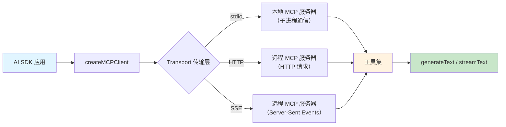

# MCP 工具集成

## 概述

MCP（Model Context Protocol，模型上下文协议）是一个开放标准，旨在统一 AI 模型与外部工具、数据源的通信方式。通过 MCP，你可以将任何符合协议的工具服务器接入 AI SDK，而无需为每个工具单独编写适配代码。AI SDK 提供了 `createMCPClient`，让你可以轻松连接 MCP 服务器并将其工具集成到 `generateText` / `streamText` 中。

[🔗 MCP Tools 文档](https://ai-sdk.dev/docs/ai-sdk-core/mcp-tools){target="_blank" rel="noopener"}

::: tip 前端类比
MCP 类似于前端中的 **LSP（Language Server Protocol）**。正如 LSP 让任何编辑器都能通过标准协议接入语言服务（自动补全、错误检查等），MCP 让任何 AI 应用都能通过标准协议接入工具服务（搜索、数据库查询、文件操作等）。你不需要为每个工具写专门的集成代码，只需连接 MCP 服务器即可。

**AI SDK 原生语义**：`createMCPClient` 返回的工具集与手动定义的 `tool()` 完全兼容，可以直接传入 `tools` 参数，也可以与手动定义的工具混合使用。
:::

## MCP 架构



## 创建 MCP 客户端

### HTTP 传输（推荐用于远程服务器）

HTTP 是连接远程 MCP 服务器最常用的传输方式：

```typescript
import { createMCPClient } from '@ai-sdk/mcp'

const mcpClient = await createMCPClient({
  transport: {
    type: 'http',
    url: 'https://your-server.com/mcp',

    // 可选：配置 HTTP 请求头（如认证）
    headers: { Authorization: 'Bearer my-api-key' },
  },
})
```

### SSE 传输（Server-Sent Events）

SSE 是另一种 HTTP 传输方式，适合需要服务器推送的场景：

```typescript
import { createMCPClient } from '@ai-sdk/mcp'

const mcpClient = await createMCPClient({
  transport: {
    type: 'sse',
    url: 'https://my-server.com/sse',

    // 可选：配置 HTTP 请求头
    headers: { Authorization: 'Bearer my-api-key' },
  },
})
```

### Stdio 传输（仅限本地开发）

Stdio 传输通过启动子进程与本地 MCP 服务器通信，适合开发和测试：

```typescript
import { createMCPClient } from '@ai-sdk/mcp'
import { Experimental_StdioMCPTransport } from '@ai-sdk/mcp/mcp-stdio'

const mcpClient = await createMCPClient({
  transport: new Experimental_StdioMCPTransport({
    command: 'node',
    args: ['src/stdio/dist/server.js'],
  }),
})
```

::: warning 注意
Stdio 传输只能连接本地 MCP 服务器，不能用于远程部署。生产环境请使用 HTTP 或 SSE 传输。
:::

## 获取工具并集成

连接 MCP 服务器后，通过 `.tools()` 获取工具集，然后传入 `generateText` 或 `streamText`：

```typescript
import { createMCPClient } from '@ai-sdk/mcp'
import { generateText, stepCountIs } from 'ai'
import { openai } from '@ai-sdk/openai'

const mcpClient = await createMCPClient({
  transport: {
    type: 'http',
    url: 'https://my-mcp-server.com/mcp',
  },
})

try {
  // 获取 MCP 服务器提供的所有工具
  const tools = await mcpClient.tools()

  const { text } = await generateText({
    model: openai('gpt-4o'),
    tools, // 直接传入 MCP 工具
    stopWhen: stepCountIs(5),
    prompt: '搜索最新的 React 19 相关文章。',
  })

  console.log(text)
} finally {
  // 重要：使用完毕后关闭客户端
  await mcpClient.close()
}
```

## 混合使用 MCP 工具和自定义工具

MCP 工具可以与手动定义的 `tool()` 混合使用：

```typescript
import { createMCPClient } from '@ai-sdk/mcp'
import { generateText, tool, stepCountIs } from 'ai'
import { openai } from '@ai-sdk/openai'
import { z } from 'zod'

const mcpClient = await createMCPClient({
  transport: {
    type: 'http',
    url: 'https://search-server.com/mcp',
  },
})

try {
  const mcpTools = await mcpClient.tools()

  const { text } = await generateText({
    model: openai('gpt-4o'),
    tools: {
      ...mcpTools, // 展开 MCP 工具
      // 添加自定义工具
      calculator: tool({
        description: '执行数学计算',
        inputSchema: z.object({
          expression: z.string().describe('数学表达式'),
        }),
        execute: async ({ expression }) => {
          return { result: eval(expression) }
        },
      }),
    },
    stopWhen: stepCountIs(5),
    prompt: '搜索苹果公司最新的市值，然后计算它是腾讯市值的几倍。',
  })

  console.log(text)
} finally {
  await mcpClient.close()
}
```

## 连接多个 MCP 服务器

你可以同时连接多个 MCP 服务器，将它们的工具合并使用：

```typescript
import { createMCPClient } from '@ai-sdk/mcp'
import { generateText, stepCountIs } from 'ai'
import { openai } from '@ai-sdk/openai'

let searchClient
let dbClient

try {
  // 连接搜索服务
  searchClient = await createMCPClient({
    transport: {
      type: 'http',
      url: 'https://search-service.com/mcp',
    },
  })

  // 连接数据库服务
  dbClient = await createMCPClient({
    transport: {
      type: 'http',
      url: 'https://db-service.com/mcp',
    },
  })

  const searchTools = await searchClient.tools()
  const dbTools = await dbClient.tools()

  const { text } = await generateText({
    model: openai('gpt-4o'),
    tools: {
      ...searchTools,
      ...dbTools, // 注意：同名工具会被后者覆盖
    },
    stopWhen: stepCountIs(5),
    prompt: '查找评分最高的产品并保存到数据库。',
  })

  console.log(text)
} catch (error) {
  console.error('MCP 调用失败:', error)
} finally {
  // 确保所有客户端都被关闭
  await Promise.all([searchClient?.close(), dbClient?.close()])
}
```

## 最佳实践

1. **始终关闭客户端**：在 `finally` 块中调用 `mcpClient.close()` 释放资源，避免连接泄漏
2. **选择合适的传输方式**：本地开发用 Stdio，生产环境用 HTTP 或 SSE
3. **注意工具名冲突**：合并多个 MCP 服务器的工具时，同名工具会被覆盖，建议检查或加前缀
4. **配置认证**：远程 MCP 服务器通常需要 API Key，通过 `headers` 传递认证信息
5. **设置合理的 stepCount**：MCP 工具可能涉及多轮交互，确保 `stepCountIs` 的值足够大

## 下一步

- [工具调用](/ai/vercel-ai-sdk/guide/tool-calling) — 了解 AI SDK 工具调用的基础概念
- [向量嵌入](/ai/vercel-ai-sdk/guide/embeddings) — 学习如何生成和使用向量嵌入
- [文本生成](/ai/vercel-ai-sdk/guide/generating-text) — 回顾 generateText 和 streamText 的基础用法
