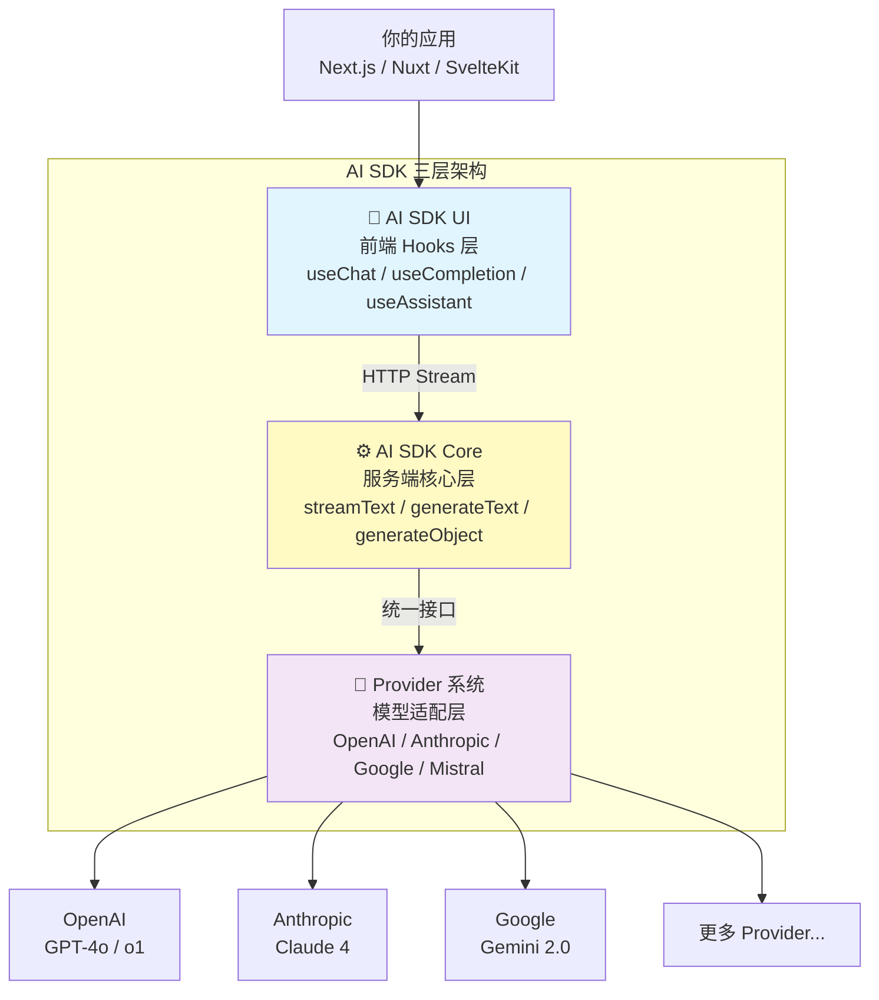
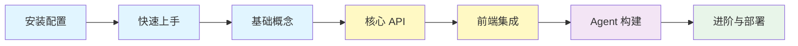

# AI SDK 概览

> **Vercel AI SDK** 是一个 TypeScript 工具包，帮助你使用 React、Next.js、Vue、Svelte、Node.js 等框架构建 AI 驱动的应用程序。它提供统一的 API 调用各大模型厂商，并内置流式 UI 集成，让前端开发者无需切换技术栈即可构建生产级 AI 应用。

## 1. AI SDK 是什么

### 1.1 一句话定义

AI SDK 是一个 **TypeScript 原生的 AI 开发工具包**，提供从服务端模型调用到前端 UI 渲染的全链路解决方案，让你用熟悉的 React/Next.js 技术栈快速构建 AI 应用。

### 1.2 三层架构

AI SDK 由三个核心层次组成，各层职责清晰、可独立使用：



| 层次 | 包名 | 职责 | 运行环境 |
|------|------|------|----------|
| **AI SDK Core** | `ai` | 文本生成、结构化输出、工具调用、嵌入向量 | 服务端（Node.js / Edge） |
| **AI SDK UI** | `@ai-sdk/react` | 聊天 Hook、流式渲染、状态管理 | 浏览器（React / Vue / Svelte） |
| **Provider 系统** | `@ai-sdk/openai` 等 | 模型厂商适配、统一接口抽象 | 服务端 |

::: tip 前端类比
把 AI SDK 三层架构类比为前端技术栈：**AI SDK Core ≈ 后端 API 层**（类似 tRPC 的服务端过程调用），**AI SDK UI ≈ TanStack Query / SWR**（前端数据获取与状态管理 Hook），**Provider 系统 ≈ 数据库驱动 / ORM 适配器**（一套接口、多种实现）。
:::

**AI SDK 原生语义**：AI SDK Core 提供 `streamText`、`generateText`、`generateObject` 等核心函数，这些函数接受一个 `model` 参数（来自 Provider）和 `messages`/`prompt`，返回统一格式的结果。AI SDK UI 的 `useChat` Hook 自动管理消息历史、流式状态和错误处理，通过 HTTP 流协议与 Core 层通信。Provider 系统将不同厂商的 API 差异抽象为统一的 `LanguageModel` 接口。

### 1.3 生态定位：AI SDK vs LangChain/LangGraph

| 维度 | AI SDK | LangChain / LangGraph |
|------|--------|----------------------|
| **语言** | TypeScript 原生 | Python 原生（有 JS 版但非主力） |
| **目标用户** | 前端 / 全栈开发者 | 后端 / AI 工程师 |
| **核心优势** | 前端 UI 集成、流式渲染、React Hooks | Agent 编排、复杂工作流、持久化 |
| **框架集成** | Next.js / Nuxt / SvelteKit 深度集成 | 框架无关，偏后端服务 |
| **学习曲线** | 低——前端开发者即学即用 | 中——需理解 Agent/Graph 等 AI 概念 |
| **适用场景** | 聊天 UI、生成式 UI、AI 增强 Web 应用 | 复杂 Agent、多步推理、RAG 管道 |

**简单选择标准**：
- 如果你是前端开发者，想快速给 Web 应用加上 AI 能力 → **用 AI SDK**
- 如果你需要构建复杂的多步骤 Agent 工作流 → **用 LangChain/LangGraph**
- 两者可以互补：AI SDK 做前端 UI + LangGraph 做后端编排

## 2. 核心能力概览

### 2.1 文本生成与流式响应

通过 `streamText` 和 `generateText` 实现 LLM 文本生成，内置流式传输支持：

```typescript
import { streamText } from 'ai'
import { openai } from '@ai-sdk/openai'

const result = streamText({
  model: openai('gpt-4o'),
  prompt: '用一段话解释什么是 React Server Components',
})

for await (const chunk of result.textStream) {
  process.stdout.write(chunk)
}
```

### 2.2 结构化输出

让 LLM 返回符合 Zod Schema 的结构化数据，告别手动 JSON 解析：

```typescript
import { generateObject } from 'ai'
import { openai } from '@ai-sdk/openai'
import { z } from 'zod'

const { object } = await generateObject({
  model: openai('gpt-4o'),
  schema: z.object({
    name: z.string(),
    pros: z.array(z.string()),
    cons: z.array(z.string()),
  }),
  prompt: '分析 TypeScript 的优缺点',
})
```

### 2.3 工具调用（Tool Calling）

定义工具让 LLM 自动调用外部 API、数据库等：

```typescript
import { generateText, tool } from 'ai'
import { openai } from '@ai-sdk/openai'
import { z } from 'zod'

const result = await generateText({
  model: openai('gpt-4o'),
  tools: {
    weather: tool({
      description: '获取城市天气',
      parameters: z.object({ city: z.string() }),
      execute: async ({ city }) => {
        // 调用天气 API
        return { city, temp: '22°C', condition: '晴' }
      },
    }),
  },
  prompt: '北京今天天气怎么样？',
})
```

### 2.4 前端 UI 集成

通过 `useChat` Hook 几行代码构建聊天界面：

```tsx
'use client'
import { useChat } from '@ai-sdk/react'

export default function Chat() {
  const { messages, sendMessage } = useChat()
  // 自动管理消息历史、流式状态、错误处理
}
```

### 2.5 多 Provider 统一接口

一行代码切换模型厂商，无需改动业务逻辑：

```typescript
import { openai } from '@ai-sdk/openai'
import { anthropic } from '@ai-sdk/anthropic'
import { google } from '@ai-sdk/google'

// 切换 Provider 只需换一行
const model = openai('gpt-4o')
// const model = anthropic('claude-sonnet-4-5-20250929')
// const model = google('gemini-2.0-flash')
```

## 3. 学习路径

建议按以下顺序学习本教程：



| 阶段 | 内容 | 目标 |
|------|------|------|
| **入门** | 安装配置、快速上手、基础概念 | 跑通第一个 AI 聊天应用 |
| **核心 API** | 文本生成、结构化输出、工具调用、嵌入向量 | 掌握服务端 AI 调用 |
| **前端集成** | useChat、生成式 UI、流式数据 | 构建 AI 增强的前端界面 |
| **Agent** | Agent 模式、工作流、多步推理 | 构建智能体应用 |
| **进阶** | Provider 选型、中间件、缓存、部署 | 上线生产级应用 |

## 4. 前置知识

开始学习 AI SDK 前，建议具备以下基础：

- **TypeScript 基础**：类型、泛型、async/await、Zod schema
- **React 基础**：Hooks、组件、状态管理（使用 UI 层时需要）
- **Next.js 基础**：App Router、Route Handler、Server Components（快速上手教程基于 Next.js）
- **LLM 基本概念**：了解什么是大语言模型、prompt、token

不需要有 AI/ML 背景。AI SDK 的设计目标就是让前端开发者用最熟悉的方式构建 AI 应用。

## 下一步

- [安装与配置](/ai/vercel-ai-sdk/guide/install) — 搭建开发环境
- [快速上手](/ai/vercel-ai-sdk/guide/quickstart) — 用 Next.js 构建第一个 AI 聊天应用
- [基础概念](/ai/vercel-ai-sdk/guide/foundations) — 理解 Provider、Prompt、Tool、Streaming 四大基础

## 参考资源

- [AI SDK 官方文档](https://ai-sdk.dev/docs/introduction){target="_blank" rel="noopener"} — 完整 API 参考
- [AI SDK GitHub 仓库](https://github.com/vercel/ai){target="_blank" rel="noopener"} — 源码与 Issue
- [LangChain 概览](/ai/langchain/guide/overview) — 对比了解 Python 生态的 AI 框架
