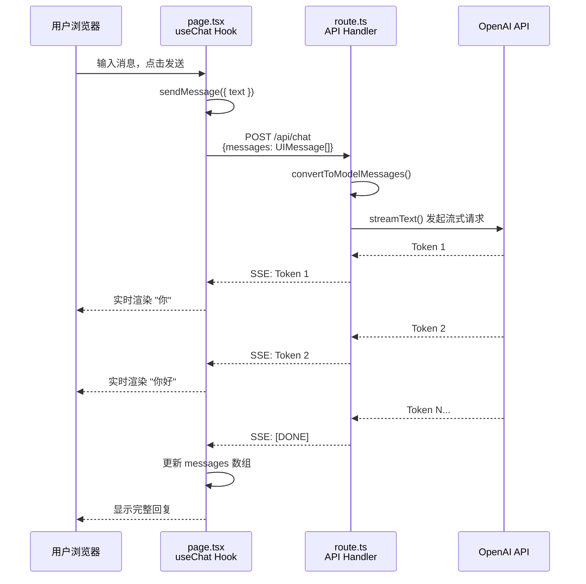

# 快速上手：Next.js AI 聊天应用

本教程带你从零构建一个完整的 AI 聊天应用：服务端使用 `streamText` 流式调用 LLM，前端使用 `useChat` Hook 实时渲染对话。

## 1. 创建项目

```bash
# 创建 Next.js 项目
pnpm create next-app@latest my-ai-chat --typescript --tailwind --app --eslint

# 进入项目目录
cd my-ai-chat

# 安装 AI SDK 依赖
pnpm add ai @ai-sdk/react @ai-sdk/openai zod
```

配置环境变量：

```bash
# .env.local
OPENAI_API_KEY=sk-xxxxxxxxxxxxxxxxxxxxxxxx
```

## 2. 完整代码

整个应用只需要两个文件：一个 API Route Handler（服务端）和一个 React 页面（前端）。

### 2.1 服务端：API Route Handler

```typescript
// app/api/chat/route.ts
import { streamText, UIMessage, convertToModelMessages } from 'ai'
import { openai } from '@ai-sdk/openai'

// 允许流式响应持续最长 30 秒
export const maxDuration = 30

export async function POST(req: Request) {
  // 1. 从请求体提取消息历史
  const { messages }: { messages: UIMessage[] } = await req.json()

  // 2. 调用 LLM 进行流式文本生成
  const result = streamText({
    model: openai('gpt-4o'),                          // 指定模型
    system: '你是一个友好的 AI 助手，用中文回答问题。',     // 系统提示词
    messages: await convertToModelMessages(messages),  // 转换消息格式
  })

  // 3. 返回 UI 消息流响应
  return result.toUIMessageStreamResponse()
}
```

::: tip 前端类比
`route.ts` 就是一个标准的 Next.js Route Handler，和你写过的任何 API 路由一模一样。唯一的区别是返回值不是 `NextResponse.json()`，而是 `toUIMessageStreamResponse()` —— 它返回一个 SSE（Server-Sent Events）流，让前端能逐字接收 AI 的回复。
:::

**代码逐行解析**：

| 代码 | 说明 |
|------|------|
| `UIMessage` | AI SDK 定义的前端消息类型，包含 `id`、`role`、`parts` 等字段 |
| `convertToModelMessages` | 将前端消息格式（UIMessage）转换为模型接口所需的格式（ModelMessage） |
| `streamText()` | AI SDK Core 的核心函数，向 LLM 发起流式请求 |
| `openai('gpt-4o')` | 通过 OpenAI Provider 创建模型实例 |
| `system` | 系统提示词，定义 AI 的角色和行为 |
| `toUIMessageStreamResponse()` | 将流式结果转换为 HTTP 流响应，兼容 `useChat` Hook |

### 2.2 前端：聊天页面

```tsx
// app/page.tsx
'use client'

import { useChat } from '@ai-sdk/react'
import { useState } from 'react'

export default function Chat() {
  const [input, setInput] = useState('')
  const { messages, sendMessage, isLoading } = useChat()

  return (
    <div className="flex flex-col w-full max-w-2xl mx-auto py-12 px-4">
      <h1 className="text-2xl font-bold mb-8">AI 聊天助手</h1>

      {/* 消息列表 */}
      <div className="flex-1 space-y-4 mb-4">
        {messages.map((message) => (
          <div
            key={message.id}
            className={`p-4 rounded-lg ${
              message.role === 'user'
                ? 'bg-blue-100 ml-12'
                : 'bg-gray-100 mr-12'
            }`}
          >
            <div className="font-semibold mb-1">
              {message.role === 'user' ? '你' : 'AI'}
            </div>
            {message.parts.map((part, i) => {
              switch (part.type) {
                case 'text':
                  return (
                    <div key={`${message.id}-${i}`} className="whitespace-pre-wrap">
                      {part.text}
                    </div>
                  )
                default:
                  return null
              }
            })}
          </div>
        ))}

        {/* 加载指示器 */}
        {isLoading && (
          <div className="text-gray-400 animate-pulse p-4">AI 正在思考...</div>
        )}
      </div>

      {/* 输入区域 */}
      <form
        onSubmit={(e) => {
          e.preventDefault()
          if (!input.trim()) return
          sendMessage({ text: input })
          setInput('')
        }}
        className="flex gap-2"
      >
        <input
          value={input}
          onChange={(e) => setInput(e.currentTarget.value)}
          placeholder="输入你的问题..."
          className="flex-1 p-3 border border-gray-300 rounded-lg focus:outline-none focus:ring-2 focus:ring-blue-500"
          disabled={isLoading}
        />
        <button
          type="submit"
          disabled={isLoading || !input.trim()}
          className="px-6 py-3 bg-blue-500 text-white rounded-lg hover:bg-blue-600 disabled:opacity-50 disabled:cursor-not-allowed"
        >
          发送
        </button>
      </form>
    </div>
  )
}
```

::: tip 前端类比
`useChat` 的使用方式和 TanStack Query 的 `useMutation` 非常相似：你调用一个函数（`sendMessage`），它自动管理请求状态（`isLoading`）和数据（`messages`）。不同的是，`useChat` 专门为流式 AI 对话优化——消息会逐字追加而非一次性返回。
:::

**AI SDK 原生语义**：`useChat` Hook 内部做了以下工作：
1. 维护消息历史数组（`messages`）
2. 发送 POST 请求到 `/api/chat`（默认路径，可自定义）
3. 解析 SSE 流响应，逐 token 更新最新的 AI 消息
4. 管理 `isLoading`、`error` 等状态
5. 自动将新消息追加到历史中

**`useChat` 返回值速查表**：

| 属性/方法 | 类型 | 说明 |
|----------|------|------|
| `messages` | `UIMessage[]` | 完整的消息历史 |
| `sendMessage` | `(message) => void` | 发送新消息 |
| `isLoading` | `boolean` | 是否正在等待 AI 回复 |
| `error` | `Error \| undefined` | 错误对象 |
| `stop` | `() => void` | 中止当前流式响应 |
| `setMessages` | `(messages) => void` | 手动设置消息历史 |

## 3. 运行项目

```bash
pnpm dev
```

打开 `http://localhost:3000`，输入问题即可与 AI 对话。你会看到 AI 的回复是逐字流式显示的。

## 4. 工作流程图



## 5. 切换模型

想换一个模型厂商？只需改动 `route.ts` 中的两行代码：

```typescript
// 使用 Anthropic Claude
import { anthropic } from '@ai-sdk/anthropic'

const result = streamText({
  model: anthropic('claude-sonnet-4-5-20250929'),  // [!code highlight]
  system: '你是一个友好的 AI 助手，用中文回答问题。',
  messages: await convertToModelMessages(messages),
})
```

```typescript
// 使用 Google Gemini
import { google } from '@ai-sdk/google'

const result = streamText({
  model: google('gemini-2.0-flash'),  // [!code highlight]
  system: '你是一个友好的 AI 助手，用中文回答问题。',
  messages: await convertToModelMessages(messages),
})
```

前端代码 **零改动**，因为 `useChat` 只关心流协议，不关心后端用的是哪个模型。

## 6. 常见问题

### 6.1 报错 `OPENAI_API_KEY is not set`

确保 `.env.local` 文件在项目根目录，且变量名拼写正确。修改 `.env.local` 后需要**重启开发服务器**。

### 6.2 流式响应出现乱码

确保 `route.ts` 返回的是 `result.toUIMessageStreamResponse()` 而非 `result.toTextStreamResponse()`。前者使用 AI SDK UI 流协议，后者是纯文本流。

### 6.3 `useChat` 请求发到了错误的 URL

默认请求 `/api/chat`，可通过 `api` 参数自定义：

```tsx
const { messages, sendMessage } = useChat({
  api: '/api/my-custom-chat',
})
```

## 下一步

- [基础概念](/ai/vercel-ai-sdk/guide/foundations) — 深入理解 Provider、Prompt、Tool、Streaming
- [文本生成](/ai/vercel-ai-sdk/guide/generating-text) — 掌握 `generateText` 和 `streamText` 的完整 API
- [聊天机器人开发](/ai/vercel-ai-sdk/guide/chatbot) — 构建更复杂的聊天应用
- [Next.js App Router 快速上手](https://ai-sdk.dev/docs/getting-started/nextjs-app-router){target="_blank" rel="noopener"} — 官方完整教程
