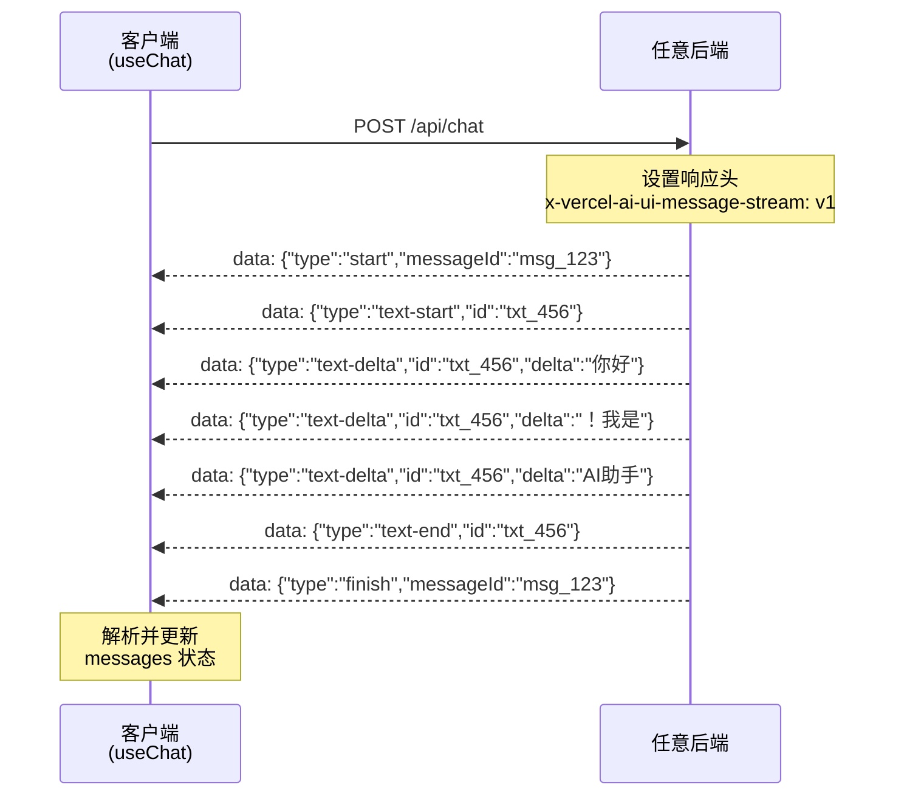
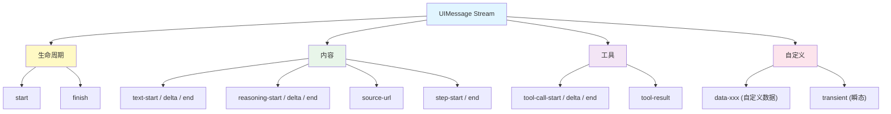

# 流协议详解

> AI SDK 的前端 Hook 通过 **UIMessage Stream Protocol** 与服务端通信。理解这个协议，你就能将 AI SDK 的前端组件对接 **任意后端**——不限于 Next.js 或 Node.js。

## 1. 协议概述

[🔗 Stream Protocol 文档](https://ai-sdk.dev/docs/ai-sdk-ui/stream-protocol){target="_blank" rel="noopener"} 定义了基于 **Server-Sent Events（SSE）** 的结构化消息格式。

### 1.1 协议特征

| 特征 | 说明 |
|------|------|
| **传输方式** | HTTP SSE（Server-Sent Events） |
| **标识头** | `x-vercel-ai-ui-message-stream: v1` |
| **数据格式** | 每行一个 JSON 对象，以 `data: ` 前缀 |
| **消息结构** | 基于 start/delta/end 模式的增量更新 |

### 1.2 整体流程



## 2. 消息事件类型

### 2.1 生命周期事件

控制消息的开始和结束：

```
data: {"type":"start","messageId":"msg_abc123"}

... (内容事件) ...

data: {"type":"finish","messageId":"msg_abc123","finishReason":"stop"}
```

| 事件 | 说明 |
|------|------|
| `start` | 新消息开始，携带 `messageId` |
| `finish` | 消息完成，携带 `finishReason` |

### 2.2 文本事件

文本内容通过 start/delta/end 三阶段传输：

```
data: {"type":"text-start","id":"txt_def456"}
data: {"type":"text-delta","id":"txt_def456","delta":"Hello"}
data: {"type":"text-delta","id":"txt_def456","delta":" world!"}
data: {"type":"text-end","id":"txt_def456"}
```

| 事件 | 字段 | 说明 |
|------|------|------|
| `text-start` | `id` | 文本块开始，分配唯一 ID |
| `text-delta` | `id`, `delta` | 增量文本内容 |
| `text-end` | `id` | 文本块结束 |

### 2.3 推理事件（Reasoning）

模型的思考过程（Chain-of-Thought）：

```
data: {"type":"reasoning-start","id":"rsn_ghi789"}
data: {"type":"reasoning-delta","id":"rsn_ghi789","delta":"让我分析一下..."}
data: {"type":"reasoning-end","id":"rsn_ghi789"}
```

### 2.4 工具调用事件

LLM 调用工具时的事件序列：

```
data: {"type":"tool-call-start","id":"tc_001","toolName":"displayWeather"}
data: {"type":"tool-call-delta","id":"tc_001","argsText":"{\"city\":\"北京\"}"}
data: {"type":"tool-call-end","id":"tc_001"}
data: {"type":"tool-result","id":"tc_001","toolName":"displayWeather","result":{"temperature":22}}
```

| 事件 | 说明 |
|------|------|
| `tool-call-start` | 工具调用开始，携带工具名称 |
| `tool-call-delta` | 工具参数增量（流式参数传输） |
| `tool-call-end` | 工具调用参数完成 |
| `tool-result` | 工具执行结果 |

### 2.5 来源事件

RAG 场景中引用的文档来源：

```
data: {"type":"source-url","sourceId":"src_001","url":"https://docs.example.com","title":"官方文档"}
```

### 2.6 自定义数据事件

以 `data-` 为前缀的自定义数据：

```
data: {"type":"data-weather","id":"w1","data":{"city":"北京","status":"loading"}}
data: {"type":"data-weather","id":"w1","data":{"city":"北京","temperature":22,"status":"success"}}
```

### 2.7 步骤事件

多步骤推理（multi-step）的边界标记：

```
data: {"type":"step-start","id":"step_001","messageId":"msg_123"}
... (步骤内容) ...
data: {"type":"step-end","id":"step_001"}
```

## 3. 完整事件类型速查



## 4. 与非 AI SDK 后端集成

UIMessage Stream Protocol 的价值在于：**任何能输出 SSE 的后端都可以对接 AI SDK 前端**。

### 4.1 协议要求

你的后端需要满足以下条件：

1. **响应头**：设置 `x-vercel-ai-ui-message-stream: v1` 和标准 SSE 头
2. **数据格式**：每个事件以 `data: ` 前缀 + JSON 对象
3. **事件顺序**：遵循 `start` → 内容事件 → `finish` 的生命周期

### 4.2 Python 后端示例

使用 Python FastAPI 实现兼容的流式端点：

```python
# main.py
from fastapi import FastAPI
from fastapi.responses import StreamingResponse
import json
import uuid

app = FastAPI()

@app.post("/api/chat")
async def chat(request: dict):
    async def generate():
        msg_id = f"msg_{uuid.uuid4().hex[:8]}"
        txt_id = f"txt_{uuid.uuid4().hex[:8]}"

        # 消息开始
        yield f"data: {json.dumps({'type': 'start', 'messageId': msg_id})}\n\n"

        # 文本块开始
        yield f"data: {json.dumps({'type': 'text-start', 'id': txt_id})}\n\n"

        # 文本增量（实际项目中从 LLM 流式获取）
        for chunk in ["你好", "！", "我是", "AI助手", "。"]:
            yield f"data: {json.dumps({'type': 'text-delta', 'id': txt_id, 'delta': chunk})}\n\n"

        # 文本块结束
        yield f"data: {json.dumps({'type': 'text-end', 'id': txt_id})}\n\n"

        # 消息完成
        yield f"data: {json.dumps({'type': 'finish', 'messageId': msg_id, 'finishReason': 'stop'})}\n\n"

    return StreamingResponse(
        generate(),
        media_type="text/event-stream",
        headers={
            "x-vercel-ai-ui-message-stream": "v1",
            "Cache-Control": "no-cache",
            "Connection": "keep-alive",
        },
    )
```

### 4.3 Go 后端示例

```go
// main.go
func chatHandler(w http.ResponseWriter, r *http.Request) {
    w.Header().Set("Content-Type", "text/event-stream")
    w.Header().Set("Cache-Control", "no-cache")
    w.Header().Set("Connection", "keep-alive")
    w.Header().Set("x-vercel-ai-ui-message-stream", "v1")

    flusher, _ := w.(http.Flusher)

    msgID := "msg_" + generateID()
    txtID := "txt_" + generateID()

    // start
    fmt.Fprintf(w, "data: {\"type\":\"start\",\"messageId\":\"%s\"}\n\n", msgID)
    flusher.Flush()

    // text-start
    fmt.Fprintf(w, "data: {\"type\":\"text-start\",\"id\":\"%s\"}\n\n", txtID)
    flusher.Flush()

    // text-delta
    chunks := []string{"你好", "！", "我是", "AI助手"}
    for _, chunk := range chunks {
        fmt.Fprintf(w, "data: {\"type\":\"text-delta\",\"id\":\"%s\",\"delta\":\"%s\"}\n\n", txtID, chunk)
        flusher.Flush()
    }

    // text-end
    fmt.Fprintf(w, "data: {\"type\":\"text-end\",\"id\":\"%s\"}\n\n", txtID)
    flusher.Flush()

    // finish
    fmt.Fprintf(w, "data: {\"type\":\"finish\",\"messageId\":\"%s\",\"finishReason\":\"stop\"}\n\n", msgID)
    flusher.Flush()
}
```

## 5. 读取 UIMessage Stream

AI SDK 提供了 `readUIMessageStream` 工具函数，用于在非 Hook 环境中解析流：

```typescript
import { readUIMessageStream, streamText, tool } from 'ai'
import { openai } from '@ai-sdk/openai'
import { z } from 'zod'

async function processStream() {
  const result = streamText({
    model: openai('gpt-4o'),
    tools: {
      weather: tool({
        description: '获取天气',
        parameters: z.object({ location: z.string() }),
        execute: async ({ location }) => ({
          location,
          temperature: 22,
        }),
      }),
    },
    prompt: '北京天气怎么样？',
  })

  // 使用 readUIMessageStream 解析
  for await (const uiMessage of readUIMessageStream({
    stream: result.toUIMessageStream(),
  })) {
    uiMessage.parts.forEach(part => {
      switch (part.type) {
        case 'text':
          console.log('文本:', part.text)
          break
        case 'tool-call':
          console.log('工具调用:', part.toolName, '参数:', part.args)
          break
        case 'tool-result':
          console.log('工具结果:', part.result)
          break
      }
    })
  }
}
```

::: tip AI 概念说明
`readUIMessageStream` 适用于服务端到服务端的场景（如微服务架构中，一个服务消费另一个服务的 AI 流），或者在非 React 环境中手动处理 AI 响应流。在浏览器端，优先使用 `useChat` 等 Hook。
:::

## 6. 手动构建流

你可以使用 `writer` 完全手动构建 UIMessage Stream，无需调用 LLM：

```typescript
import {
  createUIMessageStream,
  createUIMessageStreamResponse,
} from 'ai'

export async function POST(req: Request) {
  return createUIMessageStreamResponse({
    stream: createUIMessageStream({
      execute({ writer }) {
        // 手动写入文本
        writer.write({ type: 'text-start', id: 'greeting' })
        writer.write({ type: 'text-delta', id: 'greeting', delta: '这是' })
        writer.write({ type: 'text-delta', id: 'greeting', delta: '手动构建的' })
        writer.write({ type: 'text-delta', id: 'greeting', delta: '流式响应' })
        writer.write({ type: 'text-end', id: 'greeting' })

        // 写入自定义数据
        writer.write({
          type: 'data-status',
          data: { code: 200, message: '处理完成' },
        })

        // 写入来源
        writer.write({
          type: 'source-url',
          sourceId: 'src-1',
          url: 'https://example.com',
          title: '参考来源',
        })
      },
    }),
  })
}
```

## 7. 调试协议

### 7.1 浏览器开发者工具

在 Network 面板中查看 SSE 流：

1. 打开 DevTools → Network
2. 筛选 `Fetch/XHR` 或 `EventSource`
3. 找到 `/api/chat` 请求
4. 在 Response / EventStream 面板中查看每个事件

### 7.2 命令行调试

```bash
# 使用 curl 直接查看 SSE 流
curl -N -X POST http://localhost:3000/api/chat \
  -H "Content-Type: application/json" \
  -d '{"messages":[{"role":"user","parts":[{"type":"text","text":"你好"}]}]}'
```

## 下一步

- [UI 集成概览](/ai/vercel-ai-sdk/guide/ui-overview) — 回顾 AI SDK UI 的整体架构
- [流式自定义数据](/ai/vercel-ai-sdk/guide/streaming-data) — 使用 `createUIMessageStream` 发送自定义数据
- [聊天机器人开发](/ai/vercel-ai-sdk/guide/chatbot) — 使用 `useChat` 构建完整聊天界面
