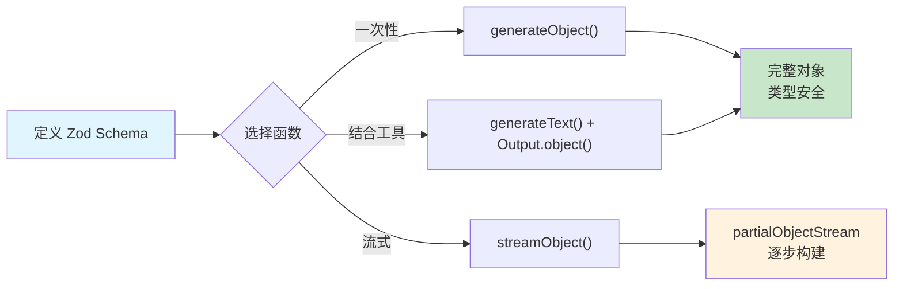

# 结构化输出

## 概述

在实际开发中，我们通常不只需要 LLM 返回一段自由文本——我们需要**结构化数据**：提取的实体、分类标签、评分数值、表单字段等。AI SDK 提供了 `generateObject` / `streamObject` 以及 `Output.object()` 等方式，让你用 Zod Schema 定义期望的数据结构，模型的输出会被自动解析并校验为符合 Schema 的 TypeScript 类型。

[🔗 generateObject API 参考](https://ai-sdk.dev/docs/reference/ai-sdk-core/generate-object){target="_blank" rel="noopener"}

::: tip 前端类比
结构化输出相当于前端中的 **Zod Schema 验证 + TypeScript 类型推导**。你定义一个 `z.object()` 描述数据结构，运行时由框架确保输出数据符合该结构。不同之处在于，LLM 的结构化输出是**生成时约束**——模型在推理阶段就被引导输出指定格式，而非"先生成再校验"。

**AI SDK 原生语义**：AI SDK 原生使用 Zod 作为 Schema 定义库，返回值自动推导为 Zod Schema 对应的 TypeScript 类型，实现端到端的类型安全。
:::

## generateObject：一次性生成对象

最直接的结构化输出方式——传入 Zod Schema，获得类型安全的对象：

```typescript
import { generateObject } from 'ai'
import { openai } from '@ai-sdk/openai'
import { z } from 'zod'

const { object } = await generateObject({
  model: openai('gpt-4o'),
  schema: z.object({
    name: z.string().describe('菜品名称'),
    ingredients: z.array(
      z.object({
        name: z.string().describe('食材名称'),
        amount: z.string().describe('用量'),
      })
    ),
    steps: z.array(z.string()).describe('烹饪步骤'),
  }),
  prompt: '生成一份番茄炒蛋的食谱。',
})

// object 的类型自动推导为:
// { name: string; ingredients: { name: string; amount: string }[]; steps: string[] }
console.log(object.name) // "番茄炒蛋"
console.log(object.ingredients) // [{ name: "番茄", amount: "2个" }, ...]
console.log(object.steps) // ["将番茄切块...", ...]
```

### Schema 字段描述的重要性

Zod 的 `.describe()` 方法会被传递给模型作为字段说明，**直接影响生成质量**：

```typescript
// 好的做法：每个字段都有清晰的描述
const schema = z.object({
  sentiment: z
    .enum(['positive', 'neutral', 'negative'])
    .describe('文本的情感倾向'),
  confidence: z
    .number()
    .min(0)
    .max(1)
    .describe('情感分析的置信度，0-1 之间'),
  keywords: z
    .array(z.string())
    .describe('从文本中提取的关键词，最多 5 个'),
})
```

## Output 模式

### object 模式（默认）

生成符合 Schema 的单个对象，这是最常用的模式：

```typescript
import { generateObject } from 'ai'
import { openai } from '@ai-sdk/openai'
import { z } from 'zod'

const { object } = await generateObject({
  model: openai('gpt-4o'),
  schema: z.object({
    title: z.string(),
    summary: z.string(),
    tags: z.array(z.string()),
  }),
  prompt: '为一篇关于 React 19 新特性的文章生成元数据。',
})
```

### array 模式

通过 `output: 'array'` 生成对象数组，每个元素都符合 Schema：

```typescript
import { generateObject } from 'ai'
import { openai } from '@ai-sdk/openai'
import { z } from 'zod'

const { object } = await generateObject({
  model: openai('gpt-4o'),
  output: 'array',
  schema: z.object({
    name: z.string().describe('角色名称'),
    class: z.string().describe('角色职业，如战士、法师、盗贼'),
    description: z.string().describe('角色描述'),
  }),
  prompt: '为一个奇幻角色扮演游戏生成 3 个英雄角色。',
})

// object 类型为 { name: string; class: string; description: string }[]
object.forEach((hero) => {
  console.log(`${hero.name} - ${hero.class}: ${hero.description}`)
})
```

### enum 模式

通过 `output: 'enum'` 让模型从预定义的选项中选择一个值，适合分类任务：

```typescript
import { generateObject } from 'ai'
import { openai } from '@ai-sdk/openai'

const { object } = await generateObject({
  model: openai('gpt-4o'),
  output: 'enum',
  enum: ['action', 'comedy', 'drama', 'horror', 'sci-fi'],
  prompt: '将以下电影分类：一个太空旅行者在遥远的星球上发现了外星文明。',
})

console.log(object) // "sci-fi"
```

## Output.object()：与 generateText 结合

除了独立的 `generateObject`，你还可以通过 `Output.object()` 将结构化输出嵌入到 `generateText` 调用中。这在结合工具调用时特别有用：

```typescript
import { generateText, Output } from 'ai'
import { openai } from '@ai-sdk/openai'
import { z } from 'zod'

const { output } = await generateText({
  model: openai('gpt-4o'),
  output: Output.object({
    schema: z.object({
      name: z.string(),
      age: z.number().nullable(),
      labels: z.array(z.string()),
    }),
  }),
  prompt: '生成一个测试用户的信息。',
})

// output 类型自动推导
console.log(output) // { name: "张三", age: 28, labels: ["开发者", "前端"] }
```

## streamObject：流式生成

对于复杂的结构化输出，`streamObject` 可以流式返回部分对象（partial object），让前端可以在生成过程中就开始渲染：

```typescript
import { streamObject } from 'ai'
import { openai } from '@ai-sdk/openai'
import { z } from 'zod'

const { partialObjectStream } = streamObject({
  model: openai('gpt-4o'),
  schema: z.object({
    notifications: z.array(
      z.object({
        name: z.string().describe('虚构人物的名字'),
        message: z.string().describe('消息内容'),
        minutesAgo: z.number().describe('几分钟前发送的'),
      })
    ),
  }),
  prompt: '生成 3 条消息应用的通知。',
})

for await (const partialObject of partialObjectStream) {
  // 每次迭代返回当前已生成的部分对象
  // 例如第一次可能是 { notifications: [{ name: "李明" }] }
  // 下一次可能是 { notifications: [{ name: "李明", message: "你好..." }] }
  console.clear()
  console.log(partialObject)
}
```

### 在 Next.js 中使用 streamObject

**服务端 API 路由**：

```typescript
// app/api/notifications/route.ts
import { streamObject } from 'ai'
import { openai } from '@ai-sdk/openai'
import { z } from 'zod'

const notificationSchema = z.object({
  notifications: z.array(
    z.object({
      name: z.string(),
      message: z.string(),
      minutesAgo: z.number(),
    })
  ),
})

export async function POST(req: Request) {
  const { prompt }: { prompt: string } = await req.json()

  const result = streamObject({
    model: openai('gpt-4o'),
    schema: notificationSchema,
    prompt,
  })

  return result.toTextStreamResponse()
}
```

## 数据流总览



## 最佳实践

### Schema 设计建议

1. **字段描述**：始终使用 `.describe()` 为每个字段提供清晰的中文描述
2. **可空字段**：对于模型可能无法确定的字段，使用 `.nullable()` 而非给默认值
3. **枚举约束**：用 `z.enum()` 限制可选值范围，比 `z.string()` 更精确
4. **数组长度**：用 `.min()` / `.max()` 约束数组长度，避免过长或过短的输出
5. **嵌套结构**：复杂结构优先拆分为独立的子 Schema，提高可读性和复用性

### 何时选择哪个函数

| 场景 | 推荐方式 | 原因 |
| --- | --- | --- |
| 纯结构化数据提取 | `generateObject` | 最直接，类型推导最好 |
| 实时展示生成进度 | `streamObject` | 前端可以逐步渲染部分数据 |
| 结构化输出 + 工具调用 | `generateText` + `Output.object()` | 支持多步骤，先调工具再生成结构 |
| 简单分类任务 | `generateObject` + `output: 'enum'` | 最轻量的结构化输出 |

## 下一步

- [工具调用](/ai/vercel-ai-sdk/guide/tool-calling) — 让模型调用外部函数，与结构化输出结合实现更强大的能力
- [文本生成](/ai/vercel-ai-sdk/guide/generating-text) — 回顾基础文本生成的流式与非流式模式
- [向量嵌入](/ai/vercel-ai-sdk/guide/embeddings) — 将文本转换为向量，实现语义搜索
