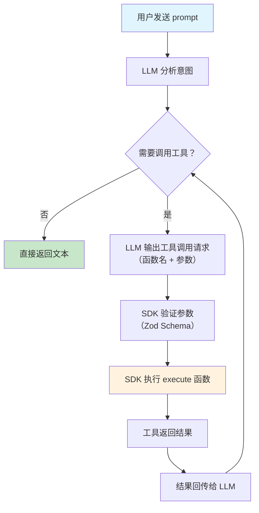

# 工具调用

## 概述

工具调用（Tool Calling）是 LLM 从"只能生成文本"进化为"能执行操作"的关键能力。通过工具调用，模型可以在生成过程中决定调用你预先定义的函数——查询数据库、调用 API、执行计算——然后基于函数返回的结果继续生成回答。

[🔗 Tools and Tool Calling 文档](https://ai-sdk.dev/docs/ai-sdk-core/tools-and-tool-calling){target="_blank" rel="noopener"}

::: tip 前端类比
工具调用类似于前端中的 **RPC 调用模式**。假设你在 React 组件中通过 `useSWR` 调用后端 API 获取数据再渲染——工具调用的流程与此类似：LLM 决定"我需要某个数据"，SDK 自动调用你定义的函数获取数据，然后 LLM 基于返回值继续生成。

**AI SDK 原生语义**：工具调用不是 prompt hack，而是模型原生支持的能力。模型输出一个结构化的"工具调用请求"（包含函数名和参数），SDK 自动执行对应函数并将结果回传给模型。
:::

## 工具调用流程



## 定义工具

使用 `tool()` 函数定义工具。每个工具需要三个核心部分：**描述**（让模型理解何时该用）、**输入 Schema**（Zod 校验参数）、**执行函数**（实际逻辑）：

```typescript
import { tool } from 'ai'
import { z } from 'zod'

const weatherTool = tool({
  description: '获取指定城市的当前天气信息',
  inputSchema: z.object({
    city: z.string().describe('城市名称，如"北京"、"上海"'),
    unit: z
      .enum(['celsius', 'fahrenheit'])
      .optional()
      .describe('温度单位，默认为摄氏度'),
  }),
  execute: async ({ city, unit = 'celsius' }) => {
    // 这里是你的实际业务逻辑
    const response = await fetch(
      `https://api.weather.com/current?city=${city}&unit=${unit}`
    )
    return response.json()
  },
})
```

## 在 generateText 中使用工具

将工具传入 `tools` 参数，模型会在需要时自动调用：

```typescript
import { generateText, tool, stepCountIs } from 'ai'
import { openai } from '@ai-sdk/openai'
import { z } from 'zod'

const { text, steps } = await generateText({
  model: openai('gpt-4o'),
  tools: {
    weather: tool({
      description: '获取指定城市的天气信息',
      inputSchema: z.object({
        location: z.string().describe('城市名称'),
      }),
      execute: async ({ location }) => ({
        location,
        temperature: 25,
        condition: '晴天',
      }),
    }),
  },
  stopWhen: stepCountIs(5),
  prompt: '上海今天天气怎么样？适合出门吗？',
})

console.log(text)
// 模型会先调用 weather 工具获取数据，再基于结果生成回答
// 例如："上海今天 25°C，晴天，非常适合出门活动。"
```

## 多步工具调用（Multi-step）

通过 `stopWhen: stepCountIs(n)` 设置最大步数，模型可以在一次请求中调用多个工具：

```typescript
import { generateText, tool, stepCountIs } from 'ai'
import { openai } from '@ai-sdk/openai'
import { z } from 'zod'

const { text, steps } = await generateText({
  model: openai('gpt-4o'),
  tools: {
    listOrders: tool({
      description: '查询用户的所有订单',
      inputSchema: z.object({ userId: z.string() }),
      execute: async ({ userId }) => ({
        orders: [
          { id: 'ORD-001', status: '已发货' },
          { id: 'ORD-002', status: '配送中' },
        ],
      }),
    }),
    trackOrder: tool({
      description: '查询订单的物流追踪信息',
      inputSchema: z.object({ orderId: z.string() }),
      execute: async ({ orderId }) => ({
        orderId,
        courier: '顺丰快递',
        currentLocation: '上海转运中心',
        estimatedDelivery: '明天下午',
      }),
    }),
  },
  stopWhen: stepCountIs(5),
  prompt: '我的用户 ID 是 user-123，帮我查一下所有订单和物流信息。',
})

// 模型会执行多步：
// Step 1: 调用 listOrders 获取订单列表
// Step 2: 调用 trackOrder 查询 ORD-001 的物流
// Step 3: 调用 trackOrder 查询 ORD-002 的物流
// Step 4: 基于所有结果生成汇总回答
console.log(`总共执行了 ${steps.length} 步`)
console.log(text)
```

## 在 streamText 中使用工具

流式场景同样支持工具调用：

```typescript
import { streamText, tool, stepCountIs } from 'ai'
import { openai } from '@ai-sdk/openai'
import { z } from 'zod'

export async function POST(req: Request) {
  const { messages } = await req.json()

  const result = streamText({
    model: openai('gpt-4o'),
    messages,
    stopWhen: stepCountIs(5),
    tools: {
      weather: tool({
        description: '获取天气信息（华氏度）',
        inputSchema: z.object({
          location: z.string().describe('城市名称'),
        }),
        execute: async ({ location }) => {
          const temperature = Math.round(Math.random() * (90 - 32) + 32)
          return { location, temperature }
        },
      }),
    },
  })

  return result.toUIMessageStreamResponse()
}
```

## 工具选择配置

通过 `toolChoice` 参数控制模型使用工具的行为：

```typescript
import { generateText, tool } from 'ai'
import { openai } from '@ai-sdk/openai'
import { z } from 'zod'

// 自动决定（默认行为）——模型自行判断是否需要工具
const result1 = await generateText({
  model: openai('gpt-4o'),
  toolChoice: 'auto',
  tools: { /* ... */ },
  prompt: '你好',
})

// 强制使用工具——模型必须调用至少一个工具
const result2 = await generateText({
  model: openai('gpt-4o'),
  toolChoice: 'required',
  tools: { /* ... */ },
  prompt: '查询北京天气',
})

// 禁用工具——即使定义了工具也不会调用
const result3 = await generateText({
  model: openai('gpt-4o'),
  toolChoice: 'none',
  tools: { /* ... */ },
  prompt: '讲个笑话',
})

// 指定使用某个工具
const result4 = await generateText({
  model: openai('gpt-4o'),
  toolChoice: { type: 'tool', toolName: 'weather' },
  tools: { /* ... */ },
  prompt: '今天出门穿什么',
})
```

## 人机协同（Human-in-the-Loop）

对于敏感操作（如支付、删除数据），可以通过 `needsApproval` 属性要求用户在工具执行前确认：

### 始终需要审批

```typescript
import { tool } from 'ai'
import { z } from 'zod'

const deleteAccountTool = tool({
  description: '删除用户账号',
  inputSchema: z.object({
    userId: z.string().describe('要删除的用户 ID'),
    reason: z.string().describe('删除原因'),
  }),
  needsApproval: true, // 每次调用都需要用户审批
  execute: async ({ userId, reason }) => {
    await deleteUser(userId, reason)
    return { success: true, message: `用户 ${userId} 已删除` }
  },
})
```

### 条件审批

`needsApproval` 也可以是一个函数，根据参数动态决定是否需要审批：

```typescript
import { tool } from 'ai'
import { z } from 'zod'

const paymentTool = tool({
  description: '处理支付',
  inputSchema: z.object({
    amount: z.number().describe('支付金额'),
    recipient: z.string().describe('收款人'),
  }),
  // 金额超过 1000 时需要用户审批
  needsApproval: async ({ amount }) => amount > 1000,
  execute: async ({ amount, recipient }) => {
    return `已向 ${recipient} 支付 ¥${amount}`
  },
})
```

### 在 Next.js 中实现审批流程

```typescript
// app/api/chat/route.ts
import { streamText, tool } from 'ai'
import { openai } from '@ai-sdk/openai'
import { z } from 'zod'

export async function POST(req: Request) {
  const { messages } = await req.json()

  const result = streamText({
    model: openai('gpt-4o'),
    messages,
    tools: {
      processPayment: tool({
        description: '处理支付',
        inputSchema: z.object({
          amount: z.number(),
          recipient: z.string(),
        }),
        needsApproval: async ({ amount }) => amount > 1000,
        execute: async ({ amount, recipient }) => {
          return `已向 ${recipient} 支付 $${amount}`
        },
      }),
    },
  })

  return result.toUIMessageStreamResponse()
}
```

当 `needsApproval` 返回 `true` 时，SDK 会向前端发送一个"等待审批"的状态，前端可以展示确认对话框，用户确认后才继续执行工具。

## 仅声明工具（不自动执行）

如果你只需要模型返回工具调用意图，但不想 SDK 自动执行（例如在前端手动处理），可以省略 `execute` 函数：

```typescript
const searchTool = tool({
  description: '搜索产品',
  inputSchema: z.object({
    query: z.string(),
    category: z.string().optional(),
  }),
  // 没有 execute —— SDK 不会自动执行
  // 模型的工具调用请求会通过 steps 或 toolCalls 返回
})
```

## 最佳实践

1. **描述要精确**：`description` 是模型决定是否调用工具的关键依据，务必清晰说明工具的用途和适用场景
2. **Schema 要严格**：用 `.describe()` 为每个参数添加说明，用 `.min()` / `.max()` 等约束限制范围
3. **步数要合理**：`stepCountIs` 设得太小可能导致复杂任务无法完成，设得太大会浪费 token
4. **敏感操作加审批**：涉及资金、数据删除、权限变更等操作，务必设置 `needsApproval`
5. **错误要处理**：`execute` 函数中应该包含 try-catch，返回友好的错误信息而非抛出异常

## 下一步

- [MCP 工具集成](/ai/vercel-ai-sdk/guide/mcp) — 通过 MCP 协议接入外部工具服务器
- [结构化输出](/ai/vercel-ai-sdk/guide/structured-output) — 结合工具调用生成结构化数据
- [文本生成](/ai/vercel-ai-sdk/guide/generating-text) — 回顾多步生成的基础用法
