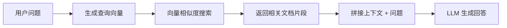

# 实战：RAG Agent

本教程将手把手带你构建一个 RAG（Retrieval-Augmented Generation，检索增强生成）Agent。RAG 通过在生成回答前检索相关文档，让 LLM 能够基于你的私有知识库进行准确回答。

[🔗 AI SDK RAG 聊天机器人指南](https://ai-sdk.dev/cookbook/guides/rag-chatbot){target="_blank" rel="noopener"}

## 什么是 RAG

::: tip 前端类比
RAG 就像给搜索引擎加上了 AI 理解能力。传统搜索返回文档列表让用户自己阅读，RAG 则是先搜索相关文档，再让 AI 基于这些文档生成精准回答 —— 类似于 Google 的 AI Overview。
:::

RAG 的三个核心步骤：

1. **嵌入（Embed）** — 将文档转换为向量表示
2. **检索（Retrieve）** — 根据用户查询找到最相关的文档片段
3. **生成（Generate）** — 将检索到的上下文提供给 LLM 生成回答



## 环境准备

```bash
npm install ai @ai-sdk/openai zod
```

## 第一步：文档嵌入

将文档切分为片段，并生成每个片段的向量表示：

```typescript
import { embed, embedMany } from 'ai'

// 将文本切分为片段
function generateChunks(input: string): string[] {
  return input
    .trim()
    .split('.')
    .map((chunk) => chunk.trim())
    .filter((chunk) => chunk.length > 0)
}

// 批量生成嵌入向量
async function generateEmbeddings(
  text: string,
): Promise<Array<{ content: string; embedding: number[] }>> {
  const chunks = generateChunks(text)

  const { embeddings } = await embedMany({
    model: 'openai/text-embedding-3-small',
    values: chunks,
  })

  return embeddings.map((embedding, i) => ({
    content: chunks[i],
    embedding,
  }))
}

// 生成单条文本的嵌入
async function generateEmbedding(value: string): Promise<number[]> {
  const input = value.replaceAll('\n', ' ')
  const { embedding } = await embed({
    model: 'openai/text-embedding-3-small',
    value: input,
  })
  return embedding
}
```

## 第二步：向量存储

将嵌入向量存入数据库。这里演示两种方式：内存存储和数据库存储。

### 方式一：内存向量存储（适合原型开发）

```typescript
import { cosineSimilarity, embed, embedMany } from 'ai'
import fs from 'fs'
import path from 'path'

// 内存数据库
const db: { embedding: number[]; value: string }[] = []

async function buildIndex() {
  // 读取文档
  const document = fs.readFileSync(
    path.join(__dirname, 'knowledge-base.txt'),
    'utf8',
  )

  // 切分并生成嵌入
  const chunks = document
    .split('.')
    .map((chunk) => chunk.trim())
    .filter((chunk) => chunk.length > 0)

  const { embeddings } = await embedMany({
    model: 'openai/text-embedding-3-small',
    values: chunks,
  })

  // 存入内存数据库
  embeddings.forEach((embedding, i) => {
    db.push({ embedding, value: chunks[i] })
  })

  console.log(`已索引 ${db.length} 个文档片段`)
}
```

### 方式二：数据库存储（生产推荐）

使用 Drizzle ORM + PostgreSQL（带 pgvector 扩展）：

```typescript
import { embed, embedMany } from 'ai'
import { db } from '../db'
import { cosineDistance, desc, gt, sql } from 'drizzle-orm'
import { embeddings } from '../db/schema/embeddings'

const embeddingModel = 'openai/text-embedding-ada-002'

// 批量存储嵌入到数据库
async function storeEmbeddings(text: string) {
  const chunks = generateChunks(text)
  const { embeddings: vectors } = await embedMany({
    model: embeddingModel,
    values: chunks,
  })

  await db.insert(embeddings).values(
    vectors.map((embedding, i) => ({
      content: chunks[i],
      embedding,
    })),
  )
}
```

## 第三步：语义检索

根据用户查询，找到最相关的文档片段：

### 内存版检索

```typescript
import { cosineSimilarity, embed } from 'ai'

async function findRelevantContent(query: string, topK = 3) {
  // 生成查询向量
  const { embedding: queryEmbedding } = await embed({
    model: 'openai/text-embedding-3-small',
    value: query,
  })

  // 计算与所有文档片段的相似度
  const results = db
    .map((item) => ({
      document: item.value,
      similarity: cosineSimilarity(queryEmbedding, item.embedding),
    }))
    .sort((a, b) => b.similarity - a.similarity)
    .slice(0, topK)

  return results.map((r) => r.document)
}
```

### 数据库版检索

```typescript
import { embed } from 'ai'
import { cosineDistance, desc, gt, sql } from 'drizzle-orm'
import { embeddings } from '../db/schema/embeddings'

async function findRelevantContent(userQuery: string) {
  const { embedding: queryEmbedding } = await embed({
    model: 'openai/text-embedding-ada-002',
    value: userQuery.replaceAll('\n', ' '),
  })

  const similarity = sql<number>`1 - (${cosineDistance(
    embeddings.embedding,
    queryEmbedding,
  )})`

  const results = await db
    .select({ name: embeddings.content, similarity })
    .from(embeddings)
    .where(gt(similarity, 0.5)) // 相似度阈值
    .orderBy((t) => desc(t.similarity))
    .limit(4)

  return results
}
```

## 第四步：增强生成

将检索到的上下文与用户问题一起提交给 LLM：

```typescript
import { generateText } from 'ai'

async function ragQuery(question: string) {
  // 1. 检索相关文档
  const relevantDocs = await findRelevantContent(question)
  const context = relevantDocs.join('\n')

  // 2. 使用上下文增强生成
  const { text } = await generateText({
    model: 'openai/gpt-4o',
    prompt: `基于以下上下文回答问题。如果上下文中没有相关信息，请明确说明。

上下文：
${context}

问题：${question}`,
  })

  return text
}

// 使用
const answer = await ragQuery('TypeScript 中的泛型是什么？')
console.log(answer)
```

## 第五步：构建 RAG Agent

将 RAG 能力封装为工具，让 Agent 自主决定何时检索：

```typescript
import { generateText, tool, stepCountIs } from 'ai'
import { z } from 'zod'

const { text } = await generateText({
  model: 'openai/gpt-4o',
  system: `你是一个知识库助手。当用户提问时，使用 retrieve 工具搜索相关信息，然后基于检索结果回答。
如果检索结果不足以回答问题，请诚实地告知用户。`,
  prompt: '什么是 React Server Components？它和传统 SSR 有什么区别？',
  tools: {
    retrieve: tool({
      description: '从知识库中检索与查询相关的文档片段',
      inputSchema: z.object({
        query: z.string().describe('搜索查询'),
      }),
      execute: async ({ query }) => {
        const results = await findRelevantContent(query)
        return results.join('\n\n')
      },
    }),
  },
  stopWhen: stepCountIs(5),
})

console.log(text)
```

## 完整示例

将以上步骤整合为一个完整的 RAG 系统：

```typescript
import fs from 'fs'
import path from 'path'
import { cosineSimilarity, embed, embedMany, generateText, tool, stepCountIs } from 'ai'
import { z } from 'zod'

// ========== 1. 内存向量数据库 ==========
const vectorDB: { embedding: number[]; value: string }[] = []

// ========== 2. 索引文档 ==========
async function indexDocument(filePath: string) {
  const content = fs.readFileSync(filePath, 'utf8')
  const chunks = content
    .split('.')
    .map((c) => c.trim())
    .filter((c) => c.length > 0)

  const { embeddings } = await embedMany({
    model: 'openai/text-embedding-3-small',
    values: chunks,
  })

  embeddings.forEach((e, i) => {
    vectorDB.push({ embedding: e, value: chunks[i] })
  })

  console.log(`已索引 ${chunks.length} 个片段`)
}

// ========== 3. 语义搜索 ==========
async function search(query: string, topK = 3): Promise<string[]> {
  const { embedding } = await embed({
    model: 'openai/text-embedding-3-small',
    value: query,
  })

  return vectorDB
    .map((item) => ({
      text: item.value,
      score: cosineSimilarity(embedding, item.embedding),
    }))
    .sort((a, b) => b.score - a.score)
    .slice(0, topK)
    .map((r) => r.text)
}

// ========== 4. RAG Agent ==========
async function ragAgent(question: string) {
  await indexDocument(path.join(__dirname, 'docs.txt'))

  const { text } = await generateText({
    model: 'openai/gpt-4o',
    system:
      '你是一个专业的技术文档助手。使用 search 工具查找相关信息后再回答。',
    prompt: question,
    tools: {
      search: tool({
        description: '搜索知识库中的相关文档',
        inputSchema: z.object({ query: z.string() }),
        execute: async ({ query }) => {
          const results = await search(query)
          return results.join('\n\n')
        },
      }),
    },
    stopWhen: stepCountIs(5),
  })

  return text
}

// 运行
ragAgent('解释 AI SDK 中的中间件系统').then(console.log)
```

## 优化建议

| 优化方向 | 方法 | 效果 |
|----------|------|------|
| 切分策略 | 按段落/标题切分，而非按句号 | 保持语义完整性 |
| 嵌入模型 | 使用 `text-embedding-3-large` | 更高精度 |
| 重排序 | 检索后用 LLM 重排结果 | 提升相关性 |
| 混合检索 | 向量搜索 + 关键词搜索 | 覆盖更多场景 |
| 缓存嵌入 | 缓存已计算的嵌入向量 | 减少 API 调用 |

## 下一步

- [实战：多模态聊天](/ai/vercel-ai-sdk/guide/tutorial-multimodal-chat) — 构建支持图片的聊天应用
- [Agent 概览](/ai/vercel-ai-sdk/guide/agent-overview) — 回顾 Agent 基础概念
- [工具系统](/ai/vercel-ai-sdk/guide/tool-calling) — 深入了解工具定义和执行
