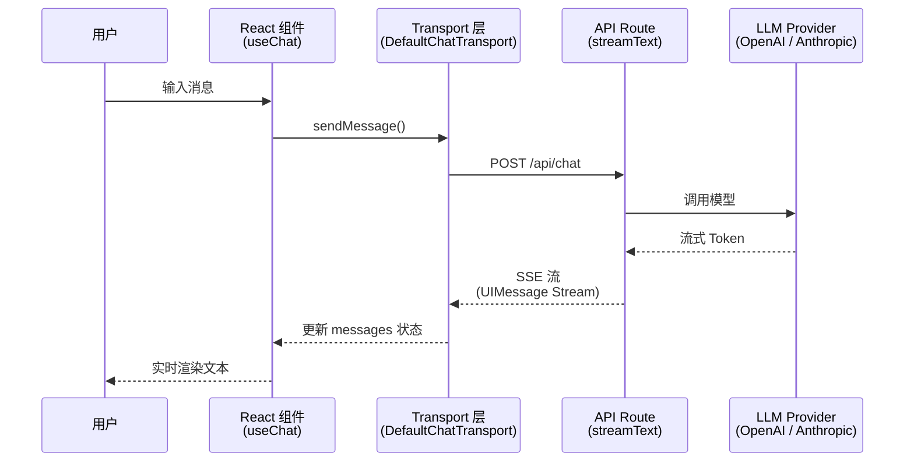

# UI 集成概览

> AI SDK 的 UI 包（`@ai-sdk/react`）提供了一组 **框架级 Hook**，让你用声明式的方式将 LLM 流式响应无缝嵌入 React 组件。无需手动管理 WebSocket、SSE 解析或消息状态——Hook 帮你全部搞定。

## 1. AI SDK UI 是什么

[🔗 AI SDK UI 概览](https://ai-sdk.dev/docs/ai-sdk-ui/overview){target="_blank" rel="noopener"} 是 AI SDK 面向前端开发者的核心包，它提供：

- **声明式 Hook**：用 `useChat`、`useCompletion`、`useObject` 管理 AI 交互状态
- **自动流处理**：内置 SSE 解析，流式响应即时渲染到 UI
- **多框架支持**：React、Vue、Svelte、Solid 均有对应实现
- **传输层抽象**：通过 Transport 机制对接不同后端（Next.js、Express、自定义服务）

## 2. 三大核心 Hook

AI SDK UI 围绕三个场景提供了对应的 Hook：

| Hook | 用途 | 典型场景 |
|------|------|----------|
| **`useChat`** | 多轮对话 | 聊天机器人、客服 Agent、AI 助手 |
| **`useCompletion`** | 单次文本补全 | 文案生成、代码补全、翻译 |
| **`useObject`** | 流式结构化对象 | 实时表单填充、数据提取、JSON 生成 |

### 2.1 useChat — 多轮对话

`useChat` 是最常用的 Hook，管理完整的对话生命周期：

```tsx
import { useChat } from '@ai-sdk/react'
import { DefaultChatTransport } from 'ai'
import { useState } from 'react'

export default function Chat() {
  const { messages, sendMessage, status, stop } = useChat({
    transport: new DefaultChatTransport({
      api: '/api/chat',
    }),
  })
  const [input, setInput] = useState('')

  return (
    <div>
      {messages.map(message => (
        <div key={message.id}>
          {message.role === 'user' ? '你：' : 'AI：'}
          {message.parts.map((part, i) =>
            part.type === 'text' ? <span key={i}>{part.text}</span> : null,
          )}
        </div>
      ))}

      <form
        onSubmit={e => {
          e.preventDefault()
          if (input.trim()) {
            sendMessage({ text: input })
            setInput('')
          }
        }}
      >
        <input
          value={input}
          onChange={e => setInput(e.target.value)}
          disabled={status !== 'ready'}
          placeholder="输入消息..."
        />
        <button type="submit" disabled={status !== 'ready'}>
          发送
        </button>
      </form>
    </div>
  )
}
```

### 2.2 useCompletion — 单次补全

适用于不需要多轮对话的场景：

```tsx
import { useCompletion } from '@ai-sdk/react'

export default function Writer() {
  const { completion, input, handleInputChange, handleSubmit, isLoading } =
    useCompletion({ api: '/api/completion' })

  return (
    <div>
      <form onSubmit={handleSubmit}>
        <input value={input} onChange={handleInputChange} placeholder="输入提示词..." />
        <button type="submit" disabled={isLoading}>生成</button>
      </form>
      <div>{completion}</div>
    </div>
  )
}
```

### 2.3 useObject — 流式结构化对象

实时流式生成 JSON 对象，配合 Zod Schema 自动类型推断：

```tsx
import { useObject } from '@ai-sdk/react'
import { z } from 'zod'

const recipeSchema = z.object({
  name: z.string(),
  ingredients: z.array(z.string()),
  steps: z.array(z.string()),
})

export default function RecipeGenerator() {
  const { object, submit, isLoading } = useObject({
    api: '/api/recipe',
    schema: recipeSchema,
  })

  return (
    <div>
      <button onClick={() => submit('番茄炒蛋')} disabled={isLoading}>
        生成菜谱
      </button>
      {object && (
        <div>
          <h3>{object.name}</h3>
          <ul>{object.ingredients?.map((i, idx) => <li key={idx}>{i}</li>)}</ul>
          <ol>{object.steps?.map((s, idx) => <li key={idx}>{s}</li>)}</ol>
        </div>
      )}
    </div>
  )
}
```

## 3. 架构：前后端协作流程

AI SDK UI 的核心设计是 **前端 Hook + 后端路由 + LLM Provider** 的三层架构：



### 3.1 数据流详解

1. **用户输入**：用户在 UI 中输入消息，调用 `sendMessage()`
2. **Transport 传输**：`DefaultChatTransport` 将消息序列化后 POST 到指定 API 端点
3. **服务端处理**：API Route 使用 `streamText()` 调用 LLM，返回 UIMessage Stream
4. **流式响应**：SSE 格式的流数据实时传回客户端
5. **状态更新**：Hook 自动解析流数据，更新 `messages` 数组，触发 React 重渲染

### 3.2 服务端 API Route 示例

```typescript
// app/api/chat/route.ts (Next.js App Router)
import { streamText, convertToModelMessages } from 'ai'
import { openai } from '@ai-sdk/openai'

export async function POST(req: Request) {
  const { messages } = await req.json()

  const result = streamText({
    model: openai('gpt-4o'),
    messages: convertToModelMessages(messages),
  })

  return result.toUIMessageStreamResponse()
}
```

## 4. 框架支持

AI SDK UI 为多个前端框架提供了原生 Hook 支持：

| 框架 | 包名 | Hook 导入 |
|------|------|-----------|
| **React / Next.js** | `@ai-sdk/react` | `import { useChat } from '@ai-sdk/react'` |
| **Vue / Nuxt** | `@ai-sdk/vue` | `import { useChat } from '@ai-sdk/vue'` |
| **Svelte / SvelteKit** | `@ai-sdk/svelte` | `import { useChat } from '@ai-sdk/svelte'` |
| **Solid / SolidStart** | `@ai-sdk/solid` | `import { useChat } from '@ai-sdk/solid'` |

所有框架共享相同的 API 设计，核心概念（`messages`、`sendMessage`、`status`）完全一致。本系列文档以 **React** 为主要示例框架。

## 5. Transport 传输层

Transport 是 Hook 与后端通信的抽象层。AI SDK 提供了 `DefaultChatTransport`，你也可以自定义 Transport 对接任意后端：

```typescript
import { useChat } from '@ai-sdk/react'
import { DefaultChatTransport } from 'ai'

const { messages, sendMessage } = useChat({
  transport: new DefaultChatTransport({
    api: '/api/chat', // API 端点
    headers: {
      Authorization: `Bearer ${token}`, // 自定义请求头
    },
  }),
})
```

::: tip AI 概念说明
**Transport 层** 解耦了 UI Hook 与具体的通信协议。默认使用 HTTP + SSE，但你可以实现自定义 Transport 以支持 WebSocket、gRPC 或其他协议，Hook 的使用方式完全不变。
:::

## 6. 关键概念速查

| 概念 | 说明 |
|------|------|
| **UIMessage** | 前端消息对象，包含 `id`、`role`、`parts` 等字段 |
| **parts** | 消息内容的组成部分（text、tool-call、tool-result、source 等） |
| **status** | Hook 状态：`ready` → `submitted` → `streaming` → `ready`/`error` |
| **Transport** | 前后端通信抽象层，可自定义 |
| **UIMessage Stream** | 基于 SSE 的流协议，传输结构化消息数据 |

## 下一步

- [聊天机器人开发](/ai/vercel-ai-sdk/guide/chatbot) — 深入学习 `useChat` 的完整用法
- [生成式 UI](/ai/vercel-ai-sdk/guide/generative-ui) — 让 LLM 决定渲染什么 UI 组件
- [流协议详解](/ai/vercel-ai-sdk/guide/stream-protocol) — 理解底层 SSE 协议格式
