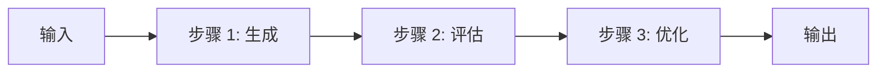
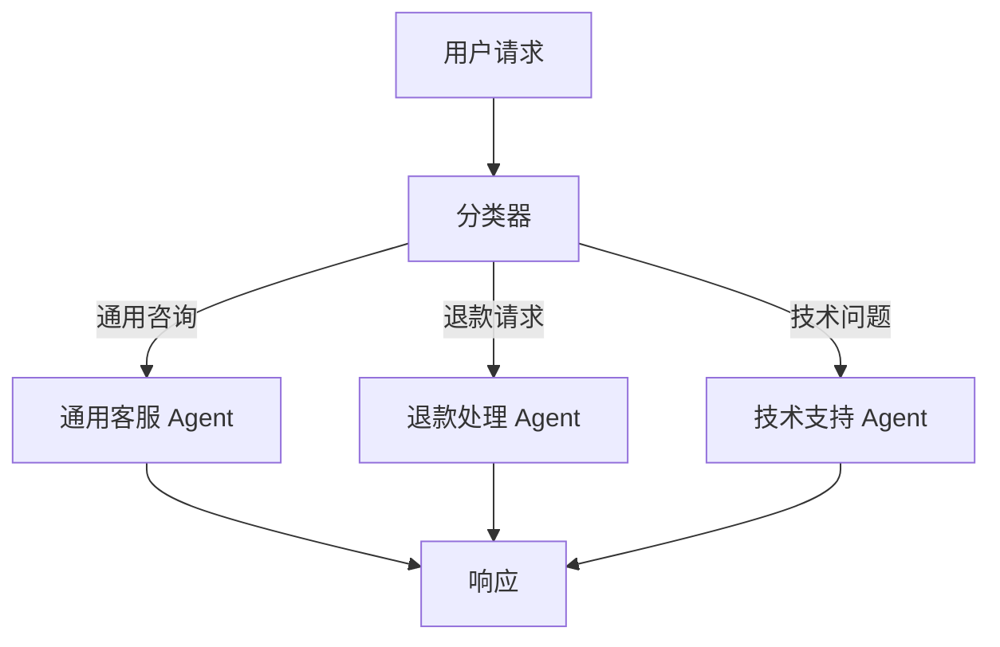
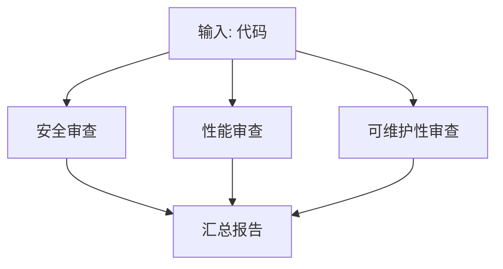
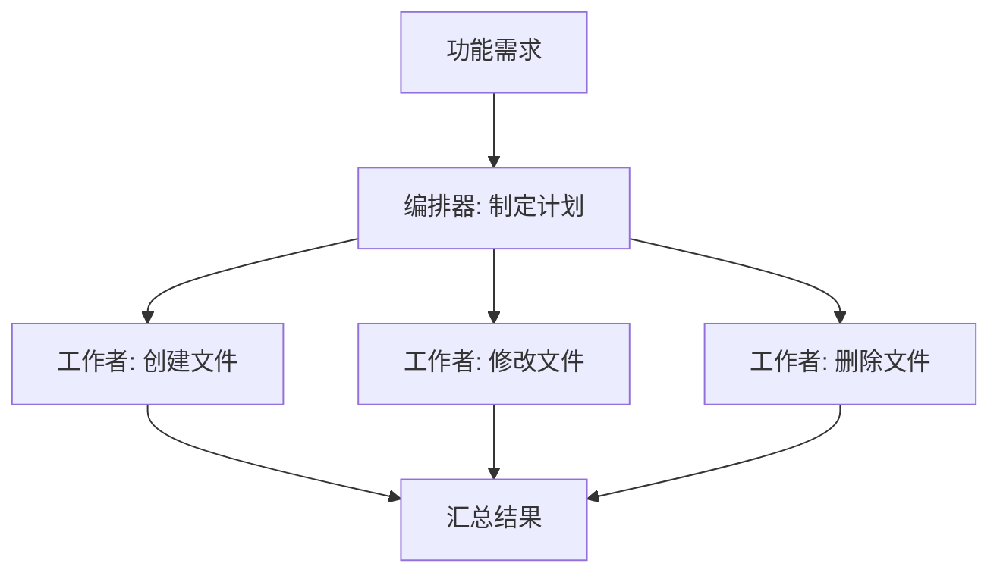
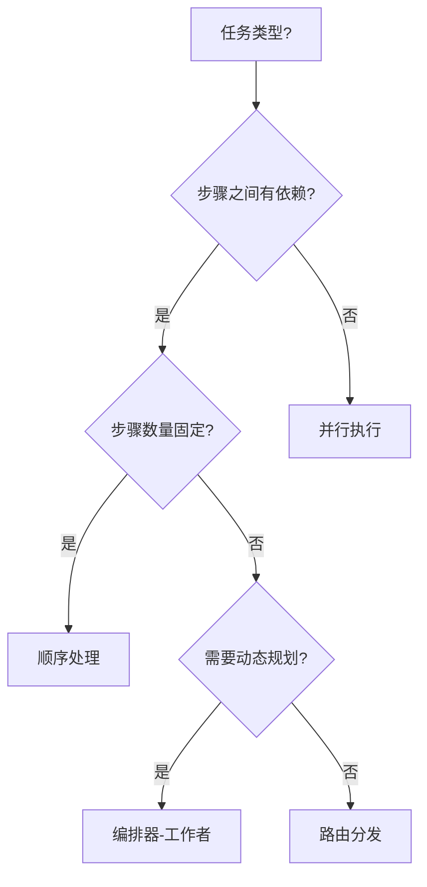

# 工作流模式

工作流模式提供了构建可靠 AI 应用的结构化方法。与完全自主的 Agent 不同，工作流通过预定义的控制流来编排 LLM 调用，提供更高的可预测性和可控性。

[🔗 AI SDK 工作流模式官方文档](https://ai-sdk.dev/docs/agents/workflows){target="_blank" rel="noopener"}

## 模式总览

| 模式 | 特点 | 适用场景 |
|------|------|----------|
| 顺序处理 | 步骤按顺序执行，前一步输出作为下一步输入 | 内容生成流水线、数据转换 |
| 路由分发 | 根据输入分类，路由到不同处理逻辑 | 客服系统、多类型请求处理 |
| 并行执行 | 多个独立任务同时运行 | 多维度分析、多模型投票 |
| 编排器-工作者 | 编排器规划任务，工作者执行子任务 | 复杂项目、需要不同专长的任务 |

## 顺序处理（Sequential Chain）

最简单的模式：步骤按固定顺序执行，每步的输出流入下一步。



### 示例：营销文案生成流水线

```typescript
import { generateText, generateObject } from 'ai'
import { z } from 'zod'

async function generateMarketingCopy(input: string) {
  // 步骤 1：生成初稿
  const { text: draft } = await generateText({
    model: 'openai/gpt-4o',
    prompt: `为以下产品撰写营销文案，注重情感共鸣和利益点：${input}`,
  })

  // 步骤 2：质量评估
  const { object: quality } = await generateObject({
    model: 'openai/gpt-4o',
    schema: z.object({
      hasCallToAction: z.boolean(),
      emotionalAppeal: z.number().min(1).max(10),
      clarity: z.number().min(1).max(10),
    }),
    prompt: `评估这段营销文案：
    1. 是否包含行动号召（true/false）
    2. 情感吸引力（1-10）
    3. 清晰度（1-10）

    文案内容：${draft}`,
  })

  // 步骤 3：如果质量不达标，重新生成
  if (
    !quality.hasCallToAction ||
    quality.emotionalAppeal < 7 ||
    quality.clarity < 7
  ) {
    const { text: improved } = await generateText({
      model: 'openai/gpt-4o',
      prompt: `改写这段营销文案，要求：
      ${!quality.hasCallToAction ? '- 添加明确的行动号召' : ''}
      ${quality.emotionalAppeal < 7 ? '- 增强情感吸引力' : ''}
      ${quality.clarity < 7 ? '- 提升表达清晰度' : ''}

      原始文案：${draft}`,
    })
    return { copy: improved, quality }
  }

  return { copy: draft, quality }
}
```

### 更通用的顺序链

```typescript
import { generateText } from 'ai'

async function sequentialChain() {
  // 第一步：生成创意
  const { text: ideas } = await generateText({
    model: 'openai/gpt-4o',
    prompt: '列出 10 个关于 AI 开发的博客主题创意',
  })

  // 第二步：选择最佳创意
  const { text: bestIdea } = await generateText({
    model: 'openai/gpt-4o',
    prompt: `从以下创意中选出最好的一个并说明理由：\n${ideas}`,
  })

  // 第三步：生成大纲
  const { text: outline } = await generateText({
    model: 'openai/gpt-4o',
    prompt: `基于这个主题创建详细的博客大纲：\n${bestIdea}`,
  })

  return outline
}
```

## 路由分发（Routing）

根据输入内容分类，将请求路由到不同的处理逻辑。



### 示例：智能客服路由

```typescript
import { generateObject, generateText } from 'ai'
import { z } from 'zod'

async function handleCustomerQuery(query: string) {
  // 第一步：分类
  const { object: classification } = await generateObject({
    model: 'openai/gpt-4o',
    schema: z.object({
      reasoning: z.string(),
      type: z.enum(['general', 'refund', 'technical']),
      complexity: z.enum(['simple', 'complex']),
    }),
    prompt: `对以下客户查询进行分类：
    ${query}

    判断：
    1. 查询类型（通用/退款/技术）
    2. 复杂度（简单/复杂）
    3. 分类理由`,
  })

  // 第二步：根据分类路由到不同的处理逻辑
  const systemPrompts: Record<string, string> = {
    general: '你是一位专业的客服代表，处理一般咨询。',
    refund: '你是退款处理专员，严格遵循公司政策，收集必要信息。',
    technical: '你是技术支持专家，提供清晰的分步故障排除指导。',
  }

  const { text: response } = await generateText({
    // 根据复杂度选择模型
    model:
      classification.complexity === 'simple'
        ? 'openai/gpt-4o-mini'
        : 'openai/o4-mini',
    system: systemPrompts[classification.type],
    prompt: query,
  })

  return { response, classification }
}
```

**路由的核心优势：**

- 根据请求特征选择不同模型（节省成本）
- 使用不同的系统提示词（提升专业度）
- 灵活扩展新的路由分支

## 并行执行（Parallel）

多个独立任务同时运行，最后汇聚结果。



### 示例：多维度代码审查

```typescript
import { generateText, generateObject } from 'ai'
import { z } from 'zod'

async function parallelCodeReview(code: string) {
  // 并行运行三个维度的审查
  const [securityReview, performanceReview, maintainabilityReview] =
    await Promise.all([
      generateObject({
        model: 'openai/gpt-4o',
        system:
          '你是代码安全专家，专注于识别安全漏洞、注入风险和认证问题。',
        schema: z.object({
          vulnerabilities: z.array(z.string()),
          riskLevel: z.enum(['low', 'medium', 'high']),
          suggestions: z.array(z.string()),
        }),
        prompt: `审查这段代码：\n${code}`,
      }),

      generateObject({
        model: 'openai/gpt-4o',
        system:
          '你是性能优化专家，专注于识别性能瓶颈、内存泄漏和优化机会。',
        schema: z.object({
          issues: z.array(z.string()),
          impact: z.enum(['low', 'medium', 'high']),
          optimizations: z.array(z.string()),
        }),
        prompt: `审查这段代码：\n${code}`,
      }),

      generateObject({
        model: 'openai/gpt-4o',
        system:
          '你是代码质量专家，专注于代码结构、可读性和最佳实践。',
        schema: z.object({
          concerns: z.array(z.string()),
          qualityScore: z.number().min(1).max(10),
          recommendations: z.array(z.string()),
        }),
        prompt: `审查这段代码：\n${code}`,
      }),
    ])

  const reviews = [
    { ...securityReview.object, type: '安全' },
    { ...performanceReview.object, type: '性能' },
    { ...maintainabilityReview.object, type: '可维护性' },
  ]

  // 汇总所有审查结果
  const { text: summary } = await generateText({
    model: 'openai/gpt-4o',
    system: '你是技术负责人，负责汇总多维度的代码审查结果。',
    prompt: `综合以下代码审查结果，生成简洁的总结和关键行动项：
    ${JSON.stringify(reviews, null, 2)}`,
  })

  return { reviews, summary }
}
```

**并行模式的要点：**

- 使用 `Promise.all()` 并行调度多个独立的 LLM 调用
- 各分支之间互不依赖，可以使用不同的模型和提示词
- 最终需要一个汇聚步骤来整合结果

## 编排器-工作者（Orchestrator-Worker）

编排器（Orchestrator）负责全局规划，工作者（Worker）执行具体子任务。



### 示例：功能实现编排

```typescript
import { generateObject } from 'ai'
import { z } from 'zod'

async function implementFeature(featureRequest: string) {
  // 编排器：制定实现计划
  const { object: plan } = await generateObject({
    model: 'openai/gpt-4o',
    schema: z.object({
      files: z.array(
        z.object({
          purpose: z.string(),
          filePath: z.string(),
          changeType: z.enum(['create', 'modify', 'delete']),
        }),
      ),
      estimatedComplexity: z.enum(['low', 'medium', 'high']),
    }),
    system: '你是一位高级软件架构师，负责规划功能实现。',
    prompt: `分析这个功能需求，制定实现计划：\n${featureRequest}`,
  })

  // 工作者：并行执行计划中的各个子任务
  const fileChanges = await Promise.all(
    plan.files.map(async (file) => {
      // 每个工作者专注于特定类型的变更
      const workerPrompts: Record<string, string> = {
        create: '你擅长按照最佳实践创建新文件。',
        modify: '你擅长修改现有代码，保持一致性并避免回归。',
        delete: '你擅长安全地删除代码，确保不会引发破坏性变更。',
      }

      const { object: change } = await generateObject({
        model: 'openai/gpt-4o',
        schema: z.object({
          explanation: z.string(),
          code: z.string(),
        }),
        system: workerPrompts[file.changeType],
        prompt: `实现 ${file.filePath} 的变更：
        目的：${file.purpose}
        整体功能需求：${featureRequest}`,
      })

      return { file, implementation: change }
    }),
  )

  return { plan, changes: fileChanges }
}
```

## 模式选型指南

### 何时使用哪种模式



| 决策因素 | 推荐模式 |
|----------|----------|
| 步骤固定，前后依赖 | 顺序处理 |
| 根据输入类型走不同路径 | 路由分发 |
| 多个独立子任务 | 并行执行 |
| 任务复杂，需要动态拆解 | 编排器-工作者 |
| 完全开放，路径不确定 | Agent（工具循环） |

### 模式组合

实际项目中，模式往往会组合使用：

- **路由 + 顺序**：先分类，再按流水线处理
- **编排器 + 并行**：编排器拆分任务后，工作者并行执行
- **顺序 + 并行**：流水线中某个步骤内部并行处理多个子项

## 下一步

- [Agent 进阶](/ai/vercel-ai-sdk/guide/agent-advanced) — 学习记忆系统和子 Agent 委托
- [构建 Agent](/ai/vercel-ai-sdk/guide/building-agents) — 回顾 Agent 基础构建方式
- [中间件系统](/ai/vercel-ai-sdk/guide/middleware) — 了解如何通过中间件增强模型能力
