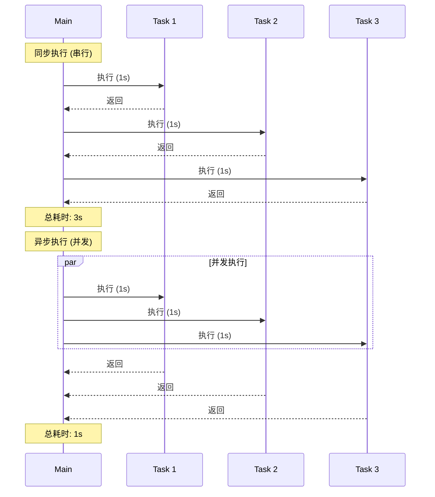

# 异步编程 Async Programming

Python 3.5+ 引入了 `async/await` 语法,提供原生异步编程支持,通过 `asyncio` 模块实现事件循环和协程,类似 JavaScript 的 Promise 和 async/await。

[🔗 asyncio 官方文档](https://docs.python.org/3/library/asyncio.html){target="_blank" rel="noopener"}

## 什么是异步编程?

### 执行流程对比



### 同步 vs 异步

```python
import time

# 同步代码 - 阻塞执行
def sync_fetch():
    time.sleep(1)  # 阻塞 1 秒
    return "data"

def sync_main():
    start = time.time()
    result1 = sync_fetch()  # 等待 1 秒
    result2 = sync_fetch()  # 再等待 1 秒
    result3 = sync_fetch()  # 再等待 1 秒
    print(f"Total: {time.time() - start:.1f}s")  # ~3 秒

sync_main()  # 串行执行,总共 3 秒

# 异步代码 - 非阻塞执行
import asyncio

async def async_fetch():
    await asyncio.sleep(1)  # 非阻塞等待
    return "data"

async def async_main():
    start = time.time()
    results = await asyncio.gather(
        async_fetch(),  # 并发执行
        async_fetch(),  # 并发执行
        async_fetch()   # 并发执行
    )
    print(f"Total: {time.time() - start:.1f}s")  # ~1 秒

asyncio.run(async_main())  # 并发执行,总共 1 秒
```

```javascript
// JavaScript 对比
// 同步代码
function syncFetch() {
  // JavaScript 没有阻塞的 sleep,这里用 busy wait 模拟
  const start = Date.now()
  while (Date.now() - start < 1000);
  return 'data'
}

// 异步代码
async function asyncFetch() {
  await new Promise((resolve) => setTimeout(resolve, 1000))
  return 'data'
}

async function main() {
  const start = Date.now()
  const results = await Promise.all([asyncFetch(), asyncFetch(), asyncFetch()])
  console.log(`Total: ${Date.now() - start}ms`) // ~1000ms
}
```

### 异步编程的优势

**为什么使用异步?**

- ⚡ **高并发**: 单线程处理大量 I/O 操作
- 🚀 **高性能**: 不阻塞等待,充分利用 CPU
- 💾 **资源高效**: 避免多线程的内存开销
- 🔄 **适合 I/O 密集型**: 网络请求、文件操作、数据库查询
- 📡 **实时应用**: WebSocket、SSE、长轮询

## async/await 基础

### 定义异步函数

```python
import asyncio

# 定义异步函数
async def greet(name):
    """async def 定义协程函数"""
    await asyncio.sleep(1)  # await 暂停协程
    return f"Hello, {name}!"

# 调用异步函数
async def main():
    result = await greet("Alice")  # 必须用 await 调用
    print(result)

# 运行异步程序
asyncio.run(main())  # Python 3.7+ 推荐方式
```

```javascript
// JavaScript 对比
async function greet(name) {
  await new Promise((resolve) => setTimeout(resolve, 1000))
  return `Hello, ${name}!`
}

async function main() {
  const result = await greet('Alice')
  console.log(result)
}

main() // 自动运行
```

### 协程 (Coroutine) vs 函数

```python
# 普通函数
def regular_function():
    return "result"

result = regular_function()  # 直接调用
print(result)  # result

# 协程函数
async def coroutine_function():
    return "result"

coro = coroutine_function()  # 返回协程对象,不执行
print(coro)  # <coroutine object coroutine_function>

# 必须用 await 或 asyncio.run 执行
result = asyncio.run(coro)
print(result)  # result
```

## asyncio 核心概念

### 事件循环 (Event Loop)

```python
import asyncio

async def task(name, delay):
    print(f"{name} started")
    await asyncio.sleep(delay)
    print(f"{name} completed")
    return f"{name} result"

async def main():
    # 创建任务并调度到事件循环
    task1 = asyncio.create_task(task("Task1", 2))
    task2 = asyncio.create_task(task("Task2", 1))

    # 等待任务完成
    result1 = await task1
    result2 = await task2

    print(f"Results: {result1}, {result2}")

asyncio.run(main())
# Task1 started
# Task2 started
# Task2 completed  (1 秒后)
# Task1 completed  (2 秒后)
# Results: Task1 result, Task2 result
```

### 创建任务

```python
import asyncio

async def fetch_data(id):
    await asyncio.sleep(1)
    return f"Data {id}"

async def main():
    # 方法1: create_task (推荐)
    task1 = asyncio.create_task(fetch_data(1))
    task2 = asyncio.create_task(fetch_data(2))

    # 任务已在后台运行
    print("Tasks created")

    # 等待结果
    result1 = await task1
    result2 = await task2
    print(result1, result2)

asyncio.run(main())

# 方法2: gather (批量执行)
async def main_gather():
    results = await asyncio.gather(
        fetch_data(1),
        fetch_data(2),
        fetch_data(3)
    )
    print(results)  # ['Data 1', 'Data 2', 'Data 3']

asyncio.run(main_gather())
```

```javascript
// JavaScript 对比
async function main() {
  // Promise 自动开始执行
  const promise1 = fetchData(1)
  const promise2 = fetchData(2)

  const result1 = await promise1
  const result2 = await promise2

  // 或使用 Promise.all
  const results = await Promise.all([fetchData(1), fetchData(2), fetchData(3)])
}
```

## 并发模式

### asyncio.gather (并发执行)

```python
import asyncio

async def fetch_user(user_id):
    await asyncio.sleep(1)
    return {"id": user_id, "name": f"User{user_id}"}

async def main():
    # 并发获取多个用户
    users = await asyncio.gather(
        fetch_user(1),
        fetch_user(2),
        fetch_user(3)
    )
    print(users)
    # [{'id': 1, 'name': 'User1'}, ...]

    # 处理异常: return_exceptions=True
    results = await asyncio.gather(
        fetch_user(1),
        fetch_user(2),
        fetch_user(999),  # 假设会抛出异常
        return_exceptions=True  # 不中断,返回异常对象
    )
    for result in results:
        if isinstance(result, Exception):
            print(f"Error: {result}")
        else:
            print(f"Success: {result}")

asyncio.run(main())
```

```javascript
// JavaScript 对比
const users = await Promise.all([fetchUser(1), fetchUser(2), fetchUser(3)])

// 处理异常
const results = await Promise.allSettled([fetchUser(1), fetchUser(2), fetchUser(999)])

results.forEach((result) => {
  if (result.status === 'fulfilled') {
    console.log('Success:', result.value)
  } else {
    console.log('Error:', result.reason)
  }
})
```

### asyncio.wait (更灵活的控制)

```python
import asyncio

async def task(name, delay):
    await asyncio.sleep(delay)
    return f"{name} done"

async def main():
    tasks = [
        asyncio.create_task(task("A", 1)),
        asyncio.create_task(task("B", 2)),
        asyncio.create_task(task("C", 3))
    ]

    # 等待所有任务完成
    done, pending = await asyncio.wait(tasks)
    for task in done:
        print(task.result())

    # 等待第一个完成
    done, pending = await asyncio.wait(
        tasks,
        return_when=asyncio.FIRST_COMPLETED
    )
    print(f"First completed: {done.pop().result()}")

    # 取消剩余任务
    for task in pending:
        task.cancel()

asyncio.run(main())
```

```javascript
// JavaScript 对比
// Promise.race (第一个完成)
const first = await Promise.race([task('A', 1), task('B', 2), task('C', 3)])

// Promise.any (第一个成功)
const firstSuccess = await Promise.any([task('A', 1), task('B', 2), task('C', 3)])
```

### TaskGroup (Python 3.11+)

```python
import asyncio

async def task(name):
    await asyncio.sleep(1)
    return f"{name} done"

async def main():
    # TaskGroup 自动管理任务生命周期
    async with asyncio.TaskGroup() as tg:
        task1 = tg.create_task(task("A"))
        task2 = tg.create_task(task("B"))
        task3 = tg.create_task(task("C"))

    # 退出 async with 时所有任务已完成
    print(task1.result(), task2.result(), task3.result())

asyncio.run(main())
```

## 异步 I/O 操作

### 异步文件操作

```python
import aiofiles
import asyncio

async def read_file(filename):
    """异步读取文件"""
    async with aiofiles.open(filename, encoding="utf-8") as f:
        content = await f.read()
        return content

async def write_file(filename, content):
    """异步写入文件"""
    async with aiofiles.open(filename, "w", encoding="utf-8") as f:
        await f.write(content)

async def main():
    # 并发读取多个文件
    contents = await asyncio.gather(
        read_file("file1.txt"),
        read_file("file2.txt"),
        read_file("file3.txt")
    )
    print(contents)

asyncio.run(main())
```

### 异步 HTTP 请求

```python
import httpx
import asyncio

async def fetch_url(url):
    """异步 HTTP GET 请求"""
    async with httpx.AsyncClient() as client:
        response = await client.get(url)
        return response.json()

async def fetch_multiple_urls(urls):
    """并发获取多个 URL"""
    async with httpx.AsyncClient() as client:
        tasks = [client.get(url) for url in urls]
        responses = await asyncio.gather(*tasks)
        return [r.json() for r in responses]

async def main():
    urls = [
        "https://api.github.com/users/python",
        "https://api.github.com/users/microsoft",
        "https://api.github.com/users/google"
    ]
    data = await fetch_multiple_urls(urls)
    print(data)

asyncio.run(main())
```

```javascript
// JavaScript 对比 (fetch API)
async function fetchMultipleUrls(urls) {
  const responses = await Promise.all(urls.map((url) => fetch(url)))
  return Promise.all(responses.map((r) => r.json()))
}
```

### 异步数据库操作

```python
import asyncpg
import asyncio

async def fetch_users():
    """异步查询数据库"""
    conn = await asyncpg.connect("postgresql://localhost/db")

    try:
        rows = await conn.fetch("SELECT * FROM users")
        return rows
    finally:
        await conn.close()

async def bulk_insert(users):
    """批量插入"""
    conn = await asyncpg.connect("postgresql://localhost/db")

    try:
        await conn.executemany(
            "INSERT INTO users (name, email) VALUES ($1, $2)",
            users
        )
    finally:
        await conn.close()

asyncio.run(fetch_users())
```

## 异步生成器

### async for 循环

```python
import asyncio

async def async_range(n):
    """异步生成器"""
    for i in range(n):
        await asyncio.sleep(0.1)
        yield i

async def main():
    # 使用 async for 迭代异步生成器
    async for num in async_range(5):
        print(num)

asyncio.run(main())

# 异步列表推导式 (Python 3.6+)
async def main_comprehension():
    result = [num async for num in async_range(5)]
    print(result)  # [0, 1, 2, 3, 4]

asyncio.run(main_comprehension())
```

```javascript
// JavaScript 对比 (Async Generator)
async function* asyncRange(n) {
  for (let i = 0; i < n; i++) {
    await new Promise((resolve) => setTimeout(resolve, 100))
    yield i
  }
}

async function main() {
  for await (const num of asyncRange(5)) {
    console.log(num)
  }
}
```

### 异步流处理

```python
import asyncio

async def process_stream():
    """处理异步数据流"""
    async def data_stream():
        for i in range(10):
            await asyncio.sleep(0.1)
            yield i

    # 过滤
    async for num in data_stream():
        if num % 2 == 0:
            print(f"Even: {num}")

asyncio.run(process_stream())
```

## 超时与取消

### 超时控制

```python
import asyncio

async def slow_operation():
    await asyncio.sleep(5)
    return "Done"

async def main():
    # 方法1: wait_for
    try:
        result = await asyncio.wait_for(
            slow_operation(),
            timeout=2.0  # 2 秒超时
        )
    except asyncio.TimeoutError:
        print("Operation timed out!")

    # 方法2: timeout (Python 3.11+)
    async with asyncio.timeout(2.0):
        result = await slow_operation()

asyncio.run(main())
```

```javascript
// JavaScript 对比
async function withTimeout(promise, ms) {
  const timeout = new Promise((_, reject) => setTimeout(() => reject(new Error('Timeout')), ms))
  return Promise.race([promise, timeout])
}

try {
  const result = await withTimeout(slowOperation(), 2000)
} catch (error) {
  console.log('Operation timed out!')
}
```

### 任务取消

```python
import asyncio

async def cancellable_task():
    try:
        print("Task started")
        await asyncio.sleep(10)
        print("Task completed")
    except asyncio.CancelledError:
        print("Task was cancelled")
        raise  # 重新抛出 CancelledError

async def main():
    task = asyncio.create_task(cancellable_task())

    # 等待 1 秒后取消
    await asyncio.sleep(1)
    task.cancel()

    try:
        await task
    except asyncio.CancelledError:
        print("Main caught cancellation")

asyncio.run(main())
```

## 异步上下文管理器

### async with 语句

```python
import asyncio

class AsyncResource:
    async def __aenter__(self):
        print("Acquiring resource")
        await asyncio.sleep(0.1)
        return self

    async def __aexit__(self, exc_type, exc_val, exc_tb):
        print("Releasing resource")
        await asyncio.sleep(0.1)

async def main():
    async with AsyncResource() as resource:
        print("Using resource")

asyncio.run(main())
```

### @asynccontextmanager

```python
from contextlib import asynccontextmanager
import asyncio

@asynccontextmanager
async def async_timer(name):
    """异步计时上下文管理器"""
    start = asyncio.get_event_loop().time()
    print(f"{name} started")

    try:
        yield
    finally:
        elapsed = asyncio.get_event_loop().time() - start
        print(f"{name} took {elapsed:.2f}s")

async def main():
    async with async_timer("Operation"):
        await asyncio.sleep(1)

asyncio.run(main())
```

## 同步与异步混合

### 在异步中运行同步代码

```python
import asyncio
import time

def blocking_operation():
    """阻塞的同步函数"""
    time.sleep(2)
    return "result"

async def main():
    # ❌ 错误:直接调用会阻塞事件循环
    # result = blocking_operation()

    # ✅ 正确:在线程池中运行
    loop = asyncio.get_event_loop()
    result = await loop.run_in_executor(
        None,  # 使用默认线程池
        blocking_operation
    )
    print(result)

asyncio.run(main())
```

### 在同步中运行异步代码

```python
import asyncio

async def async_operation():
    await asyncio.sleep(1)
    return "async result"

# 方法1: asyncio.run (推荐)
result = asyncio.run(async_operation())

# 方法2: 手动管理事件循环
loop = asyncio.new_event_loop()
asyncio.set_event_loop(loop)
try:
    result = loop.run_until_complete(async_operation())
finally:
    loop.close()
```

## 异步最佳实践

### 1. 避免阻塞事件循环

```python
# ❌ 错误:在异步函数中使用阻塞操作
async def bad():
    time.sleep(1)  # 阻塞整个事件循环!
    return "done"

# ✅ 正确:使用异步等待
async def good():
    await asyncio.sleep(1)  # 不阻塞
    return "done"

# ✅ 正确:阻塞代码在线程池运行
async def good_with_blocking():
    loop = asyncio.get_event_loop()
    result = await loop.run_in_executor(None, blocking_func)
    return result
```

### 2. 正确处理异常

```python
async def task_with_error():
    raise ValueError("Something went wrong")

async def main():
    # ❌ 错误:任务异常被忽略
    task = asyncio.create_task(task_with_error())
    await asyncio.sleep(1)  # 任务异常丢失!

    # ✅ 正确:等待任务并处理异常
    task = asyncio.create_task(task_with_error())
    try:
        await task
    except ValueError as e:
        print(f"Caught: {e}")

asyncio.run(main())
```

### 3. 使用 TaskGroup (Python 3.11+)

```python
# ✅ 推荐:使用 TaskGroup 自动管理
async with asyncio.TaskGroup() as tg:
    tg.create_task(task1())
    tg.create_task(task2())
# 所有任务完成,异常自动传播
```

### 4. 避免创建过多任务

```python
# ❌ 错误:创建 10000 个并发任务
async def bad(urls):
    tasks = [fetch_url(url) for url in urls]  # 10000 个任务!
    return await asyncio.gather(*tasks)

# ✅ 正确:限制并发数
import asyncio

async def limited_concurrency(urls, limit=10):
    semaphore = asyncio.Semaphore(limit)

    async def fetch_with_semaphore(url):
        async with semaphore:
            return await fetch_url(url)

    tasks = [fetch_with_semaphore(url) for url in urls]
    return await asyncio.gather(*tasks)
```

## 对前端开发者

### async/await 对照表

| Python                | JavaScript               | 说明             |
| --------------------- | ------------------------ | ---------------- |
| `async def func()`    | `async function func()`  | 定义异步函数     |
| `await coro()`        | `await promise`          | 等待异步结果     |
| `asyncio.run(main())` | `main()`                 | 运行异步入口     |
| `asyncio.gather()`    | `Promise.all()`          | 并发执行         |
| `asyncio.wait()`      | `Promise.race()`         | 竞速执行         |
| `asyncio.sleep()`     | `setTimeout()` + Promise | 异步延迟         |
| `async with`          | -                        | 异步上下文管理器 |
| `async for`           | `for await`              | 异步迭代         |

### 使用场景对比

```python
# Python: asyncio
import asyncio
import httpx

async def fetch_data(url):
    async with httpx.AsyncClient() as client:
        response = await client.get(url)
        return response.json()

async def main():
    urls = ["url1", "url2", "url3"]
    results = await asyncio.gather(
        *[fetch_data(url) for url in urls]
    )
    print(results)

asyncio.run(main())
```

```javascript
// JavaScript: Promise + async/await
async function fetchData(url) {
  const response = await fetch(url)
  return response.json()
}

async function main() {
  const urls = ['url1', 'url2', 'url3']
  const results = await Promise.all(urls.map((url) => fetchData(url)))
  console.log(results)
}

main()
```

## 小结

- Python 使用 `async/await` 语法实现异步编程
- `asyncio` 模块提供事件循环和协程支持
- `await` 只能在 `async def` 函数中使用
- `asyncio.gather()` 用于并发执行多个协程
- 异步适合 I/O 密集型任务(网络、文件、数据库)
- 避免在异步代码中使用阻塞操作
- 使用 `asyncio.create_task()` 创建后台任务
- 类似 JavaScript 的 Promise 和 async/await,但需要显式运行事件循环

更多信息请参考:

- [Python asyncio 文档](https://docs.python.org/3/library/asyncio.html)
- [PEP 492 - Coroutines with async and await syntax](https://www.python.org/dev/peps/pep-0492/)
- [Async IO in Python: A Complete Walkthrough](https://realpython.com/async-io-python/)
