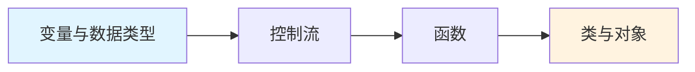

# 基础语法

## 学习目标

本章节你将学习:

- Python 变量声明与数据类型
- 控制流语句 (if/for/while/match-case)
- 函数定义与调用
- 类与面向对象编程

## 学习路径



## 对前端开发者

如果你熟悉 JavaScript，你会发现 Python 的语法相当简洁:

| JavaScript              | Python          | 说明                     |
| ----------------------- | --------------- | ------------------------ |
| `let x = 1`             | `x = 1`         | 无需声明关键字           |
| `const arr = []`        | `arr = []`      | 无 const，约定大写为常量 |
| `function foo() {}`     | `def foo():`    | 使用 def 关键字          |
| `if (x > 0) { }`        | `if x > 0:`     | 无括号，使用缩进         |
| `for (let i of arr) {}` | `for i in arr:` | 使用 in 关键字           |

> **关键差异**: Python 使用缩进表示代码块，无需花括号 `{}`

## 代码风格

```python
# Python 使用 4 空格缩进（而非 2 空格）
def greet(name):
    if name:
        return f"Hello, {name}!"
    else:
        return "Hello, World!"
```

```javascript
// JavaScript 对比
function greet(name) {
  if (name) {
    return `Hello, ${name}!`
  } else {
    return 'Hello, World!'
  }
}
```

## 开始学习

- [变量与数据类型](/backend/python/basics/variables) - 了解 Python 的变量声明和基本数据类型
- [控制流](/backend/python/basics/control-flow) - if/for/while 以及 Python 3.10 新增的 match-case
- [函数](/backend/python/basics/functions) - def、默认参数、\*args、\*\*kwargs、lambda
- [类与对象](/backend/python/basics/classes) - class、**init**、继承、魔术方法
