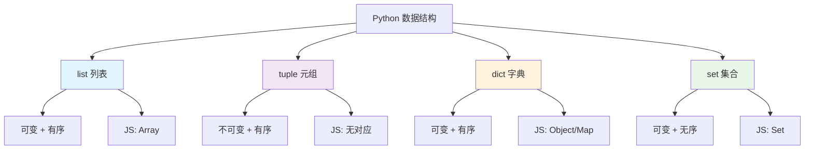

# 数据结构

## 学习目标

本章节你将学习 Python 的四种核心数据结构:

- **列表 (list)** - 可变有序序列，对应 JS Array
- **元组 (tuple)** - 不可变有序序列，JS 无直接对应
- **字典 (dict)** - 键值对映射，对应 JS Object/Map
- **集合 (set)** - 无序唯一元素集，对应 JS Set

## 数据结构对比图



## 快速对比

| Python  | JavaScript     | 可变性 | 有序性 | 特点             |
| ------- | -------------- | ------ | ------ | ---------------- |
| `list`  | `Array`        | 可变   | 有序   | 最常用的序列类型 |
| `tuple` | -              | 不可变 | 有序   | 可作为 dict 键   |
| `dict`  | `Object`/`Map` | 可变   | 有序\* | 键值对存储       |
| `set`   | `Set`          | 可变   | 无序   | 唯一元素集合     |

> \*dict 从 Python 3.7+ 开始保持插入顺序

## 创建方式速览

```python
# 列表
fruits = ["apple", "banana", "cherry"]
empty_list = []
from_range = list(range(5))  # [0, 1, 2, 3, 4]

# 元组
point = (3, 4)
single = (1,)  # 单元素元组需要逗号
empty_tuple = ()

# 字典
user = {"name": "Alice", "age": 25}
empty_dict = {}
from_pairs = dict([("a", 1), ("b", 2)])

# 集合
numbers = {1, 2, 3}
empty_set = set()  # 不能用 {} ，那是空字典
from_list = set([1, 2, 2, 3])  # {1, 2, 3}
```

## 对前端开发者

### 与 JavaScript 的主要差异

1. **列表 vs Array**
   - 功能相似，API 命名不同
   - `push()` → `append()`
   - `splice()` → 切片操作

2. **元组**
   - JS 没有原生元组
   - 类似 `Object.freeze([])` 但更彻底
   - 可以作为字典键（不可变）

3. **字典 vs Object**
   - 语法更接近 JSON
   - 键可以是任何可哈希类型
   - 不能用点语法 `obj.key`，只能 `obj["key"]`

4. **集合 vs Set**
   - 功能基本一致
   - Python 有更丰富的集合运算

### 选择指南

```python
# 需要有序、可修改的集合？ → list
shopping_cart = ["apple", "banana"]

# 需要不可变的固定数据？ → tuple
coordinates = (40.7128, -74.0060)

# 需要键值对映射？ → dict
user = {"id": 1, "name": "Alice"}

# 需要唯一元素？ → set
unique_tags = {"python", "javascript", "rust"}
```

## 开始学习

- [列表 List](/backend/python/data-structures/lists) - 最常用的序列类型
- [元组 Tuple](/backend/python/data-structures/tuples) - 不可变序列
- [字典 Dict](/backend/python/data-structures/dicts) - 键值对映射
- [集合 Set](/backend/python/data-structures/sets) - 唯一元素集合
