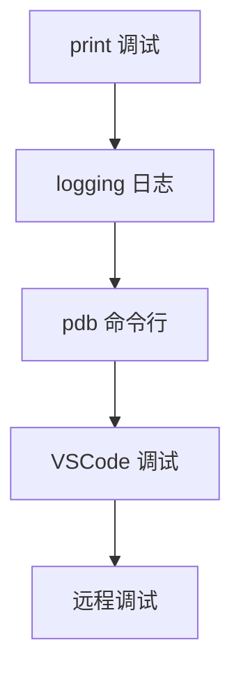

# 调试技巧

本章介绍 Python 调试的常用方法，帮助前端开发者快速定位和解决问题。

## 调试方法对比

| 方法       | Python               | JavaScript     | 适用场景           |
| ---------- | -------------------- | -------------- | ------------------ |
| IDE 调试   | VSCode + Python 扩展 | VSCode         | 复杂逻辑、断点调试 |
| 命令行调试 | pdb                  | node --inspect | 服务器/远程环境    |
| 日志调试   | logging              | console.log    | 生产环境、异步代码 |
| 交互式调试 | ipython              | Node REPL      | 快速测试           |

## 学习路径



## 快速导航

- [VSCode 调试配置](./vscode.md) - **推荐** 图形化调试
- [pdb 命令行调试](./pdb.md) - 内置调试器
- [logging 日志调试](./logging.md) - 生产环境调试

## 快速开始：print 调试

最简单的调试方法（但不推荐长期使用）：

```python
def calculate(x, y):
    print(f"DEBUG: x={x}, y={y}")  # 临时调试
    result = x + y
    print(f"DEBUG: result={result}")
    return result
```

::: tip 建议
尽快从 print 调试转向 logging 或 VSCode 调试，更专业高效。
:::
