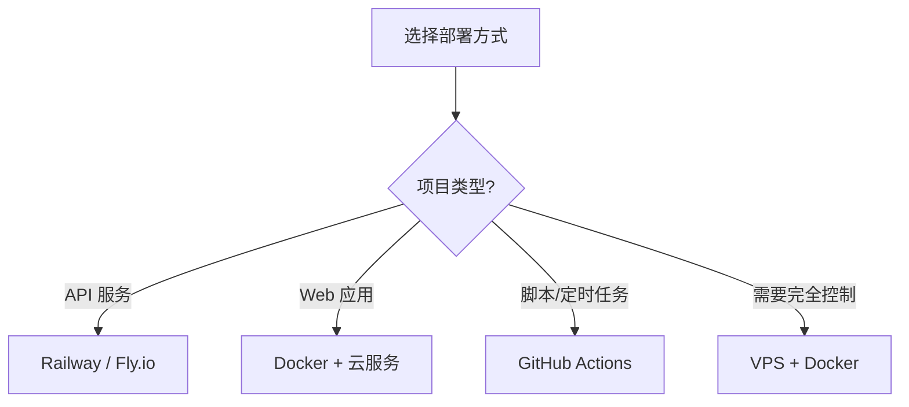

# 部署指南

本章介绍 Python 应用的常见部署方式，帮助前端开发者将 Python 项目上线。

## 部署方式对比

| 方式   | 适用场景           | 难度 | 对应前端 |
| ------ | ------------------ | ---- | -------- |
| Docker | 通用、可移植       | 中   | Docker   |
| 云平台 | 快速部署、自动扩展 | 低   | Vercel   |
| 虚拟机 | 完全控制           | 高   | -        |

## 部署流程

## 快速导航

- [Docker 部署](./docker.md) - 容器化部署
- [云平台部署](./cloud.md) - Railway, Fly.io, Render
- [依赖管理](./dependencies.md) - 虚拟环境和 Poetry

## 前端部署经验迁移

| 前端概念         | Python 对应            |
| ---------------- | ---------------------- |
| `npm install`    | `poetry install`       |
| `npm run build`  | 无需构建（解释型语言） |
| `node server.js` | `uvicorn main:app`     |
| `package.json`   | `pyproject.toml`       |
| `node_modules/`  | `.venv/`               |
| `Dockerfile`     | 相同                   |

## 选择建议

