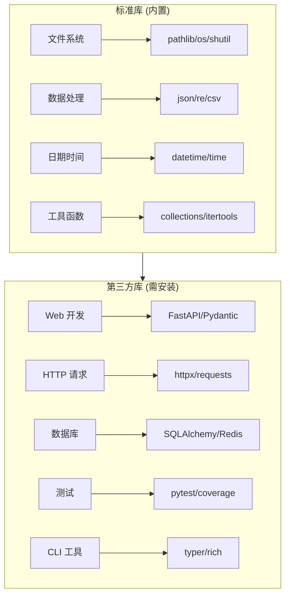

# 常用库介绍

Python 拥有丰富的库生态系统。本章整理了前端开发者最常用的标准库和第三方库，按使用场景分类，并标注推荐优先级。

## 库分类总览



## 快速选择指南

### 我该学哪个？

| 你的需求 | 推荐库 | 备选 |
|----------|--------|------|
| 做 REST API | ⭐ FastAPI + Pydantic | Flask, Django |
| 发 HTTP 请求 | ⭐ httpx | requests, aiohttp |
| 写测试 | ⭐ pytest | unittest |
| 做 CLI 工具 | ⭐ typer + rich | click |
| 操作数据库 | ⭐ SQLAlchemy | pymongo, redis-py |
| 处理数据表格 | ⭐ pandas | polars |
| 读写 JSON | 🔥 json (标准库) | - |
| 路径操作 | 🔥 pathlib (标准库) | os.path |
| 正则匹配 | 🔥 re (标准库) | - |
| 日期时间 | 🔥 datetime (标准库) | - |
| 环境变量 | ⭐ python-dotenv | - |

::: tip 标识说明
- 🔥 = 标准库重点必学
- ⭐ = 第三方库推荐首选
:::

## 标准库

Python 内置的标准库，无需安装即可使用。

### 🔥 高频必学

这些是日常开发中几乎每天都会用到的库：

| 库 | 用途 | JS 对应 | 文档 |
|----|------|---------|------|
| **pathlib** | 路径操作 | `path.join()` | [pathlib](/backend/python/libraries/stdlib/file-system/pathlib) |
| **json** | JSON 解析 | `JSON.parse()` | [json](/backend/python/libraries/stdlib/text-data/json) |
| **datetime** | 日期时间 | `Date` / `dayjs` | [datetime](/backend/python/libraries/stdlib/datetime/datetime) |
| **re** | 正则表达式 | `RegExp` | [re](/backend/python/libraries/stdlib/text-data/re) |
| **os/sys** | 系统接口 | `process` | [os/sys](/backend/python/libraries/stdlib/file-system/os-sys) |

```python
# 日常开发常用示例
from pathlib import Path
import json
from datetime import datetime
import re

# 路径操作
config_path = Path("config") / "settings.json"
if config_path.exists():
    data = json.loads(config_path.read_text())

# 日期处理
now = datetime.now()
formatted = now.strftime("%Y-%m-%d %H:%M:%S")

# 正则匹配
emails = re.findall(r'\b[\w.-]+@[\w.-]+\.\w+\b', text)
```

### 📦 常用工具

经常会用到的工具库：

| 库 | 用途 | 典型场景 | 文档 |
|----|------|----------|------|
| **collections** | 增强容器 | Counter、defaultdict | [collections](/backend/python/libraries/stdlib/collections/collections) |
| **itertools** | 迭代工具 | 排列组合、分组 | [itertools](/backend/python/libraries/stdlib/collections/itertools) |
| **functools** | 函数工具 | 缓存、偏函数 | [functools](/backend/python/libraries/stdlib/collections/functools) |
| **subprocess** | 执行命令 | 调用系统命令 | [subprocess](/backend/python/libraries/stdlib/file-system/subprocess) |
| **shutil** | 文件操作 | 复制、移动、压缩 | [shutil](/backend/python/libraries/stdlib/file-system/shutil) |

```python
from collections import Counter, defaultdict
from functools import lru_cache
import subprocess

# 统计词频
word_counts = Counter(["apple", "banana", "apple"])
# Counter({'apple': 2, 'banana': 1})

# 带默认值的字典
graph = defaultdict(list)
graph["a"].append("b")  # 无需检查 key 是否存在

# 函数缓存
@lru_cache(maxsize=128)
def fibonacci(n):
    if n < 2:
        return n
    return fibonacci(n-1) + fibonacci(n-2)

# 执行系统命令
result = subprocess.run(["git", "status"], capture_output=True, text=True)
print(result.stdout)
```

### 📚 按需学习

特定场景才需要的库：

| 分类 | 库 | 用途 | 文档 |
|------|-----|------|------|
| 数学计算 | math, random, decimal | 数学函数、随机数、精确计算 | [数学与随机](/backend/python/libraries/stdlib/math-random/math) |
| 并发编程 | threading, multiprocessing | 多线程、多进程 | [并发编程](/backend/python/libraries/stdlib/concurrency/threading) |
| 网络编程 | urllib, socket | URL处理、底层网络 | [网络编程](/backend/python/libraries/stdlib/networking/urllib) |
| 数据存储 | sqlite3, pickle | 本地数据库、序列化 | [sqlite3](/backend/python/libraries/stdlib/storage/sqlite3) |
| 工具函数 | hashlib, base64, copy | 哈希、编码、拷贝 | [工具函数](/backend/python/libraries/stdlib/utilities/hashlib) |

## 第三方库

需要通过 `uv add` 或 `pip install` 安装的库。

### ⭐ Web 开发

构建 Web API 和后端服务：

| 库 | 定位 | 推荐场景 | 文档 |
|----|------|----------|------|
| **FastAPI** ⭐ | 现代 API 框架 | 新项目首选 | [FastAPI](/backend/python/libraries/third-party/web/fastapi) |
| **Pydantic** ⭐ | 数据验证 | 配合 FastAPI | [Pydantic](/backend/python/libraries/third-party/web/pydantic) |
| Flask | 轻量框架 | 小型项目/原型 | [Flask](/backend/python/libraries/third-party/web/flask) |
| Django | 全栈框架 | 需要 Admin 后台 | [Django](/backend/python/libraries/third-party/web/django-overview) |

```python
# FastAPI + Pydantic 示例
from fastapi import FastAPI
from pydantic import BaseModel

app = FastAPI()

class User(BaseModel):
    name: str
    email: str
    age: int | None = None

@app.post("/users")
async def create_user(user: User):
    return {"message": f"Created user {user.name}"}
```

### ⭐ HTTP 客户端

发送 HTTP 请求：

| 库 | 特点 | 推荐场景 | 文档 |
|----|------|----------|------|
| **httpx** ⭐ | 同步/异步兼容 | 新项目首选 | [httpx](/backend/python/libraries/third-party/http/httpx) |
| requests | 最简单易用 | 简单同步请求 | [requests](/backend/python/libraries/third-party/http/requests) |
| aiohttp | 纯异步 | 高并发场景 | [aiohttp](/backend/python/libraries/third-party/http/aiohttp) |

```python
# httpx 示例
import httpx

# 同步
resp = httpx.get("https://api.example.com/users")
data = resp.json()

# 异步
async with httpx.AsyncClient() as client:
    resp = await client.get("https://api.example.com/users")
    data = resp.json()
```

### ⭐ 数据库

数据库操作：

| 库 | 数据库 | 推荐场景 | 文档 |
|----|--------|----------|------|
| **SQLAlchemy** ⭐ | SQL 数据库 | ORM 首选 | [SQLAlchemy](/backend/python/libraries/third-party/database/sqlalchemy) |
| pymongo | MongoDB | 文档数据库 | [PyMongo](/backend/python/libraries/third-party/database/pymongo) |
| redis-py | Redis | 缓存/队列 | [redis-py](/backend/python/libraries/third-party/database/redis-py) |

```python
# SQLAlchemy 示例
from sqlalchemy import create_engine, Column, Integer, String
from sqlalchemy.orm import declarative_base, Session

Base = declarative_base()

class User(Base):
    __tablename__ = "users"
    id = Column(Integer, primary_key=True)
    name = Column(String(50))

engine = create_engine("sqlite:///app.db")
Base.metadata.create_all(engine)

with Session(engine) as session:
    user = User(name="Alice")
    session.add(user)
    session.commit()
```

### ⭐ 测试

测试与代码质量：

| 库 | 用途 | 推荐场景 | 文档 |
|----|------|----------|------|
| **pytest** ⭐ | 测试框架 | 所有测试场景 | [pytest](/backend/python/libraries/third-party/testing/pytest) |
| pytest-mock | Mock 工具 | 单元测试 | [pytest-mock](/backend/python/libraries/third-party/testing/pytest-mock) |
| coverage | 覆盖率 | CI/CD | [coverage](/backend/python/libraries/third-party/testing/coverage) |

```python
# pytest 示例
import pytest

def add(a, b):
    return a + b

def test_add():
    assert add(1, 2) == 3
    assert add(-1, 1) == 0

@pytest.fixture
def user():
    return {"name": "Alice", "age": 30}

def test_user_name(user):
    assert user["name"] == "Alice"
```

### ⭐ CLI 工具

构建命令行应用：

| 库 | 特点 | 推荐场景 | 文档 |
|----|------|----------|------|
| **typer** ⭐ | 类型提示驱动 | 新项目首选 | [typer](/backend/python/libraries/third-party/cli/typer) |
| **rich** | 终端美化 | 美化输出 | [rich](/backend/python/libraries/third-party/cli/rich) |
| click | 功能完整 | 复杂 CLI | [click](/backend/python/libraries/third-party/cli/click) |

```python
# typer + rich 示例
import typer
from rich import print

app = typer.Typer()

@app.command()
def hello(name: str, count: int = 1):
    for _ in range(count):
        print(f"[green]Hello[/green] [bold]{name}[/bold]!")

if __name__ == "__main__":
    app()
```

### ⭐ 数据处理

数据分析与处理：

| 库 | 用途 | 推荐场景 | 文档 |
|----|------|----------|------|
| **pandas** ⭐ | 数据分析 | 表格数据处理 | [pandas](/backend/python/libraries/third-party/data/pandas) |
| numpy | 数值计算 | 数学运算 | [numpy](/backend/python/libraries/third-party/data/numpy) |
| polars | 高性能 | 大数据集 | [polars](/backend/python/libraries/third-party/data/polars) |

```python
# pandas 示例
import pandas as pd

# 读取 CSV
df = pd.read_csv("data.csv")

# 筛选和分组
result = (
    df[df["age"] > 18]
    .groupby("city")
    .agg({"salary": "mean"})
)
```

### ⭐ 配置管理

配置与环境变量：

| 库 | 用途 | 推荐场景 | 文档 |
|----|------|----------|------|
| **python-dotenv** ⭐ | 环境变量 | .env 文件 | [python-dotenv](/backend/python/libraries/third-party/config/python-dotenv) |
| PyYAML | YAML 解析 | 配置文件 | [PyYAML](/backend/python/libraries/third-party/config/pyyaml) |
| toml | TOML 解析 | pyproject.toml | [toml](/backend/python/libraries/third-party/config/toml) |

```python
# python-dotenv 示例
from dotenv import load_dotenv
import os

load_dotenv()  # 加载 .env 文件

database_url = os.getenv("DATABASE_URL")
api_key = os.getenv("API_KEY")
```

## Node.js 对照表

| 场景 | Python | Node.js |
|------|--------|---------|
| 包管理 | uv / pip | npm / pnpm |
| Web 框架 | FastAPI | Express / Fastify |
| HTTP 客户端 | httpx | axios / fetch |
| ORM | SQLAlchemy | Prisma / TypeORM |
| 测试框架 | pytest | Jest / Vitest |
| CLI 框架 | typer | commander / oclif |
| 数据验证 | Pydantic | Zod |
| 终端美化 | rich | chalk + ora |
| 路径操作 | pathlib | path |
| JSON 解析 | json | JSON |
| 环境变量 | python-dotenv | dotenv |

## 安装示例

```bash
# 使用 uv（推荐）
uv add fastapi uvicorn
uv add httpx
uv add pytest --dev

# 或使用 pip
pip install fastapi uvicorn httpx pytest
```

## 下一步

- [📍 学习路径](/backend/python/roadmap) - 查看推荐学习顺序
- [标准库详解](/backend/python/libraries/stdlib/) - 深入学习标准库
- [第三方库详解](/backend/python/libraries/third-party/) - 深入学习第三方库
