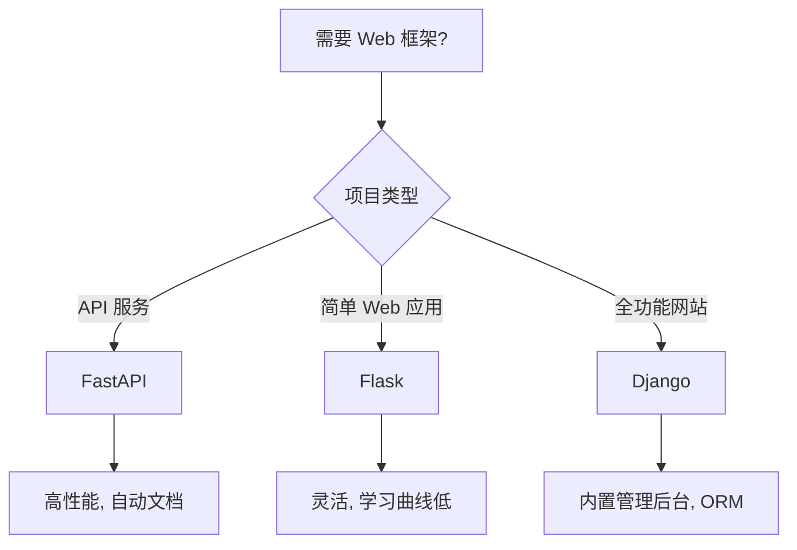

# Python 第三方库

第三方库是由社区开发的 Python 包，需要通过 `pip` 或其他包管理器安装。这相当于 Node.js 中通过 npm 安装的包。

## 安装方式

```bash
# pip 安装
pip install requests

# Poetry 安装
poetry add requests

# uv 安装
uv add requests
```

## 第三方库 vs npm 包

| Python 库 | npm 对应 | 用途 |
|----------|---------|------|
| `requests` / `httpx` | `axios` / `fetch` | HTTP 客户端 |
| `FastAPI` / `Flask` | `Express` / `Koa` | Web 框架 |
| `pytest` | `Jest` / `Vitest` | 测试框架 |
| `pandas` | `danfojs` | 数据处理 |
| `SQLAlchemy` | `Prisma` / `TypeORM` | ORM |
| `click` / `typer` | `commander` / `yargs` | CLI 工具 |
| `pydantic` | `zod` / `joi` | 数据验证 |

## 分类导航

### Web 框架
构建 Web 应用和 API 的框架。

- [FastAPI](./web/fastapi.md) - 现代高性能 API 框架
- [Flask](./web/flask.md) - 轻量级 Web 框架
- [Django 概述](./web/django-overview.md) - 全功能 Web 框架
- [Pydantic](./web/pydantic.md) - 数据验证和设置管理

### HTTP 客户端
发送 HTTP 请求的库。

- [requests](./http/requests.md) - 最流行的 HTTP 库
- [httpx](./http/httpx.md) - 现代异步 HTTP 客户端
- [aiohttp](./http/aiohttp.md) - 异步 HTTP 客户端/服务端框架

### 数据处理
数据分析和处理的库。

- [pandas](./data/pandas.md) - 数据分析神器
- [numpy](./data/numpy.md) - 数值计算基础库
- [polars](./data/polars.md) - 高性能 DataFrame 库

### 数据库
数据库连接和 ORM。

- [SQLAlchemy](./database/sqlalchemy.md) - Python ORM 和数据库工具包
- [PyMongo](./database/pymongo.md) - MongoDB 官方驱动
- [redis-py](./database/redis-py.md) - Redis Python 客户端

### 测试
测试框架和工具。

- [pytest](./testing/pytest.md) - Python 测试框架
- [pytest-mock](./testing/pytest-mock.md) - pytest 的 Mock 插件
- [coverage](./testing/coverage.md) - 代码覆盖率工具

### CLI 工具
构建命令行应用的库。

- [click](./cli/click.md) - 命令行接口创建工具
- [typer](./cli/typer.md) - 基于类型提示的现代 CLI
- [rich](./cli/rich.md) - 终端富文本渲染

### 配置管理
配置和环境变量管理。

- [python-dotenv](./config/python-dotenv.md) - 环境变量管理
- [PyYAML](./config/pyyaml.md) - YAML 解析器
- [toml](./config/toml.md) - TOML 配置文件处理

## 学习建议

对于前端开发者，建议按以下顺序学习：

1. **第一阶段**：`requests`/`httpx`, `pydantic` - API 开发基础
2. **第二阶段**：`FastAPI` 或 `Flask` - Web 框架
3. **第三阶段**：`pytest`, `python-dotenv` - 工程化
4. **第四阶段**：`SQLAlchemy`, `pandas` - 数据相关

## 选择建议

### Web 框架选择



### HTTP 客户端选择

- **requests**: 简单脚本，同步请求
- **httpx**: 需要异步，或与 FastAPI 配合
- **aiohttp**: 高并发 HTTP 客户端/服务端
