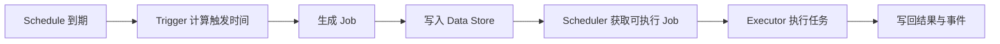

# APScheduler 核心概念

## 组件总览

- Scheduler：对外 API 入口，负责处理 schedule 和运行 job
- Data Store（v3 常称 Job Store）：保存 task/schedule/job/result
- Trigger：决定何时触发
- Job Executor：决定如何执行（线程池、进程池、异步等）
- Event Broker：多节点间分发调度事件（v4 重要能力）

## Task / Schedule / Job 的关系

- Task 定义“做什么、可并发多少、默认执行参数”
- Schedule 定义“什么时候触发这个 Task”
- Job 是 Schedule 在某个触发时间点生成的一次执行

前端类比：

- Task 像“可复用函数定义”
- Schedule 像“定时规则配置”
- Job 像“某一次真实触发后的回调执行”

真实语义补充：

- APScheduler 会把触发和执行拆开处理，Job 可能被不同执行器或节点领取
- 不是简单的单进程定时器回调模型

## 调度生命周期

### Mermaid 语义说明

上图强调两条链路：先“调度生成 Job”，再“执行 Job”。这解释了为什么同一调度系统可横向扩展为多执行节点。

## 事件模型

常见事件包括：

- `SchedulerStarted`
- `SchedulerStopped`
- `JobAcquired`

可用于审计、告警和调试。
