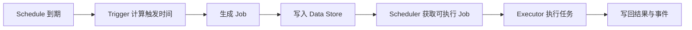

# APScheduler

APScheduler 是 Python 的任务调度库，支持一次性任务、固定间隔任务、Cron 风格任务，以及多实例协作。

## 它解决什么问题

- 让任务按时间策略执行，而不是只在请求到达时执行
- 给任务执行增加并发、错过执行窗口、结果保存等控制能力
- 在需要时把调度状态放到外部存储，支持多节点协作

## 与前端的直觉类比

- 前端 `setInterval(fn, 5000)` 类比 APScheduler 的周期调度
- 但 APScheduler 的真实语义是“调度 + 持久化 + 执行编排”
- 浏览器刷新会丢失定时器；APScheduler 可结合数据存储恢复调度状态

## 版本与术语基线（建议）

本文档按 APScheduler 4.x 术语组织：

- `Task`：可执行目标与执行约束
- `Schedule`：触发规则与调度配置
- `Job`：某次具体执行实例

> 从 v3 到 v4 的关键变化：`job` 概念拆分为 Task/Schedule/Job，并引入事件代理（event broker）与新的数据存储设计。

### 版本敏感核对清单

在更新此文档时，建议逐项复核：

1. 当前稳定版本号与发布时间
2. 是否仍使用 Task/Schedule/Job 三层模型
3. `add_schedule()` / `add_job()` API 参数是否变化
4. 触发器组合行为与状态管理语义是否变化（重点核对 `AndTrigger` / `OrTrigger`）
5. 时区建议是否仍基于 `zoneinfo`（而非 `pytz`）
6. 多节点场景下 event broker 的要求是否变化

## 核心概念

### 组件总览

- Scheduler：对外 API 入口，负责处理 schedule 和运行 job
- Data Store（v3 常称 Job Store）：保存 task/schedule/job/result
- Trigger：决定何时触发
- Job Executor：决定如何执行（线程池、进程池、异步等）
- Event Broker：多节点间分发调度事件（v4 重要能力）

### Task / Schedule / Job 的关系

- Task 定义“做什么、可并发多少、默认执行参数”
- Schedule 定义“什么时候触发这个 Task”
- Job 是 Schedule 在某个触发时间点生成的一次执行

前端类比：

- Task 像“可复用函数定义”
- Schedule 像“定时规则配置”
- Job 像“某一次真实触发后的回调执行”

真实语义补充：

- APScheduler 会把触发和执行拆开处理，Job 可能被不同执行器或节点领取
- 不是简单的单进程定时器回调模型

### 调度生命周期



上图强调两条链路：先“调度生成 Job”，再“执行 Job”。这解释了为什么同一调度系统可横向扩展为多执行节点。

### 事件模型

常见事件包括：

- `SchedulerStarted`
- `SchedulerStopped`
- `JobAcquired`

可用于审计、告警和调试。

## 快速上手

### 安装

```bash
pip install apscheduler
```

### 最小示例（异步调度器）

```python
import asyncio
from apscheduler import AsyncScheduler
from apscheduler.triggers.interval import IntervalTrigger


async def heartbeat() -> None:
    print("tick")


async def main() -> None:
    async with AsyncScheduler() as scheduler:
        await scheduler.add_schedule(
            heartbeat,
            IntervalTrigger(seconds=5),
            id="heartbeat-5s",
        )
        await scheduler.run_until_stopped()


if __name__ == "__main__":
    asyncio.run(main())
```

### 从前端视角理解启动流程

- 类比：像在应用启动时注册一个“长期定时任务”
- 真实语义：调度器会持续处理到期 schedule 并派发 job，不是单纯 `setInterval`

### 常见初始化参数

- `identity`：调度器实例标识（多节点时建议显式设置）
- `max_concurrent_jobs`：全局并发上限
- 数据存储和事件代理：生产环境建议显式配置

### 最小上线检查

1. 时区是否统一（推荐 `zoneinfo`）
2. misfire（错过触发）策略是否符合业务
3. 任务幂等性是否满足重试或重复触发场景

## 触发器

触发器负责定义“下一次什么时候触发”。

### 常用触发器

- DateTrigger：一次性任务
- IntervalTrigger：固定间隔
- CronTrigger：Cron 表达式
- CalendarIntervalTrigger：按日历间隔

### 组合触发器

APScheduler 4.x 支持 `AndTrigger` / `OrTrigger`，用于组合多条触发规则。

### 示例：Interval + Cron

```python
from apscheduler.triggers.interval import IntervalTrigger
from apscheduler.triggers.cron import CronTrigger

interval = IntervalTrigger(minutes=10)
cron = CronTrigger(hour=9, minute=30)
```

### 前端类比与差异

- 前端通常只有“固定延时或固定周期”
- APScheduler 触发器支持更丰富规则和时区语义
- 真实语义：组合触发器会维护下一次候选时间等运行态信息，升级版本时要复核触发行为

### 触发器选型建议

- 简单保活/轮询：Interval
- 固定时间批处理：Cron
- 节假日/自然日驱动：CalendarInterval
- 复杂规则：组合触发器

## 作业存储（Data Store）

在 APScheduler 4.x 中，更准确叫法是 Data Store（历史上常叫 Job Store）。

### 职责

- 保存 Task、Schedule、Job、JobResult
- 支持调度器实例间共享状态
- 为错过执行窗口、恢复、领取任务提供基础

### 选型建议

- 开发环境：可先用内存存储快速验证
- 生产环境：优先选可持久化且支持并发访问的后端

### 前端类比与差异

- 类比：像把内存状态从 Redux 临时 store 升级到数据库
- 真实语义：Data Store 还承担了分布式“领取任务”的一致性责任

### 配置注意点

1. 明确数据保留策略（尤其 JobResult 过期时间）
2. 评估多实例并发下的锁竞争与吞吐
3. 与 event broker 组合验证跨节点事件可见性

## 执行器

执行器决定 Job 如何被真正运行。

### 常见执行方式

- 线程池：I/O 型任务常用
- 进程池：CPU 密集任务更合适
- 异步执行：配合 `AsyncScheduler` 和协程任务

### 前端类比与差异

- 类比：像浏览器主线程 + Web Worker 的分工
- 真实语义：Python 执行模型受 GIL、进程通信、序列化开销影响

### 选择建议

- API 拉取、文件读写：线程池/异步
- 图像处理、重计算：进程池
- 混合场景：按任务类型拆分执行器

### 关键参数

- 并发上限（避免打满数据库或下游服务）
- 队列堆积监控（防止任务延迟放大）
- 超时与取消策略（避免僵尸任务）

## 排错与最佳实践

### 常见问题

#### 任务没有按时执行

- 检查调度器是否真正启动
- 检查时区是否配置一致
- 检查 misfire 策略是否把过期任务丢弃

#### 任务重复执行

- 检查多实例部署是否共享同一数据存储与事件代理
- 检查任务函数是否缺少幂等保护

#### 任务积压

- 检查执行器并发上限是否过低
- 检查下游依赖是否成为瓶颈
- 检查是否存在长任务占满 worker

### 上线前检查清单

1. 版本基线明确（文档与环境一致）
2. 调度器身份标识明确（多实例可追踪）
3. 数据存储与事件代理配置已压测
4. 关键任务具备幂等与重试策略
5. 监控已覆盖任务成功率、延迟、积压量

### 推荐实践

- 将“调度配置”和“业务函数”分层管理
- 为每类任务定义 SLA 与失败处理策略
- 对关键事件（如 JobAcquired/失败）打点并告警
- 控制 Mermaid 与图示数量，优先保证文本可维护性
