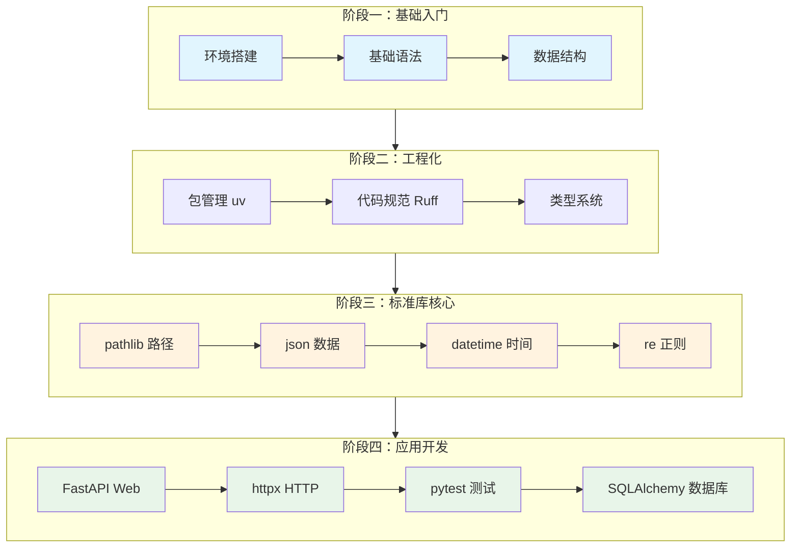
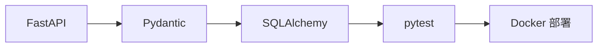
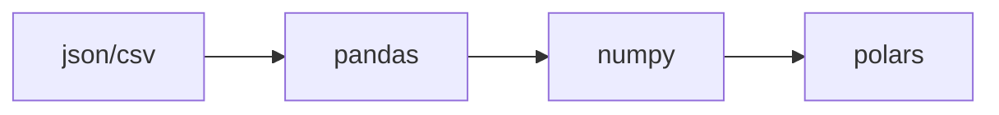
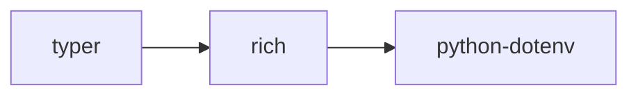
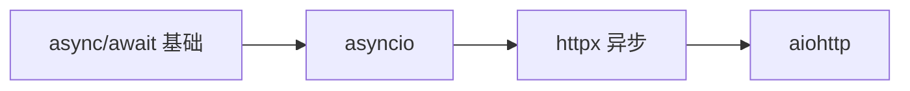

# Python 学习路径

面向前端工程师的 Python 学习路线图，按重要性和常用性排序。

## 学习路线总览



## 阶段一：基础入门

::: tip 预计时间：1-2 天
如果你有 JavaScript 基础，这个阶段会非常快。
:::

### 必学内容

| 优先级 | 内容 | 说明 | 链接 |
|--------|------|------|------|
| P0 | 环境安装 | Python + VSCode 配置 | [环境安装](/backend/python/guide/setup) |
| P0 | 变量与类型 | 对比 JS 的差异 | [变量与数据类型](/backend/python/basics/variables) |
| P0 | 控制流 | if/for/while | [控制流](/backend/python/basics/control-flow) |
| P0 | 函数 | def、参数、返回值 | [函数](/backend/python/basics/functions) |
| P1 | 数据结构 | List/Dict/Set/Tuple | [数据结构](/backend/python/data-structures/) |

### JS 开发者快速上手

```python
# 你已经会的（JS → Python）
# const name = "Alice"  →  name = "Alice"
# arr.map(x => x * 2)   →  [x * 2 for x in arr]
# obj.key              →  obj["key"] 或 obj.get("key")
# async/await          →  async/await（几乎相同）
```

## 阶段二：工程化实践

::: tip 预计时间：半天
学会这些，你的 Python 项目就能达到生产级标准。
:::

### 必学内容

| 优先级 | 内容 | 说明 | 链接 |
|--------|------|------|------|
| P0 | uv | 极速包管理（推荐） | [uv](/backend/python/tooling/dependency-management/uv) |
| P0 | Ruff | 代码检查格式化 | [Ruff](/backend/python/tooling/ruff) |
| P1 | 类型系统 | 类似 TypeScript | [类型系统](/backend/python/tooling/typing) |
| P2 | Poetry | 传统包管理工具 | [Poetry](/backend/python/tooling/dependency-management/poetry) |

### 工具选择建议

```bash
# 推荐组合（2025年最佳实践）
uv init              # 项目初始化
uv add fastapi       # 添加依赖
ruff check .         # 代码检查
ruff format .        # 代码格式化
mypy .               # 类型检查（可选）
```

## 阶段三：标准库核心

::: tip 预计时间：2-3 天
这些是日常开发中最常用的标准库，优先掌握。
:::

### 🔥 高频必学（每天都会用）

| 库 | 用途 | JS 对应 | 链接 |
|----|------|---------|------|
| 🔥 pathlib | 路径操作 | path.join | [pathlib](/backend/python/libraries/stdlib/file-system/pathlib) |
| 🔥 json | JSON 处理 | JSON.parse | [json](/backend/python/libraries/stdlib/text-data/json) |
| 🔥 datetime | 日期时间 | Date / dayjs | [datetime](/backend/python/libraries/stdlib/datetime/datetime) |
| 🔥 re | 正则表达式 | RegExp | [re](/backend/python/libraries/stdlib/text-data/re) |

### 📦 常用工具（经常用到）

| 库 | 用途 | JS 对应 | 链接 |
|----|------|---------|------|
| collections | 增强容器 | lodash | [collections](/backend/python/libraries/stdlib/collections/collections) |
| itertools | 迭代工具 | lodash | [itertools](/backend/python/libraries/stdlib/collections/itertools) |
| subprocess | 执行命令 | child_process | [subprocess](/backend/python/libraries/stdlib/file-system/subprocess) |
| os/sys | 系统接口 | process | [os/sys](/backend/python/libraries/stdlib/file-system/os-sys) |

### 📚 按需学习（特定场景）

| 库 | 用途 | 学习场景 |
|----|------|----------|
| threading | 多线程 | CPU 密集任务 |
| sqlite3 | 本地数据库 | 小型应用 |
| hashlib | 哈希计算 | 安全相关 |
| csv | CSV 处理 | 数据导入导出 |

## 阶段四：应用开发

::: tip 预计时间：3-5 天
根据你的应用场景选择学习路径。
:::

### ⭐ 推荐首选（同类最优）

| 库 | 用途 | 为什么推荐 | 链接 |
|----|------|------------|------|
| ⭐ FastAPI | Web API | 类型安全、自动文档 | [FastAPI](/backend/python/libraries/third-party/web/fastapi) |
| ⭐ httpx | HTTP 客户端 | 同步异步兼容 | [httpx](/backend/python/libraries/third-party/http/httpx) |
| ⭐ pytest | 测试框架 | 事实标准 | [pytest](/backend/python/libraries/third-party/testing/pytest) |
| ⭐ Pydantic | 数据验证 | 类型推断 | [Pydantic](/backend/python/libraries/third-party/web/pydantic) |
| ⭐ SQLAlchemy | ORM | 业界标准 | [SQLAlchemy](/backend/python/libraries/third-party/database/sqlalchemy) |
| ⭐ typer | CLI 工具 | 现代、简洁 | [typer](/backend/python/libraries/third-party/cli/typer) |

### 备选方案（特定场景）

| 推荐 | 备选 | 选择备选的场景 |
|------|------|----------------|
| FastAPI | Flask | 需要更轻量、更灵活 |
| FastAPI | Django | 需要全栈、内置Admin |
| httpx | requests | 只需同步、更简单API |
| httpx | aiohttp | 纯异步、WebSocket |
| typer | click | 需要更底层控制 |

## 场景化学习路径

### 🌐 API 开发路径



**学习顺序**：
1. FastAPI 基础路由
2. Pydantic 数据验证
3. SQLAlchemy 数据库操作
4. pytest 测试
5. Docker 部署

### 📊 数据处理路径



**学习顺序**：
1. json/csv 基础数据处理
2. pandas 数据分析
3. numpy 数值计算（按需）
4. polars 高性能处理（按需）

### 🖥️ CLI 工具路径



**学习顺序**：
1. typer 命令行框架
2. rich 终端美化
3. python-dotenv 配置管理

### 🔄 异步编程路径



**学习顺序**：
1. Python async/await 语法
2. asyncio 事件循环
3. httpx 异步客户端
4. aiohttp 异步服务（按需）

## 学习建议

### ✅ 推荐做法

1. **先学核心**：优先掌握 🔥 和 ⭐ 标记的内容
2. **边学边练**：每学一个库就写个小项目
3. **对比学习**：利用 JS 经验理解 Python 概念
4. **查阅文档**：遇到问题先看官方文档

### ❌ 避免的做法

1. **不要贪多**：不需要学完所有库
2. **不要死记**：理解概念比记住 API 重要
3. **不要跳过工程化**：Poetry + Ruff 是基础
4. **不要忽视测试**：pytest 应该早学

## 快速参考

### 我该学哪个？

| 需求 | 推荐 |
|------|------|
| 做 REST API | FastAPI + Pydantic |
| 发 HTTP 请求 | httpx |
| 写测试 | pytest |
| 做 CLI 工具 | typer + rich |
| 操作数据库 | SQLAlchemy |
| 处理数据 | pandas |
| 读写配置 | python-dotenv + pyyaml |

### 下一步

学完基础后，可以参考：
- [进阶学习路径](/backend/python/guide/next-steps) - 更深入的学习建议
- [高级特性](/backend/python/advanced/) - 装饰器、生成器等
- [部署指南](/backend/python/deployment/) - 生产环境部署
