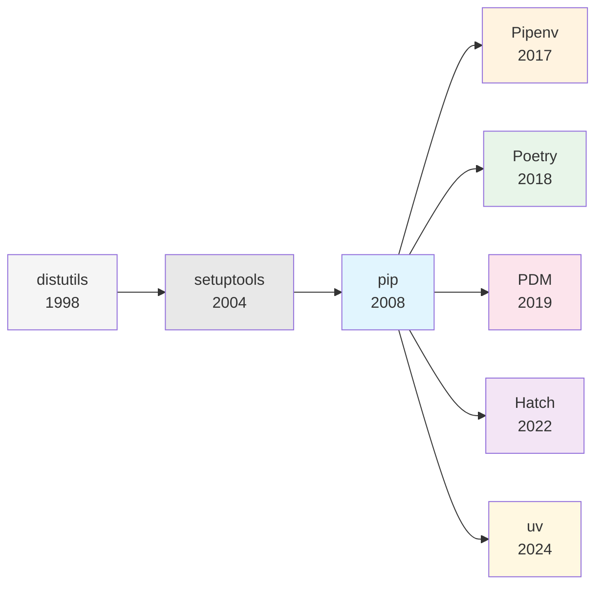
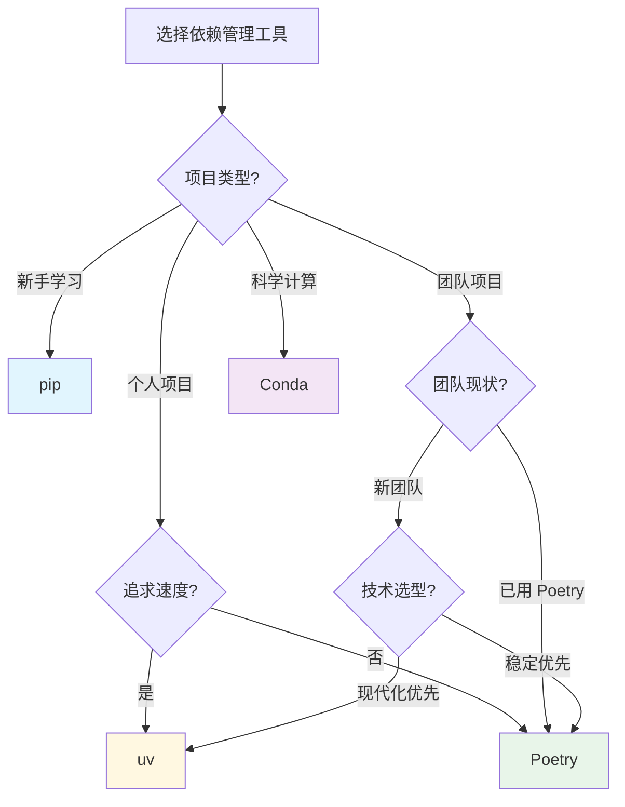

# 依赖管理工具总览

## 学习目标

本章节你将了解：

- Python 包管理工具的演进历史
- 主流依赖管理工具的特性对比
- 如何根据项目需求选择合适的工具

## 工具演进历史



### 发展脉络

| 时期 | 工具 | 特点 |
|------|------|------|
| **1998-2004** | distutils | Python 内置，功能有限 |
| **2004-2008** | setuptools | 增强 distutils，引入 egg 格式 |
| **2008-2017** | pip | 成为标准包管理器，简化安装流程 |
| **2017-至今** | 现代工具 | 依赖锁定、虚拟环境集成、项目管理一体化 |

## 主流工具对比

### 功能对比表

| 特性 | pip | Poetry | uv | PDM | Pipenv | Hatch | Conda |
|------|-----|--------|-----|-----|--------|-------|-------|
| **安装速度** | 基线 | 中等 | ⚡ 极快 | 快 | 慢 | 快 | 中等 |
| **依赖解析** | 基础 | 强大 | 强大 | 强大 | 强大 | 强大 | 强大 |
| **虚拟环境** | 手动 | 自动 | 自动 | 自动 | 自动 | 自动 | 自动 |
| **锁定文件** | ❌ | ✅ | ✅ | ✅ | ✅ | ✅ | ❌ |
| **项目配置** | requirements.txt | pyproject.toml | pyproject.toml | pyproject.toml | Pipfile | pyproject.toml | environment.yml |
| **打包发布** | 需 setuptools | ✅ 内置 | ✅ 内置 | ✅ 内置 | ❌ | ✅ 内置 | ❌ |
| **多 Python 版本** | ❌ | ❌ | ✅ | ❌ | ❌ | ❌ | ✅ |
| **非 Python 依赖** | ❌ | ❌ | ❌ | ❌ | ❌ | ❌ | ✅ |

### 各工具简介

#### pip - 标准包管理器

Python 官方内置的包管理器，所有 Python 安装都自带。

```bash
pip install requests
pip freeze > requirements.txt
```

**优势**：内置无需安装、生态兼容性最好
**劣势**：无依赖锁定、无虚拟环境管理

#### Poetry - 成熟的项目管理工具

一体化的依赖管理和打包工具，类似 npm/pnpm。

```bash
poetry new my-project
poetry add requests
poetry install
```

**优势**：功能完整、社区成熟、插件生态丰富
**劣势**：安装速度较慢、学习曲线略陡

#### uv - 高性能现代工具

Rust 编写的超快包管理器，由 Ruff 团队开发。

```bash
uv init my-project
uv add requests
uv run python main.py
```

**优势**：极速（比 pip 快 10-100x）、可替代多个工具
**劣势**：较新、生态仍在发展

#### PDM - PEP 标准兼容

严格遵循 PEP 标准的现代包管理器。

```bash
pdm init
pdm add requests
pdm run python main.py
```

**优势**：完全兼容 PEP 标准、支持 PEP 582（无虚拟环境）
**劣势**：社区相对较小

#### Pipenv - 虚拟环境集成

结合 pip 和 virtualenv 的工具，曾被 PyPA 推荐。

```bash
pipenv install requests
pipenv shell
```

**优势**：简化虚拟环境管理、安全检查
**劣势**：解析速度慢、维护活跃度下降

#### Hatch - 现代项目管理

专注于项目管理和构建的现代工具。

```bash
hatch new my-project
hatch env create
hatch run test
```

**优势**：多环境管理、构建系统灵活
**劣势**：学习曲线较陡

#### Conda - 科学计算生态

Anaconda 生态的包管理器，支持非 Python 依赖。

```bash
conda create -n myenv python=3.11
conda activate myenv
conda install numpy pandas
```

**优势**：科学计算包预编译、支持 C/C++ 依赖
**劣势**：环境体积大、与 pip 混用需谨慎

## 与前端工具对比

| 特性 | npm/pnpm | Poetry/uv |
|------|----------|-----------|
| 配置文件 | `package.json` | `pyproject.toml` |
| 锁定文件 | `package-lock.json` / `pnpm-lock.yaml` | `poetry.lock` / `uv.lock` |
| 依赖目录 | `node_modules/` | `.venv/` |
| 脚本运行 | `npm run` | `poetry run` / `uv run` |
| 开发依赖 | `devDependencies` | `[tool.poetry.group.dev]` |

## 选择建议

### 按场景推荐



### 推荐总结

| 场景 | 推荐工具 | 理由 |
|------|----------|------|
| **新手入门** | pip | 内置无需额外安装，先理解基础概念 |
| **个人项目（追求速度）** | uv | 极速安装，一体化体验 |
| **团队协作** | Poetry | 成熟稳定，文档完善，社区活跃 |
| **需要发布到 PyPI** | Poetry / uv | 内置打包发布功能 |
| **科学计算/数据分析** | Conda | 预编译包，支持 C 扩展 |
| **严格遵循 PEP 标准** | PDM | 完全兼容 PEP 582/621 |
| **大型项目（依赖多）** | uv | 安装速度优势明显 |

## 开始学习

选择适合你的工具，深入学习：

- [Poetry 完整指南](/backend/python/tooling/dependency-management/poetry) - 成熟稳定的项目管理工具
- [uv 完整指南](/backend/python/tooling/dependency-management/uv) - 极速的现代化包管理器

## 小结

- pip 是基础，但现代项目推荐使用更强大的工具
- Poetry 成熟稳定，适合大多数团队项目
- uv 追求极致速度，是新兴的有力竞争者
- Conda 是科学计算的首选
- 选择工具时，考虑团队现状和项目需求
