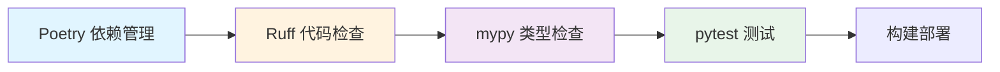

# 工程化工具

## 学习目标

本章节你将学习:

- Python 现代工具链概览
- Poetry - 依赖管理(对应 npm/pnpm)
- Ruff - 代码检查与格式化(对应 ESLint + Prettier)
- Type Hints - 类型系统(对应 TypeScript)

## 工具链流程

## 工具链对比

| 用途       | JavaScript/TypeScript | Python            |
| ---------- | --------------------- | ----------------- |
| 包管理     | npm/pnpm/yarn         | Poetry/pip        |
| 依赖锁定   | package-lock.json     | poetry.lock       |
| 项目配置   | package.json          | pyproject.toml    |
| 代码检查   | ESLint                | Ruff              |
| 代码格式化 | Prettier              | Ruff (或 Black)   |
| 类型检查   | TypeScript            | mypy + Type Hints |
| 虚拟环境   | node_modules/         | .venv/            |
| 测试框架   | Jest/Vitest           | pytest            |

## 开始学习

- [Poetry](/backend/python/tooling/poetry) - 现代化的 Python 依赖管理工具
- [Ruff](/backend/python/tooling/ruff) - 极速的 Python Linter 和 Formatter
- [类型系统](/backend/python/tooling/typing) - Python Type Hints 与类型检查
